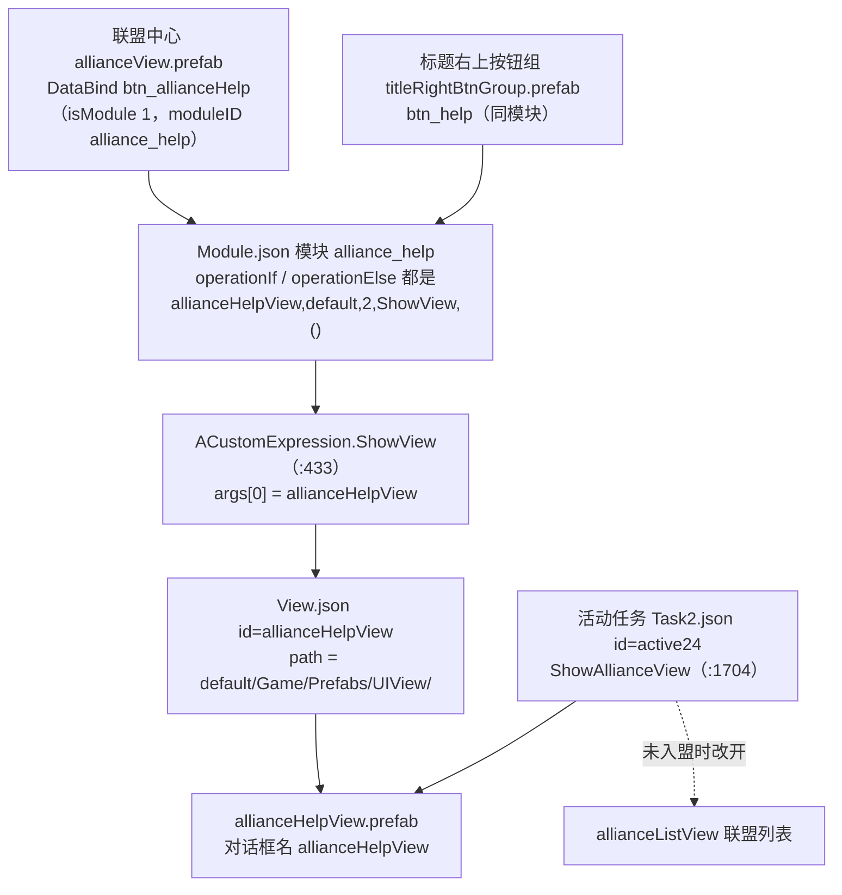

**■ 联盟帮助模块使用说明（Union Help / Assistance）**

> 项目: GhostRecon2025Dev —— Ghost Recon【红警1 中东版本】（Unity 2022.3.62f1）
> 代码根: `E:/WorkSpace/GhostRecon2025Dev/RedAlertDllProject/RedAlert/Script/`
> 游戏逻辑编译成 `RedAlert.dll`，UI 预制体与配表在 `RedAlert/Assets/Resources/{ara,en}/...`
> 整理时间: 2026-09-23
> 姊妹篇: [[联盟帮助排查日志与编译验证]]
> ⚠️ 库内 `Unity/帝国、红警2/RedAlert/` 那一批文档（内城推格子 / 联盟领地与王座争夺 / 聊天系统…）属于 **RedAlert_SuperFormation** 另一套工程，与本篇不是同一代码库，**行号不可互用**。

---

**■ 一、总览**

**▍ 1.1 一句话定位**

联盟帮助 = 「建造/升级中的建筑向联盟求助 → 盟友把请求点掉 → 服务端给该建筑减时」。客户端只做**发起 + 展示**：减时、次数上限、防重复全部由服务端裁决，本端**没有回执**（发出去的协议成功与否，客户端不可知）。

**▍ 1.2 三层结构（务必分清「求」和「帮」）**

| 层 | 做什么 | 表现 | 关键代码 |
|---|---|---|---|
| **气泡层**（内城） | 求：自己的建筑挂「请求帮助」气泡；帮：大使馆挂「帮助全部」气泡 | 所有气泡都是同一个预制体 `completeSign.prefab` 的实例，只换图标 | `UnionInfo.UpdateBuildingHelpBubble`（UnionInfo.cs:1537 / :1571）、`ButtonBuilding.OnUnionHelpOccured`（ButtonBuilding.cs:1054）、`ViewComplete.cs:19` |
| **列表界面层** | 帮：联盟帮助界面（`allianceHelpView`）逐条帮助 / 一键帮助 | 列表 + 进度条（自己那条是淡黄底且无帮助按钮） | `ViewUnionHelpMessagesLogic` / `ViewUnionHelpMessagesAdapter` / `ViewUnionHelpMessageCell` |
| **入口层** | 红点数字、HUD 一键帮助、活动跳转 | 联盟中心按钮红点、HUD `btn_help`、任务跳转 | `ViewMyUnionLogic.cs:582`、`ViewHUDLogic.cs:859`、`ACustomExpression.ShowAllianceView`（ACustomExpression.cs:1704） |

**■ 二、核心文件**

| 文件 | 行数 | 职责 |
|---|---|---|
| `Game/WorldMap/Structures/UnionInfo.cs` | 4 271 | 帮助数据 + 全部查询/气泡/协议入口（`helperInfoList` :1141、`isBuildingNeedHelp` :1445、`UpdateHelperList` :1466、`IsTechCenterNeedResearchBubble` :1511、`UpdateBuildingHelpBubble` :1537/:1571、`GetUnionHelperNum` :1607、`GetUnionHelperList` :1633、`SendNeedHelperMessage` :2538、`SendUnionHelperOtherMessage` :2553、`SendUnionHelpAllMessage` :2565、`ContainsItem` :4044） |
| `GameUI/Build/ButtonBuilding.cs` | 1 221 | 建筑按钮 + 气泡池（`enablePick` :102、`getCurrentPick` :113、`ButtonAddEvent` :136、升级中分支 :380、资源气泡 :600、科技中心 :719、大使馆 :1054） |
| `Game/UIView/ViewComplete.cs` | 304 | **所有气泡的点击总入口**（`Bind` :19 → 收资源/转发建筑事件；`OnPointerDown` :181 批量收取；`OnPointerEnter` :225） |
| `Game/UIView/ViewUnionHelpMessagesLogic.cs` | 265 | 帮助列表界面（`help_list` :136、显隐 :181、3 秒轮询 :66、`StopCoroutine` 坑 :102） |
| `Game/UIView/ViewUnionHelpMessagesAdapter.cs` | 81 | 列表填充（`GetCount` :46、进度 :72） |
| `Game/UIView/ViewUnionHelpMessageCell.cs` | 144 | 单元格（`btn_help` :97、`selectedHelper` :103、自己=淡黄 :119） |
| `Game/AModuleMessageHandlers.cs` | 4 414 | 协议入口（`UnionHelpHandler` :2904、`UnionHelpEvent` :2918） |
| `Game/UILogic/ACustomExpression.cs` | 7 338 | 模块表达式（`ShowView` :433、`ShowAllianceView` :1704、`HaveHelp` :4258、`Helpalone` :4748、`Helpall` :4759） |
| `Framework/Dialog/ATargetPickManager.cs` | 298 | 气泡管理器（`SpawnPick` :130、`isBatchCharging` :44） |
| `Game/AGameConst.cs` | — | 状态码（`serverState` :300-308、`PRODUCTION_STATE` :116-119，文件为 GBK，grep 要加 `-a`） |

**■ 三、数据与协议**

**▍ 3.1 数据模型**

唯一数据源是 `UnionInfo.UserUnion.helperInfoList`（UnionInfo.cs:1141）。每条 `UnionHelperInfo`（:634）字段：

| 字段 | 含义 |
|---|---|
| `id` | 帮助编号（列表差量刷新的唯一键） |
| `joyId` / `name` / `iconType` / `iconId` | 发起人身份与头像 |
| `city` / `buildingID` | 城市 + 建筑 dbid（去重键的一部分） |
| `startTime` | 请求时间 |
| `des` | 服务端拼好的展示文案 |
| `helperSize` / `helperMaxSize` | 已被帮次数 / 上限 |
| `helperUserList` / `helperUserIDs` | 已帮忙的人（名字 / id），用于「我是否帮过」 |

文案三种分支：`des_assistance_type_create`、`des_assistance_build_level_up`、`des_assistance_build_research`（:687-691）——对应「建造 / 升级 / 研究」。

**▍ 3.2 协议**

| 方向 | 入口 | 说明 |
|---|---|---|
| 上行·求帮助 | `SendNeedHelperMessage`（:2538）→ `UNION_UI_ASSISTANCE_ADD` | 参数 city + 建筑 dbid |
| 上行·帮单个 | `SendUnionHelperOtherMessage`（:2553）→ `UNION_UI_ASSISTANCE_HELP` | 参数 = `ANetModulesDataAtlas.selectedHelper.id` |
| 上行·帮全部 | `SendUnionHelpAllMessage`（:2565）→ `UNION_UI_ASSISTANCE_HELP_ALL` | 传「他人发起且我没帮过」的 id 串 |
| 下行·全量 | `NTC_DTCD_UNION_HELP_LIST` → `UnionHelpHandler`（AModuleMessageHandlers.cs:2904） | **整表覆盖** `helperInfoList` |
| 下行·增量 | `NTC_DTCD_UNION_ASSISTANCE` → `ReadHelperInfoFromNet`（UnionInfo.cs:1702） | operate 0 添加 / 1 删除 / 2 修改；修改且**被帮助者是我** → 记 needTip，事件里弹 `get_union_help_information` |
| 事件 | `OnHelpInfoDataUpdate`（声明 :1904，触发 :2946）、`OnHelpRequestReceived`（声明 :1906，触发 AModuleMessageHandlers.cs:2926） | 前者刷列表与 HUD，后者强制刷新列表 |

**■ 四、联盟帮助界面（allianceHelpView）显示流程**

**▍ 4.1 打开链路**



其它入口与关闭：

- 标题右上按钮组 `titleRightBtnGroup.prefab` 的 `btn_help` 挂同一模块 `alliance_help`（多个界面右上角都能进）。
- 活动任务跳转走 `ShowAllianceView`：**未入盟时改开 `allianceListView`**（ACustomExpression.cs:1704-1720）。
- HUD 的 `btn_help`（ViewHUDLogic.cs:859-893）**不打开列表**，直接 `Helpall`，且 `GetUnionHelperNum()` 为 0 时整个按钮隐藏。
- 退盟时强制关闭：`AUIManager.CloseDialog("allianceHelpView")`（UnionInfo.cs:2141）；关闭走 `Destroy(dialog.container)`（AUIManager.cs:613-622）。

**▍ 4.2 界面结构（prefab 的 DataBind key）**

| key | 作用 |
|---|---|
| `help_list` | ListView；Bind 时挂 `ViewUnionHelpMessagesAdapter`（Logic :136-148） |
| `panel_text` | 空列表提示（`notification`，:150-153） |
| `btn_helpAll` | 一键帮助（isModule=1 → `alliance_helpall` → `Helpall`；BindModule 里另置 `lockRefresh=true`，:162） |
| `title` / `text_remind` / `panel_list` / `Panel_goldbtn` | 装饰 |
| 单元格 `allianceHelpCell.prefab` | `herohead` / `heroName` / `text_help`(des) / `number_help`(进度) / `help_progressBar`(Slider) / `btn_help`(isModule=1 → `alliance_helpalone` → `Helpalone`) |

**▍ 4.3 刷新时机**

| 时机 | 行为 |
|---|---|
| `Awake`（:46-52） | `instance=this` → `helperInfoList = GetUnionHelperList()` → `base.Awake()`（触发 `Bind`） |
| `StartEnd`（:107-128） | 列表空 → 显示 `panel_text`、隐藏一键帮助；有他人请求 → 显示一键帮助 |
| `OnEnable`（:54-64） | 订阅 `OnHelpInfoDataUpdate` + `OnHelpRequestReceived`，启动 **3 秒轮询** `RefreshDaemon`（:66-79） |
| 增量事件 | `OnHelpInfoDataUpdate` → `OnHelpUpdate` → `OnHelpListUpdate` |
| 新请求事件 | `OnHelpRequestReceived`（:253-261）→ `forceRefresh=true; lockRefresh=false` 并**立即刷新** |
| 刷新主体 | `OnHelpListUpdate`（:181-243）：仅当 `forceRefresh \|\| (needRefresh && !lockRefresh)` 才刷；列表空 → 显示提示并隐藏列表父节点；非空 → **按 `id` 差量增删**（`ContainsItem` UnionInfo.cs:4044 只比 `id`）→ `RecalculateSize()` |
| 单元格填充 | Adapter / Cell 都直接读 `ViewUnionHelpMessagesLogic.Instance.helperInfoList[cellindex]`（Adapter :46、:49-76；Cell :116-140） |

**■ 五、哪些帮助会显示在联盟帮助列表**

列表内容 = `GetUnionHelperList()`（UnionInfo.cs:1633 起），三条规则：

| 规则 | 结果 |
|---|---|
| `helperUserIDs` 已包含我的 joyId（**我已帮过**） | 排除 |
| `helperSize >= helperMaxSize`（**已帮满**） | 排除 |
| 发起人是不是我自己 | **不排除** —— :1637 那行排除逻辑被注释掉了 → **自己发起的请求也会显示在列表里** |

排序：自己发起的加权 `weightLeft += 10000`（:1656）排到**最前**；用 `List.Sort`（:1649，不稳定排序）→ 除「自己优先」外其余顺序不保证。

显示细节：

| 情况 | 表现 |
|---|---|
| 自己那条 | 隐藏「帮助」按钮 + 背景淡黄 `(255,255,180)`（Cell :119-127、Adapter :52-60） |
| 他人那条 | 显示「帮助」按钮；进度条 = `helperSize/helperMaxSize`；数字走 `AGameTools.NumTotalString("/", max, size)`（AGameTools.cs:1479-1492，**非 RTL 语言会反转参数** → 实际显示 `size/max`，RTL 反之） |
| 列表为空 | `panel_text` 提示 + 隐藏列表父节点 + 隐藏一键帮助 |
| 一键帮助作用域 | `Helpall` 内部再次过滤 `joyId != 自己`（ACustomExpression.cs:4759-4781） |
| **不会出现** | 已帮满的、我已帮过的、服务端已删的（operate=1）、服务端没下发的（未入盟 / 不同联盟） |

**红点与列表口径不同**：红点 `GetUnionHelperNum()`（:1607-1630）= 他人发起 + 我未帮过 + 未帮满；而列表**额外包含「自己发起」的那几条**。所以「红点 3 但列表 4 条」是正常的。

**▍ 5.1 列表的上游（请求从哪来）**

1. 建造/升级中建筑的气泡点击 → `SendNeedHelperMessage`（`UpdateBuildingHelpBubble` :1571，条件 `serverState == LEVELUPNOTFREE(1)`）
2. 科技中心「研究中」的气泡点击（:1537 + `IsTechCenterNeedResearchBubble` :1511）
3. 新手引导里的同一入口（`BGuide.CanAllianceHelp` :4761、`TaskGuide.cs:356`）——引导的判定**更严**：还要求 `TimerArray[0].type == LEVEL` 且剩余时间大于免费加速量

→ 服务端收到 `UNION_UI_ASSISTANCE_ADD` 后按联盟广播（全量/增量）→ 落进 `helperInfoList` → 上面那套过滤与刷新。

**■ 六、气泡层与点击链路（最容易看错的地方）**

**▍ 6.1 所有气泡同源**

| 项 | 值 |
|---|---|
| `uiTargetPickPrefab` | `Assets/Resources/{ara,en}/Game/Prefabs/UIView/completeSign.prefab`（UIRoot.prefab 里引用 guid `4695df45…`） |
| `fbTargetPickPrefab` | `facebook_bubble.prefab` |
| 共用它的功能 | 资源收取（foodsmall/metalsmall/…）、**请求帮助（help）**、**帮助所有（helpall）**、免费完成（free）、出兵完成（soldierok）、装备强化完成、活动、雷达警告… |
| 差异 | 只在 `Iconlist` 图标（`Iconlist.json`：help=请求帮助_提示、helpall=帮助所有_提示、foodsmall=收取食物_气泡，同图集 `UIView_operationIcon`） |
| 关键结构 | 根节点挂 `ViewComplete`；子节点 `completeSign` 载着**全预制体唯一的 Button** + `DataBind(btn_complete)` |

结论：`ViewComplete.Bind`（:19-140）注册到那个唯一 Button 上的监听，**就是所有气泡（含联盟帮助气泡）的点击入口**。

**▍ 6.2 点「帮助」气泡实际走的路**

```text
点击气泡图标 → 唯一 Button(btn_complete) → ViewComplete 的监听（:49-132）
  ├─ 目标不是建筑 DBID        → 无响应
  ├─ 目标是福利中心           → 空实现（:99-101，什么都不做）
  ├─ clickTime > 0            → 被吞（:103-105，全局冷却 1 秒）
  ├─ 有 Electrical 且判为可收 → 走批量收资源（:110-124，不发帮助）
  └─ 其余                      → target.ButtonBuilding.noMoveEvent()（:127 / :131）
         ├─ 建造/升级中 → SendNeedHelperMessage（请求帮助）
         ├─ 大使馆      → ACustomExpression.Helpall（一键帮助）
         └─ 科技中心    → SendNeedHelperMessage
```

**▍ 6.3 帮助气泡能不能显示（7 道关）**

| 序 | 关卡 | 代码 |
|---|---|---|
| 1 | 服务端下发过帮助列表（否则「我是否请求过」永远查不到） | `UnionHelpHandler` AModuleMessageHandlers.cs:2904 |
| 2 | 已加入联盟（`unionId != 0`） | `isBuildingNeedHelp` UnionInfo.cs:1445 |
| 3 | `serverState == LEVELUPNOTFREE(1)` —— **`LEVELUPFREE(2)` 是「可免费完成」，不显示帮助气泡**（大使馆分支显式跳过 2） | :1571 / :1054 |
| 4 | 该建筑界面已创建（`UIBuild != null`） | :1571 循环内 return |
| 5 | 自己没为这栋楼发过（city + buildingID + joyId 去重） | :1445 |
| 6 | 气泡位没被占（`getCurrentPick()` 为空才 `enablePick("help")`；全量刷新分支先 `disableAllPick()`） | ButtonBuilding.cs:719-721 / UnionInfo.cs:1586-1587 |
| 7 | 点击不被吞、不被截走 | 见 6.2 |

**■ 七、注意事项（分级）**

🔴 **气泡按钮可被永久置灰**：`ViewComplete.Bind` 的「可收取」分支把气泡唯一 Button `enabled = false`（ViewComplete.cs:44），而 `ATargetPickManager.EnablePicksClicking()`（:99 / :104）**全工程 0 个调用者**，`SetNormalState` 只 `SetActive(false)` 不恢复 `enabled`，pick 还被 `ButtonBuilding.pickDict` 按图标名缓存复用 → **某建筑的某类气泡一旦「首次生成时就可收」，就永久点不动**（只坏那一种图标，例如只有 foodsmall 坏、help 正常）。

🟠 **同一判定三处写法不一致**：`Bind` 用 `(state==1 || state==2) && serverState==0`（:36）；`OnPointerDown` 因 `&&` 优先级实际是 `state==1 || (state==2 && serverState==0)`（:192）；`OnPointerEnter` 不看 `serverState`（:236）→ 升级中的电厂/核电站**按下**气泡可能误触「批量收资源」而不是求助。

🟠 **`clickTime` 是静态字段**（ViewComplete.cs:17、`Update` :150）→ 点任意一个气泡后 **1 秒内所有气泡点击全部被吞**（含帮助气泡）；气泡被 `SetActive(false)` 时该字段可能被「冻结」>0，重新显示后前 1 秒点不动。

🟠 **拖动扫过会放大协议量**：`OnPointerEnter`（:225）不检查 `clickTime`，它调的 `noMoveEvent()` 是「该类建筑**全部**收取」→ 拖过 K 个同类气泡 = K × 该类建筑数 条收资源协议；且电厂/核电站分支只收自己（:242-243），与 `OnPointerDown` 的「全城收取」语义不一致。

🟠 **帮助气泡与收取气泡抢位**：「请求帮助」与资源收取都要求 `getCurrentPick()` 为空（ButtonBuilding.cs:600 / :632 / :833、:721）→ 先到先得，会出现「该求助的建筑不显示帮助气泡」。

🟡 **`HaveHelp()` 语义与名字相反**：`ACustomExpression.cs:4258-4264` 返回 `GetUnionHelperList().Count == 0`（+1 表示**没有**可帮助请求）。当前 `alliance_help` 模块的 if/else 都开同一界面，条件形同虚设；一旦拿它做红点/置灰就会踩。

🟡 **`StopCoroutine(RefreshDaemon())` 停不掉协程**（`ViewUnionHelpMessagesLogic.cs:102`）：传的是新建迭代器，永远匹配不到正在跑的那个。当前关闭界面会 `Destroy(dialog.container)`，协程随对象销毁结束；若改成「隐藏不销毁」，每次 `OnEnable` 都会再叠一个 3 秒轮询。`ForceRefreshDaemon` 与 `needRefresh` 的「最低间隔」语义都已注释跳过，实际是 3 秒硬刷。

🟡 **引导与气泡口径不一致**：`TaskGuide / BGuide.CanAllianceHelp` 额外要求计时器存在且剩余时间大于免费加速量，气泡刷新没有这个条件 → 可能出现「有气泡但引导认为不可请求帮助」。

**▍ 7.1 排查顺序（症状 → 先查 → 再查）**

| 症状 | 先查 | 再查 |
|---|---|---|
| 建筑上没有帮助气泡 | `serverState` 是否为 1 | `UIBuild` 是否为空 / 是否未入盟 / 是否已请求过 / 气泡位是否被占 |
| 点了没反应 | 是否 1 秒内点过别的气泡（`clickTime`） | 目标是不是福利中心 / 是否被判「可收取」而走了批量收资源 |
| 列表为空 | 服务端下发条数（`[UnionHelp] 收到帮助列表下发 … 条`） | 是否都已被帮满 / 我已帮过（两条排除规则） |
| 列表里多了「自己那条」 | 属正常行为（排除自己的逻辑被注释） | 淡黄底、无帮助按钮即为自己那条 |
| 一键帮助不出现 | `helpCount` 是否大于 0（红点口径） | 大使馆 `serverState` 是否为 2（跳过） |
| 气泡点一次要等 1 秒 | `ViewComplete.clickTime` 全局冷却 | 是否拖动扫过导致 `isBatchCharging` 残留 |

**■ 八、相关文档**

- [[联盟帮助排查日志与编译验证]] —— 本轮新增 27 处 `[UnionHelp]` 日志点位、开关用法、编译验证命令与结果
- 同库 `Unity/帝国、红警2/RedAlert/` 下那批文档属于 **RedAlert_SuperFormation**（另一套工程），勿与之互用行号
