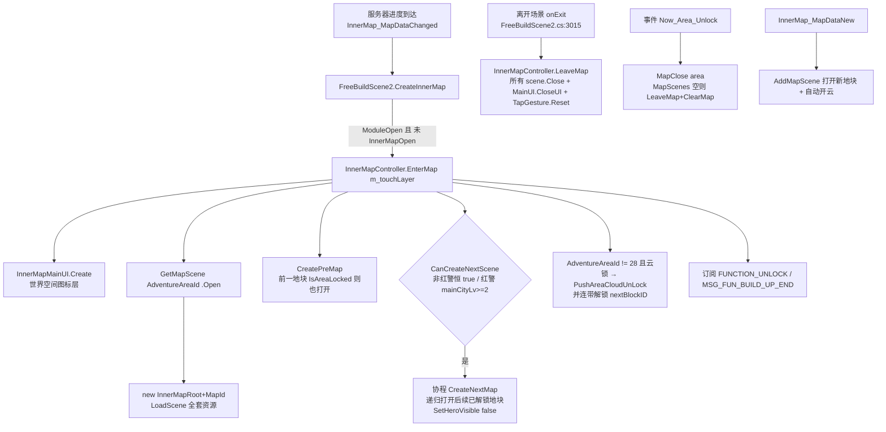
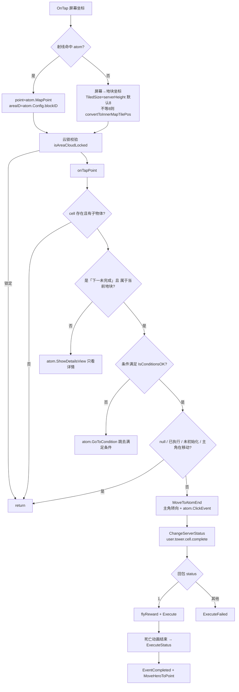
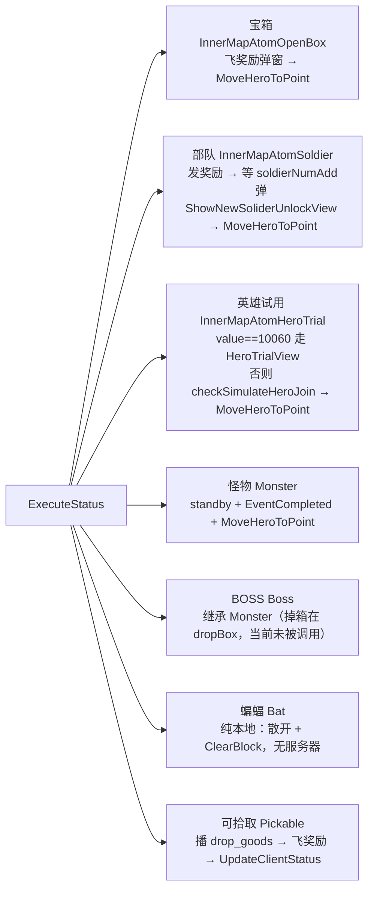
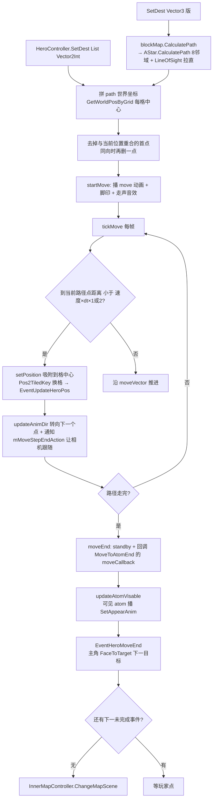

**■ 内城推格子模块使用说明（InnerMap / LastWar）**

> 项目: RedAlert_SuperFormation（红警 / 帝国 / KS 多品牌复用）
> 整理时间: 2026-09-20
> 核心代码: `Assets/DevCodeFM/IF/DayZClasses/InnerMap/`（50 个 .cs，7 764 行）
> 关卡数据: `Assets/AssetBundles/DayZ/PlatformDefault/Default/Config/WorldMap/dungeon10xxx.asset`
> 根节点: 运行时创建 `GameObject("InnerMapRoot" + MapId)` — `InnerMapScene.cs:269`
> 配套文档: [[指引模块]]（引导会点推格子）· [[活动模块]] · [[商城计费模块]]

---

**■ 一、模块总览**

**▍ 1.1 一句话定位**

内城推格子 = 把内城主界面切成 **8×8＝64 个「地块」（AreaId / blockID，0~63）**，每个地块内嵌一张 **16×16 的独立小地图（「地宫」）**，玩家逐格点开：寻路走过去 → 开宝箱 / 打怪 / 领部队 → 服务器鉴权通关 → 本格事件标记完成 → 全地宫走完则解锁下一个地块。各地宫按 `PlotGridEventConnect` 的 `previousBlockID / nextBlockID` 串成一条链（如 28 → 36 → 35 → 34 → 26 …）。

模块对外名称：`UIFunction.LastWar`（红警品牌下功能开关、`InnerMapOpen` 等都以它判定）。
MiniGame 枚举里它叫 `MiniGameType.InnerMap = 1 //内城推格子`（`controller/MiniGameManager.cs:8`）。

**· 术语对照（读代码必备）**

| 说法 | 代码名 | 含义 |
|---|---|---|
| 地块 / 区域 / 地宫区 | `AreaId`、`blockID`、`areaId` | 内城 8×8 的格子编号 0~63，一个地块 = 一张地宫图 |
| 地宫 | `MapId`、`dungeon10000+AreaId` | 地块内的 16×16 小地图，资源名 `dungeon{10000+AreaId}` |
| 格子 / 格 | `gridID`、`MapPoint`、`Vector2Int` | 地宫内的 16×16 坐标（0~15） |
| 事件 / 点 | `atom`、`eventId`（如 `28_3`） | 格子上的可交互对象（怪/箱/部队/试用），配表 `PlotGridEvent` 的主键 |
| 推格子 | `InnerMap`、`LastWar` | 本模块 |

**▍ 1.2 核心文件**

| 文件（`IF/DayZClasses/InnerMap/`） | 行数 | 职责 |
|---|---|---|
| `Controller/InnerMapScene.cs` | 976 | **单张地宫的门面**：加载地图与资源、建造 atom、出生点、可见性裁剪、主角移动、敌人光圈、渲染 order、全完成后的切图 |
| `astar/AStarManager.cs` | 718 | ⚠️ **死代码**（六边形 A*，全工程零引用，见 §五「死代码」条） |
| `Controller/InnerMapController.cs` | 487 | **模块单例**：`MapScenes` 字典、进入/切换/离开、进度「暂存—补发」、自动开云、当前地块查询 |
| `ui/InnerMapAttackView.cs` | 384 | 非红警品牌的打怪弹窗（战力比对 / 编队 / 上阵英雄校验） |
| `atom/InnerMapAtomBase.cs` | 372 | atom 基类：`Id`←地图数据、点击入口、服务器回调、飞奖励、死亡清理 |
| `ui/InnerMapMainUI.cs` | 356 | 世界空间图标层：解锁提示、条件气泡（`InnerMap_lock`）、事件图标（`InnerMap_icon`）、引导节点 |
| `GameTools.cs` | 336 | 层切换、渲染 order（`InitOrder`）、段落交点、飞奖励 |
| `hero/HeroController.cs` | 292 | 主角：`SetDest` 寻路移动、朝向/翻转、移动音效与尘土特效 |
| `map/BlockMapBase.cs` | 283 | 地图基类 + 与 A* 对接（开表/闭表、`LineOfSight`、`IsWay`） |
| `data/MapDataManager.cs` | 282 | `dungeon*.asset` 解析、方块↔菱形坐标换算、全局配置读取 |
| `test/InnerMapElement.cs` | 240 | 灰化/淡出材质（**当前被短路，见 §五「UpdateGray 首行 return」条**） |
| `astar/AStarPathFinder.cs` | 233 | ⚠️ 死代码 |
| `astar/AStarTile.cs` | 199 | ⚠️ 死代码 |
| `test/InnerMapCell.cs` | 191 | 每格容器：实例化 prefab、挂 atom、order、格位动画（`up` / `shiver`） |
| `atom/InnerMapAtomMonster.cs` | 171 | 怪物：红警品牌转 `MiniGameManager` 打关卡；其他品牌走 `InnerMapAttackView` |
| `astar/BinaryTree.cs` | 163 | ⚠️ 死代码 |
| `net/InnerMapNet.cs` | 151 | 协议 `user.tower.cell.complete`（带 MD5 签名）、`user.award.id`；`EventNetResult` |
| `finger/InnerMapTapGestureEvent.cs` | 144 | 屏幕点击 → 格子：先射线打 atom，再退化为坐标换算（含 8↔16 换算） |
| `astar/AStar.cs` | 123 | **方格 A*（在用）**：8 邻域 + `LineOfSight` 拉直拐点 |
| `ui/InnerMapHeroTrialView.cs` | 114 | 英雄试用弹窗（`GoWrapper` 挂 3D 模型） |
| `atom/InnerMapAtomEquipmentOpenBox.cs` | 113 | 装备宝箱（旧版，红警未用） |
| `atom/InnerMapAtomPickable.cs` | 111 | 可拾取道具（按品质出光效 `TX_dungeon_equ*`） |
| `hero/FrameAnimation.cs` | 106 | 帧动画基类 |
| `astar/AStarHeap.cs` | 99 | 二叉堆开放表（在用） |
| `map/BlockMap.cs` | 88 | 方格地宫实现：尺寸取 `serverWidth/Height`、`ClearBlock`、`IsInMap` |
| `astar/AStarUtils.cs` | 82 | ⚠️ 死代码 |
| `hero/HeroDragonBonesAnimation.cs` | 82 | 龙骨动画实现 |
| `map/BlockGrid.cs` | 72 | 格子权重/代价/启发值（`weightLevel = {1, 1e5, 1e3}`） |
| `ui/InnerMapDetailsView.cs` | 64 | 事件详情弹窗（名字/描述/奖励/战力） |
| `astar/AStarCoord.cs` | 58 | ⚠️ 死代码 |
| `astar/AStarGrid.cs` | 56 | A* 格子基类 + `AStarWalkable{Normal, Cannot, Hard}`（在用） |
| `ui/InnerMapTileUIController.cs` | 54 | 世界空间 `UIPanel` 工厂（`innerMap` 专用 order 排序） |
| `ui/InnerMapLandUnlockView.cs` | 54 | 地块解锁条件弹窗 |
| `astar/AStarDrawPathHelper.cs` | 48 | ⚠️ 死代码 |
| `ui/Component/LandUnlockListCell.cs` | 43 | 解锁条件列表项 |
| `test/InnerMapSoundController.cs` | 41 | 音效常量（`dungeon_walk` 等）+ 播放封装 |
| `test/InnerMapLightEffect.cs` | 40 | 地格光圈，5 种状态（主角 1 / 怪 2 / 箱 3 / 条件不足 4 / 试用 5） |
| `atom/InnerMapAtomSoldier.cs` | 40 | 部队格：领取 → 弹 `ShowNewSoliderUnlockView` |
| `atom/InnerMapAtomHeroTrial.cs` | 37 | 英雄试用格 |
| `atom/InnerMapAtomBat.cs` | 37 | 蝙蝠（纯本地表现，主角靠近自动散开并 `ClearBlock`） |
| `astar/AStarSearchNode.cs` | 28 | ⚠️ 死代码 |
| `atom/InnerMapAtomBreakBox.cs` | 34 | 可破坏箱（拾取流程基类） |
| `atom/InnerMapAtomOpenBox.cs` | 33 | 开启宝箱（死亡动画 → 飞奖励 → 主角前进） |
| `Controller/InnerMapConst.cs` | 25 | 15 个全局通知名 |
| `astar/IStarMapBlock.cs` | 25 | A* 地图接口（在用） |
| `hero/HeroAnimationBase.cs` | 21 | 动画抽象 |
| `astar/Node.cs` | 19 | ⚠️ 死代码 |
| `atom/InnerMapAtomBoss.cs` | 18 | BOSS（`Monster` 子类，死后原地掉箱 `APR_item_baoxiang`） |
| `test/InnerMapOrderOffset.cs` | 12 | 龙骨插槽 order 偏移组件 |
| `astar/FindPathResult.cs` | 9 | 寻路结果 `{short[] path; int length}`（在用） |

**▍ 1.3 配置表**（DataAtlas：`Assets/ResDepends/default/Config/DataAtlas/*.json`；类定义 `DataAtlas/DataAtlas.cs`）

| 表 | 类定义 | 条数 | 关键字段 |
|---|---|---|---|
| `PlotGridEvent` | `DataAtlas.cs:4910` | **125** | `id`(主键=eventId，形如 `28_3`) · `blockID`(地块) · `gridID`(地块内序号) · `nextID`(下一事件) · `path`(走位点) · `type`(表现类型) · `value`(指向 `PlotGridEventUIInfo`) · `visible` · `visibleid`(任务门槛) · `conditions` · `sceneid`(战斗关卡) · `sceneType` · `reward` · `UIvisible` · `UIicon` · `guideid` / `guideid_click` |
| `PlotGridEventConnect` | `DataAtlas.cs:4949` | **15** | `id`(=blockID) · `previousBlockID` · `nextBlockID` · `count` — 地宫链 |
| `PlotGridEventUIInfo` | `DataAtlas.cs:4962` | **125** | `id`(10xxxx=事件 value) · `gridID` · `name`/`des`(多语言) · `type` · `icon` · `fightingForce`(战力要求) · `reward` · `headicon` |
| `CityCloudConfig` | `DataAtlas.cs:1125` | **64** | `id`(=AreaId 0~63) · `index` · `animation` — 地块「云」表现 |

实测分布（python 统计 `PlotGridEvent.json`）：
- `type` 分布：`5:45`、`1:31`、`4:14`、`6:12`、`2:9`、`7:7`、`9:5`、`8:1`、`10:1`
- `blockID` 15 个：18/19/20/21/26/28/29/34/35/36/37/42/43/44/45；每块 7~10 个事件（链路以 `gridID` 1→N 顺序推进，末节点 `nextID` 为空）
- `conditions` 全为 `["castleLevel,1"]`；`sceneType` 仅 1 条为 1（`28_1`），其余 0

**▍ 1.4 关卡资源**（`Assets/AssetBundles/DayZ/PlatformDefault/Default/Config/WorldMap/`）

| 资源 | 数量 | 说明 |
|---|---|---|
| `dungeon10000+AreaId.asset` | 15 张（10018/10019/10020/10021/10026/10028/10029/10034/10035/10036/10037/10042/10043/10044/10045） | 正式地宫，与 `blockID` 一一对应 |
| `dungeon10028Test.asset` | 1 | 测试图 |
| `dungeon10035_1.asset` | 1 | 变体/备份 |
| `fast_dungeon10000+AreaId.asset` | 15 张 | 「快速」版地宫（体积略小，同一批地块） |
| `WorldMapPiece/3D/InnerMap/prefab/` | 343 个 prefab | `HJ_InnerMap_100xx`(地皮) + `Hj_*`(原子) + `InnerMap_APR_*`(装饰/路面/角色) |

`dungeon*.asset` 是可读 YAML（`MapData`，`ScriptableObject`，`IF/DayZClasses/Ext/WorldTileMap/NewVersion/MapData.cs:5`），固定结构：

```yaml
mapViewType: 1                 ＃ RHOMBUS 菱形
mapSize: {x: 16, y: 16}        ＃ 16x16 = 一个地块
logicTiledSize: {x: 0.5, y: 0.25}
resourceDirs: [ ...WorldMapPiece/3D/InnerMap/prefab ]
gConfigs:                      ＃ 关键！覆盖代码里的默认值
  - {key: initHalfSize, value: 16}   ＃ 出生时激活半边半径（代码默认 3）
  - {key: viewHalfSize, value: 16}   ＃ 主角视野半边半径（代码默认 3）
  - {key: bornX, value: 5}           ＃ 首次进入出生格
  - {key: bornY, value: 14}
tiledDisplayDatas:             ＃ 每格要实例化的 prefab（含 atom）
  - key: {x: 5, y: 14}
    objectDatas:
    - {prefabId: Hj_baoxiang2, position: ..., dataParams: [{key: id, value: 28_2}]}
tiledLogicDatas:               ＃ 只列「不可走」格
  - {x: 1, y: 8, physicType: 1, groupId: 0}
```

注意两点（实测）：
1. `tiledLogicDatas` **只列阻挡格**，未列出的格子由 `new BlockGrid(i, j, 0)` 默认成 `Normal`（`BlockMap.cs:38`）。dungeon10018 列 488 条、去重后仅 56 格；dungeon10028 列 1 964 条、去重后 64 格，同一 `(x,y)` 重复 4~8 次（`groupId` 不同）→ **导出脏数据**，见 §五「数据脏」条。
2. `physicType` 实测全为 `1`（`AStarWalkable.Cannot`），`Hard(2)` 权重档在现有数据里没有用到。

**· atom prefab ↔ 脚本 实测映射**（源码 + prefab 内 script GUID 反查）

| 代码里的 `type` 注释/分支 | 配表 `type` | 实测挂载脚本 | 实测 prefab |
|---|---|---|---|
| 宝箱 | 1 | `InnerMapAtomOpenBox` | `Hj_baoxiang2` / `Hj_baoxiang2_1` |
| (宝箱/资源另一档) | 4 | `InnerMapAtomOpenBox` | `Hj_baoxiang1` / `Hj_baoxiang1_1` |
| 部队 | 2 | `InnerMapAtomSoldier`（继承 `BreakBox`） | `Hj_budui_ZX/ZS/YS/YX` |
| 怪（`InnerMapObjectType.Monster/Boss`） | 5、6 | `InnerMapAtomBoss`（继承 `Monster`） | `Hj_fangkongbubing_*`、`Hj_fushebuibing_*`、`Hj_kuangshouren_*`、`Hj_fensuizhe_*`、`Hj_weilaitank_*`（23 个） |
| 限时任务 / 限时任务2 | 7、9 | `InnerMapAtomOpenBox` | `Hj_baoxiang1` / `Hj_baoxiang1_1` |
| 英雄试用 | 8 | `InnerMapAtomHeroTrial` | `InnerMap_APR_DungeonHero10009` / `InnerMap_APR_DungeonHeroTest` |
| 战机 | 10 | `InnerMapAtomOpenBox` | `Hj_zhanji` |
| （多功能） | — | `InnerMapAtomOpenBox` | `Hj_duogongneng_ZS` |

> ⚠️ **行为由 prefab 上挂的脚本决定，不由 `type` 数值决定**：`type` 只用于 `InnerMapMainUI.cs:114` 的图标控制器分支和 `InnerMapNet.cs:25` 的「是否弹奖励」判定。所以改一个事件的表现，要同时改 `type`（表现/图标）与 prefab 上的 atom 脚本（逻辑）。红警品牌下 `InnerMapAtomMonster`（裸）、`InnerMapAtomBreakBox`、`InnerMapAtomPickable`、`InnerMapAtomEquipmentOpenBox`、`InnerMapAtomBat` 这 5 个脚本**没有任何 prefab 在用**，属其他品牌/旧版余留。

**▍ 1.5 数据流**

```text
服务器推送进度 (areaId / questID / hangup_id / datas[status,reward])
        │
        ├─ LoginInitParser.cs:3437  → InnerMapController.ParseProgressData(dict)
        └─ 事件 InnerMap_DataUpdate → InnerMapController.EventDataUpdate → 补发暂存数据
                      │
                      ▼
        InnerMapController.MapScenes[areaId]   ← 每个地块一个 InnerMapScene
                      │  InitProgressData()：从 PlotGridEvent 建 ProgressData(eventId→status)
                      ▼
        InnerMapScene.Open(touchLayer)
          ├─ new GameObject("InnerMapRoot"+MapId)   (MapId = 10000+AreaId)
          ├─ LoadScene: MapDataManager.LoadMapData("Config/WorldMap/dungeon"+MapId)
          │              → BlockMap.Init()（serverWidth×serverHeight 建格 + 写入阻挡格）
          ├─ loadMapRes：给 16x16 每格建 InnerMapCell，实例化 prefab → 找 InnerMapAtomBase 注册到 mapAtomDict
          ├─ loadMapAddition：主角 prefab + UI 根（InnerMapTileUIController）
          ├─ loadServerData：定出生点 / 主角朝向 / updateAtomVisable / SetResetOrder
          └─ 订阅：EventUpdateHeroPos / CLOSE_VIEW / MSG_FUN_BUILD_UP_END / RefreshCarList / Now_Area_Unlock / QUEST_INFO_UPDATA
                      │
玩家点屏幕 → InnerMapTapGestureEvent.OnTap
   ├─ 射线命中 atom → 直接用 atom.MapPoint / atom.Config.blockID
   └─ 未命中 → 屏幕→地块坐标 → (x % TiledSize, y % TiledSize)
                      │
        onTapPoint: 校验(云锁 / 是否「下一未完成」/ 条件 / 已在执行 / 主角移动中)
                      │ 命中下一目标 → MoveToAtomEnd → atom.ClickEvent()
                      ▼
        InnerMapAtomBase.ChangeServerStatus → InnerMapPassCommand("user.tower.cell.complete")
                      │  服务器回包 params{id,status,reward,mailId}
                      ▼
        InnerMapController.ParseProgressData → InnerMapScene.ParseProgressData
                      │  → 通知 EventDataChanged(result:EventNetResult)
                      ▼
        atom.Awake 里的监听 → IsExecuting=false → 状态1: flyReward + Execute
                      ▼
        Execute → 播死亡/攻击动画 → animCompletedEvent → ExecuteStatus
                      │  箱/部队/试用：EventCompleted + MapScene.MoveHeroToPoint(this)
                      │  怪：EventCompleted + MapScene.MoveHeroToPoint(this)
                      ▼
        MoveToDest 走完 → updateAtomVisable + EventHeroMoveEnd + 主角转向下一目标
                      │  若 GetNextInCompleteData() == null（本地宫走完）
                      ▼
        InnerMapController.ChangeMapScene() → AdventureAreaId = nextBlockID → 下一个地块显主角
                      │  nextBlockID == 0 → 停在原地（最后一关）
                      ▼
        MoveHeroToPoint 里另有一条：nextdata==null 时发 MSG_REFRESH_SCENEBACK(nextBlockID)
```

---

**■ 二、流程图**

**▍ 2.1 进入 / 离开模块**



**▍ 2.2 点击 → 通关主链**



**▍ 2.3 atom 完成后的分支（ExecuteStatus 各不相同）**



**▍ 2.4 寻路与移动**



---

**■ 三、使用方法**

**▍ 3.1 新增一个地宫地块（第 N 个地块）**

1. **做图**：用项目的地宫编辑器（`MapData` 脚本）产出 16×16 布局，导出到
   `Assets/AssetBundles/DayZ/PlatformDefault/Default/Config/WorldMap/dungeon{10000+新AreaId}.asset`。
   必须确认 `gConfigs` 里有 `initHalfSize / viewHalfSize / bornX / bornY`（代码有默认值，但现网数据一律配 16/16）。
2. **配事件表** `PlotGridEvent.json`：每个节点一行，`id = "{AreaId}_{gridID}"`，`blockID = AreaId`，
   `gridID` 从 1 递增，`nextID` 指向下一节点（末节点留空），`value` 指向 `PlotGridEventUIInfo` 的 id，
   `type` 决定图标表现，`reward` 形如 `"7;300012;5000"`（`type;id;num`，多份用 `|` 分隔）。
3. **配 UI 表** `PlotGridEventUIInfo.json`：`id = value`，填 `name`/`des`（多语言 key）、`icon`、`fightingForce`、`reward`。
4. **配链** `PlotGridEventConnect.json`：新增一行 `id = AreaId`，`previousBlockID` = 上一地块、`nextBlockID` = 下一地块（0/空＝终点）。**首块必须能被 `SetPreCloudUnLock` 递归回溯到**。
5. **配云** `CityCloudConfig.json`：`id = AreaId`（0~63 全覆盖），`index`/`animation` 走地块云的解锁表现。
6. **在 `tiledDisplayDatas` 里摆 atom**：每格一个 `objectDatas`，`prefabId` 指向 `WorldMapPiece/3D/InnerMap/prefab/` 下的 prefab，`dataParams: [{key: id, value: "{AreaId}_{gridID}"}]`，可选 `{key: order, value: N}`。
7. **给阻挡格写 `tiledLogicDatas`**：`{x, y, physicType: 1}`（1＝不可走）。**漏写 = 该格可走；多写 = 走不过去**，是「主角卡住」的第一排查点。
8. **建资源目录 `HJ_InnerMap_{MapId}.prefab`** 与地皮（每张地宫都有一份同名 prefab，如 `HJ_InnerMap_10018`）。
9. **验证**：进游戏看 `EnterMap:` 日志里的 `AdventureAreaId`，再逐格点。

**▍ 3.2 给已有地宫加一个事件节点（最常用）**

在链路中间插入事件时，注意「事件链」与「实际走位」是两套东西：

1. 新建 `PlotGridEvent` 行：`id`（唯一）、`blockID`、`gridID`（决定显示顺序与 `GetCurGridId`）、`nextID`。
2. **改动前后节点的 `nextID`**，保证链路不断（`GetNextInCompleteData` 是按 `Data` 字典遍历取第一个未完成，字典顺序＝插入顺序＝`InitProgressData` 遍历 `DataAtlasManager` 的顺序，**不保证等于 `gridID` 顺序**）。
3. 摆 `tiledDisplayDatas`：把新 prefab 放到目标格，`dataParams.id` 写新 eventId。
4. 如果这个节点要让主角「走过去再打」，把走位点写进 `path`（`["9,17"]` 形式），`MoveHeroToPoint` 会 `dest = [atom.MapPoint] + path` 依次走。
5. 需要战斗就填 `sceneid`（+ `sceneType`），红警品牌会走 `MiniGameManager.EnterGame(sceneid, MiniGameType.InnerMap, sceneType, data)`。

**▍ 3.3 新增一种格子表现（新 atom）**

1. 新写一个类继承 `InnerMapAtomBase`（或 `BreakBox` / `Monster` / `OpenBox` 复用现成流程），至少实现：
   `GetObjectType()`、`Execute(EventNetResult)`；视需要重写 `ClickEvent()`、`ShowDetailsView()`、`ExecuteStatus()`、`flyReward()`、`IsExecuted()`。
2. 做 prefab，把该脚本挂在子物体上（`InnerMapCell.ConstructorObject` 用 `GetComponentInChildren<InnerMapAtomBase>()` 取，**Prefab 根或子物体均可**）。
3. prefab 放进 `WorldMapPiece/3D/InnerMap/prefab/`，并在 `dungeon*.asset` 的 `tiledDisplayDatas` 里引用。
4. 如需世界空间名字/图标：给 prefab 的 atom 填 `uiComponentName`（FGUI 组件名，包 `icon_mainmenu`），
   并在 `PlotGridEvent` 里把 `UIvisible = true`，`InnerMapMainUI.ShowAtomUIEnable` 才会给它建 `InnerMap_icon`。
5. 需要在「未解锁时显示条件气泡」，把条件写进 `PlotGridEvent.conditions`（`"castleLevel,1"` 形式）；
   `InnerMapAtomBase.IsConditionsOK()` → `DataService.CheckCondition` 会驱动 `InnerMap_lock` 气泡与 `GoToCondition()`。

**▍ 3.4 业务侧调用（外部系统接进来）**

| 需求 | 入口 | 位置 |
|---|---|---|
| 打开/关闭整个推格子 | `InnerMapController.Instance.EnterMap(touchLayer.transform)` / `LeaveMap()` | `FreeBuildScene2.cs:2980` / `:3016` |
| 单地块打开/关闭 | `AddMapScene(transform, areaId)` / `MapClose(areaId)` | `FreeBuildScene2.cs:2965` / `:2973` |
| 镜头飞到某个事件 | `GotoCurrentEvent(eventId, time)` | `InnerMapController.cs:387`；调用例 `AreaLockController.cs:120`（`"28_2"`）、`QuestController.cs:2683` |
| 当前完成到第几格 | `GetCurGridId()` | `InnerMapController.cs:424`；用于 `GuideController.cs:2201`、`FreeBuildLotteryController.cs:270` |
| 引导点某格 | `CurMapScene.ExecuteAtom(guide.para1)` / `MoveToDest(pathStr…)` / `SetOffsetPosition` | `GuideTriger.cs:1203 / 1225 / 1210` |
| 挂机奖励 id | `InnerMapController.Instance.HangupId` | `PVEController.cs:454` |
| 让所有 atom 显隐 | `InnerMapController.Instance.SetAllAtomsVisible(bool)` | `InnerMapController.cs:266`（内部由 `FUNCTION_UNLOCK` 驱动） |
| 查某格事件是否完成 | `GetProgressData(eventId).IsCompeleted()` | `InnerMapScene.cs:208` |

**▍ 3.5 调试手段**

- **日志开关点**（现网用 `LogCommon.LogError` 打正常流程，见 §五「日志噪声」条）：`EnterMap:`、`MoveHeroToPoint:`、`MoveHeroToPoint Over`、`OnTap:`、`OnTap Point:`、`OnTap isRay:`、`result:`（寻路长度）、`result path:`（拉直后节点数）、`animCompletedEvent:`、`GotoSceneBack EventDataUpdate`、`adventureMapId :`、`addMapScene :`。
- **条件不满足时**：`InnerMap_lock` 气泡直接显示 `DataService.CheckCondition` 的 `ErrorMessage`。
- **寻路可视化**：`BlockMapBase.Draw()` / `DrawBlock()`（`Debug.DrawLine`）可把阻挡格画成黄/红；`BlockMapBase.cs:43` 有 `CeHua_Delete` 宏分支（旧的正交坐标方案，已被 `MapDataManager` 坐标换算取代）。
- **资源缺失**：`InnerMapCell.ConstructorObject` 找不到 prefab 会 `LogError("mapData.prefabId is null:…")`；id 重复会 `LogError("重复的Key:…")`。
- **快捷自检**：`GuideController`/调试快捷键里有 `InnerMapMainUI_Point` 引导节点标记（`Global.GUIDE_INDEX_CHANGE`），可用来确认 UI 层是否跟着事件刷新。

---

**■ 四、配表事项（逐条可执行）**

1. `PlotGridEvent.id` 必须唯一；`blockID` 必须等于地块 AreaId；`gridID` 从 1 连续递增（`GetCurGridId` 直接用它做进度显示，`InnerMapController.cs:439-447`）。
2. `nextID` 只是**声明性**字段：真正推进用的是「`ProgressData` 里第一个 `status != 1` 的条目」，即**遍历顺序**而非 `nextID` 顺序。插事件时务必确认 `DataAtlasManager.GetDataWithType<PlotGridEvent>()` 的返回顺序与 `gridID` 一致，否则会出现「点了 A 格却推进 B 格」。
3. 每个 `PlotGridEvent.value` 必须在 `PlotGridEventUIInfo` 里存在（`InnerMapDetailsView`/`InnerMapAttackView` 都按 `value` 查表，查不到就空引用）。
4. `reward` 字符串格式 `type;id;num`，多条用 `|`；`ProgressData.Parse(PlotGridEvent)` 会按这个格式拆成 `showRewardsArr`；服务器回包给的是 `reward`（真实奖励）。
5. `path` 字段元素形如 `"x,y"`（`Vector2IntValue()` 解析），是「打完这一格之后继续走」的点位，可为空。
6. `conditions` 元素形如 `"castleLevel,1"`；用 `CCCommonUtils.ParseConditions` 解析、`DataService.CheckCondition` 校验，也决定 `InnerMap_lock` 气泡文案。
7. `visible`（恒可见）与 `visibleid`（需要 `QuestID >= visibleid`）两者取或；`InnerMapScene.updateAtomVisable` 还会**强制**让「下一未完成」事件可见（`InnerMapScene.cs:499`）。
8. `UIvisible = true` 才会在 `InnerMapMainUI` 里生成事件图标；图标外观由 `type` 决定（`InnerMapMainUI.cs:114`：`6=BOSS`、`1=宝箱`、`7=限时任务`、`9=限时任务2`、`10=战机`，其余走默认档）。
9. `PlotGridEventConnect` 必须成链：每块都要有 `id`，`previousBlockID`/`nextBlockID` 双向对得上；`EnterMap` 时会用 `SetPreCloudUnLock` 从当前块一路回溯解锁云，链断会导致云锁残留。
10. `CityCloudConfig` 的 `id` 必须覆盖 0~63（`AreaLockController.isAreaCloudLocked` 越界会返回 `true`＝视为锁定）。
11. `dungeon*.asset` 的 `gConfigs` 建议恒定 `initHalfSize = viewHalfSize = 16`（＝全图可见；硬编码清单见 §五）；改成 3 会启用 7×7 菱形视野裁剪，需自行验证表现。
12. `tiledLogicDatas` 只写阻挡格、`physicType: 1`；不要重复写同一 `(x,y)`（现网数据有 4~8 倍重复，属脏数据）。
13. `dataParams` 里 `id` 必须与该地图 `PlotGridEvent.blockID` 对应（`"{AreaId}_{gridID}"`）；写错会导致 `InnerMapScene.loadServerData` 的名字/条件对不上。
14. 出生点 `bornX/bornY` 必须落在 `tiledLogicDatas` **未列出**的格子上，否则主角出生即卡墙。
15. 新增/改名 prefab 后，务必确认拖进 `tiledDisplayDatas` 的 `prefabId` 与文件名一致（`WorldMapFactory.GetGameObject` 按 id 取）。

---

**■ 五、注意事项（已知坑）**

| 级别 | 问题 | 位置 |
|---|---|---|
| 🟠 | `NewAreaUnLock` 里 `EnemyLightEffect.GetAtom()` **未判空**，地块解锁事件到达而当前没有敌人光圈时会 NRE（同文件 `CheckLockAtom` 有判空，此处漏了） | `InnerMapScene.cs:406` |
| 🟠 | `loadServerData` 里 `var atom = GetAtom(data.eventId);` 之后**直接** `atom.Config.path`，未判空；事件配了但地图没摆 atom 时会 NRE（同函数下方 `:578` 有判空） | `InnerMapScene.cs:546-547` |
| 🟠 | `CurMapScene => MapScenes[AdventureAreaId]` 直接索引字典；`ClearMap()` 会把 `AdventureAreaId = -1`，此后任何 `CurMapScene`/`GetMapScene(AdventureAreaId).IsOpen` 都会 `KeyNotFoundException` | `InnerMapController.cs:46`、`:314`、`:350`、`:384` |
| 🟠 | 数据脏：`tiledLogicDatas` 同一 `(x,y)` 重复 4~8 次（dungeon10018：488 条→56 格；dungeon10028：1964 条→64 格），`physicType` 全为 1；体积与解析开销白花，也掩盖「编辑器中同一格反复标记」 | `Config/WorldMap/dungeon*.asset` |
| 🟡 | `UpdateGray()` **首行 `return;`** → 视野外灰化/淡出整体失效；连带 `grayRuleArray`、`IsMatchRuleArray`、`InnerMapElement.SetFade` 全成死代码，`InnerMapElement.Update()` 首行也 `return` | `InnerMapScene.cs:879-881`、`InnerMapScene.cs:913-926`、`test/InnerMapElement.cs:58` |
| 🟡 | `ShowUnLockUITips()` 内除 `IsAllCompleted()` 分支外**全部注释掉**：地块解锁 / 自动开云靠外部事件补齐，单独依靠本模块不会解锁 | `InnerMapScene.cs:758-778` |
| 🟡 | 死代码：`InnerMap/astar/` 下 `AStarManager(718) + AStarPathFinder(233) + AStarTile(199) + BinaryTree(163) + AStarUtils(82) + AStarCoord(58) + AStarDrawPathHelper(48) + AStarSearchNode(28) + Node(19) = 1 548 行`，**全工程零引用**（与 `view/DungeonMap/astar/`（namespace `DayZ`）同源复制，只改了 namespace）。真正在用的是同目录 `AStar.cs / AStarGrid.cs / AStarHeap.cs / IStarMapBlock.cs / FindPathResult.cs` | `InnerMap/astar/*` |
| 🟡 | 硬编码清单：「地宫 id＝10000+AreaId」`InnerMapScene.cs:126`；「`Config/WorldMap/dungeon` + mapId」`:320`；「内城↔地宫缩放＝serverHeight/8」`:743`；镜头时长 `0.83f` `:744`；初始地块 `AreaId != 28` `InnerMapScene.cs:767` 与 `InnerMapController.cs:61`；「主城等级 ≥ 2 才预建下一地块」`InnerMapController.cs:482`；英雄试用 `value == "10060"（纳赛尔）` `InnerMapAtomHeroTrial.cs:18`；点击兜底 `TiledSize = 8` `InnerMapTapGestureEvent.cs:53`；引导节点 `% 8` `InnerMapMainUI.cs:336`；`getAreaId` 的 `pos/8*8+pos/8` 与 `getPosFromArea` 的 `areaId%8*8` 必须成对改 | 各处 |
| 🟡 | `InnerMapCell.ConstructorObject` 遇到重复 `id` 只 `Debug.LogError` 并把该格 `ClearBlock`，**不销毁已建对象** → 配错时表现是「半坏」，不崩但很难查 | `test/InnerMapCell.cs:81` |
| 🟡 | `GameTools.PickedItem(this InnerMapAtomBase)` 是无参重载，内部引用旧地宫 `DungeonMainUI` / `DungeonFlyComponent` / `NewDungeon` 包 —— 老地宫遗留（新版走带 `AllTypeItemInfo` 参数的那个重载） | `GameTools.cs:242` 起 |
| 🟡 | `AStar` 用静态共享状态（`_result` 定长 2048 short、`blockMap` static），寻路结果数组被上层直接 `path.Reverse()` 使用 → 不可重入、连续寻路会互相覆盖；路径长度超过 1 024 格会越界 | `astar/AStar.cs:8-14`、`hero/HeroController.cs:112` |
| 🟡 | 日志噪声：`MoveHeroToPoint`、`SetAppearAnim`、`OnTap`、`result:` 等**正常流程**都用 `LogCommon.LogError` 打印，出问题时真错误容易淹没 | `InnerMapScene.cs:672`、`InnerMapAtomBase.cs:325`、`InnerMapTapGestureEvent.cs:67`、`hero/HeroController.cs:102` |
| 🟡 | `getHero()` / `GetAtom()` 等返回 null 的路径在调用侧普遍不判空（如 `loadServerData` 用 `atom.Config`、`SetEnemyLightEffect` 用 `mapObject[atom.MapPoint]`） | `InnerMapScene.cs:418-422`、`:547` |
| 🟡 | `InnerMapAtomBase.Conditions` 惰性解析写的是 `if (Conditions.Count == 0)`：当 `conditions` 为空字符串时每次调用都会重解析一次 | `atom/InnerMapAtomBase.cs:108-115` |
| 🟡 | 目录命名：生产用的 `InnerMapCell.cs` / `InnerMapElement.cs` / `InnerMapLightEffect.cs` / `InnerMapSoundController.cs` / `InnerMapOrderOffset.cs` 都放在 `test/` 目录下，容易误删 | `InnerMap/test/*` |

**「地宫走不动 / 点不动」排查顺序**（实测有效）

1. 看云锁：`AreaLockController.isAreaCloudLocked(areaId)`（`getAreaId` 越界返回 true）。
2. 看是不是「下一未完成」：`InnerMapTapGestureEvent.onTapPoint` 只对 `GetNextInCompleteData().eventId` 放行，点别的格只会弹详情。
3. 看主角是否在移动：`InnerMapTapGestureEvent.HeroIsMoving` 为真时点击全部被吞。
4. 看动画初始化：`atom.IsInit` 为假（出场动画未播完）时也会吞点击。
5. 看寻路：`BlockMapBase.IsWay` → `_mapData[x,z].Block != Cannot`；确认 `tiledLogicDatas` 没把目标格写成立 1。
6. 看坐标：`convertToInnerMapTilePosByScreenPos(pos, TiledSize)`（`TiledSize = DataManager.serverHeight = 16`），再 `% TiledSize`。

---

**■ 六、相关文档**

- 同目录姊妹模块：[[指引模块]] · [[活动模块]] · [[商城计费模块]]
- 交汇点：引导系统通过 `GuideTriger.cs:1203/1210/1225` 直接驱动推格子（`ExecuteAtom` / `MoveToDest` / `SetOffsetPosition`），`GuideController.cs:2201` 用 `GetCurGridId()` 判引导进度；`GuideController.getInstance().CheckInnerMapOnClickGuide(Id)` 是每次点击的前置闸门。
- 项目内（非 Obsidian）：本模块暂无 `docs/fix/inner_map/`；§五 中 🟠 级 3 项（NRE×2 + 字典越界）与数据脏项建议立项修复，是否立项待拍板。
- 关联模块：[[大地图]]（`AreaLockController` 的内城地块锁定/开云与地块编号 0~63 同源）
- 容易混淆：[[内城相关]] 里记的 `setConnected() / getConnected()` 属于 `FunBuildController` **建造物连通性**（`controller/FunBuildController.cs:797`、`controller/freebuild/FreeBuildController.cs:271`），与本模块无关，不要混用。
