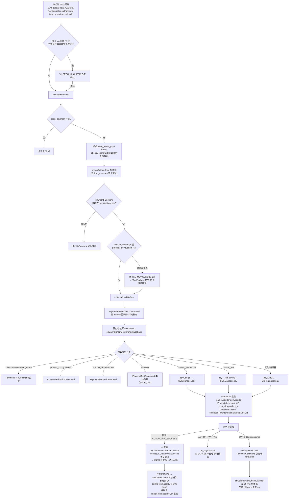
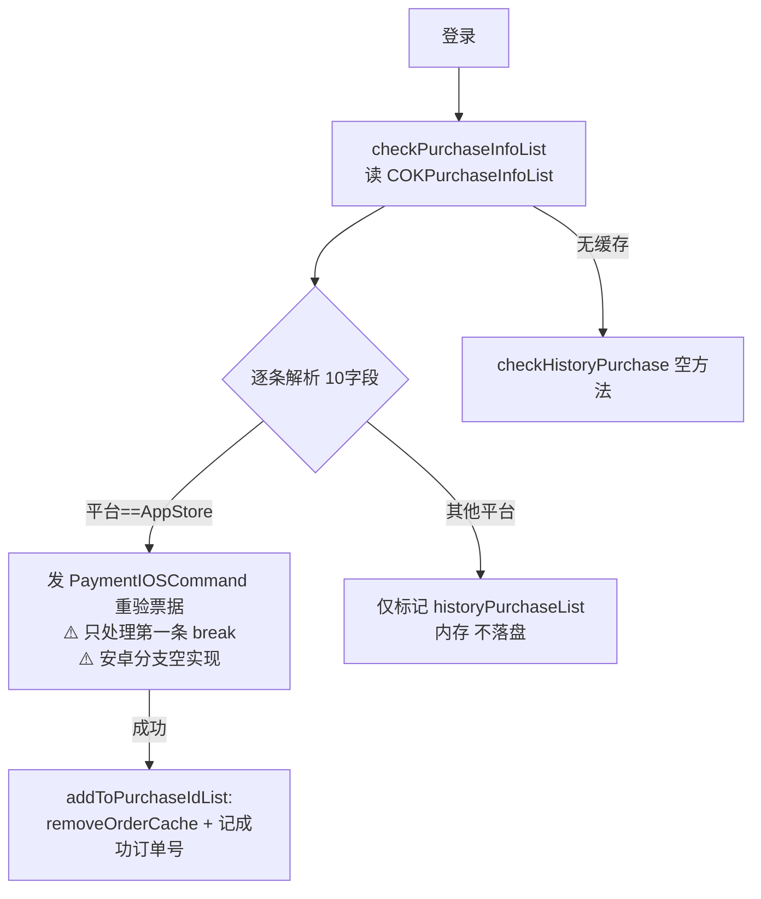

# 商城计费模块使用说明（Pay / GoldExchange）

> 项目: RedAlert_SuperFormation（红警/帝国/KS 多品牌复用，JoySDK/LTSdk 统一支付网关）
> 整理时间: 2026-09-09
> 核心代码: `IF/DayZClasses/controller/PayController.cs`（1117 行）+ `Net/command/PaymentCommand/`（11 个命令）
> 配套文档: 活动侧入口见同目录《活动模块.md》（GoldExchange 组即礼包商城）

---

## 一、模块总览

商城计费分两层：
- **商城展示层（礼包）**：礼包数据**来自服务器**（`GoldExchangeInfoCommand` 拉取 → `LiBaoController` 解析），页面/页签由 DataAtlas `Exchange_page.json` 配置；礼包商城本身就是活动框架的 `GoldExchange` 组（49 个条目，见《活动模块.md》）
- **计费链路层**：`PayController` 统一入口 → 服务端预校验（拿 selfOrderId）→ 按商品类型分发 → SDK 支付（JoySDK 网关，内部路由 Google/Apple/TStore/OneStore）→ 客户端回调 → 服务端票据核验 → 登录补单

### 1.1 核心文件

| 文件 | 行数 | 职责 |
|------|------|------|
| `controller/PayController.cs` | 1117 | **计费总控**：callPayment 入口、预校验、平台分发、SDK 回调、订单本地缓存（补单用）、成功订单号记录 |
| `controller/VIPaymentController.cs` | 231 | 越南版（RED_ALERT_VI）支付二次确认（VI_SECOND_CHECK） |
| `controller/ContinuousRechargeController.cs` | - | 连充活动 |
| `model/GoldExchangeItem.cs` | 970 | 礼包数据对象（30+ 字段，价格/商品ID/限购/展示） |
| `model/FirstPayInfo.cs` / `ContinueRechargeInfo.cs` | - | 首充/连充信息 |
| `controller/freebuild/LibaoController.cs` | 900+ | 礼包字典管理（getExchangeItemById / dumpGoldExchange / parseOneItem） |
| `view/popup/GoldExchangeView/` | - | 礼包商城视图（GoldExchangeView 继承 BaseBannerView） |
| `view/popup/GoldExchangePopUpView.cs` | 427 | 礼包弹窗（推荐位） |
| `view/popup/PaymentFailurePopUp.cs` | - | 支付失败弹窗 |
| `Net/command/PaymentCommand/*.cs` | 11 个×~50 行 | 各支付类型服务器命令（见 §三.4） |
| `Net/command/GoldExchangeInfoCommand.cs` | - | 拉取礼包数据 + 月卡命令（MonthCardRewardCommand 等） |
| `NativeCode/SDKManager.cs` | - | SDK 封装：`pay(GameInfo)` 发起、`eventSDKMsgCallback` 回调（`useSDK=false` 走本地测试） |
| `NativeCode/OnlineSDK/LtsdkListener.cs` | - | SDK 事件常量（ACTION_PAY_SUCCESS / ACTION_PAY_FAIL / …） |

### 1.2 数据来源

| 数据 | 来源 | 说明 |
|------|------|------|
| 礼包条目 | **服务器**（GoldExchangeInfoCommand） | 购买次数/限购状态/价格由服务器权威；客户端 `LiBaoController.m_goldExchangeList` |
| 商城页签 | DataAtlas `Exchange_page.json` | 7 个页签：id/name(语言key)/condition/order |
| 功能开关 | 开关表 | `open_payment`（总开关）、`certification_pay`（实名）、`wechat_exchange`（微信兑换）、`dark_guidance` |
| 订单缓存 | CCUserDefault | key `COKPurchaseInfoList`（待核验订单，10 字段 `|#|` 分隔、多订单 `|*|` 分隔）；`COK_PURCHASE_SUCCESSED_KEY`（已成功订单号）；`catch_item_id`（当前支付 itemId） |

---

## 二、流程图

### 2.1 购买主流程



### 2.2 登录补单流程（防掉单）



---

## 三、使用方法

### 3.1 业务侧发起购买

```csharp
var item = LiBaoController.getInstance().getExchangeItemById("礼包id");
PayController.getInstance().callPayment(item, "来源视图名", callback);
// 可选参数: bRegister(订阅) / chooseItem(多选一礼包) / recordIndex(全局列表防重购索引)
// 带二次确认(捕获型礼包):
PayController.getInstance().CallPaymentWithCatchConfirm(item, "来源");
```

- `fromView` 仅 `"GiftRecommendDetailsView"` 有特殊逻辑（上报 FormgGiftReCommend）
- 回调 `callback` 在 `onCallPaymentServerCallback` 成功后经 `getSuccessCallBack()` 消费（一次性，取完置 null）
- **免费/钻石/金砖/真实付费** 全走同一入口，类型由 `GoldExchangeItem` 字段决定，业务侧无需关心

### 3.2 商品类型判定（GoldExchangeItem 字段）

| 判定 | 字段 | 效果 |
|------|------|------|
| 免费礼包 | `amount`（0=付费，非0=免费）→ `CheckIsFreeExchangeItem()` | 走 PaymentFreeCommand，不经 SDK |
| 金砖兑换 | `product_id == "goldBrick"` | PaymentGoldBrickCommand |
| 钻石兑换 | `product_id == "diamond"` | PaymentDiamondCommand |
| 真实付费 | 其他 | 进 SDK 收银台 |
| 订阅 | `bRegister=true` 时用 `product_id2`，否则 `product_id` | 订阅商品 ID 独立 |

### 3.3 商品 ID 三元组（⚠️ 最易混淆）

| 字段 | 用途 | 传给谁 |
|------|------|--------|
| `product_id` | **chargeId**（计费点 ID）+ 国家码查询 + 预校验 | BeforeCheck 命令、`gameInfo.chargeId`、`getCountryCode` |
| `product_id2` | **订阅**商品 ID | 订阅购买时替代 product_id；iOS `pay()` 的 description 参数 |
| `product_id3` | **新版支付 ProductId**（SDK 实际购买商品） | `gameInfo.ProductId`；为空时旧版兜底 |

**配价/新商品时三个 ID 都要配全**，且与 JoySDK 后台商品配置对齐；`product_type`：0=消耗商品 1=订阅。

### 3.4 支付命令族（Net/command/PaymentCommand/）

| 命令 | 场景 |
|------|------|
| `PaymentBeforeCheckCommand` | **第一步**：服务端预校验（风控/限购/价格），返回 `selfOrderId` |
| `PaymentCommand` | 票据核验（orderId+purchaseTime+productId+signData+signature） |
| `PaymentIOSCommand` | iOS 发货（票据+itemId，支持 `itemId_donateUID` 拆分发好友） |
| `PaymentFreeCommand` / `PaymentDiamondCommand` / `PaymentGoldBrickCommand` | 非现金支付发货 |
| `PaymentTestCommand` | 本地测试（`ROE_DEV` + `!useSDK`） |
| `PaymentAndroidCommand` / `PaymentAmazonCommand` / `PaymentTstoreCommand` | 渠道遗留命令（当前主链路走 JoySDK 统一网关） |
| `ToolPayItem` | 道具抵现支付（wechat_exchange 场景） |

### 3.5 国家/地区码映射（getCountryCode）

| analyticID / 区域 | 值 |
|-------------------|-----|
| onestore | `₩`（⚠️ 这是韩元符号不是国家码） |
| 中东 | `IRR` |
| mycard | `TWD` |
| market_global | 读本地 `gp_currency_code` |
| mol | `THB` |
| 中国大陆 | `RMB` |
| 其他 | `US` |

⚠️ 函数名叫 countryCode 实际返回货币标识，且混用代码/符号——新渠道接入时注意对齐服务端约定。

### 3.6 调试

| 手段 | 说明 |
|------|------|
| `useSDK=false` | SDKManager 开关，关闭后真实付费走 `PaymentTestCommand` 本地直发（仅 ROE_DEV 生效） |
| 订单缓存排查 | CCUserDefault key `COKPurchaseInfoList` 查待核验订单；`COK_PURCHASE_SUCCESSED_KEY` 查已成功号 |
| 日志关键词 | `add order cache` / `remove order cache` / `purchase history redo` / `doPayGoogle receive: code` |
| 打点 | `trace_event_pay`（dollar!=0 时）、Adjust `TraceEvent_Pay`、`PayRecordCommand`（首次点击行为） |

---

## 四、配表/配价事项

1. **礼包条目服务器下发**：新增礼包 = 服务器配置 + 客户端 `show_type`/`type` 字段对齐（type: 1普通 2促销 3限购一次）；客户端 DataAtlas `Exchange_page.json` 只配页签归属（id/name/condition/order）。
2. **product_id 三件套**（见 §3.3）必须配全并与 JoySDK 后台一致；漏配 `product_id3` → `gameInfo.ProductId` 为空 → SDK 收银台无商品。
3. **价格字段**：`dollar`（美元）、`price`（MoneyAmount 上报）、`gold_value`（钻石估价）、`usd_dollar`/`cdollar`（区域价）——展示文案用 `PayController.getDollarText`（dollar=0 显示"免费"115062；RTL 语言 ` $ US`/越南版 `₫`）。
4. **限购**：`limit` + 服务器购买次数；`recordIndex` 机制做"未到账不可重复购买"（内存态，重登失效）。
5. **职业限制礼包**：`if_buy` 字段格式 `1;职业id1,职业id2|文案key`，不符职业弹切换职业确认框。
6. **功能开关依赖**：`open_payment` 关闭 = 全商城不可购；CN 区 `certification_pay` 开 = 未实名弹实名框（付费前拦截）。
7. **特殊商品 ID 硬编码**：`zuanshi_5`（可勋章兑换）、道具 `200055`（末日生存勋章）、`Global.MONTH_CARD_ID`（月卡，成功后不刷礼包数据）、`DataConfig2.Firstreward`（首充礼包→CrushIceGiftView）——改这些 ID 需同步改代码。

---

## 五、注意事项（已知坑）

> 本模块为资金链路，以下问题按风险排序。项目内暂无 fix 文档，建议按此清单立项（范式参考 `docs/fix/activity_group/fix-plan.md`）。

### 🔴 资金安全级

1. **支付重入防护被注释**（PayController.cs:474-478, 699-703）：`if (m_payState != 0) return;` 在 `payGoogle`/`pay` 里都被注释掉——用户连点两次购买按钮可拉起**两次收银台**，重复扣款风险。
2. **CANCEL 回调未处理**（:617-627）：`OnGoolgePayCallback` 里两个 `if` 条件**都是** `ACTION_PAY_FAIL`（第二个日志写 CANCEL 但条件复制错了）——用户取消支付后 `m_payState` 残留为 1、加载框（:388 showWaitInterface）无人移除，界面卡"支付中"。
3. **成功即伪造成功结果**（:629-635）：SDK 回调 SUCCESS 直接 `onCallPaymentServerCallback(NetResult.CreateWithSuccess())` 刷新礼包数据——客户端展示成功但**票据核验（PaymentCommand）是另一条异步路径**；若核验后失败，玩家已看到成功但货未发，补单只能靠下次登录重发（且 iOS 补单只发第一条，见⑤）。
4. **订单缓存去重条件写反**（:188）：`if (subList.Count != 10 || orderId.Equals(subList[1])) return;`——**任意一条**缓存记录格式损坏（Count≠10）就会让之后**所有**订单无法入缓存（整个补单链路被一条脏数据永久污染）；且该判断与 `removeOrderCache`（:294，同条件却是"删除"语义）不一致。

### 🟠 功能缺陷级

5. **登录补单残缺**（:206-265）：
   - 字段解析无长度校验（:219-220 直接 `subList[0..4]`，脏数据 IndexOutOfRange）
   - 只处理 `AppStore` 平台，**安卓补单是空 `#if` 块**（:256-258 注释"暂时不翻译"）
   - 每轮只重发第一条 AppStore 订单（:254 `break`）
   - `historyPurchaseList` 是内存字典，purgeData 后重置 → 重启后重复重发（靠服务端 orderId 幂等兜底）
   - `checkHistoryPurchase()` 是空方法（:204）
6. **removeSelfOrderId 清空整个防重购表**（:998-1005）：任一 selfOrderId 完成时 `m_purchaseSelfOrderId.Clear()`——两单并发的"未到账不可重复购买"保护互相释放。
7. **核验成功回调不消费状态**（:652-672）：`onCallPaymentCheckCallback` 读到 `status`/`orderId` 后**未做任何处理**（注释"调用Java代码onConsumeCallback"是 TODO 残留）；失败时 `Global._lang(error)` 直接把服务端错误串当语言 key 弹窗，非 key 值显示乱码。
8. **removeOrderCache 日志失效**（:301,310）：删除前把 `purshaseInfoList` 置空，"after remove" 日志永远打空串——补单排障时看不到结果。

### 🟡 技术债级

9. **GameInfo 组装四份复制粘贴**（doPayGoogle/doPayWinGS/doPayIOS 三处 + 字段表）：`AppName="warworldgames"`、`AppExt1/2="ext1"/"ext2"` 硬编码占位——多品牌换皮时容易漏改。
10. **占位常量残留**：`Global.PAY_GOLD_PRODUCT_ID = "todo"`（:12）；`isBind=29`/`isPayBind=2` 魔法数（:482-483）。
11. **渠道命令族遗留**：PaymentAmazon/Tstore/Android 命令当前主链路不走（统一走 JoySDK），但 `addOrderCache` 按平台存 `CCDevice.GetPlatform()` 字符串，补单只认 `"AppStore"`——新渠道上线时缓存/补单逻辑不匹配。
12. **成功订单号列表无上限**（:318-333）：`COK_PURCHASE_SUCCESSED_KEY` 只增不减，长期玩家 UserDefault 膨胀（低危）。
13. **越南版二次确认仅 RED_ALERT_VI**（:349-358）：其他品牌无二次确认路径，VI 合规逻辑勿外移。

### 使用注意

- 付费相关改动**必须**在真机 + 真渠道（至少 Google 沙盒）走完整链路：预校验→收银台→取消/成功/杀进程三分支→杀进程重进补单。
- 活动模块 × 计费交汇：GoldExchange 组 49 个活动条目、首充/连充/GroupPurchase 等活动数据（`NewActivityController/BaseActivityData/FirstChargeGiftActivitData` 等）都进 callPayment——活动侧改礼包展示时联动本模块验证。
- 本环境 rg 静默失效，检索用 `grep -rn --include="*.cs"`。

---

## 六、相关文档

- 活动模块（礼包商城宿主框架）: 同目录《活动模块.md》
- 指引模块: 同目录《指引模块.md》
- 活动组修复方案（范式参考）: `E:\WorkSpace\RedAlert_SuperFormation\docs\fix\activity_group\fix-plan.md`
