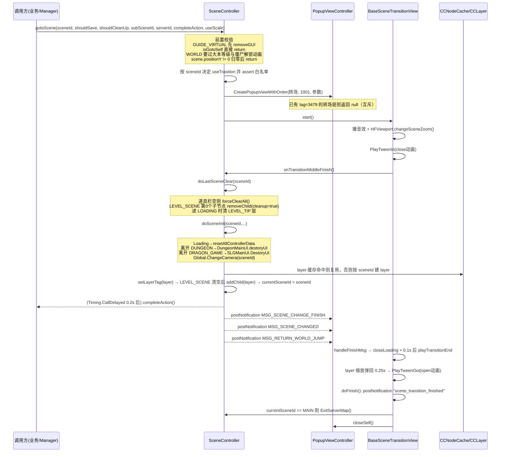
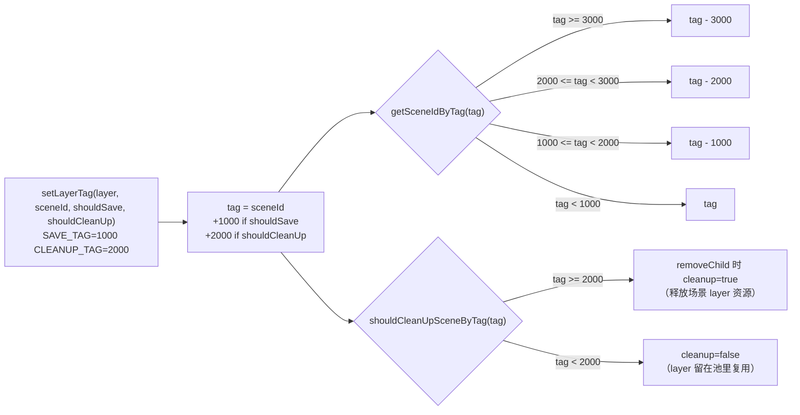
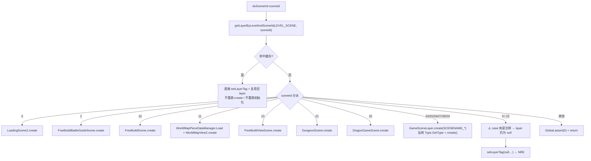
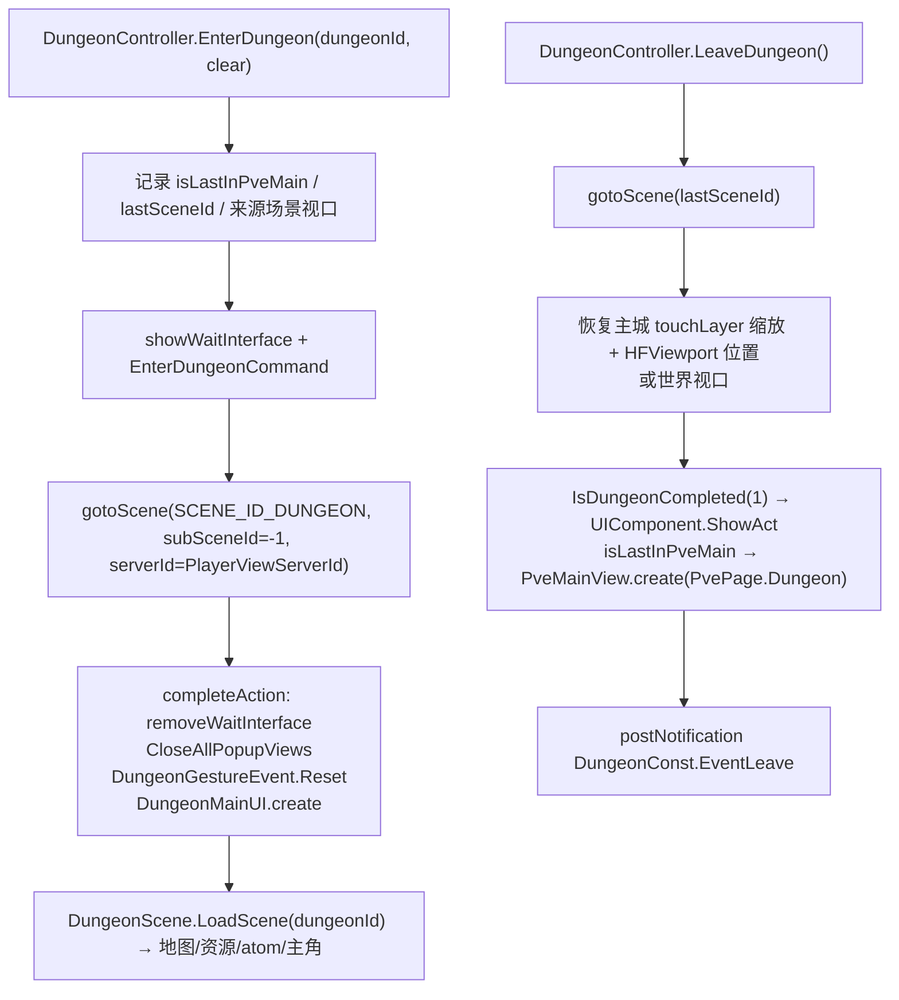

**■ 项目场景管理使用说明（SceneController / 场景框架）**

> 项目: RedAlert_SuperFormation（红警 / 帝国 / KS 多品牌复用）
> 整理时间: 2026-09-20
> 核心代码: `Assets/DevCodeFM/IF/DayZClasses/controller/SceneController.cs`（470 行）+ `scene/SceneContainer.cs`（47 行）+ `view/transition/BaseSceneTransitionView.cs`（156 行）
> 场景实现散落四处: `IF/DayZClasses/scene/` · `IF/DayZClasses/view/` · `Game/KingShot/` · `DevGameCodeFM/LastWar/`
> 配套文档: [[内城推格子模块]] · [[大地图]] · [[指引模块]]

---

**■ 一、模块总览**

**▍ 1.1 一句话定位**

全项目只有**一个 Unity Scene**（`SceneContainer`），所有"场景"都是挂在它下面 13 个层级节点上的 `CCLayer`。切换场景 = `SceneController.gotoScene()` → 播一次转场 → 销毁旧 layer → 换掉 `LEVEL_SCENE`(0) 层的唯一子节点 → 发 3 个全局事件。**没有 Unity 的 SceneManager.LoadScene**，全部是 Cocos2d-x 移植过来的 layer 管理。

**· 三层结构**

| 层 | 职责 | 文件 |
|---|---|---|
| 调度层 `SceneController` | `gotoScene` / `doSceneInit` / `doLastSceneClear`、tag 编解码、layer 缓存、相机切换、loading 引导 | `controller/SceneController.cs` |
| 容器层 `SceneContainer : CCScene` | 唯一 Unity 场景；建 13 个 `LEVEL_*` 节点；持有 4 台相机 | `scene/SceneContainer.cs` |
| 实现层 `XXXScene/XXXLayer : CCLayer` | 各场景自己的内容（主城/世界/地宫/SLG/小游戏…） | 见 §1.3 场景清单 |

**▍ 1.2 核心文件**

| 文件 | 行数 | 职责 |
|---|---|---|
| `controller/SceneController.cs` | 470 | **场景调度核心**：`gotoScene`(32) 参数校验与转场分发 · `gotoLoading`(110) 登录期引导 · `getCurrentLayerByLevel`(180) · tag 编解码(211-249) · `doLastSceneClear`(316) 拆旧场景 · `doSceneInit`(355) 建新场景+发事件 · `clearScene`(268) |
| `scene/SceneContainer.cs` | 47 | `CCScene` 子类；`create()` 由 `Main.cs:190` 调起；`init()` 建 13 个层级节点并把自身注册给 `SceneController.m_sceneContainer` |
| `view/transition/BaseSceneTransitionView.cs` | 156 | 转场基类与**全流程时序**：互斥 tag 3479 · `start`(104) · `PlayTweenIn` → `onTransitionMiddleFinish`(66) · 监听 `MSG_SCENE_CHANGE_FINISH` → `handleFinishMsg`(72) → `playTransitionEnd`(87) → `doFinish`(96) |
| `view/transition/SceneSpineTransition.cs` | 57 | **红警品牌**转场：龙骨 `SkeletPrefab/cityToWorld`，`close`/`open` 两段动画 |
| `view/transition/TransitionCallback.cs` | 37 | 非红警品牌转场 `SceneTransition`：FGUI transition `t0/t2/t3` |
| `scene/loading/LoadingScene2.cs` | 261 | 启动第一个场景；驱动 `LoadingController` 状态机；决定进主城还是世界；首次进游戏走引导分支 |
| `controller/Net/LoadingController.cs` | 142 | 登录状态机 `NONE→DO_CONNECT→WAIT_LOGINOK→OK/ERROR`（超时判错） |
| `IF/Main.cs` | 249 | **启动入口**：`CCNodeCache` 白名单注册（含各场景/背景/门/装饰层）· `ContainerRegister`(195) 反射注册管理器 · `runWithScene(SceneContainer.create())`(190) · `gotoLoading(true)`(192) |
| `Global.cs` | 4311 | `SCENE_ID_*`(2071-2089) · `LEVEL_*`(2056-2069) · `ChangeCamera`(4236) 相机切换 · `MSG_SCENE_CHANGE_FINISH/MSG_SCENE_CHANGED/MSG_RETURN_WORLD_JUMP` |
| `Game/GameSceneLayer.cs` | 41 | **反射建场景**：`Type.GetType(SCENENAME_*)` 找 `create()` 静态方法 |
| `controller/MiniGameManager.cs` | 170 | 小游戏（LastWar/KingShot）统一进出：按 `ADGamesController` 当前 ADGame 分派到 4 个 manager |
| `Game/KingShot/Game/KingShotScene.cs` | 199 | KingShot 玩法场景：`create`/`cleanup`/`StartGame`/`LoadScene`/`ResetScene`/`SetCameraFollow` |
| `Game/KingShot/Game/KingShotLevelScene.cs` | 142 | KingShot 关卡场景（同上结构） |
| `Game/KingShot/Game/KingShotSceneManager.cs` | 252 | **另一套战斗场景实现（就地离屏型）**：不改 sceneId，把战斗模型搬到 x=10000 后隐藏主城 UI/灯光/音频，`OnExit` 还原 |
| `DevGameCodeFM/LastWar/Scripts/LastWarScene.cs` | 133 | LastWar 玩法场景（同上结构） |
| `view/DungeonMap/test/DungeonScene.cs` | 467 | 新地宫场景（`SCENE_ID_DUNGEON`） |
| `view/DragonGame/Views/DragonGameScene.cs` | 190 | SLG 场景（`SCENE_ID_DRAGON_GAME`），自建相机 `SLGGame/Camera` |
| `scene/freebuild/FreeBuildScene.cs` | 84 | **主城场景工厂**：按 `KING_SHOOT` 宏继承 `FreeBuildScene3` / `FreeBuildScene2`；`getInstance()` 先校验 `currentSceneId == FREEBUILD` |
| `Game/KingShot/City/FreeBuildScene2.cs` | 3715 | 主城真正实现（`onEnter`(2752) / `onExit`(2984) / `m_sceneBack`(247) 背景回退层 / `onSaveCurPos`(2339)） |
| `scene/freebuild/FreeBuildViewScene.cs` | 36 | `SCENE_ID_VIEW`（看别人的城）；`gotoTilePoint` 直接 `throw NotImplementedException` |
| `scene/freebuild/FreeBuildBattleGuideScene.cs` | 26 | `SCENE_ID_GUIDE_VIRTUAL`（引导虚拟场景） |
| `scene/world/WorldMapView2.cs` | 2400+ | 世界场景（`create`(342) / `onEnter`(1202) / `onExit`(1262)），+ `WorldMapView2UI/Edge/Edit/ViewPort` |
| `view/DungeonMap/DungeonConst.cs` | 100 | `DungeonController.EnterDungeon/LeaveDungeon`（记录并恢复来源场景视口） |
| `controller/PopupViewController.cs` | 1800+ | UI 栈/弹窗；`removeAllPopupView`(1020)、`forceClearAll`(1737) 与场景切换强相关 |
| `Cocos2d/cocos/2d/CCLayer.cs` / `CCNode.cs` | - | 生命周期 `onEnter/onEnterTransitionDidFinish/onExit/onExitTransitionDidStart/cleanup/ResetToPool` |

**▍ 1.3 场景清单**（`Global.cs:2071-2089` + `SceneController.doSceneInit` 的 switch）

| sceneId | 常量 | 实现 | 创建方式 | 状态 |
|---|---|---|---|---|
| 0 | `SCENE_ID_LOADING` | `LoadingScene2` | 直接 new | ✅ 启动场景 |
| 1 | `SCENE_ID_GUI` | 无 | — | ⚠️ 白名单里有、`doSceneInit` 里没有 → assert 静默失败 |
| 2 | `SCENE_ID_GUIDE_VIRTUAL` | `FreeBuildBattleGuideScene` | `create()` | ✅ 引导期；进入时 `removeGUI()` |
| 9 | `SCENE_ID_CITY_3D` | 无（`FreeBuildScene3D.create()` 被注释） | — | 🔴 layer 为 null → NRE（见 §五-1） |
| 10 | `SCENE_ID_FREEBUILD` / `SCENE_ID_MAIN` | `FreeBuildScene`（→`FreeBuildScene2`） | `create()` | ✅ 主城，**两套常量同一个值** |
| 11 | `SCENE_ID_WORLD` | `WorldMapView2` | `create(viewPoint, mapType, serverId)` | ✅ 世界，调用点最多（137 处） |
| 12 | `SCENE_ID_VIEW` | `FreeBuildViewScene` | `create()` | ⚠️ 半成品（`gotoTilePoint` 抛异常） |
| 20 | `SCENE_ID_EMPTY` | 无 | — | ⚠️ 同 GUI，assert 静默失败 |
| 21 | `SCENE_ID_DUNGEON` | `DungeonScene` | `create()` | ✅ 新地宫 |
| 22 | `SCENE_ID_DRAGON_GAME` | `DragonGameScene` | `create()` | ✅ SLG；进入时 `SLGMainUI.DestoryUI()` |
| 23 | `SCENE_ID_DRIVE` | 无（被注释） | — | 🔴 同 CITY_3D，NRE |
| 24 | `SCENE_ID_SHOOT` | `ShootGameScene`（本仓库无源码） | 反射 | 🔴 反射失败 → NRE |
| 25 | `SCENE_ID_FPS_GAME` | `FpsScene`（本仓库无源码） | 反射 | 🔴 同上 |
| 26 | `STREET_FIGHT` | `DayZ.StreetFightScene`（无源码） | 反射 | 🔴 同上；常量名缺 `SCENE_ID_` 前缀 |
| 27 | `SCENE_ID_LASTWAR` | `DayZ.LastWar.LastWarScene` | 反射 | ✅ `DevGameCodeFM/LastWar/` |
| 28 | `SCENE_ID_KINGSHOT` | `DayZ.KingShot.KingShotScene` | 反射 | ✅ `Game/KingShot/` |
| 29 | `SCENE_ID_KINGSHOT_LEVEL` | `DayZ.KingShot.KingShotLevelScene` | 反射 | ✅ |
| 127 | `SCENE_ID_NONE` | 无 | — | 占位 |
| 987 | `SCENE_ID_GENERAL` | 无 | — | `Global.cs:54`，非场景用 |

> `gotoScene` 调用点实测 **165 处**，目标分布：`WORLD 137` · `FREEBUILD 6` · `MAIN 4` · `KINGSHOT 2` · `VIEW / LASTWAR / KINGSHOT_LEVEL / DUNGEON / DRAGON_GAME 各 1`。也就是说：**世界地图是切换主战场，其余场景基本只有一个入口**。

**▍ 1.4 层级与相机**

`SceneContainer.init()` 按 `Global.LEVEL_MAX = 13` 建 13 个子节点（tag = 层级号），`getCurrentLayerByLevel(level)` 取用：

| 值 | 常量 | 用途 | 引用数 |
|---|---|---|---|
| 0 | `LEVEL_SCENE` | **场景层**（唯一场景 layer 挂这里，切场景就是换它的第 0 个子节点） | 9 |
| 1 | `LEVEL_WORLDUI` | 世界 UI | 2 |
| 2 | `LEVEL_MINIMAP` | 小地图 | 3 |
| 3 | `LEVEL_POPUP_IN` | 内嵌弹窗 | 1 |
| 4 | `LEVEL_GUI` | 主界面 HUD | 2 |
| 5 | `LEVEL_POPUP` | 弹窗 | 12 |
| 6 | `LEVEL_TIP` | 飘字/提示 | 3 |
| 7 | `LEVEL_CONTROL` | 操控层 | 1 |
| 8 | `LEVEL_WORLD_UI` | 世界 UI（第二套） | 5 |
| 9 | `LEVEL_GUIDE` | 引导 | 1 |
| 10 | `LEVEL_AUTO_TIP` | — | **0（死常量）** |
| 11 | `LEVEL_POP_TOUCH` | — | **0（死常量）** |
| 12 | `LEVEL_SCENE_TRANSITION` | — | **0（转场实际走 PopupViewController 的 order=1001）** |

**相机**：`Global.ChangeCamera(sceneId)`（`Global.cs:4236`）在每次 `doSceneInit` 里调用，用「可见性 + `tag = MainCamera`」三选一：
- 主城/其他 → `SceneContainer` 的默认相机 + 建造相机 + 模糊相机（`isInHome`）
- `SCENE_ID_DUNGEON` → `DungeonCamera.Inst`
- `SCENE_ID_DRAGON_GAME` → `GameCamera.Instance`
- KingShot / LastWar **不在这个分支里**，它们自己管相机（`KingShotScene.SetCameraFollow` 用 Cinemachine；LastWar 有 `CameraMove`）

**▍ 1.5 从启动到首场景的数据流**

```text
Main.Awake
  ├─ CCNodeCache.whiteList 注册（LoadingScene2 / FreeBuildScene / DungeonScene / DragonGameScene / 背景 / 门 / 装饰层…）
  ├─ ContainerRegister()  反射注册: ILastWarManager→DayZ.LastWar.LastWarManager
  │                                  IKingShotManager→DayZ.KingShot.KingShotManager
  │                                  IKingShotLevelManager→DayZ.KingShot.KingShotLevelSceneManager
  │                                  IFpsManager / IShootManager / IStreetFightManager（本仓库无实现）
  ├─ GameHandlerRegister() / UIModuleInit.Init() / runInAppDelegateForGlobalValue()
  ├─ CCDirector.runWithScene(SceneContainer.create())     ← 唯一的 Unity 场景
  └─ SceneController.getInstance().gotoLoading(true)      ← 首登
        └─ doSceneInit(SCENE_ID_LOADING) → LoadingScene2.create()
              ├─ LoadingController.setState(NONE)
              ├─ 发 "az_continue_loading" → toInit → LoadingView.create()
              ├─ 发 "Update_SDKStartFinish" → startLogin() → LoadingController.StartLoading()
              │     └─ NONE→DO_CONNECT→WAIT_LOGINOK→OK （超时 → ERROR）
              └─ update(): isLoadingOK() → checkAndEnterGame() → gotoMainScene()
                    ├─ SceneController.showBG != null ? gotoScene(SCENE_ID_WORLD)
                    └─ 否则 gotoScene(SCENE_ID_FREEBUILD)（首进游戏先走 FirstEnterGame → 引导）
```

---

**■ 二、流程图**

**▍ 2.1 一次场景切换全时序**



**▍ 2.2 tag 编码：一个 int 同时装「场景号 + 是否保存 + 是否清理」**



**▍ 2.3 layer 缓存复用（`m_levelMap[level][sceneId]`）**



**▍ 2.4 小游戏（LastWar / KingShot）进出**

```mermaid
flowchart TD
    A[业务侧: MiniGameManager.getInstance().EnterGame sceneId, gameType, sceneType, data] --> B{ADGamesController 当前 ADGame}
    B -->|DEFAULT| C[ILastWarManager.EnterGame]
    B -->|KINGSHOT 且 sceneType==0| D[IKingShotLevelManager.EnterGame]
    B -->|KINGSHOT 且 sceneType!=0| E{KingShotSceneManager.IsOpen?<br/>实测永不置真 见五}
    E -->|是| F[KingShotSceneManager.Init]
    E -->|否| G[IKingShotManager.EnterGame]
    C --> H["记录 lastSceneId + lastViewPos/lastViewScale<br/>降帧率到 30 · 改阴影质量 · 关 BGCamera · 环境光置黑"]
    H --> I["showWaitInterface + gotoScene(SCENE_ID_LASTWAR, useScale=1)"]
    I --> J["completeAction: removeWaitInterface<br/>CloseAllPopupViews<br/>LastWarScene.Instance.CreateUI 或 StartGame(SceneId)"]
    J --> K["打完 → GameManager 结算 → MiniGameManager.LeaveGame()"]
    K --> L["恢复帧率/阴影/天空盒/环境光<br/>gotoScene(lastSceneId)"]
    L --> M["卸载 LastWar AB 包<br/>恢复主城或世界的视口位置+缩放<br/>postNotification scene_transition_finished"]
    M --> N["GotoSceneBack 按 gameType 分发"]
    N -->|InnerMap| O["发 InnerMapConst.EventDataUpdate<br/>让推格子补发进度"]
    N -->|PVETrial| P["PveGrowingView.Create + UPDATE_UI_PVE_MINIGAME_CLOSE"]
    N -->|PVEBattle| Q["ExpeditionView.create"]
    N -->|其他| R["只回调"]
```

**▍ 2.5 地宫（`SCENE_ID_DUNGEON`）进出 —— 与内城推格子是两套东西**



---

**■ 三、使用方法**

**▍ 3.1 新增一个场景（完整 8 步）**

1. **定 sceneId**：在 `Global.cs:2071-2089` 加常量。**必须 < 1000**（`setLayerTag` 里有 `Debug.Assert(tag < SAVE_TAG)`，`SceneController.cs:239`），且不要与现有值冲突（`10` 已被主城两套常量占用）。
2. **在 `gotoScene` 的 useTrasition 白名单里加 case**（`SceneController.cs:65-92`）—— 不加会走 `default: Global.assert(0); return;`，**切换静默失败**。
3. **写 layer 类**：`public class XxxScene : CCLayer`，提供 `public new static XxxScene create()`（参考 `DungeonScene.cs:57`）。
   - 需要被对象池管理就把类型加进 `Main.cs:13-185` 的 `CCNodeCache.whiteList`（否则每次切换都真销毁重建）。
4. **在 `doSceneInit` 的 switch 里加 case**（`SceneController.cs:379-435`）；否则 layer 为 null → `setLayerTag(null,…)` NRE。
5. **相机**：`Global.ChangeCamera`（`Global.cs:4236`）加分支，否则新场景用的是主城那 3 台相机（`isInHome` 默认为真）。
6. **离开时要清的东西**：在 `doSceneInit` 开头的「离开 XXX 时收尾」区加一条（现有 `DUNGEON → DungeonMainUI.destoryUI`、`DRAGON_GAME → SLGMainUI.DestoryUI`，`SceneController.cs:362-370`）。
7. **UI 分层**：场景内容挂 `LEVEL_SCENE`；HUD 用 `LEVEL_GUI` / `LEVEL_POPUP` 等，别自己新建层级（`LEVEL_MAX=13` 已经满了）。
8. **入口**：业务侧用 `SceneController.getInstance().gotoScene(...)`，**不要在 `completeAction` 里立刻访问新场景对象**——它在 `Timing.CallDelayed(0.2f)` 后才执行，而 `MSG_SCENE_CHANGE_FINISH` 在它之后才发。

**▍ 3.2 切场景的正确姿势**

```text
// 1) 最简单的切换（无回调）
SceneController.getInstance().gotoScene(Global.SCENE_ID_WORLD, false, true, index, serverId);

// 2) 需要在新场景就绪后做事
SceneController.getInstance().gotoScene(Global.SCENE_ID_DUNGEON, false, true, -1, viewServerId, () =>
{
    // 此时 doSceneInit 已完成、currentSceneId 已更新；但转场动画还没播完
    DungeonMainUI.create();
});

// 3) 需要等"转场彻底结束"（转场层已关、ExitServerMap 已处理）
CCSafeNotificationCenter...addObserver(this, onDone, "scene_transition_finished", null);
```

三个可等的时机，按「早晚」排：
- `completeAction`：doSceneInit 后 0.2s，**转场还在**
- `MSG_SCENE_CHANGE_FINISH`：紧跟 completeAction（转场层自己在听，用来播 open 动画）
- `"scene_transition_finished"`：转场层 `doFinish` 里发（`BaseSceneTransitionView.cs:98`）—— 想在新场景里再弹东西，用这个最稳

参数含义：`shouldSave` 只影响 tag 里是否记「保存」（当前调用点几乎全是 `false`）；`shouldCleanUp=true` 时会 `cleanup()` 释放旧 layer；`subSceneId` 仅世界场景用来定位（`WorldController.getPointByIndex`）；`serverId` 用于跨服；`useScale` 控制新场景入场缩放（默认 0.7，小游戏传 1）。

**▍ 3.3 加/改转场表现**

- 红警走 `SceneSpineTransition`（龙骨 `SkeletPrefab/cityToWorld`，`close` = 进场遮罩、`open` = 退场露出）；其他品牌走 `SceneTransition`（FGUI transition `t0/t2/t3`）。分支在 `BaseSceneTransitionView.cs:20-27`。
- 新增一种转场：继承 `BaseSceneTransitionView`，实现 `PlayTweenIn(Action)` / `PlayTweenOut(Action)`（**必须在动画结束时 invoke 回调**，否则整条切换链会卡住），然后在 `CreateTransition` 里加分支。

**▍ 3.4 调试手段**

| 目的 | 手段 |
|---|---|
| 看当前场景 | `SceneController.getInstance().currentSceneId`；Scene ID 是明文数字（见 §1.3） |
| 看切场景有没有真的走完 | 日志关键点：`LoadingScene2.gotoMainScene.begin` / `LoadingScene2.showMainScene begin.` / `WorldMapView2.onEnter begin` / `GotoSceneBack InnerMap` |
| 强制切场景 | `GameDebugTools.cs:206` 有地宫进出示例（`DungeonController.EnterDungeon/LeaveDungeon`）；LastWar 有 `DebugHelper/LastWarCommand.cs` |
| 卡在转场 | `BaseSceneTransitionView.cs:17` 会打 `There is a transition layer already!`（互斥 tag 3479 阻止第二次转场） |
| 卡在登录 | `LoadingController` 的 `LOADING_WAIT_LOGINOK timeout!!!`（`LoadingController.cs:67`） |
| 层挂载检查 | `getCurrentLayerByLevel(level)` 在 `Level` 下找不到时会**新建空 CCLayer**（`SceneController.cs:202-208`），看到空层说明该层没人挂东西 |

---

**■ 四、常量与约定事项**

1. `sceneId` 必须 `>= 0 && < 1000`（tag 编码要求，`SceneController.cs:239` 的 Assert）。
2. `SCENE_ID_MAIN` 与 `SCENE_ID_FREEBUILD` **同为 10**，代码里混用两套写法；新代码统一用 `SCENE_ID_FREEBUILD`。
3. `STREET_FIGHT`(26) 是唯一没有 `SCENE_ID_` 前缀的场景常量（`Global.cs:2085`）。
4. `LEVEL_*` 共 13 层且 `LEVEL_MAX=13`，新增层级必须同步改 `SceneContainer.init()` 与 `LEVEL_MAX`。
5. 需要对象池的场景 layer 类型要进 `CCNodeCache.whiteList`（`Main.cs:13-185`），否则每次切换真销毁重建。
6. 反射建场景要求「类型名 + 同程序集」：`GameSceneLayer.create` 用 `Type.GetType(name)`（`GameSceneLayer.cs:20`），**带命名空间的完整名**（如 `DayZ.KingShot.KingShotScene`），且类必须有 `public static create()`。`Assets/DevCodeFM` 与 `Assets/DevGameCodeFM` 都**没有 asmdef**，所以同在 `Assembly-CSharp`，`Type.GetType` 能解析。
7. 切到当前场景会被 `isGotoSelf` 拦掉（`SceneController.cs:39-40`）——**回调不会执行**，所以「同场景重开」必须写成「先切走再切回」（LastWar/KingShot 的 `ResetScene` 就是自己 `cleanup + StartGame`，不走 gotoScene）。
8. 进世界场景有前置门槛（`SceneController.cs:42-55`）：僵尸解锁动画播放中不允许、大本 1 级且 `base_lv_appear` 开启时不允许（飘字提示）。

---

**■ 五、注意事项（已知坑）**

| 级别 | 问题 | 位置 |
|---|---|---|
| 🔴 | `doSceneInit` 里 `SCENE_ID_CITY_3D(9)` 与 `SCENE_ID_DRIVE(23)` 的 layer 创建被注释掉，case 体只剩注释 → `layer` 仍为 `null` → `setLayerTag(null,…)` → `layer.setTag` **NRE**。这两个 id 还留在 `gotoScene` 的 useTrasition 白名单里（`:72`、`:75`），任何人写 `gotoScene(SCENE_ID_CITY_3D)` 必崩。当前无调用点，属**埋伏** | `SceneController.cs:390-392`、`:408-410`、`:437`、`:239` |
| 🔴 | 反射场景在这份红警包里**没有源码**：`FpsScene` / `ShootGameScene` / `DriveScene` / `DayZ.StreetFightScene` 全局搜不到类定义，`FpsManager` / `ShootGameManager` / `StreetFightManager` / `DriveManager` 同样只有注册字符串（`Main.cs:211-213`）→ `GameSceneLayer.create` 返回 `null` → 同一条 NRE。**24/25/26/23 号场景在本仓库切不过去** | `GameSceneLayer.cs:20-41`、`Main.cs:211-213`、`SceneController.cs:423-425`、`:429-431` |
| 🟠 | `gotoScene` 的「Y 偏移」早退：`scene.getPositionY() != 0` 时只把它归零就 `return`，**本次切换请求被丢弃、`completeAction` 永不执行**（调用方若在等回调就永久等待）。触发条件是当前 CCScene 有 Y 偏移（过渡/演出类操作留下的） | `SceneController.cs:57-62` |
| 🟠 | 转场层可能被误关：`removeAllPopupView()` 的 `removeLoading` 默认 `true`（`PopupViewController.cs:1020`），只有显式传 `false` 才保留**字面量** `"SceneTransition"`（`:1030`）——而红警品牌创建的是 `"SceneSpineTransition"`（`BaseSceneTransitionView.cs:22`），**即使传 false 也保不住**。而 `LastWarManager.EnterGame` 的 completeAction 里调了 `CloseAllPopupViews()` → `removeAllPopupView()`，此刻转场正等 `MSG_SCENE_CHANGE_FINISH`（`SceneController.cs:461` 在 `completeAction` **之后**才 post）→ 转场被 SetActive(false) 后 `OnDisable` 摘掉监听（`BaseSceneTransitionView.cs:59-64`）→ `PlayTweenOut`/`doFinish` 不再执行（`scene_transition_finished` 不发、回主城时 `ExitCrossServer.ExitServerMap` 不调）。**机制成立，现网是否真触发待实测** | `LastWarManager.cs` EnterGame 回调、`PopupViewController.cs:1020/1030`、`SceneController.cs:455-464`、`BaseSceneTransitionView.cs:59-64/96-102` |
| 🟠 | `SCENE_ID_GUI(1)` / `SCENE_ID_EMPTY(20)` 能过 `gotoScene` 白名单，但 `doSceneInit` 的 switch 没有它们 → 走 `default: Global.assert(0); return;`：**场景不变、不回调、也不报错**（正式包 assert 可能只打日志） | `SceneController.cs:67-69`、`:432-434` |
| 🟡 | `getPreSceneId()` 硬编码 `return SCENE_ID_FREEBUILD`（`:263-266`），与实际来源场景无关；来源场景的真实记录是各 Manager 自己的 `lastSceneId` 私有字段 | `SceneController.cs:263-266` |
| 🟡 | layer 缓存复用：命中 `m_levelMap[level][sceneId]` 就**直接复用旧 layer**（`:295-301`、`:375-377`），既不走 `create()` 也不重跑初始化 → 场景内状态可能残留；反过来说，`doSceneInit` 也就不能作为「场景初始化」的可信入口 | `SceneController.cs:295-301`、`:375-377` |
| 🟡 | `LEVEL_AUTO_TIP(10)` / `LEVEL_POP_TOUCH(11)` / `LEVEL_SCENE_TRANSITION(12)` 全工程 **0 引用**；转场层实际由 `PopupViewController.CreatePopupViewWithOrder(..., 1001, ...)` 管理 → 三个层级常量形同虚设 | `Global.cs:2066-2068` |
| 🟠 | **「进战斗场景」有两套互不兼容的实现同时存在**：① **gotoScene 型** —— `KingShotManager` / `KingShotLevelSceneManager` / `LastWarManager` 各自维护 `lastSceneId`、记录并恢复主城/世界视口、再 `gotoScene(SCENE_ID_KINGSHOT / …_KINGSHOT_LEVEL / …_LASTWAR)`；三份代码几乎逐行相同（`GotoSceneBack` 分支照抄）。② **就地离屏型** —— `KingShotSceneManager.Init/LoadScene` **完全不调 gotoScene**：停 BG 音乐、隐藏主城 UI、关掉所有 Light、摘掉默认相机的 AudioListener，然后 `CCNodeCache.GetGameObject(config.model, new Vector3(10000,0,0))` + `transform.parent = null`，**把战斗模型搬到 x=10000 米外**当"场景"，`OnExit` 再逐项还原。`MiniGameManager` 的 `LeaveGame/ResetGame/IsEnterGame/MiniData` 对四者「谁都试一遍」链式判断 —— 任一 manager 状态不同步就会「退不出来 / 退错场景」 | `KingShotManager.cs:91-168`、`KingShotLevelSceneManager.cs:86-165`、`LastWarManager.cs:163-280`、`KingShotSceneManager.cs:72-125`、`:150-170`、`MiniGameManager.cs:89-170` |
| 🟠 | **上面 ② 那套被一个永不置真的开关挡住**：`KingShotSceneManager.IsOpen`（`public static bool`，`:38`）**在本仓库源码里只有读、没有写**（搜 `KingShotSceneManager.IsOpen = true` 无命中，同名 `IsOpen = true` 全属于 `InteractItem` / `DropInteractItem` / `InnerMapScene` 等无关类）→ `MiniGameManager.cs:79` 的 `if (KingShotSceneManager.IsOpen)` 永远走 else，**红警包里永远用老的 gotoScene 型**；`FreeBuildMonsterAttack.cs:197`、`SettingPopUpView.cs:125`、`GuideTriger.cs:1133`、`KSEnterGameCommand.cs:11` 这 4 处分支同样固定走 else（是否有热更/外部程序集赋值待确认） | `KingShotSceneManager.cs:38`、`MiniGameManager.cs:79`、`FreeBuildMonsterAttack.cs:197`、`SettingPopUpView.cs:125`、`GuideTriger.cs:1133`、`KSEnterGameCommand.cs:11` |
| 🟡 | `MiniGameManager.LeaveGame` 里 `ILastWarManager` 分支不判断 `reset` 参数、也不透传 `action`，与另两个分支签名不一致 | `MiniGameManager.cs:91-97` |
| 🟡 | `MiniGameManager` 用**静态单例 + 可变 `miniData`**（`MiniData` getter 会连续覆盖同一个对象，取「最后一个 IsEnterGame 的 manager」）→ 多个小游戏同时处于「已进入」异常态时数据会串 | `MiniGameManager.cs:138-170` |
| 🟡 | `SceneController` 有终结器 `~SceneController()` 里调 `clearScene()`，终结器线程碰 Unity 对象（`CCLayer`）有风险；`showBG` 语义靠全局可写字段传递（谁能写、何时清全靠约定） | `SceneController.cs:282-285`、`:15`、`LoadingScene2.cs:153-157` |
| 🟡 | `doLastSceneClear` 只取 `levelNode.getChildren()[0]` 处理（`:332-338`）——LEVEL_SCENE 下若意外有多个子节点，多余的不会被清理 | `SceneController.cs:332-338` |
| 🟡 | `FreeBuildViewScene.gotoTilePoint()` 直接 `throw new NotImplementedException()`（`FreeBuildViewScene.cs:33-36`）——「看别人的城」场景是半成品，任何调它的引导/任务都会抛异常 | `scene/freebuild/FreeBuildViewScene.cs:33` |
| 🟡 | 切场景时的弹窗清理规则不统一：`forceClearAll` 会**跳过** `GuideView` 与 `BaseSceneTransitionView`（`PopupViewController.cs:1765`），`removeAllPopupView` 只跳过 `GuideView`（且 `CantClose` 时才跳），`DungeonController.CloseAllPopupViews` 手动跳过 `"LoadingView"`/`"SceneTransition"`（**红警下名字对不上**）→ 三套规则打架 | `PopupViewController.cs:1035-1038`、`:1765`、`DungeonConst.cs` CloseAllPopupViews |
| 🟡 | 代码编码不统一：**125 个 `.cs`（共 4912 个，约占 2.5%）是 GBK 编码**（中文注释按 UTF-8 读会变乱码，如 `BaseSceneTransitionView.cs:74`、`InnerMap/data/MapDataManager.cs:40`），集中在 `Game/BattleProtect/`、部分 `InnerMap` 与 `WorldTileMap/NewVersion`。用脚本批量改写/搜索时容易踩（写入会把乱码固化） | `Game/BattleProtect/**`、`IF/DayZClasses/InnerMap/data/MapDataManager.cs`、`view/transition/BaseSceneTransitionView.cs:74` 等 125 处 |
| 🟡 | `LoadScene` 是三个场景类里各自实现的同构方法（`KingShotScene.LoadScene` / `KingShotLevelScene.LoadScene` / `LastWarScene.LoadScene`），都在 `LogCommon.LogError("LoadScene:" + id)` 打正常日志，且各自重复「表不存在 / model 为空 / 预制体不存在」三段校验 | `KingShotScene.cs:91-120`、`KingShotLevelScene.cs:85-110`、`LastWarScene.cs:87-120` |

**「切场景出问题」排查顺序**

1. **没反应**：看是不是 `isGotoSelf`（切到自己）或 `scene.positionY != 0`（§五-3）在 `gotoScene` 里就 return 了。
2. **没反应且场景 id 是 1/20**：`doSceneInit` 的 `default: Global.assert(0)` 静默吞掉（§五-5）。
3. **报 NRE**：`setLayerTag` 收到 null layer → 该 sceneId 在 `doSceneInit` 里没有可用 case（9/23/24/25/26，§五-1、§五-2）。
4. **转场卡住不再消失**：看有没有在 `completeAction` 里调了 `removeAllPopupView()` / `CloseAllPopupViews()`（§五-4），以及 `BaseSceneTransitionView.cs:17` 的互斥日志。
5. **新场景白屏/空**：`getCurrentLayerByLevel(LEVEL_SCENE)` 返回的是「新建的空 CCLayer」还是真场景（§3.4）。
6. **回不到原场景 / 视角乱**：查该入口 Manager 有没有正确记录并恢复 `lastSceneId` + 视口（`lastViewPos` / `lastViewScale`）——这是四个 manager 各自复制的逻辑（§五-9）。
7. **同场景重开无效**：`gotoScene` 会被 `isGotoSelf` 拦；正确做法是 `cleanup() + StartGame(CurConfig)`（参考 `KingShotScene.ResetScene`）。

---

**■ 六、相关文档**

- 同目录姊妹模块：[[内城推格子模块]]（`MiniGameType.InnerMap` 打完正好走 §2.4 的 `GotoSceneBack`）· [[大地图]]（`SCENE_ID_WORLD`，137 个 `gotoScene` 调用点的目标）· [[指引模块]]（`GuideController` 监听 `MSG_SCENE_CHANGE_FINISH` 与 `scene_transition_finished` 推进引导）
- 交汇点：`GuideController.cs:231` 监听 `MSG_SCENE_CHANGE_FINISH`、`:238` 监听 `scene_transition_finished`；`WorldMapView2.cs:1226` 监听 `scene_transition_finished` 做场景入场刷新；`QuestController.cs:2226/2343/2460` 从地宫场景退出。
- 未覆盖（留给后续单篇）：主城 `FreeBuildScene2`（3715 行）内部结构与 `m_sceneBack` 背景链、世界地图 `WorldMapView2` 地图渲染、`PopupViewController` UI 栈细节。
- 项目内无 `docs/fix/scene/`；§五 中 🔴 两条（NRE 埋伏 ×2 组场景 id）与 🟠 三条（Y 偏移早退、转场被误关、静默 assert）建议立项修复，是否立项待拍板。
