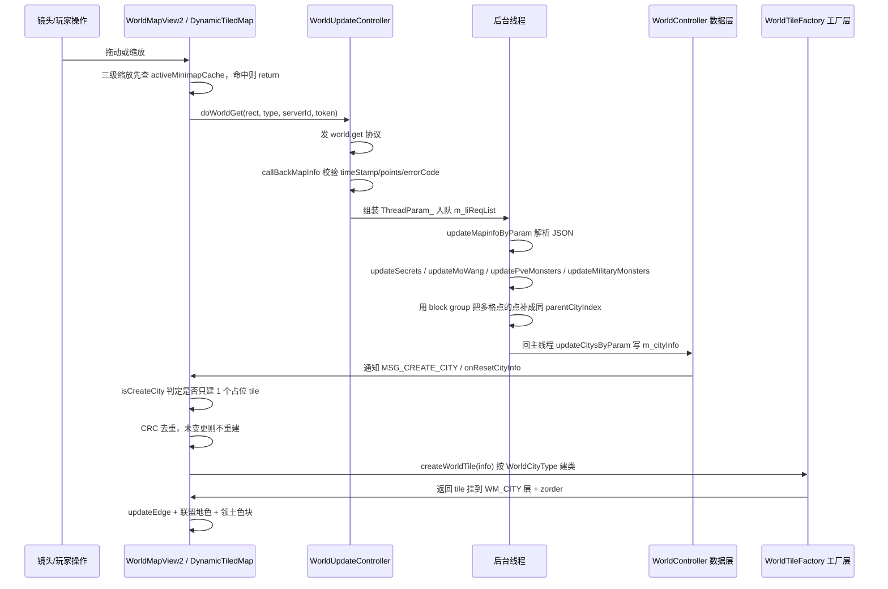
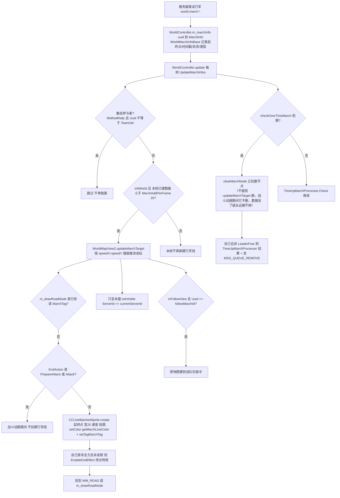
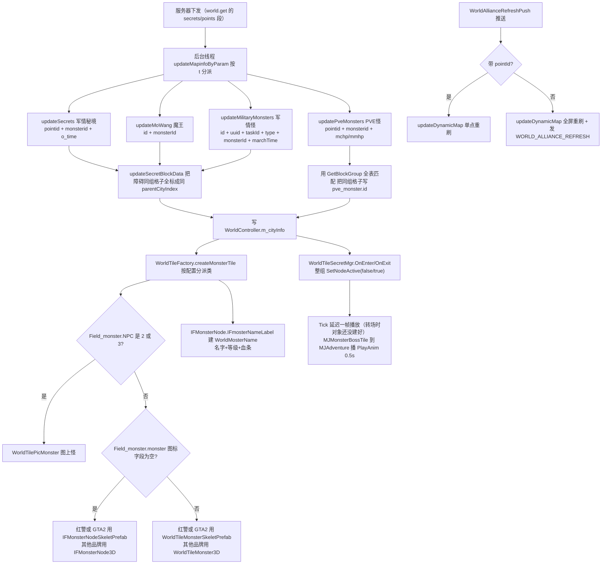
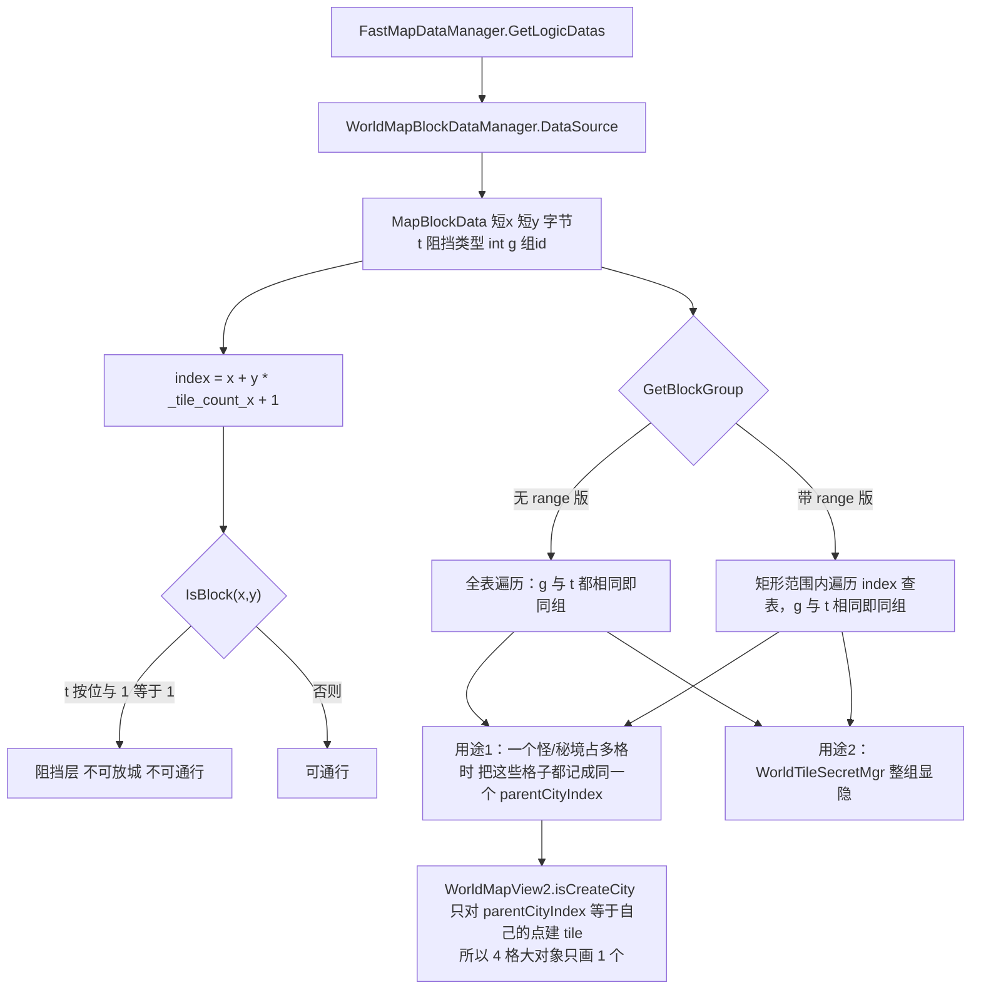
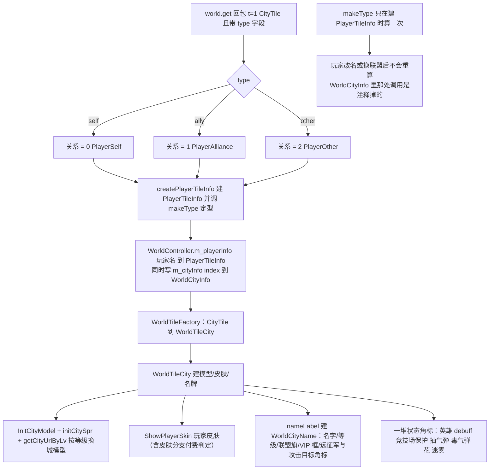

**■ 城外大地图玩法使用说明（WorldMap / 世界地图）**

> 项目: RedAlert_SuperFormation（红警 / 帝国 / KS 多品牌复用，无 git 用 SVN）
> 整理时间: 2026-09-20
> 核心代码: `Assets/DevCodeFM/IF/DayZClasses/scene/world/`（96 432 行）· `controller/WorldController.cs`（4 993 行）· `controller/WorldUpdateController.cs`
> 数据来源: 服务器下发（`world.get` 协议，客户端不本地生成世界）
> 配套文档: [[场景管理模块]]（`SCENE_ID_WORLD` 就是本模块）· [[内城推格子模块]] · [[大地图]]

---

**■ 一、模块总览**

**▍ 1.1 一句话定位**

城外大地图 = 一张 **`_tile_count_x × _tile_count_y` 的巨大格子世界**（`Global.cs:1652/1654`，运行时按服务器配置设定），客户端**不保存也不生成世界**：镜头移到哪，就向服务器请求那块矩形范围（`world.get`），拿到 JSON 后**在后台线程解析**成 `WorldCityInfo`，再在主线程按「城点类型 → tile 类」创建出对象挂到 8 个渲染层上；镜头离开就回收。

一句话把握住三件事，整个模块就通了：
1. **索引是世界的唯一身份**：`index = x + y * Global._tile_count_x + 1`（`WorldMapBlockDataManager.cs:105`）。行军线、怪物、障碍、玩家城全用 index 串起来。
2. **一切刷新都是「重发 world.get → 重建 tile」**：单点刷 `updateDynamicMap(点)`，全屏刷 `updateDynamicMap()`。
3. **城点类型（`WorldCityType`）决定一切**：决定建哪个 tile 类、占几格、画在哪一层。

**▍ 1.2 规模统计（实测）**

| 目录 | 行数 | 文件数 | 说明 |
|---|---|---|---|
| `scene/world/worldObject/` | 18 281 | 37 | **所有世界 tile 类**（城市/怪物/资源/王座/领地/工厂…） |
| `scene/world/Village/` | 4 583 | 13 | 村庄玩法 |
| `scene/world/territoryLine/` | 2 641 | 8 | 联盟领地线 |
| `scene/world/monster/` | 1 442 | 6 | 怪物节点（2D/3D/龙骨三套） |
| `scene/world/WorldMap/` | 1 289 | 3 | **地图底座**：`DynamicTiledMap` / `DynamicTiled3DMap` / `WorldMapLevel` |
| `scene/world/WorldMarchAnimCreator/` | 1 090 | 15 | 15 种行军表现（采集/侦查/送英雄/导弹/圣诞/万圣…） |
| `scene/world/miniMap/` + `MinimapView.cs` | 873 + 3 553 | 12 | 小地图 |
| `scene/world/march/` | 250 | 2 | **行军线渲染**（`WorldPathLogic` 189 行 + `CCLineBatchedSprite` 61 行） |
| `scene/world/` 根 | 剩 62 000+ | 200+ | `WorldMapView2`(6 032) + `MinimapView`(3 553) + `ThroneTile`(3 341) + 各种弹窗 |
| `controller/WorldController.cs` | 4 993 | 1 | 世界总控：城点表、行军表、玩家表、坐标/范围工具 |
| `controller/WorldUpdateController.cs` | 1 400+ | 1 | **请求-解析-回主线程**管线（含后台线程） |

**▍ 1.3 核心文件（按本次六大主题分组）**

| 主题 | 文件 | 行数 | 职责 |
|---|---|---|---|
| 框架 | `scene/world/WorldMapView2.cs` | 6 032 | 世界场景总入口：8 层节点、tile 创建/回收、行军线绘制、城点刷新、LOD |
| 框架 | `scene/world/WorldMap/WorldMapDynamicTiledMap.cs` | ~480 | **地图底座抽象类**：所有屏幕↔瓦片↔世界坐标换算 + `updateDynamicMap` 抽象 |
| 框架 | `scene/world/WorldMap/World3DMapDynamicTiledMap.cs` | ~600 | 3D 底座实现（继承上面那个） |
| 框架 | `scene/world/worldObject/WorldTileFactory.cs` | 425 | **城点类型 → tile 类的唯一映射表**（⚠️ GBK 编码，见 §六-2） |
| 框架 | `scene/world/worldObject/WorldTileBase.cs` | ~500 | tile 基类：Index/CityType、节点池 `m_nodes`、`updateTile`、渐现、占用指针 |
| 框架 | `model/WorldCityInfo.cs` | 3 300+ | **单个城点的全部数据**（约 60 种玩法字段）+ 主线程/后台线程两种 set 入口 |
| ① 资源绘制 | `Ext/WorldTileMap/WorldMapPieceManager.cs` | 569 | **分片（MapPiece）按视口绘制**：算范围 → 回收 → 创建 |
| ① 资源绘制 | `Ext/WorldTileMap/WorldMapLodListener.cs` | 55 | LOD 切换（监听 `WORLD_MAP_LEVEL_CHANGE`） |
| ① 资源绘制 | `scene/world/worldObject/WorldTileUIController.cs` | 2 971 | tile 上挂的世界空间 FGUI（城名/怪名/血条/等级） |
| ② 行军线 | `scene/world/march/WorldPathLogic.cs` | 189 | **行军线本体**：1 个 quad mesh + UV 流动 shader |
| ② 行军线 | `scene/world/march/CCLineBatchedSprite.cs` | 61 | 行军线包装（创建/颜色/终点特效） |
| ② 行军线 | `controller/WorldController/MarchInfo.cs` / `MarchInfo_Mining.cs` / `WorldMarchInfoBase.cs` | - | 行军数据（坐标/时间戳/状态/队伍/UI 状态） |
| ② 行军线 | `scene/world/NewWorldMarchArmy.cs` | 2 299 | 行军表现（士兵队列、箭矢、石头特效） |
| ③ 刷怪 | `scene/world/worldObject/WorldTileMonster.cs` + `WorldTileMonsterTile.cs` + `monster/*` | 1 247+ | 怪物 tile（地宫/野怪/BOSS 各一套：2D / 3D / 龙骨） |
| ③ 刷怪 | `scene/world/WorldTileSecretMgr.cs` | 100 | **军情/秘境点位整组显隐**（⚠️ GBK 编码） |
| ③ 刷怪 | `scene/world/worldObject/WorldMonsterUIController.cs` | ~200 | 怪物血条/名字 UI 跟随 |
| ④ 障碍物 | `Ext/WorldTileMap/WorldMapBlockDataManager.cs` | 130 | 阻挡格查询（`MapBlockData.t`）+ 成组 |
| ④ 障碍物 | `Ext/WorldTileMap/NewVersion/FastMapDataManager.cs` | - | 阻挡数据来源（`GetLogicDatas`） |
| ⑤ 玩家刷新 | `controller/WorldPlayerInfo.cs` | 130 | `PlayerTileInfo`：城的占领者 + 与自己的关系 |
| ⑤ 玩家刷新 | `scene/world/worldObject/WorldTileCity.cs` | 2 006 | **玩家城的 tile**：模型/皮肤/名牌/各种状态角标 |
| ⑤ 玩家刷新 | `scene/world/PlayerTile.cs` | 1 640 | 玩家城详情弹窗（不是世界 tile，别混淆） |
| ⑥ 城市建筑 | `scene/world/worldObject/WorldTileBuilding.cs` | 969 | 建造队/建筑状态（保护罩/修理/升级/建造中/被摧毁…） |
| ⑥ 城市建筑 | `scene/world/worldObject/WorldTileBuildCity.cs` | - | 副堡 |
| ⑥ 城市建筑 | `scene/world/WorldCityProtectNode.cs` | 30 | 城保护光效 |
| ⑥ 城市建筑 | `scene/world/WorldMapTile.cs` | 200 | `WorldCityBuildTile` / `WorldCityProduceTile`（世界建筑/生产建筑） |

**▍ 1.4 数据流总链**

```text
镜头移动 / 缩放 / 切服 / 收到刷新推送
        │
        ▼
WorldMapView2 驱动 m_map(DynamicTiledMap)。updateDynamicMap(点?)   ← 单点 or 全屏
        │  type=0 全屏（服务器发 rect 内所有格子） / type=1 单点
        │  三级缩放下先查 activeMinimapCache，命中就 return（不请求）
        ▼
WorldUpdateController.doWorldGet(rect, type, serverId, token) → world.get
        │
        ▼ 服务器回包 points / zData
WorldUpdateController.callBackMapInfo(dict)
        │  校验 timeStamp / points / errorCode
        │  组装 ThreadParam_{ _pt, _type, _tileServerId, _viewLvl, rect, vparams }
        │  push 到 m_liReqList
        ▼
【后台线程】process_inThread → do_one_process → updateMapinfoByParam(json)
        │  线程内：(1) 按 type 解析 JSON 成 WorldCityInfo
        │          (2) updateSecrets / updateMoWang / updatePveMonsters / updateMilitaryMonsters
        │          (3) 用障碍组(block group)把「占多格」的点补成同一个 parentCityIndex
        │  结果放进 tp._cityInfos / tp._playerInfoMap / tp._sets
        ▼ 回主线程
updateCitysByParam(tp)  → WorldCityInfo.setInfo_otherThread(json, ...)
        │  写入 WorldController.m_cityInfo（index → WorldCityInfo，全局唯一数据源）
        ▼
WorldMapView2.onResetCityInfo / onCreateCity / MSG_CREATE_CITY
        │  isCreateCity(info)?  →  addCityNode(info, index)
        │      ├─ CRC 去重：dataIsChange(jsonToCrc) 且 IsSameServer 都相同 → 直接 return（不重建）
        │      ├─ releaseCity(index) 先删旧对象
        │      └─ WorldTileFactory.createWorldTile(info) → 挂到 m_cityNode（WM_CITY 层）+ getWorldMapZorder(index)
        │  随后：getMapEdge().updateEdge() + getMapEdit().showAllianceBuildColorBg() + showTerrGridColorItem()
        ▼
WorldController.update(dt) 每帧
        ├─ UpdateMarchInfos(dt)      ← 行军线：一帧最多建 MarchAddPerFrame=20 条
        ├─ UpdateMiningMarchInfos(dt)← 采矿线
        ├─ TimeUpMarchProcesser.Refresh(dt)
        ├─ WorldActivityController.updateWorldActivity()
        ├─ WorldTileSecretMgr.Instance.Tick()      ← 军情点显隐的延迟播放
        └─ WorldMonsterUIController.Instance.Tick()← 怪物 UI 跟随
```

**▍ 1.5 城点类型（`WorldCityType`）**

枚举定义在 `controller/WorldDataDefine.cs:242`，**70+ 个值**。工厂映射见 `WorldTileFactory.cs:27`。以下是当前仍在用的（含注释里写明「服务器永不下发」的死类型）：

| 值 | 类型 | 建的 tile | 备注 |
|---|---|---|---|
| 1 | `CityTile` | `WorldTileCity` | **玩家城**；下发带 `type = self/ally/other` |
| 2 | `CampTile` | `WorldTileCampTile` | 出征占领空白地的扎营地 |
| 3 | `ResourceTile` | `WorldTileResource` | 资源点（带等级 `l`、类型 `t1`） |
| 6 | `MonsterTile` | `WorldTileMonsterTile` | 地宫（又名遗迹） |
| 9 | `FieldMonster` | 按 `Field_monster.NPC` 分派 | 野怪 |
| 15 | `ActBossTile` | 同上 | 活动 BOSS |
| — | `AlliceBossTile` | `createAlliceBossMonsterTile` | 联盟 BOSS |
| 31 | `tile_Npc` | `WorldTileNpc` | NPC 城 |
| 49 / 56 | `tile_USER_WORLD_BUILDING` / `tile_USER_WORLD_PRISON` | `WorldTileCityProduce`（生产型）或 `WorldTileCityBuild` | 按 `WORLD_BUILD_PRODUCT` 二分 |
| 53 | `tile_TERRITORY_ASSEMBLE` | `FBTileAssemblyPoint` | 跨服集结点 |
| 45 | `tile_build_corps` | `WorldTileBuildCorps` | 边境战基地 |
| 39 | `Throne` | `WorldTileMainThrone` | 王座 |
| 12 | `Trebuchet` | `WorldTileTrebuchet` | 投石机 |
| 36 | `Tile_kingdomMedal` | `WorldTileKingdomMedal` | 大王座雕像 |
| 33 / — | `Tile_allianceSolder` / `Tile_allianceArea` / `tile_resBuilding` | `WorldTileAllianceBuild` | 联盟堡垒 |
| 25 | `TERRITORY_BANNER` | `WorldTileAllianceBanner` | 联盟国旗（带 `tlv` 等级 / `tname` / `taid`） |
| — | `TERRITORY_EXPANSION_BANNER` | `WorldTileTerritoryExpansionBanner` | 领地扩张旗 |
| 40 | `tile_build_city` | `WorldTileBuildCity` | 副堡 |
| 55 | `tile_city_ruins` | `WorldTileRuins` | 城飞之后的废墟 |
| 60 / 62 | `tile_one_level_city` / `tile_two_level_city` | `WorldTileCityWar` | 一/二级城市 |
| — | `tile_blood_shard` | `WorldTileBloodShard` | 血钻 |
| — | `tile_allianceAreaBuild` | `WorldTileAllianceAreaBuild` | 联盟区域建筑 |
| — | `tile_personalProcessor` | `WorldTilePersonalProcessor` / `WorldTileFactoryScope` | 个人加工厂（被占 → Processor，空 → 闪烁 Scope，且**到期自动清 owner**） |
| — | `MJMonsterBossTile` / `MJGhost` | `createSecretMonsterTile` | 军情 BOSS / 幽灵 |
| — | `MJAdventure` / `MJTreasure` / `MJRescue` | `createSecretTile` | 军情秘境三玩法 |
| — | `Blood_Area_Big/Small` | `WorldTileBloodArea` | 血域（大小两种） |
| — | `PVEPersonalMonster` / `WORLD_HERO_BOSS` | `createPveMonsterTile` / `createPveWorldMonsterTile` | PVE 个人怪 / 世界英雄 BOSS |
| — | `Military_Camp/Monster/Boss/LastWar` | `createMilitaryTile` | 军情怪四档 |
| — | `VILLAGE` | `WorldTileVillage` 或 `WorldTileAllianceBuild` | 村庄；`IsAllianceBase()` 时当联盟堡 |
| — | `MINE_NEAR_RIVER` / `MINE_OWN_PLAYER` | `WorldTileResource` | 河边矿 / 私矿 |
| — | `TERRITORY_FACTORY` | `WorldTileTerritoryFactory` | 领地工厂 |

**已死类型**（注释明确写「服务器永远不下发」/「工厂类里没有创建该城点」）：`BattleTile(5)` · `tile_superMine(18)` · `title_Armory(21)` · `title_Prison(22)` · `title_Laboratory(23)` · `title_SuperMarket(24)` · `tile_resBuilding(26)`（废弃） · `tile_desert_throne` · `tile_desert_goldrush`。

**▍ 1.6 渲染分层与 LOD**

**8 个层**（`Global.cs:2862-2872`，`WorldMapView2.m_layers[Global.LAYER_COUNT]`）：

| 值 | 常量 | 内容 | 挂载方式 |
|---|---|---|---|
| 0 | `WM_BETWEEN_SERVER_MAP` | 跨服地图底图 | 挂 `m_map` 下 z=2 |
| 1 | `WM_CITY` | **所有城点 tile**（`m_cityNode`） | 挂 `m_map` 下 z=4 |
| 2 | `WM_ROAD` | **行军线**（`m_drawRoadNode` / `m_drawRoadNode_Mining` / `m_occupyPointerNode` / `m_mapMarchNode`） | 挂 `m_map` 下 z=5 |
| 3 | `WM_TILE` | 地表 | 挂 `m_map` 下 z=6 |
| 4 | `WM_GUI` | 世界内 GUI | 直接挂 scene |
| 5 | `WM_POPUP` | 世界内弹窗 | 直接挂 scene |
| 6 | `WM_COVER` | 遮罩 | 挂另一层 |
| 7 | `WM_UNDER_CITY` | 城点下层 | 挂 `m_map` 下 z=3 |

> 另有 `m_tileNode(地表) / m_domainNode(地块) / m_cityNode(建筑) / m_EdgeNode / m_particleNode / m_labelNode` 六个语义节点（`WorldMapView2.cs:44-49`），实际渲染层是上面 8 个。

**三级 LOD**（`scene/world/WorldMap/WorldMapLevel.cs:6-13`）：`level_1` 一级地图（最细）· `level_2` · `level_3` · `level_mini` · `none`。
- 切换由 `WorldMapLodListener` 完成：监听 `Global.WORLD_MAP_LEVEL_CHANGE` → 关掉 `lods[]` 全部 → 只开 `lods[mapLevel]`（越界回落 `lods[0]`）（`WorldMapLodListener.cs:14-53`）。**所以 prefab 上挂了 `WorldMapLodListener` 的对象会自动跟着缩放切模型**。
- 缩放阈值：`Global.wolrd_map_zoom_level_2` / `_3`。
- `level_3` 时 `WorldMapPieceManager.UpdateMapPiece` **只回收不创建**（`WorldMapPieceManager.cs:205-215`），地表/城点整片卸载，靠 `activeMinimapCache` 顶替。
- `level_1` 之外 `m_layers[i].setVisible(level == level_1)`（`WorldMapView2.cs:746-751`），但 `WM_GUI` 恒真。

---

**■ 二、流程图**

**▍ 2.1 视口 → 服务器 → 绘制主链**



**▍ 2.2 行军线生命周期**



**▍ 2.3 刷怪（军情 / 野怪 / BOSS）刷新**



**▍ 2.4 障碍物刷新与「占多格」的关系**



**▍ 2.5 玩家与城市刷新**



---

**■ 三、六大主题详解**

**▍ 3.1 场景资源绘制（分片 + LOD）**

**绘制单位是「分片（MapPiece）」而不是单个 tile。** 世界被切成 `m_tile_in_row × m_tile_in_col` 的分片网格（`WorldMapPieceDataManager.m_tile_in_row / m_tile_in_col`），每个分片是一块合并好的地表。

`WorldMapPieceManager.UpdateMapPiece(centerPoint, tileScale)`（`WorldMapPieceManager.cs:126`）每帧做四件事：

1. **要不要刷**：`IsNeedUpdateMap(centerPoint, tileScale)`（`:235`）——以 `lastScale = ceil(1/tileScale)` 和 `lastPoint` 去重，**同一缩放档内小幅平移不重刷**。
2. **刷哪些**：`GetRangeTilePoints(centerPoint, tileScale)`（`:273`）——用 `WorldCamera.Instance.WorldCameraRangePoint` 的屏幕四角反算视野覆盖多少格：
   - `helfX = ceil((相机右上.x - 相机左下.x) / (真实格宽 * tileScale))`
   - `helfDownY / helfUpY` 同理算上下
   - 再各方向多留 `ceil(edgeTileNum[i] * (1/tileScale))` 格（`edgeTileNum = {0.5,0.5,0.5,0.5}`，`:31`），Clamp 到 `m_real_grid_count_x/y`
   - 双层循环产出世界格坐标集合
3. **回收**：把不在集合里的分片 `DestroySelf()`（连 `territory` 一起销毁）并从 `pieceDic` 移除（`:186-197`）。**`level_3` 时全部回收**（`isLevel3` 短路，`:190`）。
4. **创建**：`if (!isLevel3)` 才建 `CreateNewPiece(index, offset)`（`:205-211`，函数体 `:382`）——注意索引用的是 **`rx = point.x % m_tile_in_row`, `ry = point.y % m_tile_in_col`**（`:148-149`），即分片索引是「世界格取模」得来的循环索引，跨服时再用 `crossServerManager.CrossGridTiled2OffsetPos(point)` 换偏移。

**坐标换算**全部集中在底座抽象类 `DynamicTiledMap`（`WorldMap/WorldMapDynamicTiledMap.cs:6`），tile 层不自己算：

| 方法 | 用途 |
|---|---|
| `getTilePointByViewPoint` / `getFloatTilePointByViewPoint` | 视口坐标 → 瓦片格 |
| `getTileCenterPosByViewPoint` / `getTileMapPointByViewPoint` | 视口 → 格中心 / 格映射点 |
| `getServerIdByViewPoint` | **视口坐标 → 该处属于哪个服务器**（跨服关键） |
| `getScreenPosByTilePos` / `getScreenPosByBigTilePos` | 格 → 屏幕（跨服时 + 偏移） |
| `GetTilePosByWorldPos` / `getViewPointByTilePoint` | 3D 世界坐标 ↔ 视口 |
| `GetCameraRangeRect` / `GetWorldMapLevel` | 抽象，由 2D/3D 底座各自实现 |

LOD 的对象级细节在 §1.6。地表贴图之外的装饰走 `WorldMapView2Edge`（边缘）、`WorldMapView2Edit`（联盟地色/领土色块）。

**▍ 3.2 行军线**

**渲染本体只有 1 个四边形**（`march/WorldPathLogic.cs`）：4 个顶点 `(0,±linewidth) → (totalDis,±linewidth)`，`trianglesA` 顺时针 6 个索引，材质是 `WorldMapPiece/Path/Path` 的 `MeshA`。三条关键技巧：

- **贴图靠 UV 行选**：`LineType`（`Foot/White/Green/Blue/Red/JiJie/Line_Max/falure`，`:12-22`）映射到图集的一行，`uvFacotr = 1/(Line_Max*2)`，行号 = `2*(Line_Max - texID)`。
- **箭头密度靠 `uv2.x`**：`mesh.uv2 = (totalDis / repeatFactor, progress)`，`repeatFactor = 35f` → 线越长箭头越多；`progress` 由 `SetProgress` 驱动箭头推进。
- **流动靠 shader**：`materialA.SetFloat("_XSpeed", -3f)`（`:129`），注释指明 shader 是 `TransparentLineUVPlus20`（`:176`）。
- 旋转：用 `acos(dot(right, dir))` 求角度，`(dir.x>=0&&dir.y>0) || (dir.x<0&&dir.y>0)` 时取负（`:200-210`）。

**谁创建/何时创建**（`WorldMapView2.updateMarchTarget`，`:3846-3861`）：
- 创建条件 = `m_drawRoadNode.getChildByTag(info.MarchTag)` 不存在 **且** `EndAction` 不是 `MarchActionPrepareAttack` / `MarchActionAttack`（**战斗动画期间没有行军线**）。
- 参数硬编码：线宽 `25`、速度 `getMarchLineSpeed(info)`、导弹行军（`Method_missileAttack`）换贴图 `Global.Missile_foot`。
- 颜色 `getMarchLineColor(info)`（`:3423`）：默认白 `MARCH_LINE_COLOR_WHITE`；当「终点是我的城且正在去」或「起点是我的城且正在回」且行军类型不属于交易/援军/联盟/运兵 → 判成攻击色系。**这段判定串了 6 个 `MarchMethodType` 排除项，注释里作者自己写「不懂这个判断有什么用」**（`:3438`）。
- 只显本服：`setVisible(info.ServerId == GlobalData.shared().playerInfo.currentServerId)`（`:3903`）。
- 终点特效：红警品牌下**自己的、非返程**的行军线 `EnableEndEffect()`（`:3852-3858`）。

**速度与推进**（`:3802-3823`）：
- `timeLeft = info.GetCurrentLineTimeLeft()`；`distance = info.calculateCurrentLineLeft(...)`。
- `speedX = distance.x / timeLeft * 1000`（`speedY` 同理），**只在绝对值大于 0 时写回 `info.SpeedX/SpeedY`**（避免 timeLeft 为 0 时把速度清零）。
- `nextPos = currentPos + (speedX*delta, speedY*delta)`；`timeLeft == 0` 时直接用 `distance` 兜底。
- `getMarchLineSpeed(info) = 80 * MT / (EndStamp - StartStamp)`，`StateSleep` 固定 80（`:3503-3516`）。

**数据与限流**：
- `WorldController.m_marchInfo`（`Dictionary<uuid, MarchInfo>`）+ `m_marchInfo_mining`（`:196/198`）；`m_selfMarchUuid`（`:211`）索引自己的队列。
- `UpdateMarchInfos`（`:1022`）**每帧最多新建 `Global.MarchAddPerFrame = 20` 条**（`Global.cs:1718`），超出的下帧继续。
- 到期删除：**必须走 `clearMarchNode(marchInfo)` 而不是 `updateMarchTarget`**——代码注释写明了原因：战斗动画期间 `updateMarchTarget` 不删线，而数据已被移除，之后将永远删不掉（`:1075-1078`）。
- 两种行军线：普通/战斗走 `m_drawRoadNode`（`:3846`），采矿走 `m_drawRoadNode_Mining`（`:4016`）。
- 行军皮肤：`ISkinManager.GetMarchLineSkinById`（`SkinType.MarchLine`，`SkinsManager.cs:18/252`）；默认模型 `world_helicopter`。
- 15 种行军表现（采集/侦查/送英雄/机器人英雄/飞机英雄/导弹/圣诞/万圣/儿童节/联盟/僵尸…）各一个类，在 `scene/world/WorldMarchAnimCreator/`，统一由 `Main.cs:140-161` 注册进 `CCNodeCache` 白名单。

**▍ 3.3 刷怪**

**客户端不决定刷什么怪，只翻译服务器下发的点。** 四条独立通道（`WorldUpdateController.cs`）：

| 方法 | 行 | 数据字段 | 特点 |
|---|---|---|---|
| `updateSecrets` | `:627` | `pointid` `monsterid` `o_time` | 军情/秘境；写 `setSecretsInfo_mainThread`，并调用 `updateSecretBlockData` 扩张到整组 |
| `updateMoWang` | `:670` | `id` `monsterId` | 魔王；同样扩组 |
| `updatePveMonsters` | `:686` | `pointid` `monsterid` `mchp` `mmhp` | **带当前/最大血量**；写 `setMonsterCurrentHp/TotalHp`；扩组时用**无 range 的全表 `GetBlockGroup`** |
| `updateMilitaryMonsters` | `:729` | `id` `uuid` `taskId` `type` `monsterId` `marchTime` | 军情怪，**带行军结束时间**，`setMilitary_MainThread` |

野怪与活动 BOSS 走另一条路（`updateMapinfoByParam`，`:513`）：`FieldMonster(9)` / `ActBossTile(15)` / `LuoHaActivityBossTile` / `AlliceBossTile` 的 `arr` 是 `(i, t1)` 数组（`i` = 点 id、`t1` = 怪物 id），客户端用 `DataAtlasManager` 查 `Field_monster` 表拿 `level` 填进 `npclist`。

**tile 类分派**在 `WorldTileFactory.createMonsterTile`（`WorldTileFactory.cs:216`，注意这是 GBK 文件）：
- `info.getParentCityIndex(true) != info.getCityIndex()` → **直接返回 null**（占多格的怪只在主格建）
- `Field_monster.NPC` 为 `"2"` 或 `"3"` → `WorldTilePicMonster`（纯图怪）
- 否则看 `Field_monster.monster`（图标字段）：空 → `IFMonsterNode` 系；非空 → `WorldTileMonster` 系
- **按品牌二选一**：红警 / `isGtaGang2()` 用 **SkeletPrefab**（龙骨）版本，其他品牌用 **3D** 版本（`:234-260`）

**怪物 UI**：`IFMonsterNode.IFmosterNameLabel()` 在怪物节点下建一个 `WorldTileUIController` 并 `createUI("label","enemylabel")` 得到 `WorldMosterName`（名字 / 等级 / 图标 / 血条 `SetHPProgress`）；位置由 `WorldMonsterUIController` 的 `UIFollower` 每帧跟随（`type=0` 跟 host、`type=1` 固定世界坐标），并在 `Tick()` 里做「相机或宿主没动就不刷新」的 `isNeedRefresh()` 短路。

**军情/秘境整组显隐**（`WorldTileSecretMgr.cs`，⚠️ GBK）：
- `OnEnter(index)` → 记 `_cacheIndex` + 把**整个 block group** 的 index 塞进 `_hashSet`
- `OnExit(index)` → 从 `_hashSet` 移除
- `Tick()` 消费 `_cacheIndex`：正数 `OnEnterEvent` → `m_map.SetNodeActive(childIndex, false)`（**隐藏**整组）；负数 `OnExitEvent` → `true`（**恢复**）
- `_currentPlayAnimationIndex`：转场后延迟播 `PlayAnim(0.5f)`，且只在 `MJMonsterBossTile ≤ type ≤ MJAdventure` 区间播
- `IsActiveFalse(index)` 供外部查询该点是否被隐藏

**刷新触发**：`Net/push/WorldRefresh.cs` 的 `WorldAllianceRefreshPush.handleResponse` —— 只在 `currentSceneId == SCENE_ID_WORLD` 时处理；带 `pointId` 就 `updateDynamicMap(该点)` 单点重刷，否则 `updateDynamicMap()` 全屏重刷，最后发 `Global.WORLD_ALLIANCE_REFRESH`。

**▍ 3.4 障碍物刷新**

**障碍物不是「刷新」出来的对象，而是一张静态的阻挡位图**（编辑器导出的 `MapBlockData`），客户端只查询：

```text
MapBlockData { short x; short y; byte t; int g; }      // WorldMapBlockData.cs:13-19
  t = 阻挡类型   g = 分组 id
  数据源 = FastMapDataManager.Instance.GetLogicDatas()   // WorldMapBlockDataManager.cs:18
  索引   = x + y * Global._tile_count_x + 1              // :105
```

`WorldMapBlockDataManager` 三个查询：

| 方法 | 行 | 逻辑 |
|---|---|---|
| `IsBlock(x,y)` | `:108` | 查表后 `data.t % 2 == 1` —— **注释写明「二进制最后一位 = 1 为阻挡层」** |
| `IsSecrtTiled(x,y)` | `:117` | 想取 `t` 的**倒数第二位**判断「可刷新军情任务点」，但代码写的是 `Convert.ToString(1, 2)` → 🔴 见 §六-1 |
| `GetBlockGroup(block[, range])` | `:56 / :87` | 同 `g` 且同 `t` 归为一组（无 range 版是全表遍历，带 range 版按矩形查 `WorldController.getIndexByPoint`） |

**为什么障碍要成组**：一个怪 / 秘境 / 城市常常**占 4 个格子**。服务器只下发主格，客户端靠「障碍组」把同组的其他格子也标成同一个 `parentCityIndex`，这样：

1. `WorldMapView2.isCreateCity(info)`（`:2553`）只在 `cityIndex == parentCityIndex` 时建 tile → **4 格大对象只画 1 个对象**（例外：`CityTile` / `ActBossTile` / `tile_build_corps` / `tile_build_city` 四类不受此限制）。
2. `WorldTileSecretMgr` 用同一套组信息做**整组显隐**。
3. 放城/建造校验：`WorldController.isAroundCanBuildGrid(pos, ignoreRange)`（`:809`）、`isCanBuildGridType(type)`（`:840`）、`getBuildGridDistFromTerritory(pos)` / `getBuildGridFromTerritory(pos)`（`:856 / :883`）、`getBuildGridDistCost(pos)`（`:906`）—— 即「离联盟领地几格、能建什么」的整套规则。
4. 多处入口校验：`CCCommonUtils.cs:7531`、`BlankTile.cs:873`、`MoveCityPopUpView.cs:1603`、`WorldTileMonster3D.cs:479`、`AZAllianceAreaPopupView.cs:2619/2679/2694`、`monster/IFAlliceBossNode3D.cs:115`。

**刷新到客户端的时机**：障碍本身不刷新，但**每格数据**会随世界请求刷新；`WorldAllianceRefreshPush` 单点刷时，服务端会把该点的 `arr` 重新下发，客户端走同一条 `updateMapinfoByParam → updateCitysByParam → addCityNode` 链（CRC 未变则不重建）。

**▍ 3.5 玩家刷新**

**「玩家」在世界地图上等于「一个占了格子的城点（`CityTile`）」。** 三层结构：

**① 关系判定** —— `PlayerTileInfo`（`controller/WorldPlayerInfo.cs:11`）：

```text
cityIndex  城点索引        name  占领者名        uid  占领者 id
type       -1 未知 / 0 自己 / 1 同联盟 / 2 其他人
makeType() //:78  名字 == 自己 → PlayerSelf
           //     否则取该城的 allianceId，等于自己的 → PlayerAlliance
           //     其余（含 getCityInfo() 为空的） → PlayerOther
```
> `makeType()` 全工程**只在 `WorldController.createPlayerTileInfo`（`:556`）调用一次**；`WorldCityInfo.cs:2499` 里那处调用是注释掉的 → **玩家改名/换联盟后关系类型不会自动重算**（`type` 是 private，只有 `makeType` 能改）。

**② 数据存储**（`WorldController`）：
- `m_cityInfo`：`Dictionary<uint index, WorldCityInfo>`（`:179`）—— 世界的唯一数据源，配 `m_cityInfoVersion` 版本号
- `m_playerInfo`：`Dictionary<string name, PlayerTileInfo>`（`:207`）
- `m_selfMarchUuid`（`:211`）、`selfPoint`（自己的坐标）
- `createPlayerTileInfo(name, index)`（`:549`）、`getPlayerTileInfo(name)`（`:501`）、`getWorldCityInfo(index / point / type / playerName)`（`:423-527`）、`resetCityInfo(index)`（`:561`）
- 类注释自我吐槽：「这个类很矛盾，详细注释见 WorldController 里 m_playerInfo 的注释」（`WorldPlayerInfo.cs:6-9`）

**③ 渲染** —— `WorldTileCity`（2 006 行）+ `WorldTileUIController`（2 971 行的名字类）：
- 模型：`InitCityModel()` / `initCitySpr()` / `getCityUrlByLv(lv)`（按城等级换图）；`buffBuildIds = {"495000","496000","490000","501000"}` 四种带 buff 的建筑
- 皮肤：`ShowPlayerSkin(SkinBaseInfo)` / `ShowPlayerSkin(string)` / `SkinDispalyBranch(GameObject)`
- 名牌：`nameLabel()` → `WorldCityName`（`WorldTileUIController.cs:106`）内含 `m_name / m_level / m_nameBg / m_vipnameBg / m_nameFlag / m_nameself` + `_crossFlag` 控制器（0 不显示 / 1 远征军 / 2 攻击目标）
- 一堆状态角标（各一对 `addTagXxx` / `updateTagXxx`）：英雄 debuff、竞技场保护、抽气弹、毒气弹、花、迷雾
- 排序与池化：`setLocalZOrderWithChild(obj, z)`、`ResetToPool()`
- 其他玩家的城详情是**弹窗** `PlayerTile : NewBaseTileInfo`（`scene/world/PlayerTile.cs:8`），不要与世界 tile 混淆；里面还有 `isInProtect / isAntiMissile / isInResourceProtect / canBeInvited / canBeRallyAttacked` 等规则问答

**小地图上的玩家**：`MinimapView`（3 553）+ `MinimapLiteView` + `miniMap/`，走 `activeMinimapCache` 在三级缩放下代替真实地表。

**▍ 3.6 城市建筑**

**一切从工厂开始**：`WorldTileFactory.createWorldTile(info)`（`WorldTileFactory.cs:27`）。它做的第一件事就是**跨服过滤**：

```text
if (info.getServerId() != GlobalData.shared().playerInfo.currentServerId) return null;  // 不该在此服务器显示
```

然后按 `WorldCityType` 分派到 **40+ 个 tile 类之一**（完整映射表见 §1.5）。

**玩家的个人建筑**（`tile_USER_WORLD_BUILDING` / `tile_USER_WORLD_PRISON`）再分两种 —— 看 `info.getBuildingId() == Global.WORLD_BUILD_PRODUCT`：
- **生产型** → `WorldTileCityProduce`：`init` 时查 `FBWorldBuildController.getMyBuildInfoByPointId(m_index)`，`isCanCollect()` 时准备气泡；`onEnterFrame` 每帧判断「是自己的 && 可收取」来显隐气泡（`WorldMapTile.cs:117-200`）
- **建造/战斗型** → `WorldTileCityBuild`（`WorldTileBuilding.cs`，969 行）：整套状态角标

`WorldTileCityBuild` 的状态机（每个状态一对方法）：

| 状态 | 方法 |
|---|---|
| 保护罩 | `addTagProtect` / `updateTagProtect`（`:178/:189`） |
| 对话气泡 | `addTagBubble` / `updateTagBubble`（`:204/:215`） |
| 治疗光效 | `addTagTreatEffect`（`:256`） |
| 修理中 | `addTagRepair` / `updateTagRepair`（`:268/:383`） |
| 升级中 | `addTagUpdate` / `updateTagUpdate`（`:290/:399`） |
| 建造中 | `addTagBuilding` / `updateTagBuilding`（`:315/:415`） |
| 被摧毁 | `addTagDestory` / `updateTagDestroy`（`:338/:431`） |
| 双倍伤害 | `addTagDoubleDamage` / `updateTagDoubleDamage`（`:448/:462`） |
| 兵营修理 | `addTagBuildSoldierRepair` / `updateTagBuildSoldierRepair`（`:472/:495`） |
| 需要修理 | `addTagNeedRepair` / `updateTagNeedRepair`（`:514/:535`） |
| 监狱协助 | `addTagJailHelp` / `updateTagJailHelp`（`:574/:587`） |

另外还有 `createBuildCCB(WorldCityInfo)`（`:479`）按配置名生成建筑表现，以及 `foreachAction / foreachAction_Opa`（`:550/:560`）遍历子树批量处理。

**创建与刷新**（`WorldMapView2.addCityNode`，`:2798`）—— 这段是整个绘制链的关键：

1. **CRC 去重**：`tileBase.dataIsChange(info.getJsonToCrc()) && tileBase.IsSameServer(info.getServerId())` 都成立就 `return`，**不重建**（服务器 JSON 转 CRC 做变更检测）。
2. **先删后建**：`releaseCity(index)`（按 `getCitySizeByType` 处理占位大小），`OriginTile` 类型直接跳过。
3. **建**：`WorldTileFactory.createWorldTile(info)` → 挂 `getCiTyParentLayer()`（= `m_cityNode`，即 `WM_CITY` 层），z 用 `getWorldMapZorder(index)`。
4. **迁城特判**：`getTeleportCity(index, type)` 命中时不播渐现（村庄换成 `SwitchToPrepared()`，其他 `setVisible(false)`）。
5. **渐现**：`!info.getIsCreatedCity()` 时 `tileBase.fadeIn()` 并置位（避免每次刷新都重放动画）。
6. **收尾**：`getMapEdge().updateEdge(index)`（边缘拼接）+ `getMapEdit().showAllianceBuildColorBg(index)`（联盟地色）+ `showTerrGridColorItem(info)`（领土格色块）。

**保护光效**：`WorldCityProtectNode`（`scene/world/WorldCityProtectNode.cs`）—— `onEnter` 里加一张 `cityProtect_up_0`、scale 0.38、`BlendFunc.ADDITIVE` 的上升图。它在 `Main.cs:15` 的 `CCNodeCache.whiteList` 里被登记为池化类型。

---

**■ 四、使用方法**

**▍ 4.1 接一个「世界地图上的新东西」（推荐路径）**

绝大多数需求不需要新写 tile 类，先按这个顺序判断：

1. **只是数据变化** → 不用动客户端：服务器在同一条 `world.get` 回包里带新的字段，客户端在 `WorldCityInfo` 加属性 + 在 `setInfo_otherThread` / `setInfo_mainThread` 里解析，`CRC` 会自动触发重建。
2. **已有类型换表现** → 改 prefab / 改 `WorldTileUIController` 里的名字类。
3. **要新类型** → 四步：
   - 在 `WorldDataDefine.cs:242` 的 `WorldCityType` 加枚举值（**注意注释里写了服务器「永不下发」的几个值，别照着编号乱用**）
   - 写 `public class WorldTileXxx : WorldTileBase`，提供 `public new static WorldTileXxx create(int index)`（参考 `WorldTileFactoryScope.cs:11` 最简实现）
   - 在 `WorldTileFactory.createWorldTile` 的 switch 加 case（**该文件是 GBK 编码，改动见 §六-2**）
   - 若要占多格，在障碍表里给这些格子配同一个 `g`（组 id）；若要跨服可见，注意工厂开头会按 `serverId` 过滤
4. **要挂 UI** → 用 `WorldTileUIController.createUI(packName, componentName, sortingOrder)`，并继承 `WorldTieldUI` 实现 `SetData(WorldCityInfo)`；需要跟随就 `WorldMonsterUIController.StartFollow(...)`。

**▍ 4.2 触发一次刷新**

```text
// 单点刷（收到某点的推送、某个操作之后）
Global.getWorldMapViewInst().m_map.updateDynamicMap(WorldController.getPointByIndex(index));
// 全屏刷
Global.getWorldMapViewInst().m_map.updateDynamicMap();
// 强制指定 type（0 全屏 rect / 1 单点）
updateDynamicMap(point, forceType: 1, bIsSendToServer: true);
```

注意 `updateDynamicMap` 内部有三个早退：`getWorldMapViewInst()` 为空、`playerInfo.uid == ""`、`GuideController.share().updateWorldInfo` 为 false；以及三级缩放下 `activeMinimapCache(point)` 命中会直接 return。

**▍ 4.3 坐标/索引互转（最常用工具）**

```text
index → 世界格：  WorldController.getPointByIndex(index)          // 反向 :1891 起
世界格 → index：  WorldController.getIndexByPoint(x, y)           // 注意有 tileX/tileY 可选参数（跨服）
格 → 屏幕：       m_map.getScreenPosByTilePos(point)
屏幕 → 格：       m_map.getTilePosByScreenPos(screenPos)
屏幕 → 属于哪个服：m_map.getServerIdByViewPoint(point)
瓦片 → 世界坐标：  WorldController.GetVec3(tilePoint)
```

**▍ 4.4 调试手段**

| 目的 | 手段 |
|---|---|
| 看世界总控状态 | `WorldController.getInstance()`：`m_cityInfo` / `m_marchInfo` / `m_playerInfo` / `m_marchInfo_mining` 的大小 |
| 看请求管线 | `WorldUpdateController` 的 `getSendListCount()`、`checkExpiredSending()`（超时重发）、`clearRequestList()` |
| 看行军线 | 数据在 `m_marchInfo`，对象在 `m_drawRoadNode` / `m_drawRoadNode_Mining`，tag = `info.MarchTag`（`getMarchTag()` 分配） |
| 看是否被隐藏 | `WorldTileSecretMgr.Instance.IsActiveFalse(index)` |
| 看阻挡 | `WorldMapBlockDataManager.Instance.IsBlock(x, y)`；⚠️ `IsSecrtTiled` 已损坏（§六-1），别用它判断 |
| 看是否该建 tile | `WorldMapView2.instance().isCreateCity(info)`、`getWorldTileBaseByIndex(index)` |
| 日志锚点 | `updateMapinfoByParam`（入口打 LogError）、`LoadScene:`（小游戏）、`GotoSceneBack InnerMap`、`deleteMarchUid / deleteMarchTag` |
| 关掉行军队列显示 | `_switch_world_hide_troop` 开关（`WorldMapView2.cs:3927`），连带隐藏白色行军线 |

---

**■ 五、常量与配表事项**

1. **世界尺寸**：`Global._tile_count_x / _tile_count_y`（`Global.cs:1652/1654`，默认注释是 1201）；边界额外 3 格：`_big_tilecountX/Y = _tile_count_*`（`:1695-1696`）；`_indexLimit = _tile_count_x * _tile_count_y`（`:1701`）；中心 `CENTER_SIZE = _tile_count_x / 2`（`:2233`）。**任何 `index` 公式都必须与 `x + y*_tile_count_x + 1` 一致**，否则障碍/组会错位。
2. **索引基准 +1**：`WorldMapBlockDataManager` 用 `+1`（`:105`），`getIndexByPoint` 另有实现——跨模块传 index 时务必用同一个入口换算。
3. **行军线速度基准**：`getMarchLineSpeed` 里的 `80`（基准像素/秒）与 `WorldPathLogic.repeatFactor = 35f`（箭头间距）是观感参数，改任一个都会改变「流动快慢」的视觉。
4. **每帧行军线预算**：`Global.MarchAddPerFrame = 20`（`Global.cs:1718`）——大会战开局时行军线是**分批出现**的，不是 bug。
5. **8 个渲染层顺序**：`WM_BETWEEN_SERVER_MAP(0) < WM_CITY(1) < WM_ROAD(2) < WM_TILE(3)` 是**挂到 `m_map` 下的 z**（2/4/5/6），而 `WM_GUI(4)/WM_POPUP(5)/WM_COVER(6)/WM_UNDER_CITY(7)` 的枚举值和实际 z 不同（`WorldMapView2.cs:954-968`）。想调层级，看的是 `addChild(x, z)` 的 z，不是枚举值。
6. **城点 z 序**：`getWorldMapZorder(index)` 决定城点前后遮挡；`WorldTileCity.setLocalZOrderWithChild(obj, z)` 是城内部件。
7. **`Field_monster` 表**决定怪物表现：`NPC`（"2"/"3" → 图上怪，其他 → 节点怪）、`monster`（空 → `IF*Node`，非空 → `WorldTileMonster*`）、`level`（进 `npclist` 显示用）。
8. **品牌分支**：怪物与行军线的 2D/3D 实现按 `CCCommonUtils.IsRedAlert() || isGtaGang2()` 二选一（`WorldTileFactory.cs:234-260`）；红警用龙骨版。
9. **`Global.WORLD_BUILD_PRODUCT`** 决定个人世界建筑走「生产」还是「建造/战斗」tile（`WorldTileFactory.cs:44-55`）。
10. **三级缩放的请求抑制**：`scale <= wolrd_map_zoom_level_2 && scale > wolrd_map_zoom_level_3` 时先查 minimap 缓存；`level_3` 直接不创建地表分片（`WorldMapPieceManager.cs:205-215`）。

---

**■ 六、注意事项（已知坑）**

| 级别 | 问题 | 位置 |
|---|---|---|
| 🔴 | **`IsSecrtTiled` 永远返回 false**：`var dataStr = Convert.ToString(1, 2);` 用的是常量 `1`（结果恒为 `"1"`），于是 `dataStr.Length >= 2` 恒 false → 本意「取 `t` 的倒数第二位判断可刷新军情任务点」的功能完全失效。应为 `Convert.ToString(data.t, 2)`。唯一调用点 `CCCommonUtils.cs:7921` 因此永远走 else | `Ext/WorldTileMap/WorldMapBlockDataManager.cs:117-127`、`Ext/CCCommonUtils.cs:7921` |
| 🔴 | **`WorldTileFactory.cs` 等 126 个 `.cs` 是 GBK 编码**（全 Assets 7 092 个 `.cs`，占 1.8%；`IF/DayZClasses` 内 125/4 912，占 2.5%）。`read_file` / UTF-8 工具会把它判成「binary file」**读不出内容**（实测 `WorldTileFactory.cs` 15 491 B，第 135 字节 `0xb5` 非法 UTF-8）。用编辑器/脚本直接以 UTF-8 覆写会**把乱码固化**。集中区：`Game/BattleProtect/**`、`scene/world/**`（`WorldTileFactory` / `WorldTileSecretMgr`）、`InnerMap/data/MapDataManager.cs`、`WorldTileMap/NewVersion/**` | `scene/world/worldObject/WorldTileFactory.cs`、`scene/world/WorldTileSecretMgr.cs` 等 126 处 |
| 🟠 | **障碍分组查询是 O(n) 全表遍历，且在后台线程逐怪调用**：`GetBlockGroup(block)`（无 range 版）每次都 `foreach` 整个 `DataSource` 匹配 `g && t`；`updatePveMonsters` 在**每只怪**上调用它（`:702-705`），`WorldTileSecretMgr.ForeachBlockGroup` 每次进/出也调一次 → 怪多时是 `怪数 × 全表`。带 range 的重载（`:87`）能避免，但这两处没用 | `WorldMapBlockDataManager.cs:56-76`、`WorldUpdateController.cs:702-705`、`WorldTileSecretMgr.cs` ForeachBlockGroup |
| 🟠 | **`WorldTileFactory` 开头按 `serverId` 硬过滤**：`info.getServerId() != playerInfo.currentServerId` 就返回 null（`WorldTileFactory.cs:33-37`） → 跨服/远征场景下，凡是没被正确回到本服 serverId 的城点**一个都不会画**，且只返回 null 不打日志，排查时表现为「地图上某些点凭空消失」 | `WorldTileFactory.cs:33-37` |
| 🟠 | **`makeType()` 只算一次**：玩家关系类型（自己/盟友/其他人）在建 `PlayerTileInfo` 时定型，改名或换联盟后不重算；`WorldCityInfo.cs:2499` 里那处重算调用是注释掉的。`type` 是 private，外部无法纠正 → 可能出现「显示成敌人/盟友」错判，影响 `getPlayerType()` 相关 UI 与逻辑 | `controller/WorldPlayerInfo.cs:78-104`、`WorldController.cs:556`、`model/WorldCityInfo.cs:2499` |
| 🟡 | `updateMapinfoByParam` 里解析出的 `cityList / roomList / resList / npcList / aliList` **五个字典填完就丢**（方法结束即销毁），真正的解析由 `updateCitysByParam` 走 JSON 重来一遍 → 死代码 + 双倍解析开销 | `WorldUpdateController.cs:513-626` |
| 🟡 | `WorldCityType` 里有 **7+ 个「服务器永不下发」的死类型**（`BattleTile(5)`、`tile_superMine(18)`、`title_Armory/Prison/Laboratory/SuperMarket(21~24)`、`tile_desert_goldrush(41)`、`tile_resBuilding(26)` 废弃），枚举与工厂分支都还在 | `controller/WorldDataDefine.cs:242-300`、`WorldTileFactory.cs` |
| 🟡 | 行军线类名叫 `CCLineBatchedSprite`（Batched），实际**不是合批**：每条线是独立 4 顶点 mesh + 独立 material（`WorldPathLogic.init` 还对 `sharedMaterial` 做 `SetFloat`）→ 大队列时 drawcall 随线数线性增长 | `scene/world/march/WorldPathLogic.cs:59-189`、`CCLineBatchedSprite.cs` |
| 🟡 | `WorldPathLogic.create` 里 `int texID = 0;//test`（`:65`）写死 → 所有线都取 `LineType` 里第 0 行贴图，**8 种线型 UV 分支形同虚设**（颜色靠 `setColor` 顶点色代替） | `scene/world/march/WorldPathLogic.cs:65` |
| 🟡 | `getMarchLineColor` 的颜色判定串了 6 行 `MarchMethodType` 排除条件，作者自己注释「不懂这个判断有什么用」→ 改行军线配色时**没有可读的规则依据**，只能实测 | `WorldMapView2.cs:3423-3450` |
| 🟡 | 到期删行军线**必须** `clearMarchNode`，不能 `updateMarchTarget`（战斗动画期间后者不删节点，而数据已被移除 → 节点永久残留）。这条只写在注释里，没有断言或保护 | `WorldController.cs:1070-1079` |
| 🟡 | 地图底座有 2D/3D 两套（`DynamicTiledMap` / `DynamicTiled3DMap`），坐标换算接口是 `virtual` 且两边都覆写；`WorldMapView2` 里同时存在 `m_map`、`World3DMapView2ViewPort`、`WorldMapView2ViewPort` 三套视口类 → 混用会出现「点击位置偏移一屏」 | `scene/world/WorldMap/`、`scene/world/WorldMapView2ViewPort.cs`、`scene/world/World3DMapView2ViewPort.cs` |
| 🟡 | 大量正常流程用 `LogCommon.LogError`（如 `updateMapinfoByParam` 入口、`LoadScene:`），日志噪音大；本模块还有 125+ 个 GBK 文件导致部分日志文本在 UTF-8 终端里是乱码 | `WorldUpdateController.cs:513` 等 |
| 🟡 | 移植残留：`WorldTileFactory.cs` 头注释写着 `WorldTileFactory.hpp` / `Created by liusiyang on 2018/6/11`，全模块大量 `.hpp/.cpp` 命名与 `CCxxx` 前缀；`WorldController/WorldUpdateController` 里有 `push_back` / `m_liReqList` / `erase` 等 C++ 风格命名 | `WorldTileFactory.cs:6-11`、`WorldUpdateController.cs` |
| 🟡 | `WorldMapView2` 6 032 行、`WorldTileCity` 2 006 行、`MinimapView` 3 553 行、`ThroneTile` 3 341 行 —— 单文件过大，改一处容易踩到别处；建议动前先 `grep -n` 定位方法边界 | 见 §1.2 |

**「地图上东西不对」排查顺序**

1. **某个点完全不显示** → 先看 `WorldTileFactory` 的 serverId 过滤（§六-4），再 `getWorldTileBaseByIndex(index)` 是否 null、`isCreateCity(info)` 是否为 false（占多格的副格本来就不建）。
2. **点位偏一格/错位** → 统一走 `WorldController.getIndexByPoint` / `getPointByIndex`，别自己写 `x + y*count`。
3. **刷新了但画面没变** → `addCityNode` 的 CRC 去重会直接 return（服务器数据没变就是这样）；或 `updateDynamicMap` 的三个早退之一命中。
4. **行军线不见了** → 战斗动画期间（`MarchActionPrepareAttack/Attack`）本来就没线；再查 `_switch_world_hide_troop`、`setVisible(ServerId == currentServerId)`。
5. **怪/秘境点该藏的没藏** → `WorldTileSecretMgr.IsActiveFalse(index)`；军情点判断不要用坏掉的 `IsSecrtTiled`（§六-1）。
6. **缩放到某个档位地图空了** → `level_3` 本来就把地表分片全卸载（只回收不创建），检查 `MinimapView` 缓存是否生效。
7. **行列/索引异常** → 确认 `Global._tile_count_x/y` 已被服务器配置正确初始化（`Global.cs:1652` 起是运行时赋值，不是常量）。

---

**■ 七、相关文档**

- 同目录姊妹模块：[[场景管理模块]]（`SCENE_ID_WORLD` = 本模块，进出世界走 `SceneController.gotoScene`，137 个调用点里绝大多数指向这里）· [[内城推格子模块]]（`MiniGameType.InnerMap` 打完回主城/世界的 `GotoSceneBack`）· [[大地图]]
- 跨模块交汇点：
  - 行军线数据由 `WorldController.m_marchInfo` 提供，`MiniGameManager`/小游戏（`LastWarManager`/`KingShotManager`）打完会回到世界并恢复视口（见 [[场景管理模块]] §2.4）
  - 障碍分组同时服务于**放城校验**（`WorldController.isAroundCanBuildGrid` 等），与内城的 `AreaLockController` 地块锁定是**两套独立体系**，不要混用
  - 怪物点击会进 `MiniGameManager.EnterGame`（红警品牌），与 [[内城推格子模块]] 共用同一条小游戏进出链
- 本次未展开（各够一篇）：`territoryLine/` 联盟领地线（`TerritoryMgr` 1 675 行）· `Village/` 村庄玩法（`VillageDetailsInfoView` 1 682 行）· `ThroneTile` 王座（3 341 行）· `MinimapView` 小地图（3 553 行）· 跨服/远征（`CrossServerManager` + `WM_BETWEEN_SERVER_MAP`）
- 项目内无 `docs/fix/worldmap/`；§六 的 🔴 两条（`IsSecrtTiled` 恒 false、126 个 GBK 文件）与 🟠 三条（O(n) 分组、serverId 硬过滤、makeType 只算一次）建议立项，是否立项待拍板
