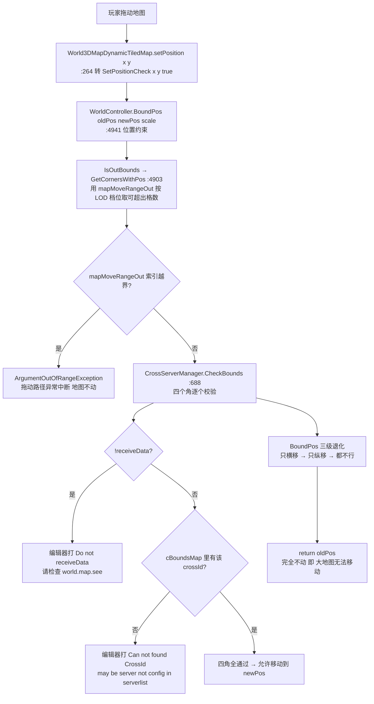

**■ 大地图（WorldMap）总纲 · 相机 / 移动 / 文档地图**

> 项目: RedAlert_SuperFormation（红警 / 帝国 / KS 多品牌复用，SVN 无 git）
> 整理时间: 2026-09-21（原始笔记 2024-12-19，本次逐条查实并展开）
> 唯一场景: `Assets/Scenes/main.unity`（1 920 行）—— 全项目只有一个 Unity Scene，WorldCamera 就挂在这里
> 本篇定位: **大地图这一族文档的入口页**。原始碎片笔记 → 查实结论；相机与移动的实测参数；文档地图
> 配套文档: [[城外大地图模块]] · [[联盟领地与王座争夺]] · [[大地图缩放分级显示]] · [[开发人员操作流程手册]] · [[场景管理模块]]

---

**■ 〇、原始笔记（2024-12-19）**

以下是最早记在本文里的三条线索，原文保留：

```text
初始相机高度
main场景WorldCamera挂载
public float worldMapDefaultSize = 0.8f; 大地图默认大小

大地图无法移动：world.map.see
![[Pasted image 20241219141049.png]]
```

**截图内容**（本次读图）：Console 里的一条 LogError ——

```text
[14:07:20] Cross map data: {"servers":[],"__id__":28,"__serverId__":1}
UnityEngine.Debug:LogError (object)
```

关键点是 **`"servers":[]` —— 服务器列表是空的**。下面 §一 逐条查实，§二~§四 是把这三条展开成可操作的内容。

---

**■ 一、三条原始笔记的查实结果**

**▍ 1.1 「初始相机高度」= position.y 1260，俯角 60°（实测）**

`main.unity` 里 WorldCamera 所在 GameObject（fileID `1267372692`，同时挂 4 个组件：`Camera` + `WorldCamera` + 天气 + `LightingHandler`）：

| 项 | 实测值 | 位置 |
|---|---|---|
| **位置** | `m_LocalPosition: {x: 0, y: 1260, z: -780}` → **高度 1260** | `main.unity:896` |
| **旋转** | 四元数 `{x:0.5, y:0, z:0, w:0.8660254}` = 绕 X 轴 **60°** | `main.unity:895` |
| 欧拉提示 | `m_LocalEulerAnglesHint: {x: 60, y: 0, z: 0}` | `main.unity:901` |
| FOV | `field of view: 60` | `main.unity:869` |
| 近/远裁剪 | `near 0.3` / `far 5000` | `main.unity:867-868` |
| 投影 | `orthographic: 0`（透视） | `main.unity:870` |
| 深度 | `m_Depth: 0` | `main.unity:872` |
| 渲染层 | `m_CullingMask.m_Bits: 4294950879` | `main.unity:875` |
| 立体 | `m_TargetEye: 3`（双眼）/ `m_HDR: 1` / `m_AllowMSAA: 1` | — |

运行时 `WorldCamera.Start()`（`Ext/WorldTileMap/WorldCamera.cs:83-100`）会做这些事：

```text
main = GetComponent<Camera>()                        // :85   取到上面那台相机
ScreenAdaptation.CameraFit(main)                     // :86   屏幕适配（该类不在 DevCodeFM 内）
this.gameObject.SetActive(false)                     // :87   ⚠️ 启动后把自己关掉（用到时再开）
LightingManager.GetInstance().lightingHandler = ...  // :88
dayNightController.Init()                            // :89
rotateX = transform.localEulerAngles.x               // :90   → 60（覆盖场景里的 rotateX: 0）
directionalLight = GameObject.Find("Directional light") // :92
cameraXTan = Mathf.Tan(rotateX * Deg2Rad)            // :95   → tan60° ≈ 1.732
InitRangePoint()                                     // :99   算出屏幕四角+中心的世界坐标
```

**▍ 1.2 「`worldMapDefaultSize = 0.8f`」——代码默认 0.8，但场景实际覆盖成 0.55**

| 项 | 值 | 位置 |
|---|---|---|
| 代码默认值 | `public float worldMapDefaultSize = 0.8f;` | `WorldCamera.cs:9` |
| **场景实际值** | **`worldMapDefaultSize: 0.55`** | **`main.unity:914`** |
| 使用点 1 | `m_map.setScale(WorldCamera.Instance.worldMapDefaultSize)` | `scene/world/World3DMapView2ViewPort.cs:114` |
| 使用点 2 | `m_map.setScale(WorldCamera.Instance.worldMapDefaultSize)` | `scene/world/WorldMapView2.cs:1542` |

两个使用点都是 **`m_map.setScale(...)`** —— 即「进大地图时把地图节点缩放到默认大小」，也就是你笔记里写的「大地图默认大小」。

**按档位阈值换算（`Global.cs:2831-2834`：`level_2 = 0.40` / `level_3 = 0.20` / `level_4 = 0.05`）**：

```text
0.55 >= 0.40  →  进大地图默认落在 level_1（一级地图档）
```

所以：**读代码得到的 0.8 是假的，实际进场是 0.55**。改默认视野要改 `main.unity:914`，不是改 `WorldCamera.cs:9`（改代码默认值对已有场景无效——序列化值优先）。

同一条 MonoBehaviour 上还有三条**只有美术/策划会动**的曲线（实测端点）：

| 字段 | 曲线端点（time → value） | 推测用途 |
|---|---|---|
| `secondMapCurve` | `0.0007 → 1.4998` … `1.0012 → 2.4987`（近线性） | 二级地图档的缩放曲线（约 1.5 ~ 2.5 倍） |
| `thirdMapCurve` | `0.1021 → 7.5166` … `0.9973 → 9.9780`（近线性） | 三级地图档的缩放曲线（约 7.5 ~ 10 倍） |
| `uiScaleCurve` | `0.0457 → 1.5060` → `0.5128 → 0.9572` → `0.9887 → 0.9571` | 世界内 UI 随缩放的反向缩放（缩放越小 UI 越大） |

**▍ 1.3 「大地图无法移动：`world.map.see`」——查实：这条笔记指的是完整因果链，而且有两个可复现根因**

**`world.map.see` 是什么**：跨服服务器列表协议。`GetServerListCommand`（`view/MultiServer/Command/GetServerListCommand.cs:5`）→ 回包由 `MultiServerManager.ParseData`（`view/MultiServer/MultiServerManager.cs:75-187`）解析。截图那条日志就是这里的 `:133`：

```text
world.map.see > Cross map data: {Newtonsoft.Json.JsonConvert.SerializeObject(dict)}
```

**为什么它会导致「无法移动」**——链路上有三道关卡，第二道就依赖这份数据：



**根因 A（与截图完全对应）：`cBoundsMap` 为空**

```text
world.map.see 回包 {"servers":[]}          ← 截图
MultiServerManager.ParseData
  :118  minLen = ceil(sqrt(0)) = 0
  :120-122  0 % 2 == 0 → minLen = 1
  :125-128  crossSize = (1,1)，crossOffset = (20,20)
  :130      serverCount = 1
  :158-166  补齐 1 条假数据（ID = 10000，State = 0）
  :173-176  vserverList = serverList.FindAll(State == 1) = 空
  :186      POST_SAFE_NOTIFY(MSG_GET_SERVER_LIST_DATA)
CrossServerManager.InitCrossData（:101 订阅该通知）:113-152
  :121-125  Global.cross_cell_col/row = (1,1)
            Global.cross_full_size_x/y = 1 × map_logic_row/col_count
  :127-148  foreach 服务器：**只有 State == 1 的才进 c2sMap / s2cMap / cBoundsMap**
            → 那条假数据 State = 0 → cBoundsMap 一条都没加
  :150      receiveData = true        ← ⚠️ 即使列表是空也置 true
结果：CheckBounds 里 cBoundsMap.ContainsKey(crossId) 恒为 false
      → CheckBounds 恒返回 false
      → BoundPos 三级尝试全失败 → return oldPos
      → **地图完全无法移动**
```

> 注意一个反直觉点：**空列表时 `receiveData` 还是被置成 `true`**（`:150`），所以那条 `Do not receiveData` 的编辑器报错**不会打**；真正打出来的是截图里 `ParseData` 的那条跨服数据日志。排查时不要靠 `Do not receiveData` 判断——它只在「通知从没发过」时才出现。

**根因 B（另一个可复现的「无法移动」）：`mapMoveRangeOut` 只配了 3 条，档位越界**

`WorldController.GetCornersWithPos`（`:4903-4930`）里：

```text
WorldMapLevel mapLevel = this.GetWorldMapLevel();
var levelRange = mapMoveRangeOut[(int)mapLevel];     // :4914  ⚠️ 没有任何越界保护
```

而 `WorldMapLevel` 枚举（`scene/world/WorldMap/WorldMapLevel.cs`）是 **5 个值**：
`level_1 = 0` · `level_2 = 1` · `level_3 = 2` · **`level_mini = 3`** · **`none = 4`**

`main.unity:1009-1012` 实测**只配了 3 条**：

```text
mapMoveRangeOut:
- {x: -3, y: -5, z: 30, w: 0}    // 索引 0 = level_1
- {x: 0,  y: -5, z: 30, w: 0}    // 索引 1 = level_2
- {x: 0,  y: 0,  z: 4,  w: 0}    // 索引 2 = level_3
```

字段语义（`WorldCamera.cs:55` 的 Tooltip 原文）：**「设置大地图移动时边界可超过 n 个格子的范围，根据 LOD 分级，顺序是左、上、右、下」**。所以：

| 档位 | 索引 | 左 | 上 | 右 | 下 |
|---|---|---|---|---|---|
| level_1 | 0 | -3 | -5 | 30 | 0 |
| level_2 | 1 | 0 | -5 | 30 | 0 |
| level_3 | 2 | 0 | 0 | 4 | 0 |
| **level_mini** | **3** | **— 越界 —** | | | |
| **none** | **4** | **— 越界 —** | | | |

（`GetCornersWithPos:4916-4917` 把它换算成「左下/右上可超出范围」：`mapLeftDownPoint = (-tile_width·x, -tile_width·y)`、`mapRightUpPoint = (tile_width·z, tile_width·w)`。）

→ **缩放到最小档（scale < 0.05 → `level_mini`）后再拖动，`GetCornersWithPos` 会直接抛越界异常，拖动中断、地图不动**；`none` 档同理。修法：场景里补 2 条（第 4、5 条），或代码里加 `Mathf.Clamp((int)mapLevel, 0, mapMoveRangeOut.Count - 1)`。

---

**■ 二、相机与缩放的补充要点**

**▍ 2.1 「移动和缩放改的是地图节点，不是摄像机」**

`WorldCamera.cs:48-52` 的原始注释把这件事说得最清楚，也是理解整套机制的前提：

> 在大地图上屏幕周围四个点映射到大地图上的四个坐标，即玩家所能看到的一个梯形范围的四个点的世界坐标，**因为大地图的移动和缩放均是更改大地图自身的节点属性，而不是更改摄像机，所以这四个点的世界坐标是固定不变的**。这四个点的顺序分别是左下，左上，右上，右下，中心。

→ 所以 `WorldCameraRangePoint[5]` 只在 `Start()` 里 `InitRangePoint()` 算一次（`:99`、`:131-145`）；**相机永远不动**，动的是 `m_map`（`m_layers` 的父节点）的 `localPosition` / `localScale`。这也是为什么所有范围计算都是「屏幕范围 ÷ scale + 偏移」的形式。

**▍ 2.2 相机被关掉 + 一个会把画面变黑的开关**

- `Start()` 里 **`this.gameObject.SetActive(false)`**（`:87`）——WorldCamera 启动后自行关闭，进大地图时才被打开。**改相机参数后如果"没生效"，先确认这个 GameObject 当前是 active 的。**
- `MaskSceneCamera(bool)`（`:113-129`）：`true` 时 **`main.cullingMask = 0`**（相机什么都不渲染 = 画面全黑），`false` 时恢复为「除 UI 层与 BGCamera 层以外的所有层」。它由通知 `Global.MSG_MASK_SCENE_CAMERA` 触发（`:105`）。
  → 出现「大地图一片黑」时，先查这个通知被谁发的、传的是不是 `true`。

**▍ 2.3 一个死配置**

`isUseWritekList`（`WorldCamera.cs:22`）与它配套的白名单 `writeGameObject`（`:37-44`：`_TYPE_` / `MANGROVE_IN_GRASS` / `Grove` / `mountain_snow`）——**全 Assets 内除声明处零引用**（`grep -rn --include=*.cs "isUseWritekList"` 只有 1 处），但场景里 `isUseWritekList: 1`。即：**这个"只处理白名单对象"的开关是死的**，改它不产生任何效果（排查"某些地块/树不显示"时不要往这上面想）。

---

**■ 三、地图移动的完整链路（三道关卡）**

**▍ 3.1 拖动主链**

```text
World3DMapDynamicTiledMap.setPosition(x, y)                    :264-267
  → SetPositionCheck(x, y, check: true)                        :269
      · 更新中心点 → CrossTiled2CrossId(tilePoint, true) + EnterServer(crossId)   :257-259  "deal server view change"
        （即：**每次位置更新都会顺带切换跨服视野**）
      · check == true → bNewPos = BoundPos(oldPos, newPos)      :282
      · transform.localPosition = bNewPos                        :283
      · getViewPort().setMovable(true)                          :288（viewport 为空则直接 return）
      · 若自身 tag == WM_BETWEEN_SERVER_MAP_TAG → 提前 return     :296（跨服底图节点不再往下走）
  → BoundPos(oldPos, newPos)                                    :186-190
      直接委托 WorldController.getInstance().BoundPos(oldPos, newPos, scale)
      （旧的 CheckBounds 内联实现整段被注释保留在 :192-226）
  → WorldController.BoundPos(oldPos, newPos, scale)             :4941-4973
  → WorldController.IsOutBounds(newPos, scale)                  :4932-4939
  → CrossServerManager.CheckBounds(cornersPos)                  :688-735
```

**▍ 3.2 关卡①：`mapMoveRangeOut` —— 按 LOD 档位取「可超出格数」**

见 §1.3 根因 B。**实测只配 3 条，`level_mini` / `none` 越界抛异常**。

**▍ 3.3 关卡②：`CheckBounds` 的六个判定**

`CrossServerManager.CheckBounds`（`:688-735`）对传入的四个角**逐个**判定，任一不过即 `false`：

| 判定 | 不过的后果 | 编辑器日志 |
|---|---|---|
| `!receiveData` | 直接打日志（但仍继续判） | `Do not receiveData!!!!!! Please check cmd world.map.see or other cmd error broken the InitCrossData function` |
| `crossKey.x < 0` | `return false` | — |
| `crossKey.x >= Global.cross_cell_col` | `return false` | — |
| `crossKey.y < 0` | `return false` | — |
| `crossKey.y >= Global.cross_cell_row` | `return false` | — |
| **`!cBoundsMap.ContainsKey(crossId)`** | `return false` | `Can not found CrossId {crossId}. If currentCrossId ... == currentServerId ... may be server not config in serverlist` |

**▍ 3.4 关卡③：`BoundPos` 的三级退化（最后就是"完全不动"）**

```text
WorldController.BoundPos(oldPos, newPos, scale)                 :4941-4973
  pass = IsOutBounds(newPos)                     → 通过：return newPos
  否则 xnewPos = newPos; xnewPos.x = oldPos.x    → 只允许横向移动
       xpass = IsOutBounds(xnewPos)              → 通过：return xnewPos
  否则 znewPos = newPos; znewPos.z = oldPos.z    → 只允许纵向移动
       zpass = IsOutBounds(znewPos)              → 通过：return znewPos
  全失败 → return oldPos                          ← 位置原样返回 = 拖动完全无效
```

> 这就是「大地图无法移动」在代码里的最终形态：**不是被某个开关拦住，而是位置被约束函数原样退回来**。手感上表现为「拖不动 / 只能斜着拖一点就卡住」。

**▍ 3.5 跨服数据的来源（这道关卡的唯一上游）**

```text
GetServerListCommand("world.map.see")                     view/MultiServer/Command/GetServerListCommand.cs:5
  → MultiServerManager.ParseData(dict)                    view/MultiServer/MultiServerManager.cs:75-187
       :77   日志 Cross -> world.map.see: ...
       :103  原字段缺失 → 日志"Cross map data is null check -> world.map.see" + return
       :111  servers 不是数组 → 日志同上（带 JSON）+ return
       :118  crossSize 由服务器数量开根号得出，并强制奇数
       :133  日志 world.map.see > Cross map data: ...      ← 截图那条
       :179  日志 world.map.see >> serverList N ; vserverList M
       :186  广播 MSG_GET_SERVER_LIST_DATA
  → CrossServerManager.InitCrossData                      controller/CrossServerManager.cs:113-152
       :119  crossSize ← IMultiServerManager.GetMapCrossSize()
       :121-125  Global.cross_cell_col/row、Global.cross_full_size_x/y
       :129  只处理 State == 1 的服务器 → 填 c2sMap / s2cMap / cBoundsMap
       :145  cBoundsMap[crossPosIndex] = CrossId2CrossRect(...)
       :150  receiveData = true（空列表也置 true）
```

其它订阅者（改动这条协议时注意联动）：`GlobalWorldMapView.OnGetServerListData`（`view/MultiServer/GlobalWorldMapView.cs:80`）、`ServerListView.RefreshServers`（`view/MultiServer/ServerListView.cs:59`）。

相关常量：`MAX_CROSS_X/Y = 40`、`CROSS_CENTER_OFFSETX/Y = 20`（`MultiServerManager.cs:9-15`）；边界矩形 `CrossId2CrossRect`（`CrossServerManager.cs:589-597`）。

---

**■ 四、「大地图无法移动」排查流程（按证据分级）**

```text
① 看 Console 有没有这两条 LogError（两条都是 ＃if UNITY_EDITOR，正式包没有！）：
     · "world.map.see > Cross map data: {...}"     → 看 servers 是不是空数组
     · "Can not found CrossId ... may be server not config in serverlist"  → cBoundsMap 缺该区域
     · "Do not receiveData!!!!!! Please check cmd world.map.see ..."       → 通知从没发过
② 判定是"根因 A（跨服数据空）"还是"根因 B（档位越界）"：
     · 当前缩放是多少？scale < 0.05（level_mini）→ 大概率是 B
       现场验证：`Global.getWorldMapViewInst().m_map.getScale()` 与 `WorldController.getInstance().GetWorldMapLevel()`
     · 把 scale 放大到 ≥ 0.05 再试拖动：能动了 → 就是 B
③ 若是 A：确认服务器侧 world.map.see 是否真的下发了 servers；
     注意"服务器没配进 serverlist"和"服务器 State != 1（未开服/维护）"都会导致该 crossId 缺失
④ 若都正常但仍拖不动：查是不是被 level 相关问题拦住（见 [[大地图缩放分级显示]]）——
     注意 level_mini 档的语义在各子系统里不一致
⑤ 改完后必须复测三个场景：一级档拖动 / 缩到最小档拖动 / 拖到跨服边界
```

**关键区分**：根因 A 是**数据问题（服务器侧）**，根因 B 是**客户端配置缺失**。二者在编辑器里都能复现，但 A 的日志会出现在拖动时（`CheckBounds` 每条 `＃if UNITY_EDITOR`），B 是直接抛异常。

---

**■ 五、调试工具（`WorldCamera` 自带，都在 `＃if UNITY_EDITOR || ROE_DEV` 内）**

| 开关/工具 | 作用 |
|---|---|
| `isShowCameraRange`（`main.unity:1001`，默认 0） | `OnDrawGizmos` 里用 Gizmos 画出**相机可视范围四边形 + 中心点射线**（`:187-196` → `RenderWorldCameraRange:281-292`）——**查"可视范围算得对不对"最直接的工具**，在 Scene 视图看 |
| `isShowTileLine`（默认 0） | `OnPostRender` 用 GL 画每条格线（`:177-179`）——查格子坐标/错位 |
| `worldMapLinesSize`（默认 0） | 同上的批量版；**`size % 16 == 0` 时线变蓝**（`:211-214`）当标尺 |
| `isShowTreePoint`（默认 0） | 把树点画成方块（`:225-236`） |
| `worldMapIndex` + ContextMenu **「获取实际坐标点」** | 在 Inspector 填 index → 右键菜单打出 `index: 坐标`（`:152-156`） |
| `WorldCameraRangePoint[5]` | 运行时读屏幕四角+中心的世界坐标（左下/左上/右上/右下/中心） |
| `mapMoveRangeOut` | 见 §1.3 根因 B —— **改动前先数元素个数是否 ≥ 5** |

其它现成锚点：`AddSimulateData`（`MultiServerManager.ParseData:168-171`，`addFakeData` 开关，本地造假服务器数据）、`Global.postNotification(MultiServerManager.MSG_GET_SERVER_LIST_DATA)`（手动重触发跨服数据初始化）。

---

**■ 六、文档地图（这一族该怎么读）**

| 文档 | 讲什么 | 什么时候读 |
|---|---|---|
| **本篇（大地图）** | 相机实测参数 · 移动的三道关卡 · **「无法移动」的完整因果链与两个根因** · 调试工具 · 导航 | **一开始就读它**——先建立相机/移动的直觉 |
| [[城外大地图模块]] | 世界地图**运行机制全貌**：索引/分片绘制/渲染 8 层/三句核心定位 · 城点类型 70+ · 行军线 · 刷怪 · 障碍分组 · 玩家与城市 · 已知坑 15 条 | 要改"地图上的任何东西"之前 |
| [[大地图缩放分级显示]] | **四档 LOD 专项**：阈值 · 每档切了什么 · 三套平行内容与数据 · 14 条问题 + 修改建议 + 自检表 | 动缩放/档位/层级显示时 |
| [[联盟领地与王座争夺]] | 领地（面：染色+轮廓线）与王座/城市/堡垒/村庄（点） | 改联盟争夺玩法时 |
| [[开发人员操作流程手册]] | 跨模块**操作流程**：症状→模块定位表 · 八步流程 · 环境红线 · 跨模块联动 · 提交前清单 | 接手任何需求时先过一遍 |
| [[场景管理模块]] | `SCENE_ID_WORLD` 的宿主框架（全项目只有一个 Unity Scene，`main.unity`） | 需要进出世界、加场景时 |

**建议阅读顺序**：本篇（相机/移动）→ [[城外大地图模块]]（机制）→ 按需求挑 [[大地图缩放分级显示]] / [[联盟领地与王座争夺]] → 动手前对照 [[开发人员操作流程手册]] 的排查表。

---

**■ 七、相关文档与待办**

- 代码入口速查：
  - 相机：`Ext/WorldTileMap/WorldCamera.cs`（310 行）· 场景 `Assets/Scenes/main.unity`（`worldMapDefaultSize` 在 `:914`、`mapMoveRangeOut` 在 `:1009-1012`）
  - 移动：`scene/world/WorldMap/World3DMapDynamicTiledMap.cs:264-296` · `controller/WorldController.cs:4903-4973`
  - 跨服：`controller/CrossServerManager.cs:113-152` / `:688-735` · `view/MultiServer/MultiServerManager.cs:75-187`
- **本次查实出的两个问题建议立项**（项目内暂无 `docs/fix/worldmap/`）：
  1. 🔴 **`mapMoveRangeOut` 只有 3 条，`level_mini` / `none` 档拖动必然越界抛异常**（`main.unity:1009-1012` + `WorldController.cs:4914` 无保护）——改法：场景补 2 条，或代码加 Clamp
  2. 🟠 **`cBoundsMap` 为空时没有任何兜底/提示**：空 `servers` 会让 `receiveData` 仍为 `true`，且 `BoundPos` 静默把位置退回 `oldPos` —— 玩家侧表现为"地图点不动"，无任何提示。改法：`InitCrossData` 里对"一条 `State==1` 都没有"打显著日志，或 `BoundPos` 失败时给出可观测的计数
- 顺带记录：`isUseWritekList` / `writeGameObject` 是死配置（全 Assets 零引用，场景却设了 1）
```
