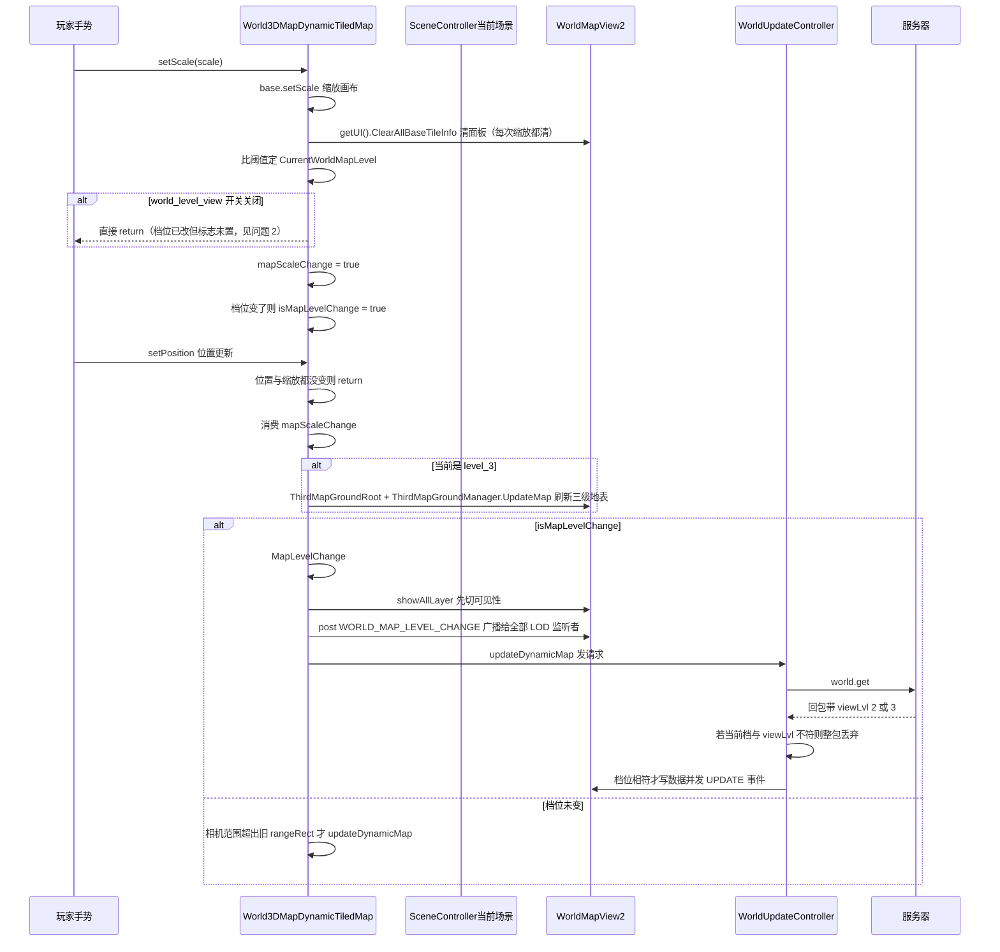
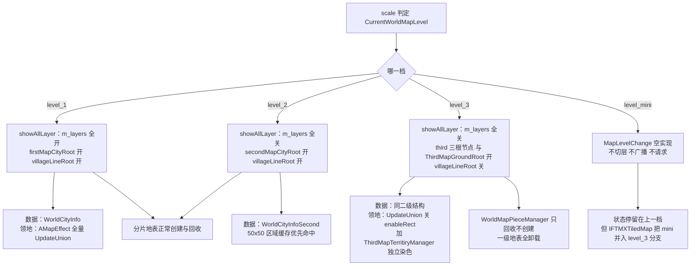

**■ 大地图缩放分级显示（WorldMapLevel / LOD）问题分析**

> 项目: RedAlert_SuperFormation（红警 / 帝国 / KS 多品牌复用，SVN 无 git）
> 整理时间: 2026-09-21
> 范围: **只做缩放分级显示（LOD 三档 + 最小档）的机制与问题专项**，不重复大地图其余内容
> 核心代码: `scene/world/WorldMap/World3DMapDynamicTiledMap.cs`（796 行）· `scene/world/WorldMapView2.cs:741-764`（`showAllLayer`）· `Ext/WorldTileMap/WorldMapPieceManager.cs` · `Ext/WorldTileMap/WorldMapLodListener.cs` · `Ext/WorldTileMap/ThirdMapGroundManager.cs`
> 配套文档: [[城外大地图模块]]（本专项是其 §1.6 的展开）· [[联盟领地与王座争夺]]（三级的领地染色是独立一套）· [[场景管理模块]]

---

**■ 一、机制速览（先把事实钉死）**

**▍ 1.1 四档判定与阈值**

阈值全部在 `IF/Global.cs:2831-2834`：

| 常量 | 值 | 原注释 | 实际含义 |
|---|---|---|---|
| （**不存在**） | — | — | **没有 `wolrd_map_zoom_level_1`**：level_1 是「≥ `level_2` 的值」，靠反向判定 |
| `wolrd_map_zoom_level_2` | `0.40f` | 小于等于这个就是2级地图 | 一级 / 二级 分界 |
| `wolrd_map_zoom_level_3` | `0.20f` | 小于等于这个就是3级地图 | 二级 / 三级 分界 |
| `wolrd_map_zoom_level_4` | `0.05f` | **小于等于这个就是3级地图（注释复制粘贴错误）** | 三级 / 最小档 分界 |
| `wolrd_map_zoom_level_min` | `0.008f` | 地图极限缩放 | 只是缩放下限，**不参与分档** |

判定实现（`World3DMapDynamicTiledMap.cs:373-381`，在 `setScale` 里）：

```text
scale >= 0.40  → CurrentWorldMapLevel = level_1      // 一级：全要素
scale >= 0.20  → CurrentWorldMapLevel = level_2      // 二级：换一套专用内容
scale >= 0.05  → CurrentWorldMapLevel = level_3      // 三级：再换一套专用内容
其余           → CurrentWorldMapLevel = level_mini   // 最小档：什么都不切（见 §三-1）
```

**▍ 1.2 触发链（三段式，两帧才落地）**

```text
① setScale(scale)                                    World3DMapDynamicTiledMap.cs:363-395
     base.setScale(scale)                              :368   真正缩放画布
     getUI().ClearAllBaseTileInfo()                    :370-371  每次缩放都清 UI 面板
     判定 CurrentWorldMapLevel                          :373-381
     if (!checkIsOpenByKey("world_level_view")) return; :383-385  ⚠️ 早于下面两步
     mapScaleChange = true                             :387
     档位变了 → isMapLevelChange = true                 :389-394

② setPosition(...)  ← 下一帧/同帧位置更新时          :305-353
     if (!mapScaleChange && lastDisplayTilePoint == tilePoint) return;  :310-313
     mapScaleChange = false                            :317   消费标志
     level_3 时：ThirdMapGroundManager.UpdateMap(...)   :332-337  三级地表独立刷新
     isMapLevelChange 时 → MapLevelChange()             :339-343
     否则：相机范围超出旧 rangeRect 才 updateDynamicMap()  :347-350

③ MapLevelChange()                                   :770-784
     level_mini → 什么都不做                            :775-777
     否则：showAllLayer(mapLevel)                       :778
           postNotification(WORLD_MAP_LEVEL_CHANGE)     :780
           updateDynamicMap()                           :782   发请求，等服务器回包

另有定时刷新：Update() 每帧 mapSecondUpdateTime 到点就 updateDynamicMap()   :786-794
```

**▍ 1.3 每档到底切了什么（`WorldMapView2.showAllLayer:741-764` 全表）**

| 根节点 | level_1 | level_2 | level_3 |
|---|---|---|---|
| `m_layers[0..7]`（**城点 `WM_CITY` / 行军线 `WM_ROAD` / 地表 `WM_TILE` 全在内**） | ✅ | ❌ | ❌ |
| `m_layers[WM_GUI]` | ✅ | ✅ | ✅（恒真，`:751`） |
| `firstMapCityRoot` | ✅ | ❌ | ❌ |
| `secondMapCityRoot` | ❌ | ✅ | ❌ |
| `thirdMapCityRoot` | ❌ | ❌ | ✅ |
| `thirdMarkCityRoot` | ❌ | ❌ | ✅ |
| `thirdMapTerriroyRoot` | ❌ | ❌ | ✅ |
| `villageLineRoot` | ✅ | ✅ | ❌ |

> 关键推论：**level_2 / level_3 下 `m_layers` 被整层关掉**，所以一级地图的城点、行军线、地表在这两档**全部不可见**，改由各自的专用根节点顶替。

**▍ 1.4 三套并行的「地图内容 + 数据」**

| 档 | 内容根节点 | 地表/领地实现 | 数据类 | 落地事件 |
|---|---|---|---|---|
| 一级 | `m_layers` + `firstMapCityRoot` + `villageLineRoot` | `WorldMapPieceManager` 分片 + `MapTerritory` 染色（细线） | `WorldCityInfo` | `MSG_CREATE_CITY` / `onResetCityInfo` |
| 二级 | `secondMapCityRoot` | 复用一级地表（分片不卸载） | `WorldCityInfoSecond` | `WORLD_MAP_LEVEL_SECOND_UPDATE` |
| 三级 | `thirdMapCityRoot` + `thirdMarkCityRoot` + `thirdMapTerriroyRoot` + `ThirdMapGroundRoot` | **独立一套**：`ThirdMapGroundManager`（`territoryGroundCol/Row = 209`，`EXT_FACTOR = 0.2`）+ `ThirdMapTerritiryManager` → `MapThirdTerritory`（池名 `World_Third_Territory`） | 同二级结构 | `WORLD_MAP_LEVEL_THIRD_UPDATE` |

**数据分级的关键事实**：`viewLvl`（2 或 3）**是服务器回包字段**，不是客户端请求参数（解析处 `WorldUpdateController.cs:391-406`：`vparams.objectForKey("viewLvl")`）。客户端**无法指定要几级数据**，只能按收到的 `viewLvl` 分流；因此两处都加了「迟到即丢」保护：

```text
viewLvl == 3 → ParseCityInfoSecond → 主线程回调里
                if (GetWorldMapLevel() != level_3) return;   // 整包丢弃 :1294-1297
                UpdateCityInfoThirdInRect(...) + post WORLD_MAP_LEVEL_THIRD_UPDATE
viewLvl == 2 → 同理，要求 == level_2                        // :1315-1318
```

**领地渲染按档分两支**（`Ext/IFTMXTiledMap.cs:20-38` `UpdateTerritoryInScreen`）：

```text
mapLevel <  level_3  → AMapEffect.UpdateUnion(rect)          有 dirty 才 UpdateTerritory()（一二共用）
mapLevel >= level_3  → AMapEffect.UpdateUnion(rect, false)   enableRect=false
                       + WorldMapView2.UpdateThirdMapTerritiry()  三级专属染色
```

**LOD 监听者清单**（都监听 `WORLD_MAP_LEVEL_CHANGE`，`level_mini` 时全部收不到 → 见 §三-1）：

| 监听者 | 收到后做什么 | 位置 |
|---|---|---|
| `MapPiece.WorldMapLevelChange` | 重跑 `LoadObjects()`（APR/GROVE/PURE 按档取舍）+ `treeParent` + `ShowGrove` | `MapPiece.cs:113-130` |
| `MapTerritory.WorldMapLevelChange` | `SetBoldType`（细/粗线）+ 重写 mesh UV | `MapTerritory.cs:66-71` |
| `LodTerritoryLine.UpdateLod` | `UpdateWidth()`：按 LOD 加宽 + 选平滑/原始折线 | `LodTerritoryLine.cs:76` |
| `WorldMapLodListener.OnWorldMapLevelChange` | 切 `lods[]` 数组（对象级 LOD） | `WorldMapLodListener.cs:14-53` |
| `TerritoryMgr.WorldMapLevelChange` | `wLevel < level_3` 才强制重请求 + `UpdateUnionRender()` | `TerritoryMgr.cs:302-324` |
| `WorldMapView2UI.WorldMapLevelChange` | `ClearAllBaseTileInfo()` | `WorldMapView2UI.cs:1568-1571` |
| `MainUIState.NotifyChangeOutsideState` | HUD 状态切 `Outer_Map1/2/3` | `MainUIState.cs:70-85` |
| `WorldMapView2.ClearNeedUpdateKeys` | 清待更新键集合 | `WorldMapView2.cs:1222` |
| `WorldMapAreaSelector.OnMapLevelChange` | 区域选择器刷新 | `WorldMapAreaSelector.cs:33` |

**▍ 1.5 缓存与节流（三档策略不一致）**

| 机制 | 生效档位 | 说明 |
|---|---|---|
| `activeMinimapCache(posTile)` | **仅 level_2 档**（`scale <= 0.40 && scale > 0.20`，`:608-612`） | 按 **50×50 格**一个区域缓存服务器 JSON（`getRangeAreaId = x/50*1000 + y/50`，`WorldUpdateController.cs:437-442`）；命中就 `updateMapinfoByParam(缓存)` 并 **return（不发协议）** |
| `minUpdateTimeInterval` / `mapSecondUpdateTime` / `moveNextUpdateTimeInterval` | 全档 | 请求频率优化（`:637-660`） |
| `MapPieceManager.IsNeedUpdateMap` | 全档 | 用 `lastScale = ceil(1 / tileScale)` 去重（`:276`、`:331`）→ **与档位判定是两套基准** |
| `world_level_view` 功能开关 | 全档 | 关掉后 `setScale` 提前 return（`:383-385`）→ 见 §三-2 |

---

**■ 二、流程与分叉**

**▍ 2.1 缩放 → 切档 → 重绘 全时序**



**▍ 2.2 三档内容与数据的分叉图**



---

**■ 三、问题清单（本次专项）**

| 级别  | 问题                                                            | 现象 / 根因                                                                                                                                                                                                                                                                                                                                                                                                                                                                                                                                                                 | 位置                                                                                                                              |
| --- | ------------------------------------------------------------- | ----------------------------------------------------------------------------------------------------------------------------------------------------------------------------------------------------------------------------------------------------------------------------------------------------------------------------------------------------------------------------------------------------------------------------------------------------------------------------------------------------------------------------------------------------------------------- | ------------------------------------------------------------------------------------------------------------------------------- |
| 🔴  | **`level_mini` 是「哑档」：三件事都不做**                                 | `MapLevelChange()` 的 `level_mini` 分支只剩一句被注释的 `onTouchMiniMap`，**既不 `showAllLayer`、也不 post `WORLD_MAP_LEVEL_CHANGE`、更不 `updateDynamicMap`**。后果：① `m_layers` 与各档根节点保持上一档（若从 level_3 缩下来，就是「只有 GUI」）；② §1.4 里 9 个 LOD 监听者**全部收不到通知**，停留在 level_3 的状态（`MapPiece`/`MapTerritory`/`LodTerritoryLine`/`WorldMapLodListener`/`WorldMapView2UI`/`MainUIState`…）；③ HUD 也停在 `Outer_Map3`（`MainUIState` 只处理 1/2/3）。**但 `IFTMXTiledMap.UpdateTerritoryInScreen` 又把 `level_mini` 并进 `level >= level_3` 分支**（继续按三级路径刷领地）→ 同一个档位在不同子系统里被当成「三级」和「什么都不做」两种语义。复现：把地图缩到最小（scale < 0.05）     | `World3DMapDynamicTiledMap.cs:775-777`；对照 `Ext/IFTMXTiledMap.cs:26-37`、`MainUIState.cs:70-85`                                   |
| 🔴  | **`world_level_view` 开关关闭 → 档位状态与画面状态分叉**                     | `setScale` 里顺序是：`base.setScale`（画布真的缩放 `:368`）→ 判档写 `CurrentWorldMapLevel`（`:373-381`）→ **然后** `if (!checkIsOpenByKey("world_level_view")) return;`（`:383-385`）→ 才 `mapScaleChange = true`（`:387`）。于是开关关闭时：画布已缩放、档位已改，但**两个标志位都没置** → `setPosition` 里 `if (!mapScaleChange && lastDisplayTilePoint == tilePoint) return;`（`:310-313`）直接返回 → **不重算范围、不请求数据**；而后续任何按档位判断的代码（`MapPiece.LoadObjects`、`UpdateTerritoryInScreen`、`MapPieceManager` 的 `isLevel3`）会拿**新档位**去处理**旧内容**。另外 `lastWorldMapLevel` 也没更新 → 开关重新打开后第一次缩放会**误触发一次全量切换**（重复 `showAllLayer` + 重复广播 + 重复请求） | `World3DMapDynamicTiledMap.cs:383-394`、`:310-317`                                                                               |
| 🟠  | **`MapPiece.LoadObjects` 的 level_3 分支不可达（死代码）+ 注释与常量不一致**     | 分片在 level_3 已被 `WorldMapPieceManager.UpdateMapPiece` **全部回收且不重建**（`if (isLevel3 \|\| !pointList.Contains(key))` 短路，之后 `if (!isLevel3)` 才创建）→ `MapPiece` 实例不会再存在，它里面那套 level_3 规则（`APR` 跳过、`GROVE` 仅 level_1、`PURE` 每 `level3AddScale` 格只留中心并放大）**永远不会执行**。且**注释写「每 9 个地块只显示中间一个，并扩大 9 倍」，代码是 `level3AddScale = 10` + `CheckCenter` 判 `% 10 == 4` + 放大 10 倍**（9 vs 10 不一致，`mid = (10-1)/2 = 4`）                                                                                                                                                                          | `MapPiece.cs:141-215`（分支）、`WorldMapPieceManager.cs:190`/`:205-211`（回收）、`WorldMapPieceDataManager.cs:116`（`level3AddScale = 10`） |
| 🟠  | **`MapTerritory.CheckCenter` 同样是死代码**                         | `MapTerritory.WorldMapLevelChange` → `UpdateUVMutiTexture()` 里 `level_3` **直接 `SetActive(false) + return`**，而 `CheckCenter` 只在 level_3 才有意义 → 永不执行（与上一条同源：level_3 的处理被搬到了 `MapThirdTerritory`）                                                                                                                                                                                                                                                                                                                                                                          | `MapTerritory.cs:66-71`、`:362-370`；三级专属见 `MapThirdTerritory.cs`                                                                 |
| 🟠  | **两套「缩放分级」判定基准不同 → 重刷时机错位**                                   | 档位按**连续 `scale` 比阈值**（0.40/0.20/0.05）；而分片是否重建按 **`lastScale = Mathf.CeilToInt(1f / tileScale)`** 去重（`IsNeedUpdateMap`）。两者一个是「缩放绝对值」，一个是「缩放倒数取整」，跨档点不重合 → 会出现「档位没变但分片全量重建」或「档位变了但分片范围沿用旧的（因为 `lastScale` 没变）」                                                                                                                                                                                                                                                                                                                                                            | `World3DMapDynamicTiledMap.cs:373-381` vs `WorldMapPieceManager.cs:235`/`:276`/`:331`                                           |
| 🟠  | **切档瞬间的「开着但空」窗口**                                             | `MapLevelChange` 的顺序是先 `showAllLayer`（**立刻**关掉旧档根节点、打开新档根节点）→ 再 `updateDynamicMap()`（**发请求等服务器回包**）。新档内容要等回包才落地 → 中间存在空白窗口。只有 **level_2 档**有 `activeMinimapCache` 兜底（命中 50×50 区域缓存直接用），**level_1 / level_3 没有任何本地兜底**                                                                                                                                                                                                                                                                                                                                                   | `World3DMapDynamicTiledMap.cs:770-784`；缓存仅 `:608-612`                                                                           |
| 🟠  | **行军线在 level_2 / level_3 整层消失**                               | 所有行军线节点（`m_drawRoadNode`、`m_drawRoadNode_Mining`、`m_occupyPointerNode`、`m_mapMarchNode`）都挂在 `m_layers[WM_ROAD]`，而 `showAllLayer` 在 level_2/level_3 把 `m_layers` 全关 → 二三级地图上**看不到任何行军线**。同时还有独立开关 `showMarchNodes(bool)` → 「线不见了」有两个互不相干的原因，排查时极易误判                                                                                                                                                                                                                                                                                                                      | `WorldMapView2.cs:744-751`（层显隐）、`:770` 起（`showMarchNodes`）                                                                      |
| 🟠  | **二/三级数据「迟到即丢弃」且不自动重发**                                       | `viewLvl` 是服务器回包字段，客户端不能指定；回包到达时若当前档位与 `viewLvl` 不符就 **整包 `return` 丢弃**（三级要求 `== level_3`，二级要求 `== level_2`），**没有补发机制**。快速在 level_2 ⇄ level_3 之间来回缩时容易连续丢包 → 到档后仍无数据，只能等下一次请求（由位置变化、缩放变化或定时器驱动）                                                                                                                                                                                                                                                                                                                                                                         | `WorldUpdateController.cs:1294-1297`、`:1315-1318`；触发源仅 `:786-794` 定时 + `:347-350` 范围变化                                          |
| 🟡  | 三档请求策略不一致                                                     | level_1：不抑制、每次都请求；level_2：缓存命中就**不请求**；level_3：不走缓存分支，但要单独拿 `viewLvl` 数据 + `ThirdMapGroundManager` 单独刷地表                                                                                                                                                                                                                                                                                                                                                                                                                                                                | `World3DMapDynamicTiledMap.cs:608-612`、`:637-660`、`:332-337`                                                                    |
| 🟡  | `villageLineRoot` 只在 level_1/level_2 可见，且只由 `showAllLayer` 控制 | 三级地图上村庄连线消失（与领地线的处理策略相反：`LodTerritoryLine` 是「收事件加宽」而不是整层关）；`level_mini` 时因不发事件，这个显隐也不更新                                                                                                                                                                                                                                                                                                                                                                                                                                                                                 | `WorldMapView2.cs:763`                                                                                                          |
| 🟡  | `setScale` 每次都清 UI 面板                                         | `if (Global.getWorldMapViewInst().getUI() != null) getUI().ClearAllBaseTileInfo();` 在每次 `setScale` 执行 → **缩放过程中每帧清空**基地/玩家信息面板，连续缩放时面板无法停留（同时 `WorldMapView2UI` 收 LOD 事件也再清一次）                                                                                                                                                                                                                                                                                                                                                                                          | `World3DMapDynamicTiledMap.cs:370-371`、`WorldMapView2UI.cs:1568-1571`                                                           |
| 🟡  | 阈值常量可读性差                                                      | ① 没有 `wolrd_map_zoom_level_1`，一级档靠「≥ level_2 的值」反向判定；② `wolrd_map_zoom_level_4` 的注释写成「小于等于这个就是3级地图」（复制粘贴错误，它其实是 mini 分界）；③ `0.008 ~ 0.05` 整段都算 `level_mini`，内部无任何区分；④ `wolrd_map_zoom_level_min` 不参与分档，容易被误当阈值                                                                                                                                                                                                                                                                                                                                                          | `Global.cs:2831-2834`                                                                                                           |
| 🟡  | 合并粒度与分片粒度不成整数倍                                                | `level3AddScale = 10`（合并块 10×10 格）与 `m_tile_piece_count_in_row = 3`（一个分片 = 3×3 格）不成整数倍 → 若 level_3 的 `PURE` 合并路径被恢复，合并块与分片边界不重合（会出现半个合并块跨分片）                                                                                                                                                                                                                                                                                                                                                                                                                            | `WorldMapPieceDataManager.cs:116` vs `:36`；`MapPiece.CheckCenter` `%10`                                                         |
| 🟡  | 三级是完整平行的一套渲染链，维护成本双份                                          | 三级地表 `ThirdMapGroundManager`（`209×209`、`EXT_FACTOR 0.2`）+ 三级领地 `ThirdMapTerritiryManager`/`MapThirdTerritory`（`World_Third_Territory`，自己一套 `tempUV0-3` / `averageFactor` / `SetDirty` / `SetUsed`），与一级的 `WorldMapPieceManager`/`MapTerritory` 完全平行 → 领地或地表改一处必须同步另一处（`AMapEffect.UpdateUnion(rect, false)` 的 `enableRect=false` 就是专为三级准备的旁路）                                                                                                                                                                                                                            | `ThirdMapGroundManager.cs:6-13`、`MapThirdTerritory.cs:7-59`、`IFTMXTiledMap.cs:26-37`                                            |

---

**■ 四、快速自检表（改这块前后各跑一遍）**

| 观测点 | 取值方式 | 期望 |
|---|---|---|
| 当前档位 | `WorldController.getInstance().GetWorldMapLevel()` | 与 `m_map.getScale()` 按 §1.1 阈值一致 |
| 缩放值 | `Global.getWorldMapViewInst().m_map.getScale()` | — |
| 三个开关状态 | `mapScaleChange` / `isMapLevelChange` / `lastWorldMapLevel`（私有，需打断点或加日志） | 一次缩放后 `mapScaleChange` 必须被消费为 `false`（`:317`） |
| 层可见性 | `m_layers[i].isVisible()` × 8 + `firstMapCityRoot/secondMapCityRoot/thirdMapCityRoot/thirdMarkCityRoot/thirdMapTerriroyRoot/villageLineRoot.activeSelf` | 与 §1.3 表逐格对照 |
| 分片数量 | `WorldMapPieceManager` 的 `pieceDic.Count` | level_1/level_2 > 0；**level_3 == 0**（只回收不创建） |
| 领地 mesh | `MapPiece.territory` / `MapThirdTerritory` 的 `isDirty`、`territoryParent.activeSelf` | level_3 下 `MapTerritory.territoryParent` 必须为 false，走三级那套 |
| 缓存是否吃掉请求 | 打点 `activeMinimapCache` 返回值 | 只在 `0.20 < scale <= 0.40` 区间可能为 true |
| 丢包情况 | 打点 `:1294` / `:1315` 两处 `return` | 快速来回缩时统计被丢弃的包数 |
| HUD 状态 | `MainUIState` 的 `controller.selectedIndex` | Outer_Map1/2/3；**缩到最小时是否还停在 3（预期会，见 §三-1）** |
| 功能开关 | `CCCommonUtils.checkIsOpenByKey("world_level_view")` | 关掉时验证「画布缩放但内容不更新」现象（§三-2） |

**最小复现脚本（手动）**：进世界 → 从一级连续缩到最小再放大回一级，逐档停 2 秒观察：
1. 每次跨 0.40 / 0.20 / 0.05 三个点时，地图内容是否出现空白窗口；
2. 缩到 < 0.05 时，是否所有 LOD 内容停在三级状态、HUD 仍是 `Outer_Map3`；
3. 放大回去时，二/三级数据是否需要等一次定时刷新才出现（丢包现象）。

---

**■ 五、修改建议（按优先级）**

| 优先级 | 建议 | 落点 |
|---|---|---|
| P0 | **给 `level_mini` 补齐语义**：要么明确「mini = level_3 的降级表现」，在 `MapLevelChange` 里把 mini 当作 level_3 处理（`showAllLayer(level_3)` + 广播 level_3 或广播 mini 并让监听者统一处理）；要么彻底不进 mini 档（把 `wolrd_map_zoom_level_4` 与 `_min` 合并）。**当前「部分子系统当三级、部分当什么都不做」是最坏状态** | `World3DMapDynamicTiledMap.cs:775-777`；同步 `IFTMXTiledMap.cs:26-37`、`MainUIState.cs:70-85` |
| P0 | **把 `world_level_view` 开关判断提到判档之前**（或在 `return` 前补 `lastWorldMapLevel = CurrentWorldMapLevel`），消除「档位已改、标志未置」的分叉 | `World3DMapDynamicTiledMap.cs:373-394` |
| P1 | **让切档先拿到数据再切可见性**：`MapLevelChange` 里把 `showAllLayer` 挪到收到该档数据（`WORLD_MAP_LEVEL_SECOND/THIRD_UPDATE`）之后再执行，或给三个档都加本地兜底（`level_3` 也走 `activeMinimapCache` 类似的区域缓存） | `World3DMapDynamicTiledMap.cs:770-784`、`WorldUpdateController.cs:1294-1333` |
| P1 | **补发机制**：`viewLvl` 不符时不要静默丢弃，记一个 `pendingRequest`，切档完成后立即重发一次 | `WorldUpdateController.cs:1294-1297`、`:1315-1318` |
| P1 | **统一分片重刷的判定基准**：`IsNeedUpdateMap` 改用与档位同一套 `scale` 比较，或把 LOD 档位判定也改为 `ceil(1/tileScale)` 的离散值 | `WorldMapPieceManager.cs:235`/`:276` vs `World3DMapDynamicTiledMap.cs:373-381` |
| P2 | **清理死代码并修正注释**：删掉 `MapPiece` 的 level_3 分支与 `MapTerritory.CheckCenter`（或明确注释「保留但当前不可达」）；把「9 个地块」注释与 `level3AddScale = 10` 对齐 | `MapPiece.cs:141-215`、`MapTerritory.cs:362-370` |
| P2 | **`m_layers` 按需分层隐藏**：level_2/level_3 不必关掉 `WM_ROAD` 整层——若希望二三级仍显示行军线，单独保留该层（或在 `showMarchNodes` 里显式接管） | `WorldMapView2.cs:744-751` |
| P2 | **`setScale` 不要清 UI**：`ClearAllBaseTileInfo()` 改为「档位真正变化时」才清（或加节流），避免缩放过程中每帧清面板 | `World3DMapDynamicTiledMap.cs:370-371` |
| P3 | **补全阈值常量**：加 `wolrd_map_zoom_level_1`（= level_2 值）并修正 `level_4` 注释；把 `level_mini` 与 `_min` 的语义写进注释 | `Global.cs:2831-2834` |
| P3 | **三级平行链收敛**：`MapThirdTerritory` 与 `MapTerritory` 的染色逻辑高度同构（都有 `tempUV0-3` / `averageFactor` / `SetDirty`），可抽公共基类 | `MapTerritory.cs` / `MapThirdTerritory.cs` |

---

**■ 六、相关文档**

- 同目录姊妹模块：[[城外大地图模块]]（本专项展开自其 §1.6「渲染分层与 LOD」，其余大地图内容不重复）· [[联盟领地与王座争夺]]（§3.2 的领地染色在一级/三级是两条链，见本文 §1.4）· [[场景管理模块]]（`SCENE_ID_WORLD` 进出时 `MapLevelChange` 的初始档位）
- 关键交叉点：
  - **领地**：`IFTMXTiledMap.UpdateTerritoryInScreen` 是「按档分两支」的唯一切口；`TerritoryMgr.WorldMapLevelChange` 又只在 `level < level_3` 才强制重请求 → 三级下领地数据靠 `WorldTerritoryCommad` 的常规节流
  - **军情/秘境显隐**：`MapPiece.SetNodeActive` 受 `WorldTileSecretMgr` 驱动，而 `MapPiece` 在 level_3 不存在 → 三级下军情点显隐走的是三级那套根节点
  - **对象级 LOD**：`WorldMapLodListener` 的 `lods[]` 由美术在 prefab 上配，与本文的「地图档位」是同一个事件源，但**独立配置**（同一个 prefab 在不同档可能显示不同模型）
- 未覆盖（留给后续）：`WorldCamera` 的缩放曲线与手势（无级缩放/惯性）· `MinimapView` 在 `level_mini` 档的实际显示链路 · `MapSecondShowComponent` / `WorldMapAreaSelector` 等 UI 侧的档位响应
- 项目内无 `docs/fix/worldmap_lod/`；§三 中 🔴 两条 + 🟠 五条建议立项，是否立项待拍板
