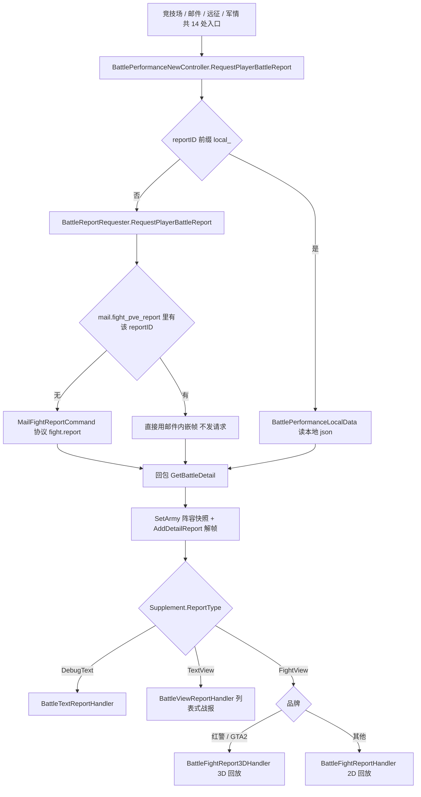
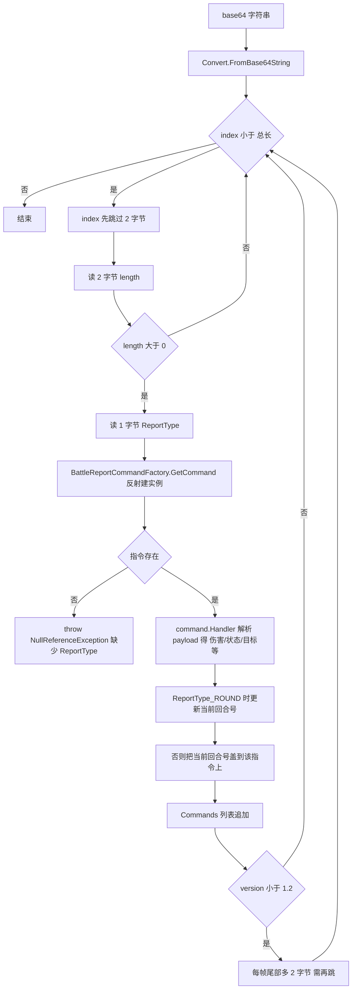
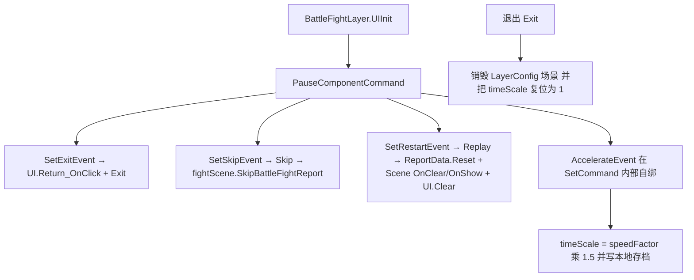

**■ 战报与回放系统使用说明（BattleReport / BattlePerformanceNew）**

> 项目: RedAlert_SuperFormation（红警 / 帝国 / KS 多品牌复用，SVN 无 git）
> 整理时间: 2026-09-21
> **先给结论（你问的那条）**：**竞技场回放、邮件战报回放、远征 / 军情 / 打怪 / 内城地宫的回放是同一类** —— 全部走唯一入口 `BattlePerformanceNewController.Instance.RequestPlayerBattleReport(...)` → `BattleReportRequester` → 按 `BattleReportType` 分派到 4 个 Handler（红警品牌走 3D 回放 `BattleFightReport3DHandler`）。**唯一例外**是联盟冠军赛的 `ACBattleReplayView`，那是另一套「对阵列表回放」，不经过本引擎（见 §五）。
> 核心代码: `IF/DayZClasses/view/popup/BattlePerformanceNew/` — **222 个 .cs / 13 516 行**（引擎全部：入口 + 取数据 + 帧解码 + 4 套表现 + 播放控制）
> 上层宿主界面: 旧战报 `view/popup/mail/MailBattleReportFormation_TileMap/`（33 文件 / 6 205 行）· 新邮件 `view/NewMail/`（102 / 13 870）· 竞技场 `GameActivityView/ArenaActivity/`（52 / 4 512）· 远征 `view/Expedition/`（24 / 3 305）· 冠军赛 `AllianceChampionship/`（45 / 6 211）
> 配套文档: [[邮件系统模块]]（战报是邮件的一种附件类型）· [[内城推格子模块]]（`MAIL_INNERMAP` 战报来源）· [[联盟领地与王座争夺]]（村庄/属地战报）· [[开发人员操作流程手册]]

---

**■ 一、模块总览**

**▍ 1.1 一句话定位**

战报系统 = **把服务器算好的战斗结果「重演」一遍**。服务器只给两样东西：**阵容快照**（`att` / `def`：谁、什么兵、多少兵、死了多少）和 **帧数据**（`detailReport`：一段 base64 字节流，里面是按时间顺序排列的战斗指令）。客户端 **不解算战斗**，只做：

1. **取数据**：按 `reportId` 拉包（协议 `fight.report`，`GloablNetGen.cs:370`），或直接用邮件里内嵌的 `fight_pve_report`（**不发请求**，`BattleReportRequester.cs:23-28`）。
2. **解码**：base64 → 字节流 → 逐条指令（`BattlePerformanceData.AddDetailReport:64`），指令经 `[BattleReportCommand]` 属性反射注册进 `BattleReportCommandFactory`（`:15-25`）。
3. **换成时间轴**：3D 侧把每条指令换算成带绝对时间的 `IBattleFightReport3DEventItem`（23 种，时长常量集中在 `BattleFightReportConfig`）。
4. **播放**：`BattleFightLayer` 建一个独立层（层名 `ReportBattle`）+ 场景 prefab + 双相机（分屏品牌），UI 用 `BattleFightReport3DView`，播放控制按钮在 `PauseComponent`。

**「竞技场回放」与「邮件战报回放」的差别只有两处**：**reportId 从哪儿来** 和 **看哪一方的视角 + 结果**（`SideType` / `result`）。引擎、解码、表现、播放控制**完全共用**。

**同一个结论还可以再扩大**：**内城地宫、地牢推关、打地块怪、军情怪、自由城建打怪**打完也是**直接跳这条 3D 回放**（经 `CCCommonUtils.PlayBattleFightReportByPveMailId(mailUid)`，见 §1.5）——即全项目「3D 战斗回放」只有这一个实现。

**▍ 1.2 三条正交维度（读代码先分清）**

| 维度 | 取值 | 决定 |
|---|---|---|
| **表现类型** `BattleReportType`（`BattlePerformanceNewController.cs:12-17`） | `DebugText` / `TextView` / `FightView` | 走哪套 Handler：DebugText→文字调试、TextView→`BattleViewReport`（列表式战报）、FightView→2D 或 3D 战斗回放 |
| **阵营视角** `SideType`（`BattlePerformanceTypeDef.cs:142-146`） | `AttackSide=1` / `DefenceSide=2` | 回放里哪半边是自己（`WatchType`），决定默认攻击目标、胜负文案、结算界面 |
| **数据来源** | ① 服务器 `reportId` ② **邮件内嵌 `fight_pve_report`** ③ 本地 `local_*`（`Config/LocalBattleReport/`） | ②命中则不發请求（离线可看）；③只在编辑器调试用（`BattlePerformanceNewController.cs:118-138`、`:199-200`） |

**▍ 1.3 规模统计（python 逐文件实测）**

| 项 | 行数 / 文件数 |
|---|---|
| **引擎总** `BattlePerformanceNew/` | **13 516 行 / 222 个 .cs** |
| ├ 3D 回放 `BattleFightReport3DReport/` | 5 506 / 71 |
| ├ 2D 回放 `BattleFightReport/` | 4 108 / 66 |
| ├ 列表战报 `BattleViewReport/` | 1 578 / 41 |
| ├ 调试文字战报 `BattleTextReport/` | 625 / 17 |
| └ 帧指令 `BattlePerformanceReportCommand/` | 572 / 19（22 个 Command 类 + 工厂 + 接口 + 属性） |
| 旧战报宿主 `MailBattleReportFormation_TileMap/` | 6 205 / 33 |
| 新邮件宿主 `view/NewMail/` | 13 870 / 102 |
| 竞技场 `ArenaActivity/` | 4 512 / 52 |
| 远征 `Expedition/` | 3 305 / 24 |
| 冠军赛 `AllianceChampionship/`（**另一套回放**） | 6 211 / 45 |
| FGUI 包 / 场景 | 回放界面包 `3D_battle`；场景 prefab `Battle/Scene/BattleReportRoot`（`BattleFightLayer.cs:122`）；层名 `ReportBattle`（`BattleReport3DHelper.cs:17`） |

**▍ 1.4 核心文件**

| 文件 | 行数 | 职责 |
|---|---|---|
| `BattlePerformanceNewController.cs` | 218 | **唯一总入口**（单例）：`RequestPlayerBattleReport`（2D/3D）、`RequestPlayer3DBattleReport`、`RequestLocalBattleReport`；`BattleReportSupplement` 结构定义 |
| `BattleReportRequester.cs` | 243 | **取数据 + 分派**：邮件内嵌命中 / 发 `MailFightReportCommand`；解析 `att/def/detailReport`；按 `ReportType` 选 Handler；品牌判定（红警/GTA2 → 3D） |
| `BattlePerformanceData.cs` | 317 | **战报数据模型 + 帧解码器**：`SetArmy`（阵容快照）/ `AddDetailReport`（字节流→指令）/ `GenerateDamageDetail`（伤害汇总） |
| `BattlePerformanceDecoderInfo.cs` | 104 | 单个单位的信息（阵营/类型/位置/兵种/等级/兵力/损失/杀敌）+ 显示名 |
| `BattlePerformanceTypeDef.cs` | 165 | 全部枚举：`ReportType`(22 值) / 攻击类型 / 状态 / 技能 / `SideType` / **`BATTLE_ROLE_TYPE`**(8 类角色) 等 |
| `BattlePerformanceReportCommand/` | 572 | 帧指令：`IBattleReportCommand` + `BattleReportCommandAttribute` + `BattleReportCommandFactory` + 22 个 `BattleReport*Command` |
| `BattlePerformanceHandler/BattleFight3DReport/BattleFightReport3DHandler.cs` | 234 | **3D 回放装配**：10 槽位角色 → 事件时间轴 → `BattleFightLayer.Open` |
| ├ `BattleFightReport3DView/` | 71 文件 | 回放界面（血条/技能/对话/优先级/暂停）+ `BattleFightScene`/`BattleFightLayer`（相机、场景、单位渲染） |
| ├ `BattleFightLogic/` | — | 表现逻辑：`UnitRender` / `FormationRender` / `UnitMono` / `BattlePerformChips` / `BattleFightDataManager` |
| ├ `BattleFightReport3DEventItem/` | 23 种 | 时间轴元素（转场/入场/移动/攻击/技能/受击/死亡/对话/救援/结果清场…） |
| ├ `BattleFightReport3DCommandHandler/` | — | 指令 → 事件的时间换算（每种指令一个 Handler） |
| └ `Components/PauseComponent.cs` | 187 | 播放控制：跳过 / 重开 / 退出 / 倍速（含 `Time.timeScale`） |
| `BattlePerformanceHandler/BattleFightReport/` | 4 108 / 66 | **2D 回放**（FightView 的非红警品牌分支）+ `BattleFightReportConfig`（时间轴常量） |
| `BattlePerformanceHandler/BattleViewReport/` | 1 578 / 41 | **列表式战报**（TextView）：兵力/羁绊/损失，不打动画 |
| `BattlePerformanceHandler/BattleTextReport/` | 625 / 17 | 纯文字调试战报 |
| `BattlePerformanceEditorTool.cs` / `BattleFightConfig.cs` | — | 编辑器调试工具 / 场景层配置（主相机 + 副相机 + 分屏品牌开关） |

**▍ 1.5 回放入口（直接调用 14 处 + 经 `PlayBattleFightReportByPveMailId` 间接 8 处 = 22 处，全部同一入口）**

| 模块 | 入口（file:line） | reportId 来源 | 说明 |
|---|---|---|---|
| **竞技场 · 战斗结果** | `ArenaBattleResultView/ArenaBattleResultBaseView.cs:107` | `battleRecord.ReportId` | 打完立即看回放；`side`/`result` 按「我是攻方吗」换算（`:97-106`） |
| **竞技场 · 挑战历史** | `ArenaChallengeHistoryView/ArenaChallengeHistoryItemComponent.cs:105` | `battleRecord.ReportId` | 历史列表里点某条看回放 |
| **邮件 · 3D 回放**（FightView） | `Ext/CCCommonUtils.cs:7965`（`PlayBattleFightReportByPveMailId`，`:8000` 发起请求）；按 mailId 调它的有：内城 `InnerMapAtomMonster.cs:143`、地牢 `DungeonAtomMonster.cs:121` / `DungeonChapterPanel.cs:194`、打地块怪 `FreeBuildTileMonsterAttackInfo.cs:216/237/281/298`、军情 `MilitaryAttackView.cs:361` | `MailPveCellInfo.reportUid` | 打完/领奖后直接看回放；**邮件内嵌帧优先（免请求）** |
| **邮件 · 列表式战报**（TextView） | `Ext/CCCommonUtils.cs:7934`（`PlayBattleTextReportByPveMailId`，`:7952` 发起请求，`supplement.PveText = true`）；唯一调用点 `MailBattleReportFormation_TileMap/FBPVEBattleDetailsCell.cs:48` | 同上 | ⚠️ **不是 3D 回放**，走 `BattleViewReport` 列表（与上一行是两个方法，别搞混） |
| **邮件 · 损失/英雄对比/恶魔攻城** | `NewMail/Component/FBPowerLossCell_New.cs:158`、`Mail_HerosCompareCom.cs:117/121`、`Mail_DemonsiegeCom.cs:102`、`Mail_UAVCompareCom.cs:280` | 同上 | 新版详情各区块自己的按钮 |
| **邮件 · 旧版战报界面** | `popup/mail/MailBattleReportFormation_TileMap/FBPowerLossCell.cs:120`、`FBRoundHeroResultCell.cs:66` | 同上 | 旧版宿主（当前不可达，见邮件文档 §五） |
| **远征** | `Expedition/ExpeditionView.cs:307` | 远征关卡 `reportUid` | 结算后回放 |
| **军情** | `controller/MilitaryIntelliController.cs:451` | `mailid` | 军情怪战报 |
| 编辑器/本地 | `BattlePerformanceNewController.cs:134-138`（`local_*` → `Config/LocalBattleReport/`） | 本地 json | 调试回放 |

**▍ 1.6 数据流**

```text
【入口】竞技场 / 邮件 / 远征 / 军情（14 处调用点）
   └─ BattlePerformanceNewController.RequestPlayerBattleReport(reportID, watchType, result, supplement, mail)  :116
        ├─ reportID 以 "local_" 开头 → BattlePerformanceLocalData（本地 json 两份）  :118/:207-216
        └─ BattleReportRequester.RequestPlayerBattleReport  :13
             ├─ ★mail.fight_pve_report 命中该 reportID → 直接用本地帧，不发请求  :23-28
             └─ 否则 MailFightReportCommand(reportId, mail.global) → 协议 fight.report  :31-43
                  └─ 回包 GetBattleDetail  :92
                       ├─ 解析 result.pointType / version / detailReport[]  :143-172
                       ├─ performanceData.SetArmy(def, att)（阵容快照）  :151
                       ├─ performanceData.AddDetailReport(base64 拼接串)（★帧解码）  :172
                       └─ 按 Supplement.ReportType 分派：
                            DebugText → BattleTextReportHandler.Create(...).Handler()          :196
                            TextView  → BattleViewReportHandler.Create(...)                    :202
                            FightView → IsRedAlert()/isGtaGang2() ? 3D : 2D                     :214-224
                                         3D → BattleFightReport3DHandler.Instance.Create(...)  :216/:220
                                         2D → BattleFightReportHandler.Instance.Create(...)    :223

【3D 回放装配】BattleFightReport3DHandler.Create  :213
   ├─ GeneRoleInfos：RoleConfig 10 槽位 → BattleFightRoleInfo[]（含默认攻击目标）  :57-107
   ├─ InjectPassiveBuffEvents（被动技能/光环补充）  :216
   ├─ GenEventItems：开场转场 → 回合提示 → 逐个入场 → 移动 → 逐条指令换算事件 → 清场  :109-185
   └─ BattleFightLayer.Instance.Open(reportData)  :229
        └─ EInit 协程：CameraInit → SceneInit(场景 prefab) → UIInit → 等 2 秒 → 开播  :76-87
```

---

**■ 二、流程图**

**▍ 2.1 入口 → 取数据 → 分派（同一入口，四种出口）**



**▍ 2.2 帧解码（`BattlePerformanceData.AddDetailReport:64-111`）**



**关键推论**：**帧格式是「客户端与服务器约定的二进制协议」**，版本号 `version` 只用来兼容「旧帧尾部多 2 字节」这一处差异（`:57-62`、`:106-107`）；**遇到未注册的 `ReportType` 直接抛异常**，不是跳过（`:93`）—— 所以「改帧格式 / 加新指令」必须**先发客户端，再让服务器发新帧**。

**▍ 2.3 3D 回放时间轴装配（`BattleFightReport3DHandler.GenEventItems:109-185`）**

```mermaid
flowchart LR
    A[开场转场 EventItem<br/>TransitionStayTime 1.5s] --> B[回合提示 EventItem<br/>文案 key 3000060078]
    B --> C[逐个单位入场 NormalRoleIn<br/>间隔 RoleInitNormalInterval]
    C --> D[隐藏转场 EventItem]
    D --> E[英雄入场动画 RoleInAnimation<br/>Hero_COMIN_AUDIO/FORMAT]
    E --> F[buff 事件 RoleAddBuff 已生成但未加入]
    F --> G[全体向前移动 MoveEvent<br/>EFFECT_MOVE_TIME 1.3s]
    G --> H[逐条帧指令换算<br/>BattleFightReport3DCommandHandlerFactory]
    H --> I[清场 ClearEventItem]
    I --> J[按 StartTime 排序后交给 BattleFightScene 播放]
```



**▍ 2.4 播放控制与退出（`PauseComponent` + `BattleFightLayer`）**



---

**■ 三、使用方法**

**▍ 3.1 新接一个「看战报」入口（6 步，照抄竞技场或邮件即可）**

```text
① 拿到 reportId：服务器数据里带的 `reportUid` / `reportId` 字段
     ⚠️ 不同模块字段名不同：邮件是 mail.reportUid（MailPveCellInfo）、竞技场是 battleRecord.ReportId
     （ArenaBattleRecordInfo.cs:11，来源协议 arena.act.get.history / arena.act.get.battlelist）
② 算「看哪一方 + 什么结果」：
     side   = 我是不是攻方（竞技场：battleRecord.Attacker.Player.Uid 比对，:97-106；
              邮件：MailController.isOwnAtk()，注意它是读全局 m_tileMapMailInfo 的无参重载）
     result = 0 胜 / 1 负 / 2 平（BattleResultNew，BattleReportMail_New.cs:15-21）
③ 组 supplement：new BattleReportSupplement(BattleReportType.FightView, 敌人类型)
     邮件走公共方法 CCCommonUtils.FillBattleReport(mail, supplement) 一次补齐
     （玩家头像/名字/奖励/敌人 NPC id，:8042 起）
④ 加开关判断（强烈建议照抄）：
     reportUid 非空 && (CCCommonUtils.checkIsOpenByKey("war_report") || gmFlag == 1)
     否则飞提示 Global._lang("105616") 并 return（邮件侧 4 处入口都这么做）
⑤ 调入口：BattlePerformanceNewController.Instance.RequestPlayerBattleReport(reportId, side, result, supplement, mail)
     · 传 mail 的入口 → 命中 fight_pve_report 时免请求（离线可看）
     · RequestPlayer3DBattleReport 只是「按 mail 自动生成 supplement 再走同一入口」（:128-132）
⑥ 验证：进回放看开场转场/入场/回合提示/伤害数字/结算是否齐全；退出后**确认游戏速度恢复正常**
     （倍速是全局 Time.timeScale，见 §五）
```

**▍ 3.2 新增一种帧指令（4 步，改协议级）**

```text
① BattlePerformanceTypeDef.cs 的 ReportType 枚举加值（注意：数值就是服务器帧里的 1 字节，顺序不能乱插）
② 写 Command 类实现 IBattleReportCommand，挂 [BattleReportCommand(ReportType.XXX)] 属性
     （反射注册在 BattleReportCommandFactory 静态构造，:12-26；漏属性 = 运行时报「缺失：XXX」）
③ 3D 侧再写一个对应 CommandHandler，把指令换算成 EventItem：
     BattleFightReport3DCommandHandlerFactory.GetCommand(指令类型) → Execute(result, c, roleInfos, Data, ref currentTime)
     并在需要新表现时加 IBattleFightReport3DEventItem（现成 23 种，参照 RoleAttack / SkillEffect / HeroTalk）
④ 顺序要求：**客户端先上，服务器后发新帧**。老客户端收到新 ReportType 会直接抛异常（:93）；
     老服务器发不出新帧时新客户端不受影响（工厂查不到就不加事件）
```

**▍ 3.3 战报补充信息 `BattleReportSupplement` 字段（`BattlePerformanceNewController.cs:61-110`）**

| 字段 | 作用 |
|---|---|
| `ReportType` | 三选一（DebugText / TextView / FightView）——直接决定走哪套表现 |
| `ReportEnermyType` | 敌人类型（None / Expedition / AreaMonster / MilitaryMonster / RESOURCE_FIGHT_FB=52 / ATTACKMONSTER_FIGHT_FB=54 / CONTRAST_WORLD_BOSS=59，值是 `MailType` 数值） |
| `DefenserId` | 防守方 NPC id（怪物名/图标查表用，`:181/:187/:7998`） |
| `Attacker` / `Defenser`（`BattleReportPlayerInfo`） | 头像 url + 战力（结算界面显示） |
| `Rewards` | 掉落/奖励列表（结算界面飞奖励） |
| `PveText` | 是否列表式战报（TextView 分支用） |
| `BackgroundController` / `ViewController` / `SkipResultPanel` | 战斗背景 / 视角档 / 跳过结算面板 |
| `ContinueBattle` / `AutoNext` | 连续战斗 / 自动下一关（远征用） |
| `BattleType` | PVE / PVP |
| `Default`（静态） | TextView + None 的兜底 supplement |

**▍ 3.4 调试手段**

| 手段 | 做法 |
|---|---|
| **本地回放**（不用服务器） | reportId 传 `local_XXX` → 读 `Config/LocalBattleReport/{0}FightRequester` 与 `...FightDetail` 两份 json（`BattlePerformanceNewController.cs:118-138/199-216`） |
| **编辑器自动存下一场** | `BattleReportRequester.cs:73-87`：`BattlePerformanceEditorTool.AutoSaveNextBattle` 为真时把战报写盘 —— ⚠️ **硬编码路径 `d:\DemoFightRequester.json` / `d:\DemoFightDetail.json`**，没有 D 盘会写失败 |
| **编辑器快速回放** | `AutoSaveNextBattle` / `QuickTestBattle`（用缓存帧替换真实帧，`BattlePerformanceData.cs:66-71`） |
| **日志锚点** | `EventItems Count : {n}`（`BattleFightLayer.cs:71`，回放开始）、`BATTLE OVER!`（`:105`，播完）、`MailType --------`（`BattlePerformanceNewController.cs:165`）、`PVP战斗邮件`/`野怪战斗邮件`（邮件侧分派） |
| **抓包过滤** | 战报帧协议 `fight.report`（`GloablNetGen.cs:370`）；竞技场历史 `arena.act.get.history` / `arena.act.get.battlelist`（`ArenaActivity/Commands/`） |
| **开关** | `war_report`（关掉或非 GM 时全部入口飞提示 105616）；`BattleFightReport3DHandler`/`BattleFightLayer` 的日志用 `LogCommon.LogError`，正式包也能看到 |
| **直接看帧** | `BattlePerformanceData.Commands` 是解码后的指令列表（含 `Round`），断点看它比看 base64 快 |

---

**■ 四、配表与常量事项**

1. **`BattleFightReportConfig`（`BattlePerformanceHandler/BattleFightReport/BattleFightReportView/BattleFightReportConfig.cs`）是回放节奏的唯一常量表**：`BASE_SPEED_RATE = 1.95` / `TransitionStayTime = 1.5` / `RoundChangeTime = 1.5` / `RoleAttackAnimationTime = 2` / `RoleSkillAnimationTime = 3.5` / `RoleDieAnimationTime = 0.3` / `EFFECT_MOVE_TIME = 1.3` / `REPLAY_COMMON_DELAY_BEFORE_RESULT = 3` / `REPLAY_SKIP_BUTTON_ENABLE_LEVEL = 2` / `REPLAY_SPEED_BUTTON_ENABLE_LEVEL = 1` 等 60+ 项（含各动画名与音频名格式串）。**改「回放快慢/演出时长」改这张表，不要散着改代码**。
2. **`BattleFightConfig`（MonoBehaviour，`BattlePerformanceNew/BattleFightConfig.cs`）是场景层配置**：`mainCamera` / `aidCamera` + `SplitScreen`（`isGtaGang2()` 品牌才分屏）。
3. **10 个出战槽位是硬编码的**（`BattleFightReport3DHandler.cs:38-50`）：`RoleConfig` 把 `阵营_角色类型_位置` 映射到槽 0~9 —— `1_8_0`(攻方无人机)→槽0、`1_7_1`~`1_7_3`(攻方英雄)→槽1-3、`2_8_0`→槽5、`2_7_1`~`2_7_3`→槽6-8、`2_3_1`(守方箭塔)→槽9；**槽4 空着**（注释：以前是给箭塔的，现在是飞机）；`roleInfos[9] = null` 写死（陷阱槽废弃，`:60`）。3D/2D/列表三套 Handler **各有一份同样的 RoleConfig**，改槽位要**三处同步**（`BattleFightReportHandler`、`BattleViewReportHandler.cs:9-21`）。
4. **回放所在层与场景资源**：层名 `ReportBattle`（`BattleReport3DHelper.cs:17`）；场景 prefab `Battle/Scene/BattleReportRoot`（`CCNodeCache` 取，`BattleFightLayer.cs:122`）；回放界面 FGUI 包 `3D_battle`（`pauseView` / `skillShow` / `HPtag` / `num_generalHurt` / `label_state`，`BattleFightReport3DView.cs:48/108`、`BattleFightReport3DView/HealthComponent.cs:103/132`）。
5. **速度参数**：`PauseComponent.baseSpeed = 1.5f`（`:67`）；加速按钮 `speedFactor = speedFactor ^= 3`（`:101`，按位异或 → **只在 1 与 2 之间切**，不是注释暗示的 1×/3×），实际时间倍率 = `speedFactor × 1.5`（即 **1.5× / 3.0×**）；倍率写本地存档 `BattleFightSpeedFactorLocal`（`:94/110-118`）。2D 侧倍率走 `BattleFightReportView.cs:48/52`，同样以 `BASE_SPEED_RATE` 为基准。
6. **`Time.timeScale` 的复位点只有 2 处（3D）**：`BattleFightLayer.Exit:96` 与 `BattleFightScene.cs:197`；2D 侧在 `BattleFightReportView.cs:212/372`（暂停用 `:324` 设 0）。见 §五。
7. **怪物/防守方名字的查表顺序**（`BattlePerformanceData.AnalyseName:204-269`）：`Field_monster` → `Secret_volume_monster` → `GeneralBossTower` → `GeneralBossPersonal` → `GeneralBoss`，全部查不到才用玩家名；同时用表里的 `icon` 覆盖头像。
8. **单位信息补全**：兵种走 `Arms` 表（`BattlePerformanceDecoderInfo.Create:39-43` 取 `arm_1` / `arms_type`）；英雄走 `FreeBuildHeroController.getHeroXMLInfoByHeroId`；战机（`Drone`）取 `id` / `level`；箭塔取 `armyId` / `level`（`BattlePerformanceData.cs:151-180`）。
9. **邮件内嵌战报是独立数据源**：`MailInfo.fight_pve_report`（`MailInfo.cs:389`，解析于 `:990`）—— 命中即免请求，`reportUid` 为空或开关关闭则看不到回放。**同一场战斗「有人能看有人看不了」先查这个分支**。
10. **品牌决定 2D 还是 3D**：`IsRedAlert()` / `isGtaGang2()` → 3D（`BattleReportRequester.cs:214-224`）；其余品牌走 2D。改表现前先确认当前构建品牌。
11. **`BattleResultNew`**（`BattleReportMail_New.cs:15-21`）：`RESULT_WIN=0` / `RESULT_LOOSE=1` / `RESULT_DRAW=2` / `RESULT_NOTWIN=3` —— 回放入参 `result` 的 0/1/2 就是它（与 `MailStatus`、`BattleResultNew` 易混，注意区分）。
12. **剧本/解锁硬编码**：`"910034"` 这个 NPC 会让回放走「解锁资源点」特殊流程（`BattleReportRequester.cs:119-135`，含整段 demo 帧数据），配套 `CCUserDefault` 键 `UnlockRes` / `UnlockAreaId`（`:121/161/182-189`）。

---

**■ 五、注意事项（已知坑）**

| 级别 | 问题 | 位置 |
|---|---|---|
| 🟠 | **遇到未注册的 `ReportType` 直接抛异常**（不是跳过）：`throw new NullReferenceException("缺少：" + reportType)` → 帧格式新增指令而客户端未更新时，**整场回放崩**，表现为「点看战报没反应/闪退」 | `BattlePerformanceData.cs:93` |
| 🟠 | **倍速改的是全局 `Time.timeScale`**（不是回放局部速度）：`PauseComponent.SycSpeedLocal:116` 每次打开回放就把全局速度设成 1.5× 或 3×，复位只在 `BattleFightLayer.Exit:96` 与 `BattleFightScene.cs:197`。若回放不是走这两个出口关闭（外部切场景/异常/被中断），**全局时间倍率会残留** → 现象是「整个游戏像被加速」 | `PauseComponent.cs:99-118` |
| 🟠 | **暂停按钮实际是「跳过」**：`Pause()` 里真正的暂停（`Time.timeScale = 0`）整段被注释，改为执行 `SkipEvent`（`:138-152`），而 `BattleFightLayer.cs:184` 把 `SkipEvent` 绑到 `Skip`（跳过整场）。UI 上那块按钮的语义要与策划对齐后再改 | `PauseComponent.cs:138-152`、`BattleFightLayer.cs:184/190-194` |
| 🟠 | **重复点同一场回放无反应**：`BattleFightLayer.Open:64-65` 若当前 `ReportData.ReportId` 相同则直接 `return`（防重入），但**不会给任何提示** | `BattleFightLayer.cs:64-65` |
| 🟠 | **`maxForces == 0` 的单位在回放里直接消失**：`AddArmyInfo` 里 `continue` → 该槽位在时间轴上不存在（不是显示 0 兵，而是整队不见） | `BattlePerformanceData.cs:140-141` |
| 🟠 | **邮件侧视角判定依赖全局 `m_tileMapMailInfo`**：入口先把它设成当前邮件（`CCCommonUtils.cs:7941/7976`），再调无参 `isOwnAtk()`。多入口并发/嵌套打开时可能算成对方视角（与 [[邮件系统模块]] §五 的全局可变状态是同一条） | `CCCommonUtils.cs:7941/7949`、`MailController.cs:3131` |
| 🟠 | **编辑器专用写盘代码在正式分支内**：`＃if UNITY_EDITOR` 里直接写 `d:\DemoFightRequester.json`（硬编码盘符，无 try/catch） | `BattleReportRequester.cs:73-87` |
| 🟡 | **`BattleFightReport3DData.GetRoleByIndex()` 是空实现**（直接 `return null`）—— 有调用点就会空引用 | `BattleFightReport3DHandler.cs:28-30` |
| 🟡 | **buff 事件生成了但没加入时间轴**：`GenEventItems` 里 `BattleFightReport3DRoleAddBuffEventItem` 那段的 `result.Add(e)` 被注释 → 开场的被动 buff 提示实际不播 | `BattleFightReport3DHandler.cs:148-159` |
| 🟡 | **冠军赛 `ACBattleReplayView` 是另一套**：只回放「对阵 / 胜场列表」（`ACBattleReplayInfo` / `ACBattleReplayPlayerInfo` / `ACBattleReplayFrameInfo`，数据来自 `AC_WarManager.AC_Replay_Dict`），**不经过 `BattlePerformanceNew`**。别把它当竞技场回放改 | `GameActivityView/AllianceChampionship/ACBattleReplay*.cs`、`controller/AllianceChampionship/AC_WarManager.cs:25/243` |
| 🟡 | **同一套槽位表在三处重复**（3D / 2D / 列表 各一份 `RoleConfig`），改一处另外两处不会跟着变 | `BattleFightReport3DHandler.cs:38-50`、`BattleFightReportHandler.cs`、`BattleViewReportHandler.cs:9-21` |
| 🟡 | **`BattleReportRequester` 是 `new` 出来的普通对象**（不是单例，`BattlePerformanceNewController.Initialize:143`），但内部 `WatchType/ReportID/Result/Supplement` 是**实例字段且整场唯一** → 连续快速请求两场回放会互相覆盖（同 `BattleFightLayer` 的 ReportId 防重入一起看） | `BattleReportRequester.cs:8-11`、`BattlePerformanceNewController.cs:143` |
| 🟡 | `BattleTextReportHandler` 在 FightView/TextView 分支里的调用被 `＃if UNITY_EDITOR` 包着（编辑器内可切换文字战报，正式包不可） | `BattleReportRequester.cs:199-201/206-213` |
| 🟡 | 日志噪声：回放正常流程用 `LogCommon.LogError` 打（`EventItems Count :`、`BATTLE OVER!`、`MailType ----`） | `BattleFightLayer.cs:71/105`、`BattlePerformanceNewController.cs:165` |
| 🟡 | `BattleFightReport3DData.Reset()` 只重置 `LiveTroop`，不清事件时间轴；「重开」靠 `BattleFightLayer.Replay:204-209` 再跑一遍 `OnClear/OnShow/UI.Clear` | `BattleFightReport3DHandler.cs:19-26`、`BattleFightLayer.cs:204-209` |

**「回放不对」排查顺序**

```text
1. 点了没反应 → ① war_report 开关 / gmFlag 是否为 1（关掉只会飞提示，很多人以为是 bug）
                ② reportUid 是否为空
                ③ 是不是同一场正在播（BattleFightLayer.Open 的同 ReportId 早退，:64）
2. 一直转圈 / 卡在加载 → 协议 fight.report 是否回包；回包解析里 performanceData 是否被填上
   （看日志 EventItems Count 有没有打出来，没打出来说明没走到 3D Handler）
3. 能进但整场闪退/报「缺失：XXX」 → 帧里有客户端未注册的 ReportType（BattlePerformanceData.cs:93），
   属于客户端版本落后于服务器帧格式
4. 单位少了一队 → 该队 maxForces 为 0（:140 被跳过）；或 RoleConfig 槽位没覆盖该 roleType
5. 名字/头像不对 → AnalyseName 的 5 张表查表顺序（§四-7）；或 Supplement 没 SetAttacker/SetDenfenser
6. 退出后游戏速度不对 → 全局 Time.timeScale，查是否走了 BattleFightLayer.Exit（§五 🟠 倍速）
7. 同一个功能有人能看有人不能 → 邮件内嵌帧分支（mail.fight_pve_report）、或品牌分支（红警 3D vs 其他 2D）
```

---

**■ 六、相关文档**

- 同目录姊妹模块：[[邮件系统模块]]（战报是邮件的附件；`reportUid` / `fight_pve_report` 从这里来）· [[内城推格子模块]]（`MAIL_INNERMAP=90` 战报由它触发）· [[联盟领地与王座争夺]]（`MAIL_VILLAGE` / `MAIL_MANOR_FIGHT_FB` 战报）· [[大地图缩放分级显示]]（回放层与地图层的关系）· [[开发人员操作流程手册]]
- 交汇点（已核实）：
  - 邮件 → 回放：`CCCommonUtils.cs:7934`（`PlayBattleTextReportByPveMailId` → 列表式战报）/ `:7965`（`PlayBattleFightReportByPveMailId` → 3D 回放）/ `:8032`（按 uid 的重载，内部转 :7965）/ `:8013`（`DeleteSpecialPveMail`）/ `:8042`（`FillBattleReport` 补玩家·奖励·敌人）；两处都含 `war_report` 开关与 `105616` 提示
  - 内城/地牢/打怪/军情 → 回放：`InnerMap/atom/InnerMapAtomMonster.cs:143`、`view/DungeonMap/atom/DungeonAtomMonster.cs:121`、`view/DungeonMap/ui/DungeonChapterPanel.cs:194`、`controller/freebuild/FreeBuildModel/FreeBuildTileMonsterAttackInfo.cs:216/237/281/298`、`view/MilitaryIntelligence/MilitaryAttackView.cs:361`（全部走 `PlayBattleFightReportByPveMailId`）
  - 竞技场 → 回放：`ArenaBattleResultBaseView.cs:97-107`、`ArenaChallengeHistoryItemComponent.cs:105`；战报 id 来自 `ArenaBattleRecordInfo.Parse:20`（协议 `arena.act.get.history`）
  - 结算界面 → 回放/分享：`BattleFightReportResultWinView.cs:173` / `BattleFightReportResultFailView.cs:162`（按 `useNewPvpMail` 决定进新版邮件战报还是直接回放）、`MailBattleReportView.onShareClick:274-281` → `ChatController4New.Instance.ShareMail(m_info)`（战报分享到聊天，配合 `mail.like` / `mail.like.share`）
  - 远征 → 回放：`ExpeditionView.cs:307` + `ExpeditionFightReportResultWinView/FailView`（消费 `BattlePerformanceData`）
  - 军情 → 回放：`MilitaryIntelliController.cs:451`
  - 引导 → 回放：`BattleFightLayer.cs:98`（回放胜利且 `ReportData.Result` 真时 `GUIDE_ON_TRIGGER`）
- 本次未展开（各够一篇）：**远征系统**（`view/Expedition/`，含 `IExpeditionManager` 与挂机/跳过等级限制）· **竞技场活动体系**（`ArenaActivity/`：赛制/榜单/奖励/编队）· **联盟冠军赛**（`AllianceChampionship/`：另一套回放与对阵列表）· **战斗本身**（`BattleProtect/` 真打流程，与本回放不是一回事）
