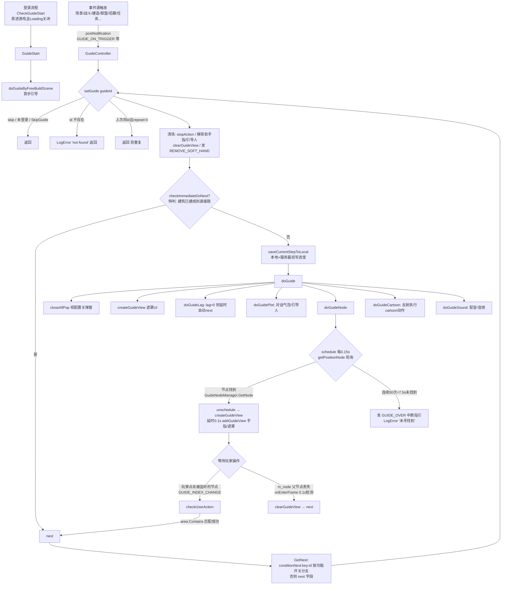
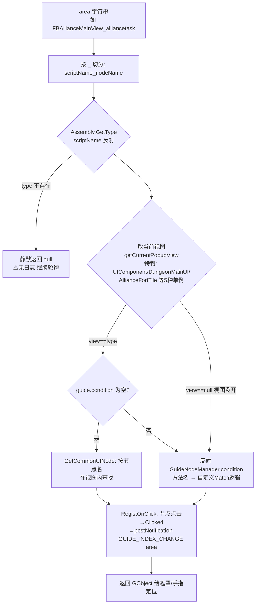

**■ 指引模块使用说明（Guide System）**

> 项目: RedAlert_SuperFormation（红警/帝国/KS 多品牌复用）
> 整理时间: 2026-09-09
> 核心代码: `Assets/DevCodeFM/IF/DayZClasses/controller/GuideController.cs`（3078 行主状态机）
> 配套文档: 问题诊断与修复方案见 `docs/fix/guide_system/fix-plan.md`（项目内）

---

**■ 一、模块总览**

指引模块是**配置驱动的引导状态机**：策划在引导表里配 626 个步骤（id→next 链表），代码按步骤表驱动 UI 遮罩、手指、对话、镜头、特效、音效，并监听玩家操作推进流程。

**▍ 1.1 核心文件**

| 文件 | 行数 | 职责 |
|------|------|------|
| `IF/DayZClasses/controller/GuideController.cs` | 3078 | **主状态机**：setGuide→doGuide→next 流转；20+ 事件监听；节点轮询查找；进度保存/跳过 |
| `IF/DayZClasses/controller/Guide/GuideTriger.cs` ⚠️类名拼写缺r | 1715 | **105 个触发动作**（跳镜头/开门/播CG/发道具…），按配置 `method`/`cartoon` 字段反射调用 |
| `IF/DayZClasses/controller/Guide/GuideNodeManager.cs` | 496 | **节点匹配**：area 字符串 → 反射找到当前视图 → 取目标 UI 节点（`condition` 字段二次反射到具体 Match 方法） |
| `IF/LocalConfig/GuideConfig.cs` | 363 | **配置加载**（静态构造一次）+ Guide POJO（40+ 字段）+ GuideSteps 枚举 |
| `IF/DayZClasses/view/guide/GuideView.cs` / `GuideViewWithBG.cs` | - | 遮罩/手指/对话气泡 UI（FairyGUI） |
| `IF/DayZClasses/controller/Guide/GuideSoundController.cs` | 222 | 引导配音（dub）/音效（soundEffect） |
| `IF/DayZClasses/controller/GuideSocket.cs` | 50 | 场景调试组件（见 §五 调试） |
| `DebugHelper/GuideKeyCommand.cs` | 16 | 剪切板调试指令 |

**▍ 1.2 配置表**

| 表 | 位置 | 内容 |
|----|------|------|
| 主指引表 | 热更 `config/game/guide`（JSON，id→Guide 字典）；DataAtlas 镜像 `ResDepends/default/Config/DataAtlas/Guide.json`（626 步） | 全部步骤定义 |
| 换皮表 | `config/game/guide2` | GTA/帝国/KS 品牌用（加载分支见 §六 注意事项①） |
| 阶段表 | `config/game/guideStage` | GuideStage：stage→起始 guideid 映射（`GuideConfig.GetStageStartId`） |

**加载时机**: `GuideConfig` 静态构造，**首次访问时**加载（不是启动时！首次访问若早于登录信息就绪，会按错误的品牌分支加载——见注意事项①）。

---

**■ 二、流程图**

**▍ 2.1 主流程（状态机）**



**▍ 2.2 节点匹配流程（doGuideNode → GetNode）**



**▍ 2.3 进度保存与恢复**

```
setGuide → saveCurrentStepToLocal(saveId)
   ├─ 本地: CCUserDefault key = "{uid}_GuideStep"
   ├─ 服务器: sendSaveGuide(GUIDE_STEP, saveId)  ← 断线重连/换设备恢复
   └─ flush 立即落盘
getCacheGuideId: 本地缓存 → 本地存储 → 服务器记录 三级回退
跳过: ArchivedData.Instance.SkipGuide == true → setGuide 直接 return（ignoreSkip 参数可强制）
```

---

**■ 三、使用方法**

**▍ 3.1 配置一步指引（策划侧）**

在 `config/game/guide` 加一条（id 建议 8 位数字，与现有段位不冲突）：

```json
"20004099": {
  "next": "20004100",        // 下一步id；空=结束
  "area": "FunBuildView_BUILDTIP2",  // 定位格式: 视图类名_节点名（见3.2）
  "enforce": "1",            // 1=强制（全屏遮罩+只能点目标）
  "click": 1,                // 需要点击次数（0→按3次；dark_guidance 开关开→100次）
  "clickCntDelay": 1.0,      // 点击判定延迟秒
  "showFinger": "1",         // 显示手指
  "plot": "",                // 底部对话气泡文本（语言key）
  "sidePlot": "",            // 引导人旁白（显示引导人NPC）
  "lag": 0,                  // >0 则延时秒后自动 next（无人工操作步骤）
  "method": "",              // 进入该步时反射执行 GuideTriger 的动作方法名
  "cartoon": "",             // 进入该步时反射执行的 cartoon 动作（CG/特效类）
  "closeAllPop": "1",        // 1=关普通弹窗 2=关所有
  "condition": "",           // 非空=节点查找走 GuideNodeManager 同名方法（反射）
  "conditionNext": "key:id", // 按功能开关分支 next（key 命中则走 id）
  "mark": "",                // 进度存档点：非空且非"1"时以该值存档
  "repeat": 0,               // 1=允许重复进入同一步
  "jump": ""                 // 软引导被打断后跳转的id
}
```

**最小可用配置**只需：`id` / `next` / `area`（或 `lag>0` 自动推进）。

**▍ 3.2 area 格式与节点定位**

- 格式：`视图类名_节点名`（如 `FBAllianceMainView_alliancetask`），按 `_` 切分
- 视图解析规则（`GuideNodeManager.GetNode`）：
  - 默认取**当前打开的弹窗视图** `getCurrentPopupView()`，要求类型 == 反射出的类
  - 5 个特例单例：`UIComponent` / `DungeonMainUI` / `AllianceFortTile` / `TerritoryBannerTile` / `TerritoryFactoryTile` / `VillageTile`（按 area 字符串包含判断）
  - 视图未打开时 → 走 `condition` 方法（可自己造节点，如 `FreeBuildTileTouchMatch` 在场景里定位地块）
- **节点没找到不会报错**，每 0.15s 重试，**50 次（7.5s）后中断整条指引**（LogError "未寻找到"）。配表前务必确认目标界面在该步一定会打开。

**▍ 3.3 触发引导（开发侧）**

| 场景 | 写法 |
|------|------|
| 事件触发（最常用） | 业务代码 `postNotification(Global.GUIDE_ON_TRIGGER, "guideId")` → GuideController 自动 setGuide |
| 直接触发 | `GuideController.getInstance().setGuide("guideId")` |
| 指定节点点击推进 | 业务点击处 `postNotification(Global.GUIDE_INDEX_CHANGE, "与area匹配的值")`（见注意事项④，**Contains 子串匹配**） |
| 通知型引导 | `postNotification(Global.GUIDE_NOTIFY_TRIGGER, new object[]{ (int)NotifyGuideType.xxx, 参数 })` |
| 软引导打断跳转 | `postNotification(Global.BREAK_SOFT_GUIDE, "匹配串")` |

**触发入口全量**：GuideController.onEnter 注册了 20+ 监听（场景切换完成、世界地块创建、战斗结果、招募结果、建筑升级开始/结束、联盟迁城确认、小游戏胜负、碰撞触发等），新增触发源推荐走 `GUIDE_ON_TRIGGER` 通知而不是改 GuideController。

**▍ 3.4 新增触发动作（GuideTriger）**

1. 在 `GuideTriger.cs` 加 `public void 方法名()`（参数必须无参——反射按 `new object[]{}` 调用）
2. 配置表对应步骤填 `method`（普通动作）或 `cartoon`（CG/特效类）
3. ⚠️ 方法名与配置**纯字符串反射关联**：改名必同步改表，否则运行时才暴露（cartoon 配错目前会 NRE，见 fix-plan P0-1）

**▍ 3.5 自定义节点查找（condition）**

area 找不到节点时，配置 `condition` 字段 = `GuideNodeManager` 中的**公有方法名**（反射调用，参数为 `object[]{view, areaStr}`），自行返回节点：

```csharp
// 现有例子: FreeBuildTileTouchMatch / FBAllianceMainViewMatch / BattleViewCellMatch 等 13 个
public GObject XxxViewMatch(object[] parameters) { ... return 场景/视图内的目标节点; }
```

**▍ 3.6 调试**

| 手段 | 用法 |
|------|------|
| 剪切板跳步 | 复制 guideId 到系统剪切板 → 触发 `GuideKeyCommand` 调试指令（DebugCommand 机制）→ 直接 setGuide |
| 游戏内工具 | `GameDebugTools` 内有 setGuide 快捷入口（含 `area1_attack_10092` 示例） |
| 日志开关 | 场景放 `GuideSocket` 组件勾选 `ShowLogInConsole` → 每次 setGuide 打 "current guideId" |
| 跳过引导 | `ArchivedData.Instance.SkipGuide = true`（setGuide 全拦截，`ignoreSkip=true` 可绕过） |
| 本地存档开关 | `GuideSocket.saveGuideLocal` |

**常用调试手法**：弱网/时序问题先用剪切板跳步定位到卡住的那一步，再查该步 area 对应的界面是否真的打开了（7.5s 超时中断的日志关键词："未寻找到"）。

---

**■ 四、关键机制速查**

| 机制 | 说明 |
|------|------|
| 双套引导系统并存 | `GuideController`（本文主角）+ `REDALERT.GuideNewController`（DailyActiveController 处按品牌二选一，:704-706），新玩法注意确认走哪套 |
| 硬编码阶梯链 | 砍树(60001020)→杀羊(60001077)→杀鹿(60002010) 在 `getLadderGuide` 硬编码，丢包坏档时按资源点存在性跳步（GuideController:700-745） |
| 节点查找轮询 | 0.15s × 50 次 = 7.5s 超时中断（`limitCount=50`，GuideController:122） |
| 帧轮询 | `onEnterFrame` 0.1s 永久运行（willGuide 延迟引导 + 节点父级丢失检测）——常驻开销 |
| 动作 tag | 定时动作 tag = `atoi(guideId)`，切步时 stopActionByTag 清理（⚠️ 非数字 id 都变 tag 0，见 fix-plan P2-9） |
| RTL 适配 | 手指特效 `fingerEffectBranch`（0=通用 1=LTR 2=RTL）+ `fingerFlip`/`fingerRotation`；界面列表 RTL 时反转 |
| 进度同步 | 本地 CCUserDefault + 服务器 GUIDE_STEP 双写；`mark` 字段控制存档点粒度 |
| 多品牌 | 红警 / 帝国 / KS / GTA2 共用代码，`＃if RED_ALERT` / `＃if GTA_GANG` 分支 + guide/guide2 双表 |

---

**■ 五、配表事项（重点）**

1. **area 必须真实可达**：配表前确认该步骤时目标界面一定会打开且节点名与 FairyGUI 组件名一致（区分大小写）。找不到 = 7.5s 后中断整条指引，**新手会卡在中间步且无任何玩家可见提示**。
2. **反射字段三处全是字符串陷阱**：`area`（视图类名）、`method`/`cartoon`（GuideTriger 方法名）、`condition`（GuideNodeManager 方法名）——**代码改名必须同步改表**。当前无任何启动期校验（已登记 DEBT-01），配错只能运行时发现。
3. **id 建议 8 位数字**：`stopActionByTag(atoi(id))` 依赖数字 id 做定时动作清理；`"skip"`/空串/超长 id 会产生 tag 0 碰撞或截断。
4. **next 链闭环**：`next` 指向的 id 必须存在；`conditionNext` 格式严格 `key:id` 冒号分隔（key 走 `CCCommonUtils.checkIsOpenByKey` 功能开关）。
5. **repeat 语义**：repeat=0（默认）时同一步连续 setGuide 会被防重拦截——想重入的步骤（如反复触发的软引导）必须 repeat=1。
6. **mark 存档点**：关键断点（长流程中段）配 mark 防止中途退出后从头再来；mark 值会作为本地+服务器存档内容。
7. **enforce + click 组合**：enforce=1 全屏遮罩只留目标孔；click=0 会按 3 次处理（代码兜底）；需要"点完自动进"就配 lag>0 而不是靠 click。
8. **closeAllPop 慎用 "2"**：会把特殊弹窗也关掉，可能打断正在进行的付费/战斗流程。
9. **软引导（soft）**：soft=1 时不建遮罩视图，只用手指提示；配 `jump` 字段定义被打断后的跳转步。
10. **换皮项目**：GTA/帝国/KS 用 `guide2` 表——**改表前确认改的是哪个文件**（加载分支逻辑目前有两个判断条件不一致，见 fix-plan P1-8，修复前以实际品牌构建为准）。

---

**■ 六、注意事项（已知坑）**

> 完整问题清单（12 项，带 file:line 与修复任务）见 `docs/fix/guide_system/fix-plan.md`，此处列与日常使用最相关的：

1. **配置缺失是静默的**：`GuideConfig.Get(不存在的id)` 不返回 null 而是返回一个**全局共享的空 Guide**——流程无声终止，无日志。排"引导没反应"问题时先查 id 拼写/表里有没有。（修复中：FIX-001 加日志）
2. **引导表加载失败 = 全崩**：guide 文件损坏/热更包不完整时 `config=null`，之后所有 Get 都 NRE。热更发布后必验引导首步。
3. **cartoon 配错会崩**：`TriggerByCartoon` 方法不存在时直接 NRE（GuideTriger.cs:36）。（修复中：FIX-002）
4. **操作判定是子串匹配**：`checkUserAction` 用 `area.Contains(通知值)`——通知值 `"Shop"` 能误触发 area `"HeroShop_xxx"` 的步骤。业务侧发 `GUIDE_INDEX_CHANGE` 时**用完整 area 值**，别发短串。（修复中：FIX-003 改精确匹配）
5. **7.5s 超时是硬阈值**：弱机/弱网下界面加载 >7.5s 的引导步骤会被随机中断。配表时避免"依赖大界面加载完成"的步骤，或拆成前置等待步（lag）。
6. **GuideController 是常驻 CCNode 单例**：20+ 事件监听在 onEnter 注册、purgeData 才清理（依赖 removeFromParent + Safe 通知中心语义）——不要在非 GameController 生命周期外手动创建/销毁。
7. **静态配置首次访问时机**：`GuideConfig` 静态构造依赖 `LoginInfo.pureModel` 选表分支——引导表在登录前被任何代码提前访问（如编辑器预加载）会锁定错误分支。
8. **双套引导系统**：新玩法先确认走 `GuideController` 还是 `GuideNewController`（品牌二选一），配表前问清。
9. **剪贴板跳步会写进度**：`GuideKeyCommand` 跳步会走 saveCurrentStepToLocal——**调试后记得把进度档清掉**，否则污染本地新手状态。
10. **环境坑**：本机 ripgrep 静默失效（对已知存在的字符串也返回无匹配），代码检索用 `grep -rn --include="*.cs"`。

---

**■ 七、相关文档**

- 问题诊断与修复方案: `E:\WorkSpace\RedAlert_SuperFormation\docs\fix\guide_system\fix-plan.md`
- 测试策略: `E:\WorkSpace\RedAlert_SuperFormation\docs\fix\guide_system\test-strategy.md`
- 姊妹模块（同类架构、同类问题）: 活动组模块 `docs/fix/activity_group/fix-plan.md`
