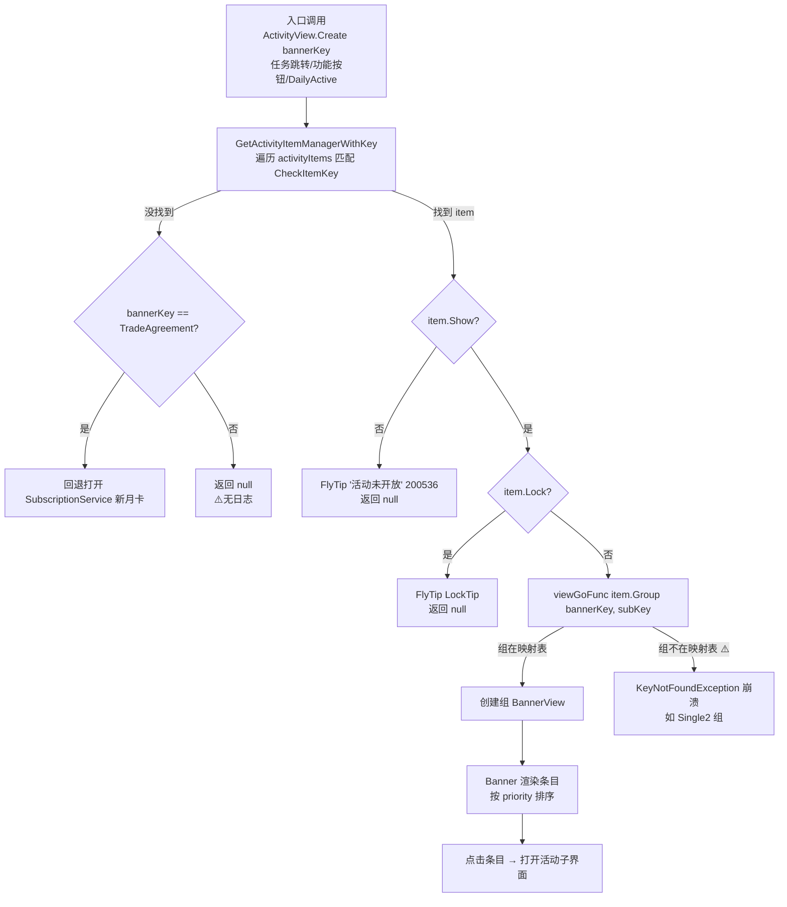
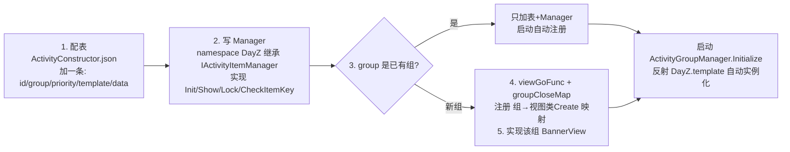

# 活动模块使用说明（Activity ToolKit）

> 项目: RedAlert_SuperFormation（红警/帝国/KS 多品牌复用）
> 整理时间: 2026-09-09
> 核心代码: `Assets/DevCodeFM/IF/DayZClasses/view/popup/ActivityViewToolKits/`
> 配套文档: 问题诊断与修复方案见项目内 `docs/fix/activity_group/fix-plan.md`

---

## 一、模块总览

活动模块是**配置驱动的活动分组框架**：策划在 `ActivityConstructor` 表里注册活动（组/模板/优先级），代码反射实例化各活动的 Manager，按组聚合成 Banner 入口视图，统一处理展示判定、锁定提示、刷新与跳转。

### 1.1 核心文件

| 文件 | 职责 |
|------|------|
| `ActivityViewToolKits/ActivityGroupManager.cs` (91) | **活动注册中心**（Singleton）：启动时读 `ActivityConstructor` 表，反射 `DayZ.{template}` 创建 Manager 实例，按 `group` 分组、按 `priority` 排序 |
| `ActivityViewToolKits/IActivityItemManager.cs` (⚠️是抽象基类不是接口) | 所有活动 Manager 的基类：`Init(id,priority,data)` / `Group` / `Priority` / `Show` / `Lock` / `LockTip` / `CheckItemKey` / `ParseRewardPreview` |
| `ActivityViewToolKits/BaseBannerView.cs` (440) | 各活动组 Banner 视图的基类：列表渲染、打点、监听 `NEW_ACTIVITY_DATA_REFRESH` 刷新 |
| `ActivityViewToolKits/ActivityView.cs` (155) | **总入口**：`viewGoFunc` 组→视图映射表、`Create(bannerKey)` 打开指定活动、`CloseGroup(group)` |
| `ActivityViewToolKits/BaseActivityComponent.cs` | Banner 条目组件基类 |
| `NewActivityController/` | 新一代活动数据（`BaseActivityData/*`：FirstChargeGift、GroupPurchase、GoldBrickShop…） |
| 各 Manager（70+ 个） | 每个活动一个类，如 `DailyRewardManager`、`VipShopMallManager`、`CommonTargetRankTypeActivityManager`，命名空间必须 `DayZ` |

### 1.2 配置表

| 表 | 位置 | 内容 |
|----|------|------|
| 活动注册表 | DataAtlas `ActivityConstructor.json`（162 条）；`Assets/ResDepends/default/Config/DataAtlas/` | 字段：`id`（活动键）/ `group`（组）/ `priority`（组内排序，升序）/ `template`（**反射类名**，不带命名空间）/ `data`（活动参数数组） |
| 活动条目配置 | DataAtlas `ActivityItemConfig.json` | 各活动具体条目（奖励/条件等） |
| 功能开关 | 功能开关表（`CheckFunctionShow`） | 活动 `Show` 判定依赖 |

**当前 12 个组**（配置实际存在）：GoldExchange(49)、GameActivity(36)、NewEvent2(21)、Welfare(15)、CommonShopMall(13)、CelebrationActivity、Newcomer、NewEvent、GamePlay、Single、ReUnion、**Single2**。

⚠️ **视图映射表 `viewGoFunc` 只注册了 11 组，缺 `Single2`**（groceryStore2/3 所在组，任务跳转点击必崩——已登记 fix-plan P0-3）。

### 1.3 数据流

```
DataAtlasManager 读 ActivityConstructor.json (162条)
   ↓ 启动时一次性（ActivityGroupManager.Initialize）
foreach: Activator.CreateInstance(Type.GetType("DayZ." + template))
   → result.Init(id, priority, data)  → result.Group = group
   → activityItems[id] = result（按id索引）
   → activityItemManagers[group].Add(result)（按组索引，组内按 priority 排序）
   ↓
ActivityView.Create("活动id")
   → GetActivityItemManagerWithKey(bannerKey) 遍历找 CheckItemKey 命中
   → Show 判定（FunctionOnController.CheckFunctionShow: 功能开关+条件）
     不显示 → FlyTip 提示返回 null
     Show && Lock → FlyTip(LockTip) 返回 null
   → viewGoFunc[item.Group](bannerKey, subKey)  创建组视图
   ↓
BannerView 渲染条目 → 点击条目 → viewGoFunc[item.Group] 跳转/打开子界面
```

### 1.4 刷新链路

```
登录: GameController.cs:122 startGetAllActData（拉取全量活动数据）
跨天: GameController.cs:113-126 延时块（⚠️注释写"两分钟"，实际 60*5=5分钟）
   ↓
postNotification(NEW_ACTIVITY_DATA_REFRESH)
   ↓
BaseBannerView.cs:340 监听 → 刷新列表
   ⚠️ OnActivityEnd（BaseBannerView.cs:349-354）被整体注释：
      已打开的界面在活动结束时不会自动刷新/关闭
```

---

## 二、流程图

### 2.1 活动打开主流程



### 2.2 新增活动的代码链路



---

## 三、使用方法

### 3.1 新增一个活动（已有组内）

1. **配表**：`ActivityConstructor.json` 加一条：
```json
{ "id": "MyActivity", "group": "Welfare", "priority": 15, "template": "MyActivityManager", "data": ["参数1"] }
```
   - `template` = 类名（**不带命名空间**，代码会拼 `DayZ.` 前缀反射）
   - `priority` 数值越小越靠前（组内升序排序，ActivityGroupManager.cs:70）
   - `data` 数组作为 `Init(id, priority, data)` 第三参传给 Manager
2. **写 Manager**（命名空间必须 `DayZ`，否则 `Type.GetType` 找不到）：
```csharp
namespace DayZ
{
    public class MyActivityManager : IActivityItemManager
    {
        public MyActivityManager() {}
        public override void Init(string id, int priority, List<string> data) { ... }
        // Show: 是否展示（基类默认走 FunctionOnController.CheckFunctionShow）
        // Lock/LockTip: 锁定状态与提示
        // CheckItemKey: ActivityView.Create 时按键匹配
    }
}
```
3. **无需改注册代码**：启动时 `Initialize` 自动反射实例化（ActivityGroupManager.cs:57-66）。

### 3.2 新增一个活动组

1. 3.1 全部步骤 +
2. 写该组的 BannerView（继承 `BaseBannerView`，含静态 `Create(string bannerKey, object subKey)`）
3. **两处映射表都要加**（`ActivityView.cs:77` 与 `:92`）：
```csharp
viewGoFunc   { "MyGroup", MyGroupView.Create };   // 创建映射
groupCloseMap { "MyGroup", "MyGroupView" };        // 关闭映射（CloseGroup 用）
```
   ⚠️ 漏加 viewGoFunc = 该组所有活动点击跳转崩溃（P0，Single2 组现状）。

### 3.3 打开/关闭活动界面（业务侧）

```csharp
// 打开（bannerKey = 活动 id，如 "HeroShop"）
ActivityView.Create("HeroShop");
ActivityView.Create("HeroShop", subKey);   // 带子参数
// 关闭某组
ActivityView.CloseGroup("Welfare");
// 取 Manager
var mgr = ActivityGroupManager.Instance.GetActivityItemManager<MyActivityManager>();
var mgr2 = ActivityGroupManager.Instance.GetActivityItemManagerWithKey("MyActivity");
var list = ActivityGroupManager.Instance.GetActivities("Welfare");  // ⚠️组不存在会抛异常
```

### 3.4 展示判定（Show）

基类 `IActivityItemManager.Show` 默认实现 = `FunctionOnController.Instance.CheckFunctionShow(...)`（功能开关 + 玩家条件）。自定义判定覆写 `Show` 属性。

### 3.5 调试

- **启动日志**：反射失败会打 `LogError "----------活动表异常 : {template}"`（ActivityGroupManager.cs:86）——启动时看到即说明 template 类名/命名空间错了，且该活动会**以 null 进入列表**（P0-2，遍历可能 NRE）
- **组数据**：`GetActivities(group)` 直接取字典，组名拼错 = 异常（非 null），排查配置组名先打这行
- **数据刷新**：手动触发 `NEW_ACTIVITY_DATA_REFRESH` 通知可刷新已打开的 Banner 列表
- 活动数据为 DataAtlas 静态表，**热更表后需重启**才重新初始化 Manager（Initialize 只跑一次）

---

## 四、配表事项

1. **template 三要素**：类名精确匹配（大小写）、命名空间必须 `DayZ`、类必须有无参构造 + 继承 `IActivityItemManager`。三者任一不满足 → 启动 LogError + null 入列表。
2. **group 必须已注册视图**：配新组名 = 必崩（viewGoFunc 11 组白名单）。配表前对照 `ActivityView.cs:77` 映射表。
3. **id 全局唯一**：`activityItems.Add(id, ...)` 对重复 id 直接抛 `ArgumentException`（Initialize 内，启动崩溃）。
4. **priority 是组内相对序**：同组多个活动时数值需错开；相同数值排序不稳定。
5. **data 是字符串数组**：Manager 内自行解析；空数组 `[]` 是合法值。
6. **换皮项目**：ActivityConstructor 为 DataAtlas 表，红警/帝国/KS 各环境表内容可能不同——**配表前先确认当前环境读的是哪份**（`ResDepends/default` vs 品牌目录）。

---

## 五、注意事项（已知坑）

> 完整问题清单（3 个 P0 + 3 个 P1，带 file:line 与修复任务）见 `docs/fix/activity_group/fix-plan.md`，此处列日常使用最相关的：

1. **缺组 = 点击崩溃**：配置 12 组、映射表 11 组（缺 Single2），groceryStore2/3 相关跳转必崩（P0-3）。新增组务必同 PR 加映射。
2. **反射失败静默降级**：template 配错 → null 塞进活动列表，后续遍历 NRE；日志只有一行且无活动 id/堆栈（P0-2）。启动检查日志必扫 "活动表异常"。
3. **`GetActivities` 无防御**：字典直取（ActivityGroupManager.cs:15），组名错误抛 `KeyNotFoundException`——调用方传配置来的组名时注意。
4. **已打开界面不随活动结束刷新**：`OnActivityEnd` 被注释（BaseBannerView.cs:349-354），活动到期后已打开的 Banner 内容停留在旧态，直到手动重开。
5. **Config 为 null 的多处 NRE**：`ParseRewardPreview`（IActivityItemManager.cs:36-44）、打点（BaseBannerView.cs:300 直接 `CurrentActivityItem.Config.id`）——活动条目配置缺失时这些路径会崩。
6. **跨天刷新 5 分钟**：注释与实现不符（写"两分钟"实为 5 分钟，GameController.cs:113-126）；对"活动整点切换"敏感的玩家，最坏情况 5 分钟内看到旧列表。
7. **`NewEventButtonComponent` 死代码**：首行 `return false`，该入口按钮实际永不显示（且配置中无 NewEvent 组）——别把 NewEvent 组当可用入口。
8. **入口字符串耦合**：`ActivityView.Create("HeroShop")` 等字符串散落在 QuestGoRegister / FunBuild3D / DailyActiveController 等处，活动改名要全项目 grep。
9. **活动 × 商城计费交汇**：`GoldExchange` 组 49 个活动条目走商城计费流程（`PayController.callPayment`），活动侧改动涉及付费礼包时**必须联动验证计费链路**（见《商城计费模块.md》）。

---

## 六、相关文档

- 问题诊断与修复方案: `E:\WorkSpace\RedAlert_SuperFormation\docs\fix\activity_group\fix-plan.md`
- 测试策略: `E:\WorkSpace\RedAlert_SuperFormation\docs\fix\activity_group\test-strategy.md`
- 商城计费模块: 同目录《商城计费模块.md》
- 指引模块: 同目录《指引模块.md》
- 既有分析: `docs/activity_redpoint_refresh_analysis.md`（红点刷新 4 根因，672 行）
