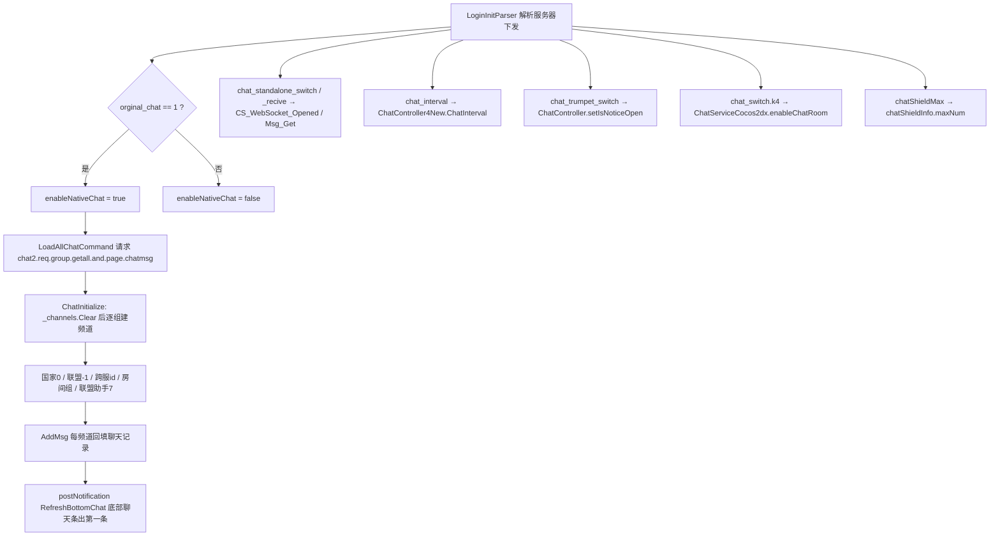
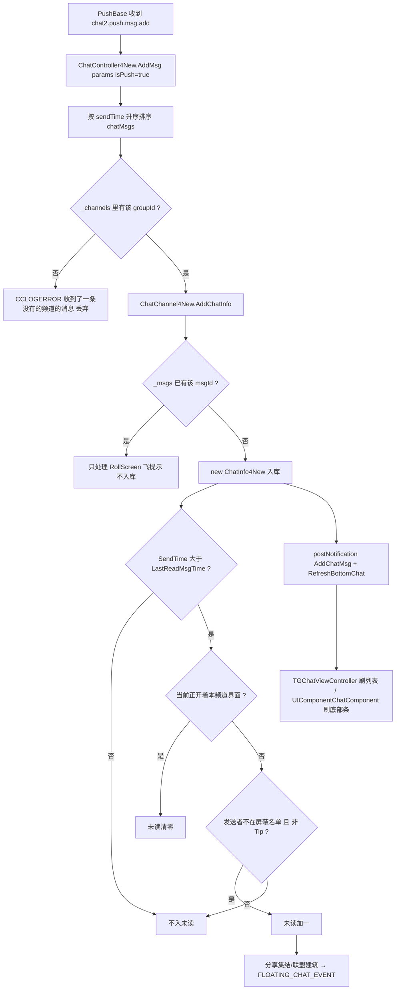
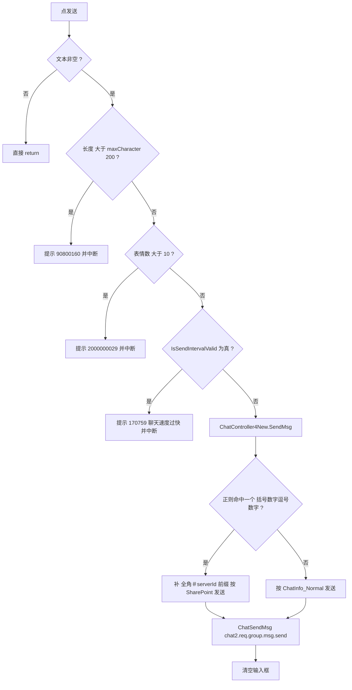
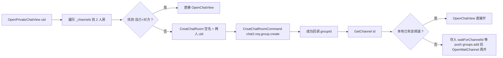
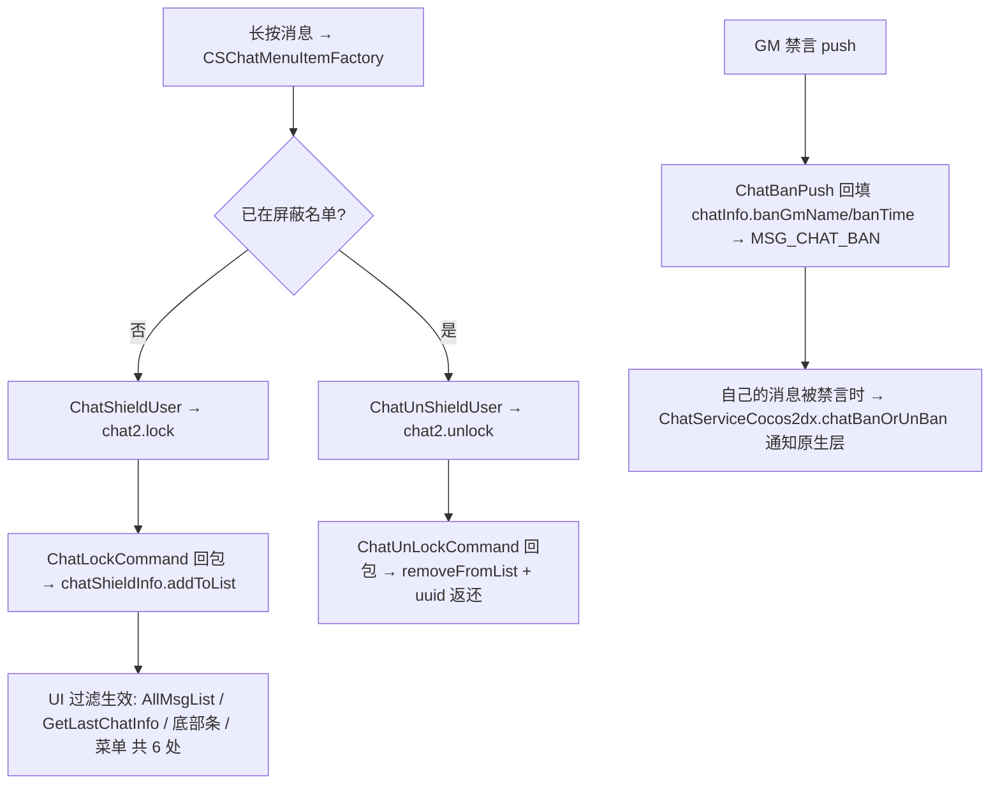

**■ 聊天系统使用说明（Chat / chat2 协议）**

> 项目: RedAlert_SuperFormation（红警 / 帝国 / KS 多品牌复用，SVN 无 git）
> 整理时间: 2026-09-21
> 核心代码: `Assets/DevCodeFM/IF/NativeChat/New/ChatController4New.cs`（1420 行·总管）+ `New/ChatCommand.cs`（665·协议）+ `DayZClasses/view/chat/TGChatViewController.cs`（883·主界面）
> UI 资源: FairyGUI 包 `007_chat`（`Assets/AssetBundles/DayZ/PlatformDefault/Default/UI/007_chat/007_chat_fui.bytes`）
> 配套文档: [[联盟领地与王座争夺]] · [[大地图]] · [[场景管理模块]] · [[商城计费模块]] · [[指引模块]]

---

**■ 一、模块总览**

**▍ 1.1 一句话定位**

聊天系统是**三套实现并存**的模块：当前主线是走独立协议族 `chat2.*` 的「新聊天」（频道 + 消息 + 未读），而**国家/联盟发言、红包、屏蔽、聊天×邮件整合仍由老 `ChatController` 承担**，另有一整套 iOS 原生聊天移植代码留在仓库里（大部分已 `throw new NotImplementedException()`），只余语言聊天室与屏蔽名单判定在服役。

| 线 | 位置 | 状态 | 承担的职责 |
|---|---|---|---|
| **A 线·新聊天（主线）** | `IF/NativeChat/New/` | ✅ 在用 | 频道模型、消息模型、chat2 协议、未读、翻译、分享、红包发放/领取、私聊、建/退聊天室、联盟助手 |
| **B 线·老聊天** | `IF/DayZClasses/controller/ChatController.cs`、`view/popup/ChatView.cs` | ✅ 部分在用 | 国家/联盟/评论三池、`receiveChat` 入口、喇叭（系统公告）、屏蔽名单、红包 uid 列表、与邮件互相通知 |
| **C 线·原生移植残骸** | `IF/NativeChat/`（除 `New/`） | ⚠️ 大半 stub | 语言（语音）聊天室 `LanguageChatRoomController`、屏蔽判定 `UserManager.isInRestrictList`、翻译 `TranslateManager`、原生聊天桥 `ChatServiceCocos2dx` |

> 判据：B 线 `ChatController.receiveChat()` 里显式给 A 线让路 —— `IF/DayZClasses/controller/ChatController.cs:160` 判 `ChatServiceCocos2dx.CS_WebSocket_Opened && CS_WebSocket_Msg_Get` 时对国家/联盟消息直接 `return`（独立聊天服务器已接管接收）。

**▍ 1.2 核心文件**

| 文件 | 行数 | 职责 |
|---|---|---|
| `IF/NativeChat/New/ChatController4New.cs` | 1420 | **A 线总管**（`Singleton`）：`_channels` 频道字典 · `ChatInitialize`(145) 登录初始化 · `AddChatChannels`(426)/`AddChatChannel`(465)/`AddMsg`(489) 下行入口 · `SendMsg`(540) 上行 · `OpenCountryChatView`(256)/`OpenCrossCountryChatView`(267)/`OpenAllianceChatView`(279)/`OpenChatView`(295)/`OpenPrivateChatView`(307) 界面入口 · `CreatChatRoom`(387)/`ExitChatRoom`(414)/`ChangeRoomName`(421) 房间管理 · `PullDown4MoreChatMsg`(576) 分页 · `SetTranslateMsg`(593) 翻译回填 · `Share*`(617~1009) 十种分享 · 红包 `SendRedPacket`(1314)/`ReceiveRedPacket`(1320)/`UnGetRedPacketIdx`(1326)/`HasUnGetRedPacket`(1349)/`OpenChatViewWithRedPacket`(1384) |
| `IF/NativeChat/New/ChatChannel4New.cs` | 395 | 频道模型：`ChatChannelType` 枚举(6) · `ChatRoomMemberInfo`(17) · `Parse`(131) 解析 `id/name/channel/lastSendMsgTime/roles` · `LastReadMsgTime`(96) **存 PlayerPrefs** · `UnReadMsgCount`(113) 上限 99 · `AllMsgList`(159) 过滤屏蔽+排序+5 分钟时间戳 · `TiTleName`(205) 频道显示名 · `AddChatInfo`(295) **去重入库+未读判定** · `SaveLastReadMsgTime`(382) |
| `IF/NativeChat/New/ChatInfo4New.cs` | 440 | 消息模型：`ChatInfoType`(8)/`ShareType`(21)/`ChatSendState`(35)/`RedPacketState`(42) · `Msg`(113) 按类型拼显示串 · 构造函数(245) 解析 `msgId/groupId/channel/sendTime/msgType/sender/citySerever` · `IsSelfSend`(429) |
| `IF/NativeChat/New/ChatCommand.cs` | 665 | chat2 协议命令集（见 §1.5） |
| `IF/NativeChat/New/ChatUserInfo.cs` | 76 | 发送者快照（Uid/Vip/头像/联盟缩写/`Bubble` 气泡皮肤） |
| `IF/DayZClasses/view/chat/TGChatViewController.cs` | 883 | **主聊天界面**（`PopupBaseView`）：`Awake`(42) 注册 9 个 FGUI 扩展 · `OnEnable`(58) 订阅 6 个事件 + 0.1s 未读轮询 · `Init`(92) 取控件 · 发送校验(412~434) · `onCutChatFragment`(444) 国家⇄联盟切换 |
| `IF/DayZClasses/view/chat/TGDialogViewController.cs` / `TGDialogListCell.cs` | - | 会话列表（TG 风格私聊/房间列表） |
| `IF/DayZClasses/view/chat/CSMessageTableCell.cs` | - | 消息气泡本体（`chatCell02_right`/`chatCell03_left`），译文切换见 (253~266) |
| `IF/DayZClasses/view/chat/CSChatMenuItemFactory.cs` | 295 | 消息长按菜单：**屏蔽/取消屏蔽**(96,246,258) · **翻译/看原文**(108,281) · 举报 |
| `IF/DayZClasses/view/chat/ChatEmojiView.cs` + `EmojiParser.cs` | 239 / - | 表情面板与 UBB 表情解析 |
| `IF/DayZClasses/view/chat/RedPack*.cs` · `RadPackListView.cs` | - | 红包设置/打开/领取/列表 |
| `IF/DayZClasses/view/gameui/UIComponent/Components/UIComponentChatComponent.cs` | 292 | **主界面底部聊天条**：订阅 `RefreshBottomChat`(47) · `updateChatInfo`(72) 国家/联盟/房间分流 · 22 字截断(195) · 功能锁判定(218) |
| `IF/DayZClasses/view/gameui/GlobalFloatingChatView.cs` | 170 | **悬浮聊天球**（拖拽 + 动画）：订阅 `FLOATING_CHAT_EVENT`(153) · 拖拽边界(69) |
| `IF/DayZClasses/view/popup/alliance/ChatFrameCell.cs` | 163 | 联盟界面内嵌聊天条 → `OpenAllianceChatView`(39) |
| `IF/DayZClasses/view/popup/ChatView.cs` | 846 | **老聊天界面**（`ChatView` + 内嵌 `ChatFunView`(331) 消息菜单）；仍在被联盟相关界面调用（`QuestController.cs:1744`、`CombineAllianceInfoView.cs:660/690/699`、`FBAllianceCheckView.cs:501/523/532` 等） |
| `IF/DayZClasses/view/popup/CreateChatRoomView.cs` | 725 | 建群/选人界面 |
| `IF/DayZClasses/controller/ChatController.cs` | 496 | **B 线总管**：三池 `m_chatCountryPool/m_chatAlliancePool/m_commentPool` · `sendSystemMsgNew`(84) · `sendCountryChat`(118) · `receiveChat`(157) · 红包 uid 列表(239) · 举报(245) · 多人信息(256) · 屏蔽(390/407) · 断线重连(455/464) |
| `IF/DayZClasses/model/ChatInfo.cs` | 346 | B 线消息模型（`post`/`dialog`/`extra`/`translationMsg`/`banTime`） |
| `IF/DayZClasses/model/ChatMailInfo.cs` | 331 | **聊天↔邮件适配模型**（`ChatMailInfo.create`），B 线消息转邮件条目 |
| `IF/DayZClasses/Ext/ChatService/ChatServiceCocos2dx.cs` | 551 | 原生聊天桥 + **全局开关仓**：`enableNativeChat`(13) · `CS_WebSocket_Opened/Msg_Get`(22,23) · `CS_ChatCell_OC_Native_New`(25) · `DB_MsgItem_switch`(30) · `handleChatPush`(399) · `refreshChatMessageOnCocos`(33) · `isChatShowing_fun`(190) |
| `IF/NativeChat/LanguageChatRoomController.cs` | 420 | **语言（语音）聊天室**：`loginChatRoom`(242)/`leaveChatRoom`(253) · 房内人数 `updateRoomMembersCount`(218) · 按语言取房 `getChatRoomIndex`(280) |
| `IF/NativeChat/UserManager.cs` | - | `isInRestrictList(uid,type)`(134) —— **全 UI 层屏蔽判定的唯一依据** |
| `IF/NativeChat/NativeChatGlobal.cs` | 246 | 旧原生协议常量（`push.chat.room`(200)、`room.joinLangRoom`(218)、`room.getCustomRoomList`(216) …） |
| `IF/DayZClasses/Net/push/ChatPush.cs` | 100 | `ChatPush.handleResponse`(7) 老聊天 push 入口 · `ChatBanPush`(50) 禁言 push |
| `IF/DayZClasses/Ext/LoginInitParser.cs` | 4126 | **所有聊天开关的解析中心**（176、195-200、723、741-796、912-942） |
| `IF/DayZClasses/view/gameui/UIComponent/UIFunctionUtility.cs` | 107 | 功能锁判定：`CheckFuntionOpened`(24) → DataAtlas 表 `FunctionControl`(41) |
| `Assets/ResDepends/default/Config/DataAtlas/FunctionControl.json` | 24 行 | `UIChat` 解锁条件（见 §四） |
| `Assets/NativeCode/3rdSDKManager/WebHelperChatManager.cs` | 218 | 3rd SDK 侧聊天辅助（网页客服/分享） |

**▍ 1.3 频道类型（`ChatChannel4New.cs:6-15`）**

| 枚举 | 值 | 频道 id 约定 | 显示名来源 | 备注 |
|---|---|---|---|---|
| `ChatChannel_Country` | 0 | **0**（写死） | `_lang("105300")` | 国家/世界频道 |
| `ChatChannel_Alliance` | 1 | **-1**（写死） | `_lang("102161")` | 未入盟不可用（`OpenChatView:297` 会降级到国家） |
| `ChatChannel_Room` | 2 | 服务器下发 | 自定义名 / 对方昵称 / 「讨论组」`_lang("2000000123")` | 私聊=2 人房间 |
| `ChatChannel_Cross_World` | 3 | 服务器下发，存 `ChatController.ChatChannelId_Cross_World`（默认 1） | `_lang_n("ZH400040535", 跨服列表)` | 仅跨服#最强王国 War 期才开（`CanOpenCrossChannel:124`） |
| `ChatChannel_Cross_Room` | 4 | 服务器下发 | 同房间 | 建群上报的 `channel` 就是它（`ChatCommand.cs:79`） |
| `ChatChannel_All_Server` | 5 | — | — | 未见使用 |
| `ChatChannel_Assistance` | **7** | ⚠️ 列表取用**写死 3**（`ChatController4New.cs:84,89`） | `_lang("ZH400043140")` | 联盟助手（求助/集结），未入盟不建 |

**▍ 1.4 消息类型**

| `ChatInfoType` | 值 | 含义 | 特殊处理 |
|---|---|---|---|
| `ChatInfo_System` | 0 | 系统 | `Sender` 可为空 |
| `ChatInfo_Normal` | 1 | 普通文本 | 分享坐标正则失配时会**降级成 Normal**（`ChatInfo4New.cs:295-302`） |
| `ChatInfo_Voice` | 2 | 语音 | - |
| `ChatInfo_Share` | 3 | 分享 | `_shareType` 决定 10 种子类型 |
| `ChatInfo_Tip` | 4 | 提示（加人/踢人） | 不计未读（`ChatChannel4New.cs:313`） |
| `ChatInfo_RedPacket` | 5 | 红包 | 文案取 `＃` 前段走语言表（`ChatInfo4New.cs:305-310`） |
| `ChatInfo_RollScreen` | 6 | 滚屏公告 | push 时飞一次系统提示（`ChatChannel4New.cs:330-336`） |
| `ChatInfo_AllianceInvite` | 7 | 联盟邀请 | 底部条固定显示「邀请入盟」 |
| `ChatInfo_AllianceAssist` | 8 | 联盟助手 | `SetAssistMsg`(316) 解析 JSON |

`ShareType`（`ChatInfo4New.cs:21-33`）：`SharePoint 0 · ShareReport 1 · ShareAssembly 2 · ShareEquipment 3 · ShareLegion 4 · ShareAlliancePurchase 5 · ShareAllianceMark 6 · ShareAllianceBuild 7 · ShareCart 8 · ShareAllianceHelp 9`。
`ChatSendState`：`Fail 0 / Success 1 / Sending 2`；`RedPacketState`：`ALREADY_GET / VALID / COST_ALL / TIMEOUT`。

**▍ 1.5 协议清单**

A 线（`ChatCommand.cs`）：

| 命令 | 类:行 | 方向 | 说明 |
|---|---|---|---|
| `chat2.req.group.getall.and.page.chatmsg` | `LoadAllChatCommand:11` | 请求 | 登录拉全部频道+每频道前 20 条 → `ChatInitialize` |
| `chat2.req.group.role.enter` | `AddRoomMemberCommand:40` | 请求 | 拉人进房间 |
| `chat2.req.group.create` | `CreatChatRoomCommand:73` | 请求 | 建房（回调里直接开界面） |
| `chat2.req.group.msg.send` | `ChatSendMsg:116` | 请求 | 发消息（带 `sharedType`）；`channel==1 && msgType==1` 时打点 `alliance_chat_count` |
| `chat2.req.group.eixt` | `ExitChatRoom:156` | 请求 | 退房（**命令名拼错 eixt**，协议名不可改） |
| `chat2.req.group.name.change` | `ChangeChatRoomName:190` | 请求 | 改名 |
| `chat2.req.group.msgs.get.page` | `GetMoreChatMsg:230` | 请求 | 上拉更多 |
| `chat2.req.translate.msg` | `TranslateChatMsg:278` | 请求 | 翻译（`FixLang:287` 修语言码） |
| `chat2.lock` / `chat2.unlock` | `ChatShieldUser:336` / `ChatUnShieldUser:379` | 请求 | 屏蔽/取消屏蔽玩家 |
| `chat2.req.shared.msg.detail.get` | `ChatShareInfoDetail:422` | 请求 | 点分享消息取详情 |
| `alliance.team.ls` | `ChatShareInfoAssembly:501` | 请求 | 集结详情 |
| `send.red.packet` / `get.red.pack` | `SendRedPacket:587` / `ReceiveRedPacket:630` | 请求 | 发/抢红包 |

Push（`IF/DayZClasses/Net/push/PushBase.cs:1557-1590`）：`chat2.push.groups.add` / `chat2.push.groups.update` / `chat2.push.groups.del` → 都进 `AddChatChannels`；`chat2.push.msg.add` → `AddMsg(params, true)`；`push.chat.hint` → 飞提示。

B 线老协议：`CountryChatCommand`（`Global.CHAT_STATE_COUNTRY_COMMAND` / `CHAT_STATE_ALLIANCE_COMMAND`）、`SendChatRoomMsgCommand`、`GetChatRoomMemberCommand`、`KickChatRoomMemberCommand`、`ModifyChatRoomNameCommand`、`ChatLockCommand`/`ChatUnLockCommand`/`ChatLockInfoCommand`、`WorldChatInviteInCommand`、`alliance/ChatIsInAllanceCommand`、举报 `Global.REPORT_PALYER_CHAT`（`ReportPlayChatCommand.cs:14`）。
C 线原生：`push.chat.room` · `history.roomsv2` · `room.join/joinMulti/leave` · `room.inviteCustomRoom` · `room.kickCustomRoom` · `room.changeCustomRoomName` · `room.getCustomRoomList` · `room.joinLangRoom` · `room.getRoomsMembersCount`（`NativeChatGlobal.cs:200-227`）。

**▍ 1.6 事件总线（CCSafeNotificationCenter）**

| 事件 | 发出 | 监听 |
|---|---|---|
| `AddChatMsg` | `ChatChannel4New.cs:337` | `TGChatViewController:61`（带 `channelID`/`scroll`） |
| `RefreshBottomChat` | `ChatChannel4New.cs:328`、`ChatController4New.cs:252/438`、`ChatCommand.cs:367/411`、`AllianceManager.cs:689` | `UIComponentChatComponent:47`、`FBAllianceMainView:292` |
| `AddChatRoom` | `ChatController4New.cs:438/529`、`TGChatViewController:88` | `TGDialogViewController:35`（会话列表重载） |
| `FLOATING_CHAT_EVENT` | `ChatChannel4New.cs:317`（集结/联盟建筑分享） | `GlobalFloatingChatView:153`（悬浮球播动画） |
| `TranslateMsgSuccess` / `ChangeRoomNameSuccess` / `PushOldMsgSuccess` / `ExitChatRoom` / `ChangeChannel` | `ChatController4New.cs:605` 等 | `TGChatViewController:62-66` |
| `SendRedPacketSuccess` / `ReceiveRedPacketSuccess` | `ChatCommand.cs:620/660` | 红包界面 |
| B 线：`MSG_CHAT_UPDATE` / `MSG_CHAT_BAN` / `MSG_CHAT_NAME` / `MSG_ALLIACNE_HELP_NUM_CHANGE` | `ChatController.cs:227`、`ChatPush.cs:89` | 老聊天条 |

**▍ 1.7 数据流**

```
登录
  LoginInitParser(176/195-200/723/741-796/912-942)  →  各开关落 ChatServiceCocos2dx / ChatController4New / GlobalData
  LoadAllChatCommand(chat2.req.group.getall...)    →  ChatController4New.ChatInitialize
        ├─ _channels.Clear()
        ├─ 0  国家 / -1 联盟 / 跨服(服务器 id) / 房间组 / 联盟助手  →  AddChatChannel + AddMsg
        └─ 求各频道最后一条 → postNotification("RefreshBottomChat")

运行期收消息
  PushBase: chat2.push.msg.add  →  ChatController4New.AddMsg(params,true)
        └─ ChatChannel4New.AddChatInfo(dict, isPush)
              ├─ 未读++ (不在本频道界面且非屏蔽且非 Tip)
              ├─ 分享集结/建筑 → FLOATING_CHAT_EVENT
              ├─ RollScreen → flySystemUpdateHint
              └─ postNotification("AddChatMsg") / ("RefreshBottomChat")
  PushBase: push.chat.hint → 飞提示
  B 线: ChatPush.handleResponse → ChatController.receiveChat → 三池 + ChatMailInfo + UIComponent.updateChatInfo

发消息
  TGChatViewController 发送校验(412~434: 长度≤200 / 表情≤10 / 间隔)
        → ChatController4New.SendMsg(channelId, (byte)channelType, text)
              → ChatSendMsg(chat2.req.group.msg.send)  [正则判定是否坐标分享]
  分享类：ChatController4New.ShareXxx() → ChatSendMsg(shareType=n)

跨模块
  聊天 ⇄ 邮件：MailController(760/820/920/1126/1146/1156/1209) 用 ChatMailInfo + ChatServiceCocos2dx.handleChatPush
  聊天 ⇄ 联盟：AllianceManager(514/534/539/617/688-690) 分享集结/清空联盟消息/刷新底条
  聊天 ⇄ 屏蔽：UserManager.isInRestrictList(uid,1) 被 6 处 UI 与 AllMsgList/GetLastChatInfo 过滤
```

---

**■ 二、流程图**

**▍ 2.1 登录初始化频道**



**▍ 2.2 收一条消息**



**▍ 2.3 发一条消息（含进度/校验）**



**▍ 2.4 私聊 / 自建聊天室**



**▍ 2.5 屏蔽 / 禁言 / 未读**



---

**■ 三、使用方法**

**▍ 3.1 打开聊天界面（业务侧唯一正确姿势）**

```csharp
// 国家 / 跨服 / 联盟 / 私聊（内部已处理"未入盟"降级与"跨服未开"的情况）
ChatController4New.Instance.OpenCountryChatView();
ChatController4New.Instance.OpenCrossCountryChatView();
ChatController4New.Instance.OpenAllianceChatView();
ChatController4New.Instance.OpenPrivateChatView(uid, (result) => { /* 房间建好后回调 */ });

// 指定频道（会话列表点某个房间时用）
ChatChannel4New ch = ChatController4New.Instance.GetChannel(channelId);
if (ch != null) ChatController4New.Instance.OpenChatView(ch);

// ⚠️ 不要自己 new：界面必须通过 PopupViewController 走 create()
```

`OpenChatView` 的两条硬规则（`ChatController4New.cs:295-301`）：联盟/联盟助手频道在未入盟时**强制改开国家频道**；界面创建参数只有 `(channelType, channelId)` 两个。

**▍ 3.2 新增一种「分享」消息（最常见的扩展）**

1. 在 `ChatInfo4New.cs:21-33` 的 `ShareType` 末尾追加枚举值（**必须追加在末尾**，值要与服务器约定一致）。
2. 在 `ChatInfo4New.cs:113` 的 `Msg` getter（或 `SetTipMsg`/`SetAssistMsg` 同族的解析分支）里补该类型的**显示文案拼装**；如果是 `msg|a|b` 形式，参考 `ShareReport` 分支的 `Split('|')[0]`。
3. 若该分享需要点击后弹详情，在 `ChatController4New.cs` 的 `ClickShareEvent`(1058) 里加 `case`，并实现对应的查询命令（参考 `ChatShareInfoDetail` `chat2.req.shared.msg.detail.get`）。
4. 在 `ChatController4New.cs` 增加 `ShareYourThing(...)` 方法，内部 `new ChatSendMsg(channelId, (byte)type, (byte)ChatInfoType.ChatInfo_Share, msg, (byte)ShareType.ShareYourThing).send();`。
5. 若要在消息 cell 里加图标，改 `CSMessageTableCell.cs` 的渲染分支 + 在 `TGChatViewController.Awake`(45-55) 注册新的 FGUI 扩展（新 cell 需先在 FairyGUI 工程 `007_chat` 里做好并导出到 `Assets/AssetBundles/.../UI/007_chat/`）。
6. 语言 key 走 `Global._lang("...")`，不要写死中文（见 §四）。

**▍ 3.3 新增一个频道（如「战区频道」）**

1. `ChatChannelType`(`ChatChannel4New.cs:6`) 追加枚举（值要与服务器 `channel` 字段一致）。
2. `ChatController4New.getChannelList()`(73) 里决定它在频道列表中的**位置**（现有顺序：跨服 → 国家 → 联盟 → 联盟助手 → 房间按 `CreatTime` 倒序），若要固定密钥（如国家 0/联盟 -1/助手 3）就按同样写法 `_channels.TryGetValue(固定id, out ch)`。
3. `ChatInitialize`(145) 增加 `channelType` 分支建频道（**注意**：`_channels.Add(0, channel)` 未做 `ContainsKey` 保护，见 §五-1）。
4. `ChatChannel4New.TiTleName()`(205) 加显示名（走语言表）。
5. 未读汇总 `GetTotalUnReadMsgCount`(51) 若该频道需要参与，记得排除规则（跨服频道已有 `CheckCrossWorldChatActive` 特判）。
6. 打开入口：加一个 `OpenXxxChatView()`，内部走 `OpenChatView`。

**▍ 3.4 调试手段**

| 目的 | 做法 |
|---|---|
| 看下行原文 | `ChatController4New.ChatInitialize`(149) 与 `AddChatChannel`(481) 用 `CCLOGERROR` 打了全量 JSON，直接在日志里搜 `chatGroups` / `AddChatChannel ChannelId` |
| 看协议名 | `NativeChat/New/ChatCommand.cs` 每个类的构造函数第一行就是协议名；push 侧在 `PushBase.cs:1557-1590` |
| 关掉新聊天走老逻辑 | 服务器下发 `orginal_chat = 0`（`LoginInitParser.cs:176`）→ `enableNativeChat = false`，B 线 `ChatController` + `ChatView` 接管 |
| 抢独立聊天服务器 | `chat_standalone_switch=1` + `chat_standalone_recive=1`（`LoginInitParser.cs:912-920`）；两者同时开时 `ChatController.receiveChat` 会对国家/联盟消息直接 return（`ChatController.cs:160`） |
| 屏蔽名单 | `GlobalData.shared().chatShieldInfo`（`ChatLockInfoCommand` 登录时拉取，`LoginInitParser.cs:3675-3682`），上限 `chatShieldMax` |
| 聊天功能锁 | `UIFunctionUtility.CheckFuntionOpened(UIFunction.UIChat)` → 表 `FunctionControl.json` 的 `UIChat` 行 |
| 本地未读残留 | 未读/已读时间存在 `PlayerPrefs`，key = 频道 id（`ChatChannel4New.cs:96-106`），排查异常时 `PlayerPrefs.DeleteKey(channelId)` |

**▍ 3.5 常用业务调用**

```csharp
// 发一条普通消息 / 求助消息
ChatController4New.Instance.SendMsg(channelId, (byte)ChatChannelType.ChatChannel_Alliance, "文本");
ChatController4New.Instance.SendHelpSummonMsg(-1, (byte)ChatChannelType.ChatChannel_Alliance, json);

// 联盟分享（AllianceManager.cs:534/539 即此用法）
ChatController4New.Instance.ShareAssembly(name, targetName, teamId, 1);

// 举报（老接口，仍在服役）
ChatController.getInstance().reportPlayerChatContent(uid, content);

// 清空联盟消息（退盟/并入时）
ChatController4New.Instance.ClearAllianceMsg();      // 内部 _channels.Remove(-1)
ChatController.getInstance().m_chatAlliancePool.clear();  // B 线池也要清（AllianceManager.cs:682-690 两处一起清）
```

---

**■ 四、配表事项**

1. **功能锁表**：`Assets/ResDepends/default/Config/DataAtlas/FunctionControl.json` → `id = "UIChat"`，`type = 1`(BUILD 解锁)，`buildid = 417000`，`buildlevel = 1`，`guideid = "60003030"`，`tipId = "Z400041624"`。聊天入口（底部条/悬浮球）以此判定显隐（`UIComponentChatComponent.cs:218-226`）。
2. **服务器开关（`dataConfig`）** —— 全部在 `IF/DayZClasses/Ext/LoginInitParser.cs` 解析，**客户端没有兜底默认值，字段缺失即为 0/false**：

| key | 行 | 落到哪里 | 作用 |
|---|---|---|---|
| `orginal_chat` | 176 | `ChatServiceCocos2dx.enableNativeChat` | 1 = 走原生/新聊天；0 = 老聊天 |
| `chat_standalone_switch` | 916 | `CS_WebSocket_Opened` | 独立聊天服务器总开关 |
| `chat_standalone_recive` | 917 | `CS_WebSocket_Msg_Get` | 是否接收独立服务器消息 |
| `chat_standalone_send` | 918 | **解析后未使用**（只在日志里打印） | 预留 |
| `chat_websocket_thread` | 907 | 未使用（仅打印） | 预留 |
| `chat_interval` | 723 | `ChatController4New.ChatInterval` | 发言最小间隔（秒级，配合 `LastSendTime`） |
| `chat_trumpet_switch` | 795 | `ChatController.setIsNoticeOpen` | 喇叭/公告开关 |
| `chat_switch.k4` | 756-760 | `ChatServiceCocos2dx.enableChatRoom` | 多人聊天室开关 |
| `chat_switch.k1` | 746-752 | 已注释 | 曾为 Google 自动翻译 |
| `chatShieldMax` | 939-942 | `chatShieldInfo.maxNum` | 屏蔽名单上限 |
| `roe_language_channel` | 195 | `language_channel` | 语言（语音）频道 |
| `new_personal_chat` | 196 | `new_personal_chat` | 新私聊 |
| `battlefield_chat_room` / `chat_msg_independent` | 197-198 | 同名静态字段 | 战场聊天室 / 独立消息 |
| `red_packet_switch` | 716 | `GlobalData.m_red_packet_switch` | 红包总开关（`ChatController4New.IsOpenRedPacket` 另有一份，登录时未同步，见 §五-6） |
| `language_channel_autojoin` | `NativeChat/MessageController.cs:356` | 语言频道自动加入 | 与 `use_language_enc` 联合判入口显隐 |

3. **硬编码 id / 常量**（改动即联调）：
   - 频道 id：国家 `0`、联盟 `-1`、联盟助手取用 `3`、跨服 id 由服务器 `channelGroupId` 覆盖到 `ChatController.ChatChannelId_Cross_World`（`ChatController.cs:31` 默认 1）。
   - 消息长度上限 `ChatController.maxCharacter = 200`（`ChatController.cs:41`）；每页 20 条 `ChatChannel4New.ChatNumInPage`（`:88`）与 `ChatController4New.GetMsgMaxCount = 20`（`:32`）。
   - 未读上限 99（`ChatChannel4New.cs:116`）；时间戳标签间隔 5 分钟（`ChatChannel4New.cs:187`）；底部条截断 22 字（`UIComponentChatComponent.cs:197`）。
   - 频道/公告系统 uid `Global.CHAT_NOTICE_SYS_DIALOG = "3000002"`（`Global.cs:2432`）。
   - 输入框过滤 `restrict = "[^<>]"`（`TGChatViewController.cs:110`）—— 只挡尖括号，**不做敏感词本地过滤**。
4. **语言 key**（改文案只改语言表，不要改代码）：

| key | 含义 | 位置 |
|---|---|---|
| `105300` | 国家频道名 | `ChatChannel4New.cs:208` |
| `102161` | 联盟频道名 | `:212` |
| `ZH400043140` | 联盟助手名 | `:214` |
| `ZH400040535` | 跨服频道名（带跨服 id 参数） | `:210` |
| `2000000123` | 「讨论组」兜底名 | `:231` |
| `105327` | 下拉刷新提示 | `TGChatViewController.cs:102` |
| `170759` | 聊天速度过快 | `TGChatViewController.cs:431` |
| `90800160` | 消息长度超限（带参数） | `:415` |
| `2000000029` | 表情不能超过 10 个 | `:423` |
| `105311` / `105316` | 空消息提示 / 图标 | `ChatController.cs:135` |
| `79010922` | 红包前缀 | `UIComponentChatComponent.cs:161` |
| `ZH400040241` | 联盟邀请占位文案 | `:165` |
| `103001` | VIP 等级前缀 | `:136` |
| `105394` | 举报成功提示 | `ReportPlayChatCommand.cs:40/46` |
| `115261` | 联盟邀请（带盟名参数） | `ChatPush.cs:24` |

5. **UI/FairyGUI**：包名 `007_chat`，资源在 `Assets/AssetBundles/DayZ/PlatformDefault/Default/UI/007_chat/`。cell 扩展注册在 `TGChatViewController.Awake`(45-55)：`chatCell02_right`/`chatCell03_left`/`ChatOption`/`btn_chatOption`/`EmojiS`/`chatCell05`/`chatCell07_left|right`/`chatFrame_invite_l|r`/`chatCell08_left`。**组件名改动必须同步这里**，否则 FGUI 导出后运行时绑定不到 cell。
6. **表情**：解析在 `EmojiParser`（继承 `UBBParser`），发送侧用正则 `\[:[abc].{1,2}\]` 数表情（`TGChatViewController.cs:419`），文案/图标改动要与该正则口径一致。

---

**■ 五、注意事项（已知坑）**

| 级别 | 问题 | 位置 | 说明与后果 |
|---|---|---|---|
| 🔴 | **`AddChatInfo` 对 `sender` 无空判** | `New/ChatChannel4New.cs:298-299` → `CCDictionary sender = dict.objectForKey("sender"); string uid = sender.valueForKey("uid");` | 下行消息若缺 `sender` 字段即 NRE 崩在收包链路。反证：同文件 UI 侧到处判 `info.Sender == null`（`ChatChannel4New.cs:164/252/309`、`UIComponentChatComponent.cs:104/116`），且 `ChatInfo4New` 构造允许 uid 为空（`:262-271`，系统/滚屏消息走空 sender 分支）→ 客户端自身认为 Sender 可为 null，此处却直接解引用。**建议立项修**：加 `if (sender == null) return;`（或与 `ChatInfo4New` 同样容忍空 uid）。 |
| 🟠 | **`chat2.push.groups.del` 不会删本地频道** | `PushBase.cs:1559-1565` 三种 push 全部进 `ChatController4New.AddChatChannels`（`:426-440`），该方法只有 `AddChatChannel`（新增/覆盖）+ 通知，**没有任何移除** | 被踢出/房间被解散后，本地会话列表仍留着该频道，点进去看到旧消息、发消息报错。只有自己主动退房才删（`ExitChatRoom:414-419` 有 `_channels.Remove`）。 |
| 🟠 | **国家频道建频道无重复保护** | `ChatController4New.cs:158-159` `_channels.Add(0, channel)` | 同一分支里跨服频道做了 `ContainsKey` 判断（`:166-169`），国家/联盟/助手没有。若服务器 `chatGroups` 重复下发国家频道 → `Dictionary.Add` 抛 `ArgumentException`（初始化期崩溃）。 |
| 🟠 | **`SendMsg` 用正则判定"分享坐标"，会误判玩家输入** | `ChatController4New.cs:540-561` 正则 `\(\d*,\d*\)` 命中一次即当坐标分享 | 玩家自然输入如 `(12,34)` 会被打上 `ChatInfo_Share` + 补 `＃serverId` 前缀发出去；反向判断在 `ChatInfo4New.cs:295-302`（服务端消息失配时才降级回 Normal）→ **收发两条路径口径不一致**。 |
| 🟠 | **联盟助手频道 id 取用写死 3** | 写入用服务器下发 `roomInfo.id`（`ChatController4New.cs:217-218`），读取写死 `_channels.TryGetValue(3, ...)`（`:84`、排除列表 `:89`） | 服务器一旦给助手频道分配的不是 3，助手频道就进不了频道列表且被当成普通房间显示。**待确认**：需与服务端核对是否契约固定为 3。 |
| 🟠 | **`IsOpenRedPacket` 登录未同步** | `ChatController4New.cs:39` 默认 `false`；红包总开关落在 `GlobalData.m_red_packet_switch`（`LoginInitParser.cs:716`） | 两处开关不是同一个变量，登录后 `IsOpenRedPacket` 仍是 false → 红包入口/提示可能不生效。使用前需确认谁在赋值（**待确认**）。 |
| 🟡 | **`IsSendIntervalValid()` 命名与语义相反** | `ChatController4New.cs:41-49` 返回 `true` 表示"间隔未到"，调用处 `if (IsSendIntervalValid()) { 提示太快; return; }`（`TGChatViewController.cs:429-432`） | 易被后续维护者写反，建议改名 `IsSendingTooFast()`。 |
| 🟡 | **正常日志用 `CCLOGERROR`** | `ChatInitialize`(`:149`)、`AddChatChannel`(`:481`)、`AddChatChannels`(`:428`)、`OpenWaitChannel`(`:452`) | 全量 JSON 进错误日志，线上日志噪音大、影响问题定位。 |
| 🟡 | **C 线移植残骸会直接崩** | `NativeChat/ChatChannel.cs:173-177`、`NativeChat/ChatServiceController.cs:36-129` 一票方法主体是 `throw new NotImplementedException()` | 这些是 iOS 原生聊天移植未清理的接口，**只要被调到就抛异常**。`ChatServiceCocos2dx` 仍在引用 `ChannelManager`/`ServiceInterface`（`:40/52/57/63/385-389`），维护时要留意别踩进 stub。 |
| 🟡 | **未读与已读时间存 PlayerPrefs，key = 频道 id** | `ChatChannel4New.cs:96-106`（get/set 都是裸的 `channelId.ToString()`） | ① 与其它模块的 PlayerPrefs key 共用命名空间，冲突风险；② 频道 id 复用（服务器回收 id）时旧已读时间会串进来；③ 退出房间用 `DeleteKey` 清（`:415`），但长住的房间永不清。 |
| 🟡 | **B/C 线与 A 线双写清单容易漏** | 典型：退盟时 `AllianceManager.cs:682-690` 同时清 `ChatController.m_chatAlliancePool` 与 `ChatController4New.ClearAllianceMsg()` | 任何"清空/重置聊天"的需求都要**两处一起改**，只改一边会残留旧消息（参见 `LoginInitParser.cs:4118-4120` 同样是三池齐清）。 |
| 🟡 | **`chat2.req.group.eixt` 拼写错误** | `ChatCommand.cs:156` | 协议名与服务器约定一致，**不能顺手"修正"成 exit**，否则退房功能整体失效。 |
| 🟡 | **`ChatController.chat_interval` 已废弃但仍被引用** | 定义与默认值 `ChatController.cs:7/38`，下发处已注释（`LoginInitParser.cs:722`） | 老界面 `ChatView.cs:230` 仍在用它做限速 → 老界面实际用默认值 1 秒，与新聊天（服务器 `chat_interval`）不一致。 |
| 🟡 | **消息数量/内存无上限** | `_msgs` 为 `Dictionary<long, ChatInfo4New>`（`ChatChannel4New.cs` 字段区），`AddChatInfo` 只增不删 | 长时间在线的大频道（国家/跨服）消息全留内存且每条 `AllMsgList` 都做一次全量排序（`:159-200`），是主界面刷新的性能热点。 |

---

**■ 六、相关文档**

- 同目录：[[联盟领地与王座争夺]]（联盟频道的业务来源：分享集结/联盟建筑/助手求助） · [[大地图]]（分享坐标 `SharePoint` 的坐标口径） · [[场景管理模块]]（弹窗栈 `PopupViewController` 与聊天界面的进出） · [[商城计费模块]]（红包与充值活动交叉） · [[指引模块]]（`guideid = 60003030` 是聊天的引导步骤）
- 项目内：`docs/fix/` 目前**没有**聊天相关立项；本页 §五 的 🔴/🟠 若要开修，建议按 fix-doc-generator 范式建 `docs/fix/chat_system/`（候选任务：① `AddChatInfo` sender 空判；② `chat2.push.groups.del` 增删分支；③ 国家频道 `ContainsKey` 保护；④ 坐标分享正则与输入校验分离）。

---
*本文档由只读代码分析产出，所有结论均带 `文件:行号`。标注「待确认」的 3 条（助手频道 id=3、`IsOpenRedPacket` 赋值方、`LastReadMsgTime` 与断线重连的一致性）需与服务端/维护者核对后回填。*
