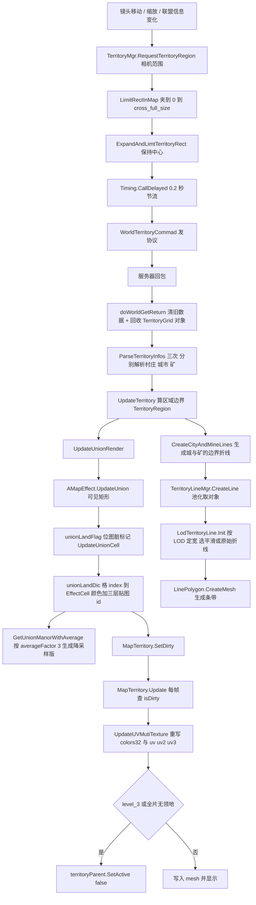
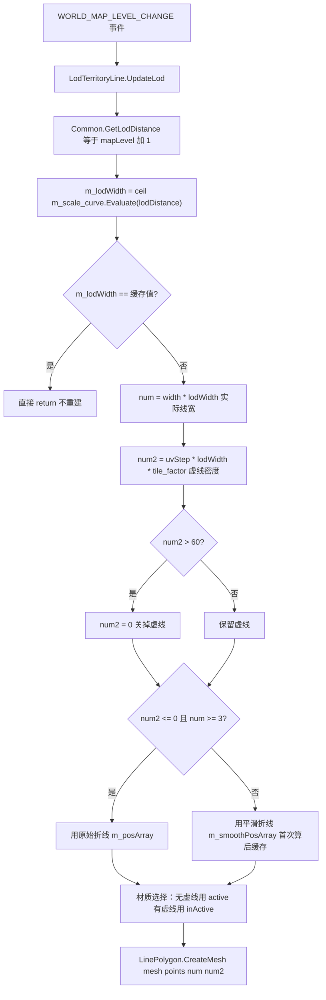
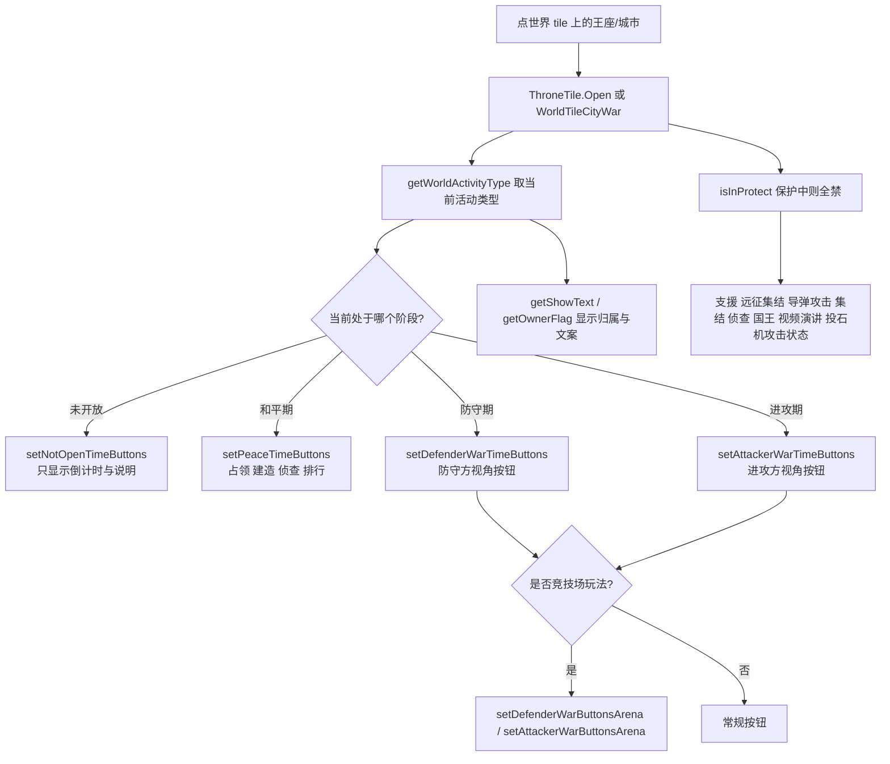
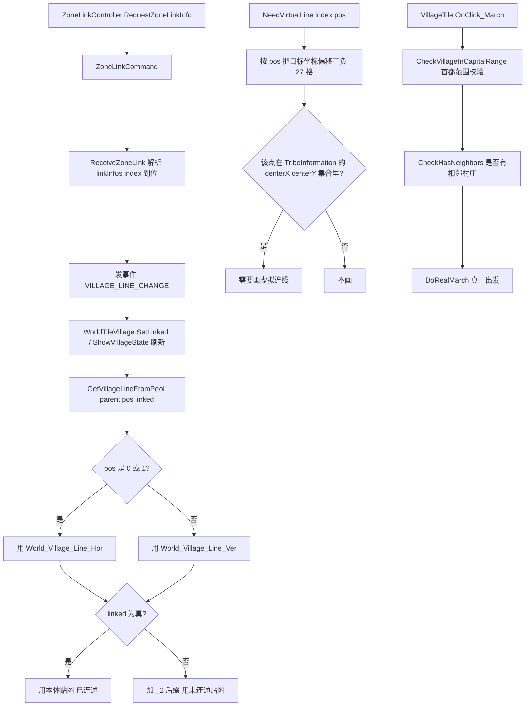

**■ 联盟领地与王座争夺使用说明（Territory / Throne / Fort / Village）**

> 项目: RedAlert_SuperFormation（红警 / 帝国 / KS 多品牌复用，SVN 无 git）
> 整理时间: 2026-09-20
> 核心代码: `IF/DayZClasses/scene/world/territoryLine/`（2 641 行）· `scene/world/ThroneTile.cs`（3 341 行）· `scene/world/AllianceFortTile.cs`（1 103 行）· `scene/world/Village/`（4 583 行）· `Ext/WorldTileMap/AMapEffect.cs` + `MapTerritory.cs`
> 数据全部由服务器权威下发（`territory.*` / `ZoneLinkCommand` / 8 个 `PushKingdom*`）
> 配套文档: [[城外大地图模块]]（本模块跑在大地图之上，索引/分片/渲染层全部复用）· [[场景管理模块]] · [[内城推格子模块]]

---

**■ 一、模块总览**

**▍ 1.1 一句话定位**

联盟争夺玩法分**两层**，一定要分开理解：

| 层 | 是什么 | 表现方式 | 核心类 |
|---|---|---|---|
| **面**（领地） | 联盟占领的格子集合 | **分片 mesh 顶点色染色 + 3 层 UV 边界贴图**（无对象、无 drawcall 增量）；外圈再画一条**平滑加宽的轮廓线** | `AMapEffect` + `MapTerritory` + `TerritoryMgr` + `TerritoryLineMgr` |
| **点**（王座 / 一二级城市 / 堡垒 / 村庄） | 争夺目标 | 各是一个 `WorldTileBase` tile + 一个详情面板 `NewBaseTileInfo` | `WorldTileThrone/MainThrone/CityWar` + `ThroneTile` / `AllianceFortTile` / `WorldTileVillage` + `VillageTile` |

两层的连接点只有一个：**`TerritoryMgr` 持有的格子归属表**——领地染色、轮廓线、村庄连线、放城校验（`IsInAllianceTerritory` 等 8 个 API）全都查它。

**▍ 1.2 核心文件**

| 文件 | 行数 | 职责 |
|---|---|---|
| `scene/world/territoryLine/TerritoryMgr.cs` | 1 675 | **领地总控**：格子归属表、区域计算、请求节流、区域/城/矿的连线生成、对外 8 个查询 API |
| `scene/world/territoryLine/TerritoryDebug.cs` | 227 | **区域可视化调试器**（`DrawRegions` / `DrawRectXZ`），改领地逻辑必备 |
| `scene/world/territoryLine/TerritoryMapItem.cs` | 206 | 地图上的领地项 |
| `scene/world/territoryLine/LinePolygon.cs` | 176 | 把折线 + 宽度 + UV 步进生成**条带 mesh** |
| `scene/world/territoryLine/LodTerritoryLine.cs` | 126 | **轮廓线对象 + LOD 加宽 + 平滑缓存**（一条线一个对象） |
| `scene/world/territoryLine/TerritoryItem.cs` | 101 | 线的最小单位：`联盟id + 颜色 + 矩形起止格(x1,y1,x2,y2)` |
| `scene/world/territoryLine/TerritoryLineMgr.cs` | 71 | 线的池化与「跟随地图位置/缩放」 |
| `scene/world/territoryLine/Common.cs` | 59 | `SmoothLine`（拐角圆滑）+ `GetLodDistance` |
| `Ext/WorldTileMap/AMapEffect.cs` | 764 | **领地染色数据源**：`unionLandDic`（格→`EffectCell`）、UV 图集、粗/细两套边界纹理、降采样版 |
| `Ext/WorldTileMap/MapTerritory.cs` | 385 | **每片（MapPiece）上的领地 mesh**：写 `colors32` + 4 组 UV |
| `Ext/WorldTileMap/MapPiece.cs` | 326 | 分片：加载对象、树木 LOD、`SetNodeActive`、持有 `territory` |
| `scene/world/ThroneTile.cs` | 3 341 | **王座详情面板**：6 套按钮组合 + 占领/集结/侦查/国王/导弹/投石机等全部操作 |
| `scene/world/AllianceFortTile.cs` | 1 103 | 联盟堡垒面板：耐久条、状态机、集结/回城 |
| `scene/world/worldObject/WorldTileThrone.cs` | 1 656 | 王座/主王座的世界表现（三档活动角标、联盟旗、保护、战报提示） |
| `scene/world/worldObject/WorldTileCityWar.cs` | ~260 | 一/二级城市的世界表现 |
| `scene/world/worldObject/WorldTileAllianceBuild.cs` | 1 014 | 联盟堡垒/联盟主堡的世界表现 |
| `scene/world/worldObject/WorldTileAllianceAreaBuild.cs` | 1 014 | 联盟区域建筑 |
| `scene/world/Village/WorldTileVillage.cs` | 418 | 村庄的世界表现（连通/归属/战斗/保护/怪物） |
| `scene/world/Village/VillageTile.cs` | 532 | 村庄面板：侦察/集结/行军/区域信息 + **首都范围校验** |
| `scene/world/Village/VillageDetailsInfoView.cs` | 1 682 | 村庄详情（排行榜/保护/奖励） |
| `scene/world/Village/ZoneLinkController.cs` | 162 | **村庄连线**（四向邻居判定 + 横/竖线拼图） |
| `scene/world/Village/CityWarDetailsInfoView.cs` | 548 | 城战详情 |

**▍ 1.3 数据流**

```text
镜头移动（WorldMapView2 → TerritoryMgr.RequestTerritoryRegion）
        │  取相机范围 → LimitRectInMap → ExpandAndLimtTerritoryRect
        │  ⚠️ Timing.CallDelayed(0.2f) 节流后发协议（每 0.2s 一批）
        ▼
WorldTerritoryCommad(rect)  →  territory.*
        │
        ▼
TerritoryMgr.doWorldGetReturn(dict, rect)
        ├─ 清空 territoryItemInfos + 回收 m_territoryGrids 全部对象
        ├─ ParseTerritoryInfos(cityDict, 表, type) × 3  → m_territoryVillages / m_territoryCities / m_territoryMines
        └─ UpdateTerritory(rect, territoryRegions)      ← 算出区域边界（TerritoryRegion）
                 │
                 ├─ UpdateUnionRender()  → AMapEffect.UpdateUnion(visibleRect)
                 │        ├─ unionLandFlag 位图脏标记 → UpdateUnionCell
                 │        ├─ unionLandDic[格 index] = EffectCell{ color, tiledIdLayer0/1/2 }
                 │        ├─ GetUnionManorWithAverage(…, averageFactor=3) → averageUnionLandDic（降采样）
                 │        └─ MapTerritory.SetDirty() → 每片 mesh 重写 colors32 + uv/uv2/uv3
                 │
                 └─ CreateCityAndMineLines() → CreateOneCityLineNew(cityInfo, enableAdjoin)
                          └─ TerritoryLineMgr.CreateLine(posArray, color, uvStep, width, mat)
                                   └─ LodTerritoryLine（池化）→ 监听 WORLD_MAP_LEVEL_CHANGE 调宽窄

村庄：ZoneLinkController.RequestZoneLinkInfo() → ZoneLinkCommand → linkInfos{ index → 位 }
        └─ 发 "VILLAGE_LINE_CHANGE" → WorldTileVillage 用 World_Village_Line_Hor/Ver 拼四向连线

争夺点：服务器推送 → WorldTileThrone/MainThrone/CityWar/Village/AllianceBuild 表现
        + 8 个 PushKingdom*（Name/King/Winner/ThroneOwne/ThroneOwnerCountdown/ThronePic/Res/Banner）
```

**▍ 1.4 渲染分层位置**

领地相关的对象落在大地图的哪一层（见 [[城外大地图模块]] §1.6）：

| 内容 | 挂载 | 排序 |
|---|---|---|
| **领地染色**（`MapTerritory` 的 `World_Territory` mesh） | 每片 `MapPiece` 的子节点（地表之上） | 由材质决定 |
| **领地轮廓线**（`LodTerritoryLine`） | `TerritoryLineMgr`（SingletonMono）→ 跟随 `m_map` 位置与缩放 | `sortingOrder = -30000`（压到最底，`LodTerritoryLine.cs:47-52`，赋值在 `:51`） |
| 村庄连线 | `villageLineRoot`（`WorldMapView2` 持有 `villageLines` / `villageLinesText` 列表） | — |
| 王座 / 城市 / 堡垒 / 村庄 tile | **`WM_CITY` 层**（`m_cityNode`，与所有城点同层，z 由 `getWorldMapZorder(index)` 决定） | — |
| 面板（`ThroneTile` / `AllianceFortTile` / `VillageTile`） | UI 弹窗层（`NewBaseTileInfo`，走 `PopupViewController`） | — |

---

**■ 二、流程图**

**▍ 2.1 领地数据 → 染色 → 轮廓线**



**▍ 2.2 轮廓线 LOD 加宽与平滑取舍**



**▍ 2.3 王座／城市：按钮按「阶段 × 攻守 × 竞技场」切换**



**▍ 2.4 村庄：四向连线与首都范围校验**



---

**■ 三、分主题详解**

**▍ 3.1 领地：格子归属与区域计算（`TerritoryMgr`）**

**关键常量**（`:13-28`、`:626`）：

| 常量 | 值 | 含义 |
|---|---|---|
| `GRIDS_OF_LENGTH_AT_WIDTH` / `_HEIGHT` | `60` / `60` | 领地网格的宽高（格） |
| `GridSizeX` / `GridSizeY` | `18` / `18` | **每个领地网格由 18×18 个世界格组成**（可被 `SetGridSize` 动态改，`:616`） |
| `BaseLineWidth` | `15` | 轮廓线基准宽度 |
| `BaseUVStep` | `100` | 轮廓线基准 UV 步进（虚线密度） |
| `OUT_OF_RANGE` | `100` | 超范围哨兵值 |
| `NO_ALLIANCE_NAME` | `"NoAlliance"` | 无联盟占位的名字键 |
| `TERRITORY_EXT` | `1.5f` | 请求范围扩张系数 |

**四邻遍历**用一维索引加减常量（`:48`）：

```text
directions = { -1, -_tile_count_x, 1, _tile_count_x }   // 左 上 右 下
```
因为在世界地图里 index = `x + y*_tile_count_x`，所以四邻就是 ±1 和 ±`_tile_count_x`——**任何一处 tile_count 变了，这套四邻遍历就会错位**。

**内部结构（5 张表 + 1 个列表）**：

| 字段 | 类型 | 用途 |
|---|---|---|
| `territoryItemInfos` | `List<TerritoryItemInfo>` | 服务器下发的原始项（每次 `doWorldGetReturn` 先清空） |
| `smallMap` | `Dictionary<int,int>` | 小地图用的降采样映射 |
| `territoryRegions` | `List<TerritoryRegion>` | 算出的**区域**（一块连续领地），供染色与调试器使用 |
| `m_territoryGrids` | `Dictionary<int,TerritoryGrid>` | 格子对象，**用对象池 `ObjectPoolManager.RecycleReusableObject` 回收** |
| `m_territoryVillages` / `m_territoryCities` / `m_territoryMines` | `Dictionary<string,TerritoryCityInfo>` | **村庄 / 城市 / 矿** 三类目标表（都按 string id 索引） |
| `m_rangeRect` | `Rect` | 当前已请求的范围（节流与重刷的基准） |

**对外查询 API（外部只应通过这些判断，不要自己读表）**：

| API | 行 | 用途 |
|---|---|---|
| `GetTerritoryRegionColor(Vector2)` | `:54` | 某格所属领地颜色 |
| `GetTerritoryRegion(int point)` | `:67` | 某格所属区域 |
| `GetAllianceColor(int index)` | `:81` | 某格的联盟颜色 |
| `IsInAllianceTerritory(int index, bool needActivity)` | `:102` | **是否在自己联盟领地内**（可要求「领地玩法开启」） |
| `IsInOtherAllianceTerritory(int index)` | `:128` | 是否在别人领地内 |
| `IsAllianceTerritoryDisableOrInBuilding(int)` | `:147` | 领地是否失效或建造中 |
| `IsAllianceTerritoryDisable(int)` | `:153` | 是否失效 |
| `IsAllianceTerritoryInBuilding(int)` | `:162` | 是否建造中 |
| `IsIntersectWithRect(center, w, h)` | `:171` | 矩形与领地是否相交（放多格建筑用） |

**请求节流**（`:220`）：取相机范围 → `LimitRectInMap`（夹到 `0 ~ cross_full_size`）→ `ExpandAndLimtTerritoryRect`（保持中心、按 `TERRITORY_EXT` 扩）→ **`Timing.CallDelayed(0.2f)` 后发协议**。原本「范围没超出旧范围就不发」的判断被注释掉了（`:225-232`），所以节流只靠 0.2 秒。

**刷新触发**：`OnAllianceInfoChanged`（`:294`）监听三个事件 —— `MSG_ALLIACNE_HELP_NUM_CHANGE`、`MSG_AZ_TERRITORY_UPDATE_INFO`、`"dismissAlliance"`（联盟解散）→ 重发协议；`WorldMapLevelChange`（`:302`）时若 `level < level_3` 则**强制**重请求 + `UpdateUnionRender()`。

**区域连线生成**：`CreateCityAndMineLines()`（`:975`）遍历城/矿，对每个调 `CreateOneCityLineNew(cityInfo, enableAdjoin)`（`:1002`，新版）；旧版 `CreateOneCityLine(cityInfo)`（`:1091`）保留未删。静态批量版 `UpdateTerritoryS(territoryInfos, mat)`（`:1130`）→ `UpdateTerritory(...)`（`:1135`）→ `CreateTerritoryLine(territory_list, uvStep, width, mat)`（`:1182`）**供地图分片直接调用**（走材质而不是走对象）。

**调试**：`TerritoryDebug`（`MonoSingleton`）—— `SetData(List<TerritoryRegion>)`（`:58`）灌数据、`DrawRegions()`（`:74`）在 OnGUI 里画区域、`DrawRectXZ(Rect)`（`:212`）画矩形。改领地算边界时**先开这个**，不要靠肉眼猜。

**▍ 3.2 领地染色（`AMapEffect` + `MapTerritory`）**

**数据结构**（`AMapEffect.cs`）：

```text
EffectCell {                        // 一个格子的表现（:9-18）
    string unionId;
    int x, y;
    int tiledIdLayer0 = 13;         // 默认 13（对应 TEXTURE_THIN）
    int tiledIdLayer1 = -1;
    int tiledIdLayer2 = -1;
    Color32 color;
}
unionLandDic          : Dictionary<long 格index, EffectCell>   // 真实数据（:42）
averageUnionLandDic   : Dictionary<long 格index, EffectCell>   // 降采样版（:46），averageFactor = 3（:52）
unionLandFlag         : byte[]                                 // 位图脏标记（:40）
averageUnionLandFlag  : byte[]                                 // （:44）
uvArrDic              : Dictionary<int, Vector2[]>             // UV 图集（:48）
UV_COL = 4, UV_ROW = 8                                          // 图集 4 列 8 行（:56-57）
TEXTURE_THIN = 13, TEXTURE_BOLD = 14                            // 细线 / 粗线两套边界贴图（:59-60）
```

**染色流程**：`UpdateUnion(visualRect, enableRect)`（`:258`）→ `UpdateUnionCell(unionLandDic, unionLandFlag, visualRect, enableRect)` 按位图只处理脏格 → `GetUnionManorWithAverage(unionLandDic, averageFactor, averageUnionLandDic)`（`:269`）生成**降采样版**（低 LOD / 小地图用）。

增删领地：`addUnionManor(uId, sights, color)`（`:247`）/ `removeUnionManor(uId, sights)`（`:252`）—— 传的是**一整个 HashSet<int> 的格子**，不是单个格子。

**粗/细线切换**：`SetBoldType(bool)`（`:229`）—— `MapTerritory.WorldMapLevelChange` 里 `level_1` 设 `false`（细线），其他设 `true`（粗线）。`GetRealUVId(uvId)`（`:234`）把逻辑 id 映射到图集真实 id（**因为有降采样，不能直接用**）。

**`MapTerritory`（每片一个 mesh）**：

- mesh 尺寸：`meshTiledCol/Row = FastMapDataManager.tiledPhysicCol/Row ÷ m_tile_piece_count_in_row`（`InitDefaultConfig`），即**每个分片自己是一个格阵列**。
- **写入 4 组顶点属性**（`UpdateUVMutiTexture`）：
  ```text
  territoryMeshFilter.mesh.uv    = tempUV0;   // 第 1 层边界贴图
  territoryMeshFilter.mesh.uv2   = tempUV1;   // 第 2 层
  territoryMeshFilter.mesh.uv3   = tempUV2;   // 第 3 层
  territoryMeshFilter.mesh.uv4   = tempUV3;   // 预留（恒为 UVNone）
  territoryMeshFilter.mesh.colors32 = colors; // 每个顶点 4 个顶点色（同格同色）
  ```
  每格写 **4 个顶点 × (4 组 UV + 1 颜色) = 20 个分量**。
- 防接缝：`groundFixScale = 0.001f`（`:21`）—— 地块 scale 稍微放大一点，避免两片连接处穿帮；`InitDefaultConfig` 里把 `m_tile_width * (scale + groundFixScale)` 当作实际宽高。
- 脏标记：`SetDirty()`（`:129`）→ `Update()` 每帧 `if (isDirty) UpdateUVMutiTexture()`（`:136-143`）。
- 早退：`level_3` 直接 `territoryParent.SetActive(false)`；全片无领地（`allNone`）同样隐藏。
- 回收：`DestroySelf()`（`:352`）把 `territoryParent` 送回 `WorldMapFactory` 的 `"World_Territory"` 池并摘掉 LOD 监听；**`MapPiece.DestroySelf` 里会同时销毁 `territory`**（见 [[城外大地图模块]] §3.1 的分片回收），所以分片回收时染色对象不会漏。

**`MapPiece` 上跟领地联动的东西**（`MapPiece.cs`）：`SetNodeActive(int index, bool active)`（`:308`）—— 被 `WorldTileSecretMgr` 用来隐藏军情点上的地表对象；树木单独一层 `treeParent` + `CanShowTree(GameObject)`（`:296`）+ `treeData`（`:50`），随 LOD 显隐。

**▍ 3.3 领地轮廓线（`TerritoryLineMgr` → `LodTerritoryLine` → `LinePolygon`）**

**一条线 = 一个对象**，池化：

```text
TerritoryLineMgr  (:6)
  GetOrCreateTerritoryLineObject()   // 池里 Pop，否则 Resources.Load("map_building/territory_line_obj") 实例化
  CreateLine(pos_array, color, uvStep, width, mat)   // :15  固定 smooth_distance = 2f
  ReturnToPool(component)             // Reset() + SetActive(false) + Push
  ClearAllLine()                      // 全回收
  Update()                            // :53  每帧 transform.localPosition = m_map.getPosition3D()
                                      //      transform.localScale = scale
```

> 注意：`TerritoryLineMgr` 里的 `Update()` 让整条线**跟随地图的位置与缩放**——所以线的坐标是**地图局部坐标**，不需要自己乘缩放。

**`LodTerritoryLine` 三个要点**：

1. **压到最底**：`Awake` 里 `m_meshRenderer.sortingOrder = -30000`（`:47-52`，赋值在 `:51`）——领地线永远在所有对象下面。
2. **LOD 加宽**（`UpdateWidth`）：
   ```text
   lodDistance = Common.GetLodDistance() = (int)mapLevel + 1     // Common.cs:54-57
   m_lodWidth  = ceil(m_scale_curve.Evaluate(lodDistance))       // 曲线配在 prefab 上
   num  = m_width * m_lodWidth          // 实际线宽
   num2 = m_uvStep * m_lodWidth * m_tile_factor
   if (num2 > 60) num2 = 0              // 虚线太密就直接关掉虚线，改画实线
   ```
   同一 `m_lodWidth` 直接 return（缓存 `m_oldLodWidth`），所以**只在 LOD 跨档时重建**。
3. **平滑取舍**：`num2 <= 0 && num >= 3` 用原始折线（宽而实，拐角看得见无所谓）；否则用 `Common.SmoothLine(pos, smooth_distance, 2)`，**结果缓存在 `m_smoothPosArray`**（只在 `== null` 时算，`Reset()` 才清）。

**`Common.SmoothLine`（`Common.cs:19-53`）** —— 拐角圆滑算法：对每个中间点，若前后两段长度都 `> smooth_distance * 2`，就把这个角点拆成「沿前段退 `smooth_distance`」和「沿后段进 `smooth_distance`」两个点；`iterate` 控制迭代次数，**且每轮把 `smooth_distance` 除以 `(已迭代次数+1)` 递减**。

**`LinePolygon.CreateMesh(mesh, points, width, uvStep)`** —— 把 (点列 + 宽度 + UV 步进) 生成条带 mesh；`uvStep > 0` 时是有虚线的材质（`m_inActiveMaterial`），否则 `m_activeMaterial`，切材质时同时 `SetColor("_Color", m_color)`。

**线的最小数据单位**（构造函数 `TerritoryItem.cs:91`）：

```text
TerritoryItem( allianceId, color, startX, startY, endX, endY )
```
即**矩形格区间**，而不是任意多边形 —— 领地边界是按矩形段拼出来的。

**▍ 3.4 王座 / 一二级城市 / 雕像**

| 类 | 继承 | 说明 |
|---|---|---|
| `WorldTileThrone` | `WorldTileBase, ScheulerUpdateTarget`（`WorldTileThrone.cs:7`） | 王座世界表现基类 |
| `WorldTileMainThrone` | `WorldTileThrone`（`:63`） | **大王座**：额外带 `WorldTileCityNameLabel` / `CityWarStateLabel` / `CityBattleTip` / `WorldCityData` / 战斗粒子（`:72-77`） |
| `WorldTileTrebuchet` | `WorldTileThrone`（`:853`） | **投石机继承王座**，复用整套状态逻辑 |
| `WorldTileCityWar` | `WorldTileBase`（`WorldTileCityWar.cs:7`） | 一/二级城市：`WorldTileCityNameLabel` + `AreaBuildingLabel` + `AreaBuildingState` + `WorldTileBuildStateLabel` + `CityWarStateLabel` + `CityBattleTip` |
| `WorldTileKingdomMedal` | `WorldTileBase` | 大王座雕像 |

**王座的三档活动角标**（`WorldTileMainThrone`）：

| 档 | update / add |
|---|---|
| 活动 1 | `updateTagThroneActivity1(state, info)`（`:540`）/ `addTagThroneActivity1()`（`:579`） |
| 活动 2 | `updateTagThroneActivity2(state, info)`（`:631`）/ `addTagThroneActivity2(info)`（`:650`） |
| 活动 3 | `updateTagThroneActivity3(state, info)`（`:709`）/ `addTagThroneActivity3()`（`:723`） |
| 保护 | `updateTagProtect()`（`:496`）/ `addTagProtect()`（`:521`）/ `addProtectParticle()`（`:838`） |
| 联盟旗 | `updateTagAllianceFlag(info)`（`:769`）/ `addTagAllianceFlag(info)`（`:795`） |
| 背景 | `addBG()`（`:618`） |

其他：`getHostCityInfo()`（`:44`，取宿主城信息）、`initBaseInfo()`（`:372`）、`getDialog()`（`:440`，城状态对话文案）、`getThroneIndex(picId)`（`:749`，按图 id 反查王座索引）、`ShowBattleEffect()` / `clearBattleEffect()`（`:239`/`:259`）、`OnFocus` / `OnBlur`（`:268`/`:276`，聚焦时放大等表现）、`update(float sec)`（`:288`，作为 `ScheulerUpdateTarget` 每帧跟状态）。

**`ThroneTile`（3 341 行面板）** —— 核心是「按钮按阶段组合」：

| 方法 | 行 | 场景 |
|---|---|---|
| `getWorldActivityType()` | `:555` | 取当前活动类型（决定下面走哪套） |
| `setNotOpenTimeButtons()` | `:893` | 未开放：只给倒计时/说明 |
| `setPeaceTimeButtons()` | `:936` | 和平期：占领 / 建造 / 侦查 / 排行 |
| `setDefenderWarTimeButtons()` | `:1033` | 战争期·防守方 |
| `setAttackerWarTimeButtons()` | `:1102` | 战争期·进攻方 |
| `setDefenderWarButtonsArena()` | `:1155` | 竞技场·防守方 |
| `setAttackerWarButtonsArena()` | `:1140` | 竞技场·进攻方 |
| `setViewCityGuideButtons()` | `:1169` | 观战引导按钮 |

操作入口（全部是 `onClickXxx`）：支援 `:142` · 信息 `:331` · 远征集结 `:345` · **导弹攻击 `attackWithMissile` `:363`** · 建筑信息 `:406` · 联盟积分排行 `:418` · 部队 `:449` · 集结 `:476` · 侦查 `:570` · **国王 `:639`** · 联盟标记 `:706` · 事件 `:734` · 快报 `:741` · **占领 `:751`** · 视频演讲 `:801` · **投石机攻击状态 `:838`**。显示类：`getShowText()`（`:858`）、`getOwnerFlag()`（`:877`）、`isInProtect()`（`:565`）、`isSelfBuild()`（`:352`，可被派生类覆写）。战报条目结构 `FightInfo { long time; string content; }`（`:1182`）。

**服务器权威**：王国相关全部走 8 个推送（`Net/push/`）：`PushKingdomName` / `PushKingdomKing` / `PushKingdomWinner` / `PushKingdomThroneOwne`（王座归属）/ `PushKingdomThroneOwnerCountdown`（占有倒计时）/ `PushKingdomThronePic` / `PushKingdomRes` / `PushKingdomBanner`。**客户端不做任何王座归属推断**。

**▍ 3.5 堡垒与联盟建筑**

`AllianceFortTile : NewBaseTileInfo, ScheulerUpdateTarget`（1 103 行）：

| 能力 | 方法 |
|---|---|
| 请求详情（静态，可当工具用） | `SendDetailCommand(index, serverId, callback)`（`:115`）→ `DetailCallCallback`（`:90`）/ `DetailCallback(info, index)`（`:151`） |
| 耐久 | `showProgressBar()`（`:570`）/ `updateProBar(durable, maxDurable)`（`:577`） |
| 状态机 | `getState() → TerritoryTileState`（`:600`） |
| 按钮图 | `getButtonPic(TileButtonState state)`（`:272`） |
| 集结/回城 | `OnGetTownPlacePositions(NetResult)`（`:1019`）/ `onButtonGoHome()`（`:1061`） |
| 引导 | `GuideCheck()`（`:1092`） |

世界表现：`WorldTileAllianceBuild`（1 014 行，堡垒/联盟主堡）、`WorldTileAllianceAreaBuild`（1 014 行，区域建筑）、`AAreaBuildCCB : CCAniNode`（联盟区域建筑的表现节点）。

**▍ 3.6 村庄（争夺点 + 连线）**

**世界表现 `WorldTileVillage : WorldTileBase`（418 行）**：

| 方法 | 行 | 用途 |
|---|---|---|
| `SetLinked(object)` | `:139` | **连通状态变化**（→ 决定用连通贴图还是未连通贴图） |
| `AddAreaSprite(info)` | `:157` | 区域底色 |
| `AddBlackSprite(info)` | `:170` | 黑化/未归属遮罩 |
| `ShowVillageState(object)` | `:186` | 状态刷新入口 |
| `updateTagProtect()` / `addTagProtect(float scale = 2.0f)` | `:201` / `:226` | 保护罩（**村庄的默认 scale 是 2.0，比其他点大**） |
| `InitVillage()` | `:236` | 初始化 |
| `UpdateNameLabel()` / `CreateNameUI()` | `:256` / `:362` | 名牌 |
| `UpdateVillage()` / `UpdateVillageMonster()` / `UpdateStateUI()` | `:292` / `:301` / `:308` | 每帧刷新 |
| `GetEndTimeStr()` / `GetRichTextByAlliance(str)` | `:321` / `:345` | 倒计时 / 富文本 |
| `ShowBattleEffect()` / `clearBattleEffect()` | `:108` / `:130` | 战斗表现 |
| `OnFocus` / `OnBlur` | `:70` / `:79` | 聚焦表现 |

**面板 `VillageTile : NewBaseTileInfo`（532 行）**：

| 能力 | 方法 | 行 |
|---|---|---|
| 按钮装配 | `AddButtons()` | `:100` |
| 侦察 / 集结 / 行军 | `OnClick_Scout` / `OnClick_Rally` / `OnClick_March` | `:261` / `:334` / `:384` |
| 真正执行 | `DoRealRally()` / `DoRealMarch()` | `:375` / `:494` |
| **首都范围校验** | `CheckVillageInCapitalRange(out bool isPass)` | `:441` |
| **相邻村庄校验** | `CheckHasNeighbors(WorldCityInfo info)`（静态） | `:475` |
| 区域信息 / 标记 | `OnClick_AreaInformation` / `OnClickMark` | `:314` / `:251` |
| 详情 | `OnClick_Information` | `:299` |
| 怪物信息 | `UpdateMonsterInfo(cityInfo)` | `:86` |
| 恢复倒计时 | `updateRecoverTime(t)` | `:80` |
| 收藏 | `getFavoriteView()` | `:503` |
| 引导 | `GuideCheck()` | `:520` |

**连线 `ZoneLinkController`（162 行，纯数据 + 拼图，不是 MonoBehaviour）**：

```text
构造：从 DataAtlasManager 的 TribeInformation 表读 centerX/centerY
      → WorldController.getIndexByPoint → villageIndexSet（所有村庄索引）
请求：RequestZoneLinkInfo() → ZoneLinkCommand → ReceiveZoneLink
      linkInfos : Dictionary<int index, int 位标记>
      → 发事件 "VILLAGE_LINE_CHANGE"
查询：GetVillageLine() / GetLinkInfoByIndex(index) / GetLinkInfoByRect(rect)
取件：GetVillageLineFromPool(parent, pos, linked)
      pos 0/1 → WorldMapPiece/3D/map_landform/World_Village_Line_Hor
      pos 2/3 → .../World_Village_Line_Ver
      linked == false 时名字加后缀 "_2"（未连通用另一张贴图）
虚拟线：NeedVirtualLine(index, pos) → 把坐标按 pos 偏移 ±27 格
        → 命中 villageIndexSet 则说明该方向还有村庄，需要补一条虚拟连线
回收：ResetVillageLineToPool(node)
```

**村庄周边还有一整套子系统**：`VillageDetailsInfoView`（1 682，排行榜/保护/奖励）· `CityWarDetailsInfoView`（548）· `VillageProtectionDetailView` · `VillageLinkTipView`（153，连线提示）· `VillageRankPlayerCell` / `VillageRankPlayerInfo`（排行）· `StrongholdLabel`（424，据点标签）· `VillageStatus`（状态枚举）· `RankRewardPreview`（295）/ `FirstRankRewardPreview`（146，奖励预览）。

**协议清单**（`Net/command/`）：`WorldTerritoryCommad(rect)`（领地）· `territory.point` → `AZTerritoryController.ParseSuitableTerritoryPoints`（可建领地）· `AllianceTerritoryShowCommand(bool)`（`Global.ALLIANCE_TERRITORY_SHOW`，受功能开关 `alliance_territory_system` 控制）· `GetTerritoryPointsCommand` · `GetTerritoryAvailableCommand` · `GetTerritoryEffectCommand` · `GetCityVillageListCommand` · `GetVillageWarInfoCommand` · `ZoneLinkCommand`。

---

**■ 四、使用方法**

**▍ 4.1 判断「某格能不能干某事」——统一用 TerritoryMgr，不要自己读表**

```text
// 是否在我方领地内（放置/建造/资源加成等）
TerritoryMgr.getInstance().IsInAllianceTerritory(index, needActivity: true);
// 是否在敌对领地内
TerritoryMgr.getInstance().IsInOtherAllianceTerritory(index);
// 领地是否处于失效/建造中（失效时资源加成通常不生效）
TerritoryMgr.getInstance().IsAllianceTerritoryInBuilding(index);
// 多格建筑：矩形是否与任何领地相交
TerritoryMgr.getInstance().IsIntersectWithRect(centerTilePos, width, height);
// 取颜色（做小地图/UI 用）
TerritoryMgr.getInstance().GetAllianceColor(index);
```

**▍ 4.2 新增一个「争夺点」**

1. **世界表现**：新建 `class WorldTileXxx : WorldTileBase`，实现 `public new static WorldTileXxx create(int index)`（最简参考 `WorldTileKingdomMedal`）。若要有战斗/保护表现，直接抄 `WorldTileVillage` 的 `ShowBattleEffect` / `updateTagProtect` / `OnFocus,OnBlur` 三件套。
   - 需要每帧跟状态就再实现 `ScheulerUpdateTarget.update(float)`（王座、堡垒面板都这么做）。
2. **注册类型**：在 `WorldDataDefine.cs` 的 `WorldCityType` 加值，并在 **`WorldTileFactory.createWorldTile` 的 switch 加 case**（该文件是 GBK 编码，见 §六）。
3. **详情面板**：新建 `class XxxTile : NewBaseTileInfo`，实现 `Open()` / `Close()` / `getFavoriteView()`；点击链参考 `VillageTile.OnClick_March` → `DoRealMarch`（校验在前、发包在后）。
4. **UI 分层**：面板走 `PopupViewController`；世界上的名牌用 `WorldTileUIController.createUI("label", "...")` + 继承 `WorldTieldUI`。

**▍ 4.3 新增/调试一块领地**

- **加领地**：`AMapEffect.Instance.addUnionManor(unionId, HashSet<int> 格子索引集合, color)`（`:247`），删是 `removeUnionManor`。**一次传整块**，别逐格调。
- **让染色生效**：`MapTerritory.SetDirty()`（每个分片各自调；正常由 `UpdateUnionRender` 统一触发），`MapTerritory.Update()` 会在下一帧重写 mesh。
- **看区域算得对不对**：`TerritoryDebug.SetData(TerritoryMgr.getInstance().territoryRegions)` + `DrawRegions()`（OnGUI 画框）。这是最快的领地调试姿势。
- **强制重刷**：`TerritoryMgr.getInstance().RequestTerritoryRegion(rect)`；注意内部有 `CallDelayed(0.2f)`，连续调要等。
- **改线宽/虚线**：不用改代码 —— `LodTerritoryLine` 上的 `m_scale_curve`（每档 LOD 的宽度倍率）、`m_tile_factor`、`m_activeMaterial` / `m_inActiveMaterial` 都是 prefab 上暴露的字段；`TerritoryMgr.BaseLineWidth(15)` / `BaseUVStep(100)` 是基准值。

**▍ 4.4 触发/清空村庄连线**

```text
ZoneLinkController.Instance.RequestZoneLinkInfo();   // 请求（内部发 ZoneLinkCommand）
ZoneLinkController.Instance.ClearZoneLinkInfo();     // 清空并广播 "VILLAGE_LINE_CHANGE"
ZoneLinkController.Instance.GetLinkInfoByRect(rect); // 只要视口内的
```

**▍ 4.5 调试手段**

| 目的 | 手段 |
|---|---|
| 领地区域可视化 | `TerritoryDebug`（`DrawRegions` / `DrawRectXZ`） |
| 领地数据原文 | `TerritoryMgr.doWorldGetReturn` 入口会 `LogCommon.LogWarning("territory data : " + dict.ToJson())` —— **完整服务器 JSON 在这里** |
| 污染值开关 | `TerritoryMgr.TestType`（`public static int`，`:11`） |
| 当前请求范围 | `TerritoryMgr.m_rangeRect` |
| 王座状态 | `ThroneTile.getWorldActivityType()` / `getShowText()` / `getOwnerFlag()` / `isInProtect()` |
| 堡垒状态 | `AllianceFortTile.getState() → TerritoryTileState` |
| 村庄连通 | `ZoneLinkController.GetLinkInfoByIndex(index)`；世界侧看 `WorldTileVillage.SetLinked` |
| 分片上的领地对象 | `MapPiece.territory`；池名 `"World_Territory"` / `"map_building/territory_line_obj"` |

---

**■ 五、常量与配表事项**

1. **领地网格与世界格的换算基准**：`GridSizeX/Y = 18`（`TerritoryMgr.cs:22/24`）——一个领地网格 = 18×18 世界格；可用 `TerritoryMgr.SetGridSize(x, y)`（`:616`）动态改。改这个值会同时影响染色与轮廓线的拓扑。
2. **`directions` 数组必须与 `_tile_count_x` 一致**：`{ -1, -_tile_count_x, 1, _tile_count_x }`（`:48`），是四邻遍历的全部基础。
3. **请求范围扩张**：`TERRITORY_EXT = 1.5f`（`:626`）——按 1.5 倍扩相机范围再请求，防止边滑边出现空白。
4. **两张边界纹理**：`AMapEffect.TEXTURE_THIN = 13` / `TEXTURE_BOLD = 14`（`:59-60`）；`EffectCell.tiledIdLayer0` **默认就是 13**（`:15`），level_1 用细线、其他用粗线（`SetBoldType`）。
5. **UV 图集规约**：`UV_COL = 4` / `UV_ROW = 8`（`:56-57`）——图集 4 列 8 行，改图集尺寸必须同步改这两个常量。
6. **降采样倍率**：`AMapEffect.averageFactor = 3`（`:52`）——低 LOD / 小地图用的聚合粒度。
7. **线的池化 prefab 路径**：实际用 `Resources.Load("map_building/territory_line_obj")`（`TerritoryLineMgr.cs:26`）。改路径只改这里就行（另一个常量是死的，见 §六）。
8. **村庄邻居距离 = 27 格**（`ZoneLinkController.cs` `NeedVirtualLine` 内的 `±27`）——与 `TribeInformation` 表的 `centerX/centerY` 强耦合，**改动必须两处同步**。
9. **村庄连线资源**：`WorldMapPiece/3D/map_landform/World_Village_Line_Hor` · `..._Ver` · 未连通版 `_Hor_2` / `_Ver_2`（`ZoneLinkController.cs:110-121`，横线 `:116` / 竖线 `:120`）。
10. **王座按钮阶段**由 `WorldActivityType` 决定（`ThroneTile.getWorldActivityType()`），不是本地时间判断。
11. **功能开关**：领地玩法受 `CCCommonUtils.checkIsOpenByKey("alliance_territory_system")` 控制（`AllianceTerritoryShowCommand.cs:20-24`）——**关开关时协议根本不发**，表现为「领地表空着」。
12. **王座/王国数据全服务器下发**：8 个 `PushKingdom*`；客户端不要缓存推断归属。

---

**■ 六、注意事项（已知坑）**

| 级别 | 问题 | 位置 |
|---|---|---|
| 🟠 | **`m_line_prefab_path` 是死常量**：`TerritoryLineMgr.cs:10` 定义 `"troop/territory_line"` 但从未使用，真正的加载写死在 `GetOrCreateTerritoryLineObject` 里（`Resources.Load("map_building/territory_line_obj")`，`:26`）→ 按常量改路径会「改了没生效」 | `territoryLine/TerritoryLineMgr.cs:10` vs `:26` |
| 🟠 | **领地请求的「范围去重」被注释掉了**：`RequestTerritoryRegion` 里 `if (rect 超出 m_rangeRect) {...}` 整段注释（`:225-232`），只剩 `Timing.CallDelayed(0.2f)` 节流 → 连续拖动地图时协议按调用频率成批发出（每 0.2s 一批），**协议量与操作频率正相关** | `territoryLine/TerritoryMgr.cs:220-238` |
| 🟠 | **村庄邻居距离硬编码 27 格**：`NeedVirtualLine` 里 `targetPos.x ± 27` / `targetPos.y ± 27`，与 `TribeInformation` 表的 `centerX/centerY` 间距强耦合；村庄布局一变，连线就错位（且没有常量、没有注释说明 27 的来历） | `Village/ZoneLinkController.cs` `NeedVirtualLine` |
| 🟠 | **新旧两套领地计算并存**：新（`UpdateTerritory(rect, territoryRegions)` `:628` + `CreateOneCityLineNew` `:1002`）与旧（`ClearTerritoryCacheCurrent` `:542` / `doCaculateTerritoryRegions` `:582` / `CheckNode` `:592` / `CreateOneCityLine` `:1091` / `GetDisabledColor` `:889` / `GetInBuildingColor` `:895`）大量注释代码与两套静态版（`UpdateTerritoryS` `:1130`）混在一个文件里 → **改之前必须确认当前实际走哪条链**，否则改的是死代码 | `territoryLine/TerritoryMgr.cs` 多处 |
| 🟡 | `MapTerritory.UpdateUVMutiTexture` 是**三层嵌套循环 + 每格写 20 个顶点分量**（4 顶点 × (4 UV + 1 色)），每片 mesh 都要全量重写；`Update()` 每帧查 `isDirty` → 领地频繁变化（大规模领地战）时是明显 CPU 峰值 | `Ext/WorldTileMap/MapTerritory.cs` `UpdateUVMutiTexture` |
| 🟡 | `MapTerritory` 的 **`tempUV3` 恒为 `UVNone`**（无条件写零），第 4 组 UV 是预留未用 → 白白占一份顶点属性（显存 + 带宽） | `Ext/WorldTileMap/MapTerritory.cs` `UpdateUVMutiTexture` |
| 🟡 | **平滑折线只算一次并缓存**：`LodTerritoryLine.UpdateWidth` 里 `if (m_smoothPosArray == null) m_smoothPosArray = SmoothLine(...)` → LOD 变化（线宽变了）后**不会重算平滑**，只有 `Reset()`（回池）才清。表现为「缩放到不同档，同一块领地的圆角粗细不一致」 | `territoryLine/LodTerritoryLine.cs` `UpdateWidth` |
| 🟡 | `LodTerritoryLine.Awake` 把 `sortingOrder` **写死 -30000**（`:51`）——领地线永远压在最底；若要某内容盖住领地线（如水面、遮罩）只能改代码 | `territoryLine/LodTerritoryLine.cs:51` |
| 🟡 | 正常数据用 `LogCommon.LogWarning` 打全量 JSON：`doWorldGetReturn` 入口 `LogCommon.LogWarning("territory data : " + dict.ToJson())`（`:331`）→ 每次领地刷新都序列化并打一整包 JSON，**大范围刷新时日志量很大**（好处是排查方便，上线应关） | `territoryLine/TerritoryMgr.cs:331` |
| 🟡 | **`WorldTileTrebuchet : WorldTileThrone`**：投石机继承王座 → 会带上王座的三档活动角标与联盟旗逻辑（`:853`） | `worldObject/WorldTileThrone.cs:853` |
| 🟡 | 面板巨型化 + 无状态机抽象：`ThroneTile` 3 341 行、`AllianceFortTile` 1 103 行、`VillageDetailsInfoView` 1 682 行；王座按钮用 6 个 `setXxxButtons` 平铺互斥切换（`:893/:936/:1033/:1102/:1140/:1155`），新加一个阶段就要在 6 处补逻辑 | `ThroneTile.cs` / `AllianceFortTile.cs` / `Village/VillageDetailsInfoView.cs` |
| 🟡 | `WS` 编码：`WorldTileFactory.cs`（世界 tile 工厂）等文件是 **GBK 编码**，`read_file` 会判成 binary 读不出来；本模块的 `scene/world/**` 里也有多份（详见 [[城外大地图模块]] §六-2） | `scene/world/worldObject/WorldTileFactory.cs` 等 |
| 🟡 | `IsSecrtTiled` 恒 false 的坑（军情点判断）与本模块共用同一份障碍数据 `WorldMapBlockDataManager` → 涉及「领地内能否建」的判断**不要**间接依赖它 | `Ext/WorldTileMap/WorldMapBlockDataManager.cs:117-127` |

**「领地/王座不对」排查顺序**

1. **领地整块不显示** → 先看功能开关 `alliance_territory_system`（§五-11），再看 `TerritoryMgr.m_rangeRect` 是否覆盖当前视口、`doWorldGetReturn` 的 JSON 日志里有没有该区域。
2. **染色有但轮廓线没有** → 看 `TerritoryLineMgr` 的池是否被 `ClearAllLine` 清空后没重建；确认 `WORLD_MAP_LEVEL_CHANGE` 到了（线只在事件与创建时重建）。
3. **线宽/虚线不对** → `LodTerritoryLine.m_scale_curve` 的曲线与 `m_tile_factor`（prefab 字段），以及平滑缓存没重算（§六-7）。
4. **村庄之间连线缺一段或错位** → 检查 `NeedVirtualLine` 的 27 格假设（§六-3）与 `linkInfos` 的值。
5. **王座按钮少/多** → `getWorldActivityType()` 返回的活动类型 + 当前阶段（和平/防守/进攻/竞技场四选一），六个 `setXxxButtons` 是互斥的，走到哪个由阶段决定。
6. **领地边界与地图错位一格** → 统一用 `WorldController.getIndexByPoint` / `getPointByIndex`；`TerritoryMgr.directions` 依赖 `_tile_count_x` 正确初始化。
7. **分片回收后领地对象泄漏** → 确认走的是 `WorldMapPieceManager` 的回收路径（它同时销毁 `MapPiece` 与 `MapPiece.territory`），不要手动 `Destroy` 单个对象。

---

**■ 七、相关文档**

- 同目录姊妹模块：[[城外大地图模块]]（索引/分片/渲染层/行军线/刷怪全部复用本模块的 `WorldCityType` 与 `WorldTileBase`）· [[场景管理模块]]（`SCENE_ID_WORLD`）· [[内城推格子模块]] · [[大地图]] · [[指引模块]]
- 跨模块交汇点：
  - **放城/建造校验**：`WorldController.isAroundCanBuildGrid` / `getBuildGridDistFromTerritory` / `getBuildGridDistCost` 与 `TerritoryMgr.IsInAllianceTerritory` 是两层校验（前者算距离、后者算归属），改动要成对考虑
  - **军情点显隐**：`WorldTileSecretMgr` 用同一份障碍组数据；`MapPiece.SetNodeActive` 是它的落地方法
  - **王座/城市争夺**会走 `MiniGameManager.EnterGame` 进小游戏（红警品牌），返回链见 [[城外大地图模块]] §2.4
- 未覆盖（留给后续单篇）：`territoryLine/TerritoryMapItem.cs` 的地图项细节 · `Village/VillageDetailsInfoView`(1 682) 的排行榜/保护/奖励面板 · `AllianceFortTile` 的 `TerritoryTileState` 全状态表 · 王国/王座的活动配置表（`WorldActivityType` 体系）
- 项目内无 `docs/fix/territory/`；§六 中 🟠 四条（死常量、请求去重失效、27 格魔数、新旧两套并存）与 🟡 三条（领地量性能、平滑缓存不重算、排序写死）建议立项，是否立项待拍板
