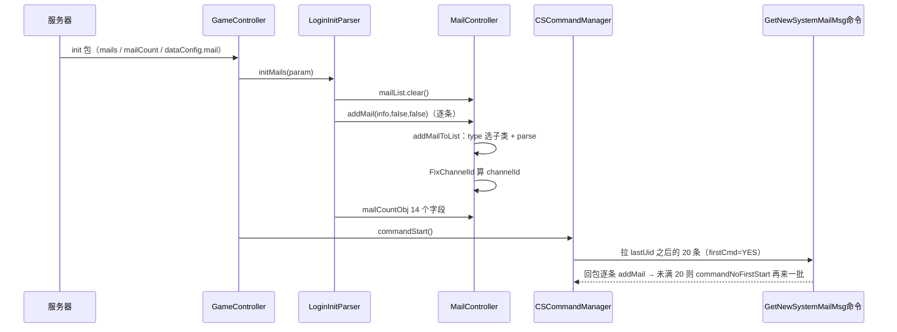
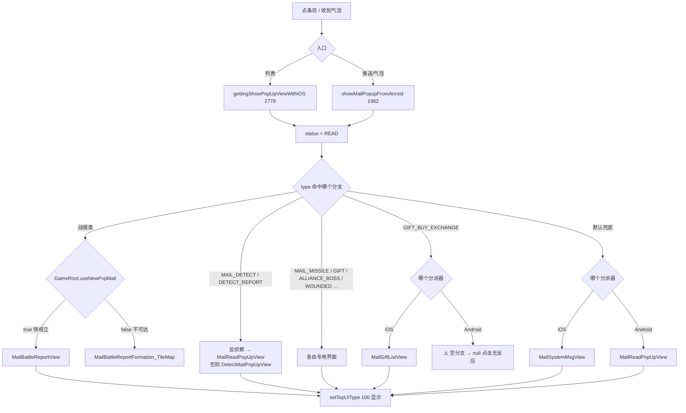
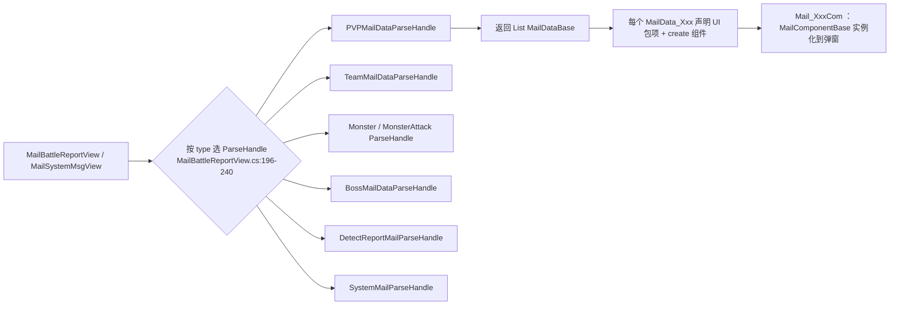

**■ 邮件系统使用说明（Mail / MailController）**

> 项目: RedAlert_SuperFormation（红警 / 帝国 / KS 多品牌复用，SVN 无 git）
> 整理时间: 2026-09-21
> 核心代码（4 处，实测行数）:
> · `IF/DayZClasses/controller/MailController/` — 4 个 .cs / **5 067 行**（`MailController.cs` 单文件 **4 929 行**）
> · `IF/DayZClasses/model/Mail*.cs` — 18 个 / **4 874 行**（`MailInfo.cs` 单文件 **2 620 行**）
> · `IF/DayZClasses/Net/command/` 的 12 个 `Mail*Command` + `GetNewPersonMailMsgCommand` / `GetNewSystemMailMsg_iOS_Command` / `GetUpdateMailCommand` — **2 229 行**
> · 视图两棵：`view/popup/mail/`（**16 806 行**）+ `view/NewMail/`（**13 829 行**）
> 数据来源: **服务器权威** —— 登录全量下发 + 增量推送；客户端没有邮件内容配表（只有 2 张辅助表，见 §四）
> 配套文档: [[内城推格子模块]] · [[场景管理模块]] · [[大地图]] · [[开发人员操作流程手册]]

---

**■ 一、模块总览**

**▍ 1.1 一句话定位**

邮件系统 = **服务器权威的「异步消息 + 附件奖励」箱体**。服务器下发邮件本体（`type` / `title` / `contents` / `rewardId`），客户端只做三件事：**① 缓存**（`MailController.mailList`，`uid → MailInfo` 字典）**② 分类**（客户端自己算 `channelId`，决定进收件箱哪个页签）**③ 呈现**（按 `type` 分派到 20+ 个详情弹窗）。

抓住 5 件事就通了：

1. **一个字典**：`MailController.mailList`（`MailController.cs:11`）是全部邮件的唯一副本，UI 全是它的视图。
2. **四条并行分类体系**（§1.4）：`MailType`（服务器给）→ `tabType`（旧计数用）→ `channelId`（**新收件箱页签用，客户端算**）→ `MailBoxView.MailTypeConfigs`（5 个页签）。
3. **两个分派器**：`showMailPopupFromAnroid`（`MailController.cs:1962`，推送/气泡入口）与 `gettingShowPopUpViewWithiOS`（`:2778`，列表入口）——**两套 `type → 弹窗` 映射，且不一致**（见 §五）。
4. **两代视图并存**：旧 `view/popup/mail/`（16 806 行）+ 新 `view/NewMail/`（13 829 行），由 `GameRoot` 的硬编码开关与弹窗内分支决定走哪套。
5. **邮件兼做聊天通道**：`MAIL_USER` / `CHAT_ROOM` / `MAIL_MOD_*` 类型同时承载私聊与聊天室消息（`MailDialogInfo` + `ChatMailInfo`，`MailController.handleMailMessage:753`），与 NativeChat 模块强耦合。

**▍ 1.2 规模统计（实测口径）**

| 项 | 值 |
|---|---|
| 邮件相关 `.cs`（路径含 mail，两代码根） | 主控制器 4 + 模型 18 + 网络 15 + 视图 2 棵（75 + 102 个 .cs） |
| 代码行数 | 5 067（controller）+ 4 874（model）+ 2 229（Net）+ 16 806（popup/mail）+ 13 829（NewMail）≈ **42 800 行** |
| `MailType` 枚举值 | **87 个**（值域 0~90，**4 个空洞**：43 / 68 / 83 / 86） |
| `channelId` 频道常量 | **26 个**（`MailInfo.cs:2587-2612`）；其中归类逻辑实际引用 19 个，`matchChannel_Id` 另返回 2 个 |
| 详情弹窗目标类 | 按 `type` 分派，逐条见 §3.2 表 |
| FGUI 包 | 2 个：`008_Mail`（旧，48 处引用）· `009_Mail_new`（新，163 处引用） |
| 龙骨动画 / 音效 | `SkeletonAnimation/mail`、`mail_blue`；`DayZSounds/effects/voice_read_mail.ogg` |
| 配表 | 2 张：`DataAtlas/MailLegend.json`（129 条）· `Config/Game/mail_channel_id.json`（10 条） |

**▍ 1.3 核心文件**

| 文件 | 行数 | 职责 |
|---|---|---|
| `controller/MailController/MailController.cs` | 4 929 | **模块单例**：邮件字典、拉取/推送落地、分类计数、两个详情分派器、未读数、发信 |
| `model/MailInfo.cs` | 2 620 | 邮件实体（90+ 字段）+ `parse()` + `parseBattleMail()` + **频道归类 `FixChannelId`** |
| `view/popup/mail/CSSystemMailListVC.cs` | 2 337 | ⚠️ **死代码**（旧版三级列表，全工程零调用，见 §五） |
| `view/popup/mail/MailDetectReport_FreeBuild.cs` | 1 446 | 旧版侦查邮件（被硬开关挡住，见 §五） |
| `view/NewMail/MailCellInfo/*` | ≈4 800 | **新版详情数据层**：`MailDataBase` 子类（`MailData_Tittle` / `MailData_BattleDetails` / …） |
| `view/NewMail/Component/*` | ≈3 500 | 新版详情组件层：`MailComponentBase` 子类（`Mail_*Com`），与 `MailData_*` 一一配对 |
| `view/NewMail/SnowMail/SnowBattleDetail/*` | ≈2 500 | 「雪地」战报详情（Snow 皮肤） |
| `view/NewMail/SnowMail/MailBattleReportView.cs` | 343 | **新版战报入口**：按 `type` 选 ParseHandle（`:196-240`） |
| `view/NewMail/SnowMail/MailSystemMsgView.cs` | 221 | **新版系统邮件入口**（默认兜底弹窗） |
| `view/popup/mail/MailBattleReportFormation_TileMap/` | ≈5 700（33 文件） | 旧版战报（`useNewPvpMail` 恒 true → 不可达） |
| `view/popup/mail/MailReadPopUpView/` | 614+ | 旧版通用邮件详情（**Android 分派的默认兜底**） |
| `view/popup/mail/MailBoxView/` | 317 + cells | **收件箱新主界面**（5 页签 + 批量删/批量读领） |
| `Net/push/MailPush.cs` | 308 | 增量推送入口（`handleResponse`） |
| `Net/command/MailBatchCommand.cs` | 183 | 批量删 / 批量领奖 / 批量保存 / 批量已读（**平台宏重灾区**） |
| `Net/command/MailSendCommand.cs` | 479 | 发信（含总统邮件消耗钻石、礼物赠送、退盟信） |
| `Net/command/GetNewSystemMailMsg_iOS_Command.cs` | 91 | 首启/增量「拉系统邮件」命令（`:85` 触发下一批） |
| `model/MailCountObj.cs` | 36 | 14 个分类计数（`saveR/sysR/…/total`），红点与页签数字来源 |
| `controller/CSCommandManager.cs` | 107 | 邮件操作的门面（8 个方法，UI 只调它，不直接 new 命令） |

**▍ 1.4 四条并行分类体系（读代码第一道坎）**

同一封邮件会同时带着四个「身份」，分属不同系统，**改一个不要以为改了全部**：

| 体系 | 取值 | 谁写 | 谁用 |
|---|---|---|---|
| **`MailType`**（`MailType.cs:18`） | 87 个值 0~90（`MAIL_USER=1`、`MAIL_BATTLE_REPORT=4`、`MAIL_INNERMAP=90`…） | **服务器下发** | 全部逻辑分支的总开关 |
| **`tabType`**（`MailPanelType`，`MailPopUpView.cs:9-19`） | 0 USERMAIL / 1 SYSTEMMAIL / 2 SAVEMAIL / 3 MAILTAB3 / 4 MAILTAB4 / 5 MAILTAB5 | 客户端 `MailInfo.parse` 按 type 反推（`MailInfo.cs:956-988`） | 旧计数 `mailCountObj`（`MailController.cs:708-742`）、后台归档口径 |
| **`channelId`** | 26 个字符串常量（`system` / `fight` / `alliance` / `monster` / `village` / `missile`…） | 服务器字段优先（`MailInfo.cs:943-945`），否则客户端 `FixChannelId` 算（`:2366`） | **新收件箱页签分组**、未读计数去重、气泡过滤 |
| **`MailBoxView.MailTypeConfigs`**（`MailBoxView.cs:16-23`） | 5 组：War / Alliance / System / Report / Collect | 客户端硬编码 | 收件箱 5 个页签的归属 |

5 个页签的频道归属（`MailBoxView.cs:18-22`）：

```text
War      = fight, village
Alliance = alliance
System   = system, studio, gift
Report   = monster, resource, pve_monster, alliance_boss
Collect  = （无频道）→ 只看 save != 0（收藏）
```

⚠️ `Report` 页签额外把 `MailPveCellInfo` 且 `type ∈ {MAIL_DUNGEON, MAIL_INNERMAP, MAIL_AREA_MONSTER_ATTACK}` 的邮件**排除**（`MailBoxView.cs:230-233`）；`resource` 频道在 `Report` 里**只保留 1 条**，其余丢进 `extraMailInfos`（`:249-264`，与未读计数去重同源）。

**▍ 1.5 数据流**

```text
【登录全量】
服务器 init 包(mails[] / mailCount)
   └─ LoginInitParser.initMails(param)                    :2480，调用点 :3192
        ├─ mailList.clear()                               :2494
        ├─ foreach → addMail(info,false,false)            :2504
        │     └─ addMailToList(dic)                       MailController.cs:589
        │           ├─ type → 子类工厂（见 §3.1 第 4 步）  :592-619
        │           └─ mailList[uid] = mail               :624
        └─ mailCountObj 14 个字段                         :2511-2525

【增量推送】
服务器 push
   └─ MailPush.handleResponse(dict)                       MailPush.cs:9
        ├─ contentsLocalArr 拼成 contentsLocal            :15-26
        ├─ reward → GCMRewardController.retReward         :33-37   （奖励先到手）
        ├─ type ∈ {USER, SELF_SEND, Alliance_ALL, MOD_*} → 会话合并/新建 :44-81
        ├─ type == MAIL_RESOURCE → 掉落进装备/背包          :82+
        └─ addMailFromAndroidToList(dic,false)  /  addMail / postNotification("Mail.Push") :303

【打开收件箱】
MailButtonComponent.cs:41 / MailBubbleButtonComponent.cs:29 / GameManager.cs:455 …
   └─ MailBoxView.Create()                                MailBoxView.cs:70
        ├─ PrepareMailDatas()：channelId → 5 组 + 排序 + 去重 :196-268
        └─ 点条目 → MailController.getInstance().gettingShowPopUpViewWithiOS(mailInfo) :2778
                                                  / showMailPopupFromAnroid(mailInfo)   :1962
                                                     └─ 按 type 分派到 26 个弹窗之一（§3.2）

【领奖 / 已读 / 删除 / 收藏】
MailBoxView.OnClickDeleteButton   → CSCommandManager.deletingMailDataWithALlMailIDArray → mail.delete.batch :85/:9
MailBoxView.OnClickReadAndReceive → CSCommandManager.settingRewardStatusWithMailDataArray → mail.reward.batch :96/:41
                                     CSCommandManager.settingReadStatus_mail_withMailArray   → mail.read.status.betch :68/:161
单封：MailReadPopUpView / 详情弹窗 → MailGetRewardCommand(mail.reward :13) / MailReadStatusCommand(mail.read.status :144)
收藏：MailController.addSaveClick(mailInfo) → mail.save / mail.cancel.save  :3017、MailSaveCommand.cs:7/44

【红点】
MailController.getMailUnReadNum()          :3303（status==0 计数；resource 频道只算 1 条）
   └─ MailButtonComponent.UpdateUIMailTip() :35 → CommonRedTipComponent(Number)
   └─ 变更通知 kMailChannelUnReadCountChanged（Global.cs:2951）→ 收件箱/气泡刷新
```

**▍ 1.6 界面与资源**

| 界面 | 类（文件） | 备注 |
|---|---|---|
| 收件箱（新） | `MailBoxView`（`popup/mail/MailBoxView/`） | 包 `009_Mail_new`，5 页签；扩展注册在 `Awake`（`MailBoxView.cs:40-42`） |
| 收件箱（旧，死） | `CSSystemMailListVC` + `CSMailRootCategoryListVC` | 包 `008_Mail`；零调用（§五-8） |
| 战报（新） | `MailBattleReportView` → `SnowBattleDetailView` / `BattleViewDetailView` | `view/NewMail/SnowMail/` |
| 战报（旧，不可达） | `MailBattleReportFormation_TileMap`（33 文件） | 被 `useNewPvpMail` 恒 true 挡住 |
| 通用/系统邮件 | `MailSystemMsgView`（新）· `MailReadPopUpView`（旧） | 两个分派器的默认兜底各不相同 |
| 侦查/反侦查 | `DetectMailPopUpView`（新）· `MailDetectReport_FreeBuild`（旧）· `MailReadPopUpView`（反侦察道具） | `pointType == 10000` 走反侦察分支 |
| 专用小界面 | `MailHeiqishiListView`（黑骑士）· `MailMissileListView`（导弹）· `MailMonsterListView`（打怪）· `WorldBossMailView` / `WorldBossRewardMailView` · `MailAllianceBossView` · `MailGiftReadPopUpView` / `MailGiftListView` · `MailResourcePopUpView` / `MailResourceHelpView` · `MailAnnouncePopUp` · `MailCityLvUpView` · `MailWarZonePopUpView` / `MailSeasonWarZonePopUpView` · `OccupyMailPopUpView` · `ExplorePopUpView` · `BattleEndReportMail` · `BattleReportMail_New` · `MailAllianceActiveView` | 全部在 §3.2 表 |
| 红点/提示 | `MailButtonComponent`（主界面按钮）· `MailBubbleButtonComponent`（气泡，**当前不显示**）· `UIComponentMailTipComponent`（Head 冒泡提示） | — |
| 龙骨/音效 | `SkeletonAnimation/mail`、`mail_blue`；`voice_read_mail.ogg` | — |

---

**■ 二、流程图**

**▍ 2.1 登录全量 + 首启拉取**



**▍ 2.2 增量推送落地（`MailPush`）**

```mermaid
flowchart TD
    A[服务器 push] --> B[MailPush.handleResponse]
    B --> C{contentsLocalArr?}
    C -->|有| D[拼成 contentsLocal]
    C -->|无| E{reward?}
    D --> E
    E -->|有| F[GCMRewardController.retReward<br/>奖励立即入账]
    E -->|无| G{type?}
    F --> G
    G -->|USER / SELF_SEND / Alliance_ALL / MOD_*| H[遍历 mailList 找同 fromUid 会话]
    H --> I{合并逻辑}
    I -->|MOD 类：addOneDialogToMailEnd| J[并入已有会话]
    I -->|其他：该分支已整段注释| K[pushMailDialogFirst 新建会话 + addChatUser]
    G -->|MAIL_RESOURCE| L[掉落进装备/背包]
    G -->|其他| M[addMailFromAndroidToList]
    M --> N{type == MAIL_ATTACKMONSTER?}
    N -->|是| O[直接 return 丢弃]
    N -->|否| P[子类工厂 + FixChannelId + 计数]
    P --> Q[postNotification "Mail.Push"]
    Q --> R[MailBoxView / Head 提示 / 气泡 各自刷新]
```

**▍ 2.3 点开一封邮件（分派器）**



**▍ 2.4 新版详情的内容装配（`view/NewMail` 三层）**



关键推论：**新版邮件详情是「数据类 + 组件类」配对**（`MailDataBase`（`MailCellInfo/MailDataBase.cs:8`）声明 `UI` 与 `create()`，`MailComponentBase`（`Component/MailComponentBase.cs:8`）实现具体界面）。加一个新版详情区块 = 写一个 `MailData_Xxx` + 一个 `Mail_XxxCom` + 在对应 ParseHandle 的 `Parse()` 里 `result.Add(...)` + 在 `SetPackages()` 里注册包项扩展（范例：`PVPMailDataParseHandle.cs:14-61`）。

---

**■ 三、使用方法**

**▍ 3.1 新增一种邮件类型（8 步，缺一步就有邮件「看不见」或「点不开」）**

```text
① MailType.cs 加枚举值
     注意：值域 0~90 里有 4 个空洞（43 / 68 / 83 / 86，历史删除），**不要复用空洞号**；
     服务器按数值下发，数值就是协议契约。
② 归频道：MailInfo.mailInfoDataForChannelWithSelf（:2371）加 case → 落到某个 Mail_ChannelID_*
     ⚠️ 漏了这步 = channelId 为空 → 新收件箱 5 个页签**都不显示它**
        （编辑器下 MailBoxView.cs:214 会打 LogError "Miss: " + channelId）
③ 加详情映射：**两个分派器都要加**
     · gettingShowPopUpViewWithiOS（MailController.cs:2778）— 列表入口
     · showMailPopupFromAnroid（:1962）                — 推送/气泡入口
     ⚠️ 只加一个 → 从一个入口点开是 A 界面、从另一个入口点开是 B 界面（现有代码已有多处这种不一致）
④ 需要特殊解析 → 写 MailInfo 子类（看 MailPveCellInfo.cs:285 的写法），并同时在**两处工厂**里 new：
     · addMailFromAndroidToList（MailController.cs:41-113）— 推送/登录走它
     · addMailToList（:592-619）                          — 部分链路走它
     ⚠️ 两处工厂的 type 列表**并不完全一致**（推送侧多了 MAIL_MISSILE、黑骑士分支）
⑤ 列表页签归属：MailBoxView.MailTypeConfigs（MailBoxView.cs:16-23）
     新频道必须写进某一组的 Channels，否则只能在「Collect（收藏）」里看到
⑥ 奖励/附件：走服务器 `rewardId`（客户端只用 `＃` 切分 replyText，MailInfo.cs:1043-1056），
     领奖结果由 mail.reward / mail.reward.batch 回包驱动飞奖励（GCMRewardController.flyRewardTip）
⑦ 文案：全部走 Global._lang(key)；⚠️ 联盟礼包类邮件在 FixChannelId 里是**按 title 语言 key 硬判**的
     （MailInfo.cs:2376-2384 的 8 个 key），新增同类邮件要同步这张表
⑧ 验证（按顺序）：
     · 收到：日志 "UID %s"（addMailToList）+ push 的 "[MAIL]&&&&&&&PUSH NEW MAIL..."
     · 归类：收件箱对应页签是否出现；跨页签未读数字是否正确
     · 打开：列表进 + 推送/气泡进 **两条入口都试**（正是 ③ 的坑）
     · 领奖：奖励是否到手、红点是否消、邮件是否按预期删除/保留
```

**▍ 3.2 `type → 详情弹窗` 对照表（两个分派器实测差异）**

| MailType | 列表入口（`:2778`） | 推送/气泡入口（`:1962`） |
|---|---|---|
| BATTLE_REPORT / BORDER_FIGHT（黑骑士频道） | `MailHeiqishiListView` | `MailHeiqishiListView`（**无频道判断**） |
| CITY/MONSTER/RESOURCE/SPACE/MANOR 战斗、VILLAGE、WEEK_CHAMPIONSHIP 等 | `MailBattleReportView` 或旧战报（受 `useNewPvpMail`） | 同左 |
| HERO_BOSS_* / MAIL_DUNGEN / MAIL_INNERMAP / MAIL_AREA_MONSTER_ATTACK / MILITARY_BOSS | 旧战报 `MailBattleReportFormation_TileMap`（**不受开关控制**） | 同上（走 `useNewPvpMail` 分支） |
| MISSILE | `MailMissileListView` | `MailMissileListView` |
| RESOURCE / RESOURCE_HELP | `MailResourcePopUpView` / `MailResourceHelpView` | 同左 |
| DETECT / DETECT_REPORT / NEW_SCOUT_REPORT_FB | `pointType==10000` → `MailReadPopUpView`，否则 `DetectMailPopUpView`；侦查开关下再分新旧 | 同左，但 `NEW_SCOUT_REPORT_FB` 分支里用的是 `useNewPvpMail` 而不是 `useNewDetectMail`（**两处开关写错了对象**） |
| WARZONE_FB / SEASONWARZONE_FB | `MailWarZonePopUpView` / `MailSeasonWarZonePopUpView` | 同左 |
| CITYLV_UP / ENCAMP / WORLD_NEW_EXPLORE / SYSUPDATE / CASTLE_ACCOUNT | `MailCityLvUpView` / `OccupyMailPopUpView` / `ExplorePopUpView` / `MailAnnouncePopUp` / `BattleEndReportMail` | 同左（Android 侧无 CASTLE_ACCOUNT 分支 → 兜底） |
| ATTACKMONSTER | `MailMonsterListView` | `MailMonsterListView` |
| GIFT_BUY_EXCHANGE | `MailGiftListView`（重复分支，见 §五-10） | **空实现 → `popUpView` 为 null（点击无反应）** |
| MAIL_GIFT | `MailGiftReadPopUpView`（重复分支） | `MailGiftReadPopUpView` |
| WORLD_BOSS | `WorldBossRewardMailView`（击杀奖励）/ `WorldBossMailView` | 同左 |
| ALLIANCE_BOSS / MJ_ALLIANCE_BOSS | `MailAllianceBossView` / 旧战报 | **无分支 → 落到 `MailReadPopUpView`** |
| 联盟活跃度 4 类（`ALLIANCE_NOT_LIVENESS_*` / `LIVENESS_*`） | `MailAllianceActiveView` | **无分支 → 落到 `MailReadPopUpView`** |
| WOUNDED | `MailSystemMsgView` | 无分支 → `MailReadPopUpView` |
| INVITE_TELEPORT | `MailSystemMsgView` | 无分支 → `MailReadPopUpView` |
| 其余全部（默认兜底） | `MailSystemMsgView` | `MailReadPopUpView` |

**▍ 3.3 业务侧入口（API + 位置）**

| 需求 | 调用 | 位置 |
|---|---|---|
| 打开收件箱 | `MailBoxView.Create()` | `MailBoxView.cs:70`；调用点 `MailButtonComponent.cs:41`、`MailBubbleButtonComponent.cs:29`、`Game/KingShot/.../GameManager.cs:455`、`NewMonsterAttackActivityComponent.cs:209`（KS 品牌另有 `KingShotMailBoxView`） |
| 打开某封邮件 | `MailController.getInstance().gettingShowPopUpViewWithiOS(mail)` / `showMailPopupFromAnroid(mail, isDetect)` | `:2778` / `:1962`（注意二者映射不同） |
| 未读数（红点） | `MailController.getInstance().getMailUnReadNum()` | `:3303`；UI 消费点 `MailButtonComponent.cs:35` |
| 单封领奖 | `new MailGetRewardCommand(uid, type).sendAndRelease()` | `MailGetRewardCommand.cs:13`（错误码 105784 = 城堡等级不足，`:32-39`） |
| 批量已读+领奖 | `CSCommandManager.sharedCommandManager().settingRewardStatusWithMailDataArray(arr, delete)` / `settingReadStatus_mail_withMailArray(arr)` | `CSCommandManager.cs:96` / `:68` |
| 批量删除 | `deletingMailDataWithALlMailIDArray(arr)`；全删 `MailDeleteAllCommand` | `CSCommandManager.cs:85`；`MailDeleteAllCommand.cs` |
| 单封已读 | `settingreadSatusWithMailID(uid, type)` | `CSCommandManager.cs:60` |
| 收藏 / 取消收藏 | `MailController.getInstance().addSaveClick(mailInfo)` | `:3017`（内部发 `mail.save` / `mail.cancel.save`） |
| 发信（系统/总统邮件） | `MailController.getInstance().sendMail(toName, title, contents, …, type)` | `:1043` → `MailSendCommand.cs:25`（剩余次数/钻石价由回包写 `playerInfo.mailCount/mailCost`，`MailSendCommand.cs:110-111`） |
| 赠礼邮件 | `MailGiftSendCommand` / `MailUnSignSendCommand` | `MailSendCommand.cs:259` / `:429` |
| 拉到某封邮件的详情 | `MailReadCommand`（`mail.read`）→ 回包按 type 调 `refresh*Content` | `MailReadCommand.cs:33-128`、`MailController.cs:1096` 起 20 个 `refreshXxxContent` |
| 会话（私聊）消息 | `MailController.handleMailMessage(mailInfo, mailDialogInfo, …)` → `ChatMailInfo` | `:753`；聊天侧共用 `CSChatMsgFactory.chatMessageWithChatMailInfo` |
| 登出清理 | `MailController.purgeData()` | `GameController.cs:320` |
| 战报邮件用到的兵种说明表 | `DataAtlasManager.Instance.GetDataWithTypeById<MailLegend>(key)` | `FBSoldierInfoCell.cs:344/346`（全工程唯一读取点） |

**▍ 3.4 调试手段**

| 手段 | 关键串（file:line） |
|---|---|
| 推送落地 | `[MAIL]&&&&&&&&&&&PUSH NEW MAIL&&&&&&&&&&&&&&&& mailId(%s).` — `MailPush.cs:42` |
| 分派命中 | `type:%d  tabType:%d title:%s` — `MailController.cs:2784`（列表入口）/ `:1968`（推送入口） |
| 邮件入列 | `UID %s` — `MailController.cs:623` |
| 未归类邮件（编辑器） | `LogError("Miss: " + item.channelId)` — `MailBoxView.cs:214` |
| 正常流程里的 LogError（噪声源） | `PVP战斗邮件` `:2818`、`野怪战斗邮件` `:2827`、`isWorldBossKillRewardMail` `:2950` |
| 抓包过滤用协议名 | 定义在 `IF/GloablNetGen.cs:359-383`：`mail.delete.batch` / `mail.reward.batch` / `mail.save.batch` / `mail.read.status.betch` / `mail.delete.person_mail` / `mail.delete.all` / `mail.delete` / `mail.reward` / `mail.read` / `mail.read.status` / `mail.translate` / `mail.save` / `mail.cancel.save` / `mail.like` / `mail.like.share` / `mail.send` / `mail.gift.send`；另有 `BATTLE_FIGHT_REPORT`（`MailFightReportCommand.cs:14`）、`CHAT_GET_PERSON_NEW_MAIL_MSG`（`GetNewPersonMailMsgCommand.cs:15`）、`CHAT_GET_UPDATE_MAILS`（`GetUpdateMailCommand.cs:11`）；⚠️ `mail.room.name.refresh` / `mail.room.msg.change` 是**聊天室**常量（`Global.cs:2388-2389`），别混进邮件链路 |
| 刷新通知链 | `MAIL_LIST_CHANGE`（15 个文件引用）/ `MAIL_LIST_DELETE`（11）/ `MAIL_CONTENT_READ`（9）/ `MAIL_SAVE_LIST_CHANGE`（5）/ `MIAL_GET_REWARD_REFRESH`（4）/ `kMailRewardBanchForClaim`（3）/ `kMailChannelUnReadCountChanged`（`Global.cs:2951`）/ `"Mail.Push"`（`MailPush.cs:303` 发出） |
| 收件箱本地排查 | `MailBoxView.PrepareMailDatas` 是唯一分组入口（`:196`），想看某封邮件为何不进页签，直接读它的 `channelId` 与 `save` |

---

**■ 四、配表与常量事项**

1. **`DataAtlas/MailLegend.json`**：129 条，字段 `nId / nVersion / id / name / order / icon / level / node / show / buff / max`。实测分布：`level` 3→83 条、2→39 条、1→7 条；`icon` 仅 8 条非空（`mail_attack` / `mail_defense` / `mail_health` / `mail_restrain_shooter` / `mail_troop_limit` / `mail_d_shooter` / `mail_give_damage`）。**名字叫 Mail 但只服务战报邮件的兵种加成说明**，全工程唯一读取点是 `FBSoldierInfoCell.cs:344/346`。
2. **`Config/Game/mail_channel_id.json`**：10 条（`mod / battle_game / missile / resource / gift / arena_game / monster / knight / shamo_explore / shamo_game`），字段 `id` + `mail_type_order`；读取点在 **旧版分类列表** `CSMailRootCategoryListVC.cs:106` 起（属死代码，见 §五-8）。新收件箱**不读这张表**，页签顺序写在 `MailBoxView.MailTypeConfigs`。
3. **邮件容量由服务器下发**：`LoginInitParser.cs:691-703` 读 `dataConfig.mail.k1/k2/k7` 与 `dataConfig.mail_astrict.k1/k2` → `MailConfig`（`MailConfig.cs:11-15` 五个字段）；同处 `:706` 读 `newbie_mail_optimize` → `GlobalData.newbie_mail_optimize_switch`（联盟申请/加入分支在用，`AllianceAcceptInviteCommand.cs:47`、`ApplyAllianceCommand.cs:106`）。
4. **`MailPanelType` 是后台/旧版口径**（`MailPopUpView.cs:9-19`），`tabType` 由 `MailInfo.parse` 按 type 反推（`MailInfo.cs:956-988`：战报/侦查/扎营/世界 BOSS/新侦查 → 4；ALL_SERVICE → 3；FRESHER/SYSNOTICE/SYSUPDATE → 2；USER/mod 类 → 0；其余 → 1），再驱动 `mailCountObj` 分桶（`MailController.cs:708-742`）。
5. **`channelId` 双来源**：服务器字段优先（`MailInfo.cs:943-945`），否则客户端 `mailInfoDataForChannelWithSelf`（`:2371`）计算；触发点 `FixChannelId()`（`:2366`）在 `MailController.cs:377`（推送落地）与 `:3433`（`CreatMailServer`）各调一次，`parseBattleMail` 内也调（`:1556`）。频道字符串常量共 26 个（`MailInfo.cs:2587-2612`，其中归类逻辑用 19 个）。
6. **未归类黑洞（量化）**：87 个 MailType 值里 **11 个**在任何频道分支都没出现 → `channelId = ""`：

```text
0  MAIL_SELF_SEND   1  MAIL_USER      7  MAIL_GENERAL_TRAIN   12 MAIL_DIGONG
22 MAIL_PERSONAL    23 MAIL_MOD_PERSONAL   24 MAIL_MOD_SEND   35 CHAT_ROOM
36 MAIL_ACTIVITY    56 MAIL_activity_FIGHT_FB（注释已标"未用"）  88 RED_BOSS_TRIAL
```

   前 6 个属会话/私聊类（由聊天 UI 承载，不进邮件页签），**12 / 36 / 56 / 88 是真黑户**：若服务器下发这些类型，收件箱里只有「收藏过」的才看得见（`Collect` 组只看 `save != 0`）。
   口径：`MailType.cs` 枚举值与 `MailInfo.mailInfoDataForChannelWithSelf` 函数体内出现的 `MailType.XXX` 求差集（76 个被覆盖）。
7. **枚举空洞**：43 / 68 / 83 / 86 —— 历史上删除过类型，新增类型不要复用这些号。
8. **硬编码清单**：26 个 `Mail_ChannelID_*` 字符串常量（`MailInfo.cs:2587-2612`；归类逻辑用 19 个 + `matchChannel_Id` 用 2 个 = `PveMonster`/`Pve_Player`，其余 `Mod`/`Resourcehelp`/`Message`/`MJ_Monster`(已注释)/`KingShotSystem` 在归类之外）；`FixChannelId` 里按 **title 语言 key** 硬判联盟礼包（`114111` / `105726`~`105730` / `115429` / `87003105` / `_lang("77000157")`，`MailInfo.cs:2376-2384`）；黑骑士战报用 `isKNightFightReport()`（`:2405`）；`MAIL_DETECT_REPORT_PROTECT = 10000`（`Global.cs:2570`）区分侦查/反侦察；未读计数对 `resource` 频道**只算 1 条**（`MailController.cs:3311-3318`），收件箱同规则（`MailBoxView.cs:249-264`）。
9. **两个「新旧开关」是硬编码默认值**：`GameRoot.useNewPvpMail = true`（`GameRoot.cs:26`）、`useNewDetectMail = true`（`:32`）、`useBossMail = false`（`:35`，零引用）。全 Assets 只有读取点、**没有任何写入点** → 改了要重编；`false` 分支的界面等于死代码（§五-9）。
10. **平台宏**：邮件模块内有 `＃if ROE_IOS`（5 处）与 `＃if ROE_ANDROID`（8 处），集中在 `MailBatchCommand.cs:68/88/144`、`GetNewPersonMailMsgCommand.cs:54/76/91/128/203/241`、`GetUpdateMailCommand.cs:40` —— **领奖/保存/删除的后处理在安卓与 iOS 上是两套行为**（§五-4）。

---

**■ 五、注意事项（已知坑）**

| 级别 | 问题 | 位置 |
|---|---|---|
| 🟠 | **Android 分派器对 `GIFT_BUY_EXCHANGE` 是空分支** → `popUpView` 保持 null，从推送/气泡点开该邮件**完全无反应**（列表入口正常） | `MailController.cs:2084-2086` |
| 🟠 | **两个分派器不一致**：默认兜底各不同（Android → `MailReadPopUpView` `:2109`；iOS → `MailSystemMsgView` `:3003`），且 Android 侧**没有** `MAIL_ALLIANCE_BOSS` / `MAIL_MJ_ALLIANCE_BOSS` / 4 个联盟活跃度类型 / `MAIL_WOUNDED` / `MAIL_INVITE_TELEPORT` 的分支 → 这些邮件从推送入口打开会拿到通用界面 | `:1962-2110` vs `:2778-3004` |
| 🟠 | **`NEW_SCOUT_REPORT_FB` 的分支判错开关**：列表入口用 `useNewDetectMail`（`:2892`），推送入口用 `useNewPvpMail`（`:2048`）——同一类型两个入口走不同界面 | `MailController.cs:2892` / `:2048` |
| 🟠 | **推送链路丢弃「打怪被抢」邮件**：`addMailFromAndroidToList` 开头 `if (type == MAIL_ATTACKMONSTER) return;`（作者标了 TODD） | `MailController.cs:36` |
| 🟠 | **非 MOD 私聊邮件的「合并到已有会话」逻辑整段被注释** → 每次推送都 `pushMailDialogFirst` 新建会话 + `addChatUser` | `MailPush.cs:65-73`、`:78` |
| 🟠 | **批量领奖的后处理全在 `＃if ROE_IOS` 内**（`:68-103`）：安卓包不会 `endRewardAllOpMails()`、不会自动删除、不会通知 ChatService；本地状态由 UI 直接改字段（`MailBoxView.cs:168-194`）→ 两端表现不同 | `MailBatchCommand.cs:68-103` |
| 🟠 | **邮件气泡按钮当前不显示**：取值与显示开关两处被注释（`UIComponent.cs:312`、`UIComponentDefine.cs:481`），且该组件被注册到 `icon_mainmenu/btn_allianceRecommend` 上（名字与用途不符） | `UIComponentDefine.cs:193`、`MailBubbleButtonComponent.cs:29/39` |
| 🟠 | **`isMailFull` 只对收藏邮件生效**：`count` 只在 `SAVEMAIL` 分支计算（其余分支 `count` 恒 0、`maxNum` 取到了也没用）→ 系统/用户邮件「满箱」判断恒 false | `MailController.cs:856-864` |
| 🟡 | **死代码整棵 ≈ 2 900 行**：`CSSystemMailListVC`（2 337）+ `CSMailRootCategoryListVC`（408）+ `MailListCell` / `MailListCellHead` / `CSMailCategoryListModel` + `MailPopUpView`（`create()` 直接 `throw new NotImplementedException()`）——全工程零调用，`GameRoot.cs:89` 只剩一行注释 | `view/popup/mail/CSMailRootCategoryListVC/*`、`CSMailSystemMailListVC.cs`、`MailPopUpView.cs:21-24` |
| 🟡 | **死开关**：`useNewPvpMail` / `useNewDetectMail` 无写入点（默认 true）→ 旧战报 `MailBattleReportFormation_TileMap`（33 文件）与旧侦查 `MailDetectReport_FreeBuild`（1 446 行）在现网**永不显示**；`useBossMail` 声明后零引用 | `GameRoot.cs:26/32/35` |
| 🟡 | **分派器重复分支**：`MAIL_GIFT` 出现两次（`:2942` 与 `:2958`）、`MAIL_RESOURCE` 两次（`:2851` 与 `:2962`），后一个**永不执行** | `MailController.cs` |
| 🟡 | 复制粘贴残留：`if (type == MAIL_BATTLE_REPORT \|\| type == MAIL_BATTLE_REPORT)` 两个条件完全相同 | `MailController.cs:104` |
| 🟡 | **切页签会静默删本地邮件**：`updateMailCountByType` 把「已领奖且未收藏」的邮件从 `mailList` 里 `erase`（服务器数据仍在，重新拉取会回来）→ 排查「邮件怎么少了」先看这里 | `MailController.cs:1891`、`:1935-1944` |
| 🟡 | **两套分类并存**：新收件箱按 `channelId`，旧计数/后台口径按 `tabType`（`MailPanelType`）→ 加类型要同时维护（§3.1 第 2/5 步） | `MailBoxView.cs:16-23` vs `MailInfo.cs:956-988` |
| 🟡 | **全局可变状态 `m_tileMapMailInfo`**：`MailController.getInstance().m_tileMapMailInfo` 是「当前正在看的战报邮件」全局变量，`isOwnAtk()` 无参重载直接读它 → 隐式耦合，多处共享同一实例 | `MailController.cs:10`、`:3131`、`CCCommonUtils.cs:7941/7949/7976`、`HeroManager.cs:26` |
| 🟡 | 日志噪声：分派与领奖等**正常流程**用 `LogCommon.LogError` 打（`PVP战斗邮件` `:2818`、`野怪战斗邮件` `:2827`、`isWorldBossKillRewardMail` `:2950`）→ 真错误容易被淹没 | `MailController.cs` |
| 🟡 | God class：`MailController.cs` 4 929 行 / `MailInfo.cs` 2 620 行；`MailInfo` 同时承载字段、通用解析、频道归类、战报解析（`parseBattleMail:1559` 起 ≈600 行）、赛季战区（`:2166`）、礼包（`:2217`） | `controller/MailController/`、`model/MailInfo.cs` |
| 🟡 | 注释里保留大段旧实现（`MailGetRewardCommand.cs:71-131` 整段被注释的奖励入账逻辑；`addMailFromAndroidToList` 头部若干 `CCLOG` 注释）→ 看代码时别被误导 | `MailGetRewardCommand.cs:71-131` |

**「邮件不对」排查顺序（按顺序查，别乱搜）**

```text
1. 邮件根本没进列表 → push 日志有没有 "PUSH NEW MAIL"；addMail 是否被 addMailFromAndroidToList 开头的
   MAIL_ATTACKMONSTER 早退吞掉（§五 🟠 丢件）
2. 进了 mailList 但收件箱看不到 → 看它的 channelId：
     channelId == "" → 属未归类黑洞（§四-6），只能靠收藏可见
     有频道但不在 5 组的 Channels 里 → 页签自然不显示（编辑器会打 "Miss: "）
     save != 0 的邮件只在 Collect 页签
3. 看得到但点不开 → 走哪个分派器、popUpView 是否 null（GIFT_BUY_EXCHANGE 在推送入口就是 null）
4. 界面内容空/错 → 新版走 ParseHandle（MailBattleReportView.cs:196-240 选 handle）；旧版看 MailReadPopUpView 的
   MailInfo 字段是否被 parse 填上（战报内容要 mail.read 回包触发 refreshMailContent 才有）
5. 红点不消 → status 是否被置 1（MailReadStatusCommand）；resource 频道只计 1 条未读
6. 领奖没到账 / 没删邮件 → 批量链在安卓包被 ＃if 剪掉（§五 🟠），核对回包是 mail.reward 还是 mail.reward.batch
7. 列表不刷新 → 通知是否发出：MAIL_LIST_CHANGE / MAIL_LIST_DELETE / Mail.Push / kMailChannelUnReadCountChanged
   （MailBoxView.cs:49-52 是监听点）
8. 私聊内容错 → 邮件与聊天共用 MailDialogInfo / ChatMailInfo（handleMailMessage:753），去 NativeChat 侧看
```

---

**■ 六、相关文档**

- 同目录姊妹模块：[[内城推格子模块]]（`MAIL_INNERMAP=90` 战报由它产生）· [[场景管理模块]] · [[城外大地图模块]] · [[联盟领地与王座争夺]]（`MAIL_VILLAGE` / `MAIL_MANOR_FIGHT_FB` 战报来源）· [[活动模块]]（`MAIL_ACTIVITY_COMMON=66`）· [[商城计费模块]]（`GIFT_BUY_EXCHANGE=34`）· [[开发人员操作流程手册]]
- 交汇点（已核实）：
  - 内城推格子 → `InnerMapAtomMonster.cs:136` 直接查 `MailController.getInstance().mailList[mailUid]` 取战斗结果
  - 联盟 → `AllianceManager.cs:338-340` 用 `mailList` 判联盟邀请邮件；`AllianceAcceptInviteCommand.cs:47` / `ApplyAllianceCommand.cs:106` 读 `newbie_mail_optimize_switch`
  - 登录/初始化 → `LoginInitParser.cs:2480/3192`（邮件全量）、`:1015`（战报 k1/k2）
  - 聊天 → `ChatServiceCocos2dx.cs:167/207/210/215/313/319` 是邮件操作的回调面；`CSChatMsgFactory.cs:11` 复用 `ChatMailInfo`
  - 打点/奖励 → `GCMRewardController.flyRewardTip`（领奖表现统一入口，`MailGetRewardCommand.cs:134`、`MailBatchCommand.cs:83`）
  - 引导/HUD → `MailButtonComponent`（`UIFunction.UIMail` 开关控制显隐，`:46`）、`UIComponentMailTipComponent`（Head 冒泡，`:23`）
- 本次未展开（各够一篇）：**背包/道具**（`view/popup/Bag/`）· **聊天与私聊会话**（`NativeChat/New/` + `Ext/ChatService/`）· **战报内容本身**（`MailBattleReportFormation_TileMap` 33 文件 + `NewMail/SnowMail/SnowBattleDetail`）· **KingShot 品牌的邮件 UI**（`Game/KingShot/Game/UI/KingShotMailBoxView.cs`）
